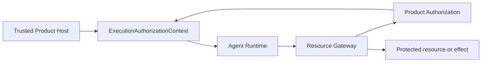

# Agent Runtime Authorization Integration Contract

**Purpose**: Define how Agent Runtime consumes and carries Product
Authorization evidence without becoming an identity, entitlement, policy, or
database permission system.

**Required reader gain**: A reader can identify the immutable authority context
for one execution, the Runtime checks performed at admission and re-entry, the
Gateway checks performed for protected operations, and the smaller set of
high-risk effects that require a bounded grant.

## 0. Contract Capsule

```yaml
layer: T1
status: proposal
canonical_owner: designDoc/agent_runtime_09_authorization_integration_contract.md
parent: designDoc/the_agent_runtime.md
scope:
  - provider-neutral ProductAuthorizationClient integration
  - immutable execution authorization context binding
  - execution admission, re-entry, dispatch, and revocation fences
  - protected-operation request propagation
  - optional high-risk OperationGrant reference propagation
  - authorization trace and failure evidence
non_goals:
  - authentication, credential, Product Principal, Group, or Entitlement management
  - Product policy evaluation or grant issuance
  - direct Product Authorization table access
  - resource filtering, PostgreSQL permission management, or side-effect execution
  - domain quality, graph transition, or Artifact acceptance
inputs:
  - designDoc/the_agent_runtime.md
  - designDoc/the_product_authorization.md
  - designDoc/product_authorization_00_service_and_persistence_contract.md
  - designDoc/agent_runtime_00_execution_charter.md
  - designDoc/agent_runtime_01_module_contract_and_assembly.md
  - designDoc/agent_runtime_08_agent_execution_adapter_contract.md
outputs:
  - product_authorization_client protocol
  - execution_authorization_context_binding
  - authorization status, fence, operation observation, and closure records
implementation_surfaces:
  - src/agent_runtime/execution/execution_authorization_resolution.py
  - src/agent_runtime/execution/execution_authorization_coordination.py
  - src/agent_runtime/execution/execution_operation_resolution.py
  - src/agent_runtime/contracts/execution_authorization_definition.py
  - Runtime execution ledger
review_gate: authorization-boundary, revocation, isolation, portability, and clean-package tests
```

## 1. Authority Boundary

Runtime owns execution ordering and evidence. It owns no upstream permission and
no downstream resource access.

| Concern | Canonical owner | Runtime relationship |
| --- | --- | --- |
| Authentication and session status | Identity and Session | Receives no credentials or raw session assertions |
| Product Principal, Entitlement, policy, decision, context, revocation, and grant issuance | Product Authorization | Consumes only public client results and immutable references |
| Workload identity | Trust and Operations infrastructure | Runtime authenticates as its own workload |
| Workflow and Module executable closure | Runtime Release Registry | Resolves exact admitted releases |
| Execution binding, ordering, retry, context, trace, and fence | Agent Runtime | Owns and persists |
| Final Module and user permission conjunction | Data Access Gateway | Resolves the Runtime intent and enforces the Product decision |
| Business operation invariants | Owning Domain Contract | Remains opaque to Runtime Authorization |
| Domain quality and graph transition | Owning domain plugin | Remains opaque to Runtime Authorization |

The initiating Product Principal is the subject of the execution. Runtime is an
authenticated workload actor. The Workflow Execution is not a new Product
Principal.

Identity and Session authenticates a human or workload subject. Product
Authorization resolves Product Principal, tenant, Cell, and effective authority
server-side. Runtime neither authenticates a subject nor derives Product
Principal, tenant, or Cell from caller payload. Raw authentication challenges,
assertions, session handles, and credentials remain outside Runtime storage and
task packages.



## 2. Product Authorization Client Port

Runtime depends on a provider-neutral public client:

```python
class ProductAuthorizationClient(Protocol):
    def validate_execution_context(
        self,
        context_id: str,
        tenant_id: str,
        observed_at_utc: str,
    ) -> ExecutionAuthorizationStatus: ...
```

Runtime does not need Product policy, Entitlement, assignment, Principal-profile,
or PostgreSQL query APIs. A host may supply an in-process adapter, HTTP client,
or another transport without changing the Runtime contract.

The exact DTO schemas, canonical field order, release hashes, codecs,
persistence bindings, and validators are code-owned by the public Product
Authorization and Runtime packages.

Protected operations are enforced by the resource Gateway. Runtime propagates
the execution context and exact operation identity but does not call Product
Authorization on the Gateway's behalf unless a host adapter explicitly combines
those transports.

## 3. Execution Authorization Context Binding

Before a managed execution starts, the trusted Product host supplies one exact
`execution_authorization_context`. Runtime validates and commits one immutable
`execution_authorization_context_binding` that closes over:

- `runtime_execution_binding`, Workflow Execution, Workflow Release, and
  execution input package;
- initiating Product Principal and Runtime workload actor;
- tenant and Cell;
- Product Authorization decision and context identities;
- authorization catalog and policy release identities;
- effective and expiry time; and
- current revocation status reference.

The Runtime binding contains no Entitlement body, policy expression,
credential, database role, or mutable permission list. Changed closure creates a
new Workflow Execution and binding.

Runtime checks identity equality, exact release equality, time validity, and
status. It does not reconstruct why the Product decision allowed the run.

## 4. Admission and Re-entry Fences

Runtime validates the execution authorization context at:

- durable execution creation;
- process re-entry or recovery;
- Module dispatch after a wait or external event;
- PM-requested revision before continuing the same execution; and
- receipt of an ordered Product Authorization invalidation event.

An unchanged effective context may continue. Entitlement expansion does not
widen it. Expiry, revocation, reduced scope, tenant or Cell change, Principal
change, or Workflow Release change closes the execution-control fence.

Continuation after a closed authorization fence requires a new execution. The
old execution preserves its domain state and authorization trace but cannot
dispatch new work.

## 5. Protected Operation Boundary

Agent registration compiles one selected Module source into an exact Runtime
Module Release. Its declared operation IDs are the Module permission source.
Runtime resolves the registered release by ref and hash before it constructs a
`protected_operation_context` from trusted execution and Module state:

- execution and Module Run identity;
- exact Runtime Module Release;
- execution authorization context identity;
- operation ID and idempotency key;
- requested resource and action supplied through a typed Module interface;
- enforcing Gateway identity; and
- observation time.

Runtime records the intent before dispatching it to the Gateway. The Gateway:

1. authenticates Runtime's workload;
2. resolves the Runtime-owned intent and execution binding by exact ref and
   hash;
3. resolves authoritative resource, tenant, Cell, and request context;
4. obtains or validates a current Product Authorization decision;
5. requires both the registered Module operation and Product decision to
   allow;
6. invokes Data Governance enforcement and the owning Domain Contract's
   business invariants;
7. performs the operation through its own bounded credential; and
8. returns a bounded result plus decision and effect evidence references.

Runtime records the returned references. A Gateway deny becomes an execution
failure or a typed domain-visible authorization outcome according to the
Workflow contract; Runtime never converts it into an allow.

## 6. High-Risk Operation Grants

Only an action whose admitted Resource Permission Manifest requires a grant
uses `operation_grant` semantics. Default grant-required classes are:

- publication;
- external send or disclosure;
- sensitive export;
- trade or other real transaction; and
- asynchronous cross-service canonical mutation.

For those actions, Runtime carries the opaque grant reference and records the
Gateway's terminal disposition. The Gateway validates issuer, audience,
subject, actor, action, resource, execution context, idempotency, validity, and
replay policy before the effect.

Ordinary authorized reads, internal semantic search, model calls, and
synchronous service operations do not acquire a single-use grant merely because
they are observable. They still require a current decision at the enforcing
Gateway.

## 7. Provider Adapter Boundary

Claude Agent SDK, Codex CLI, model APIs, and future adapters receive scoped
Runtime callbacks or pre-materialized inputs. They receive no Product
Authorization client, policy table, Entitlement body, database credential, or
unfiltered resource client.

Switching provider, model, SDK, CLI, or durable backend changes an execution
variant. It does not change the Product Principal, tenant, Cell, execution
authorization context, or enforcement law.

Provider tool traces are telemetry. They are not authorization decisions or
Gateway effect evidence.

## 8. Revocation and Late Results

Product Authorization owns revocation status. Runtime consumes status through
the public client or an ordered invalidation event and atomically closes the
execution-control fence.

After the fence closes:

- no new Module dispatch or protected operation begins;
- late provider output is quarantined as non-consumable execution evidence;
- already committed external effects are reconciled but never repeated;
- provider contexts and pending work are closed; and
- the terminal Runtime status is `authorization_invalidated`.

Historical output does not become invalid merely because later authority
changed, but it cannot advance the old execution after the fence.

## 9. Persistence and Trace

Runtime authorization persistence contains only Runtime-owned records:

- execution authorization context binding;
- observed context status and execution-control fence;
- protected operation intent;
- Gateway decision and effect reference observation;
- high-risk grant disposition reference when applicable; and
- invalidation, quarantine, and closure evidence.

Product Principals, Groups, Entitlements, assignments, policies, decisions,
contexts, grants, and revocations remain in Product Authorization stores.
Resource access and effect evidence remain in the enforcing service's store.

Runtime trace and usage are generated automatically from execution events. No
Agent writes them manually.

## 10. Failure Contract

| Failure | Runtime behavior |
| --- | --- |
| Missing or invalid execution context | Reject admission before durable execution |
| Context expired or revoked | Close fence; require a new execution |
| Product Authorization unavailable during context validation | Fail closed at protected transition; retry only the same validation |
| Gateway denies operation | Record denial; invoke no fallback or direct credential |
| Gateway unavailable before effect | Retry according to the operation's idempotency contract |
| High-risk grant absent, expired, wrong-audience, or replayed | Gateway rejects before effect |
| Tenant, Cell, Principal, release, or context mismatch | Security failure and fence |
| Late result after fence | Quarantine; do not advance graph |

Runtime never substitutes another Provider, Gateway, Workflow, policy copy, or
credential to bypass an authorization failure.

## 11. Conformance

The Runtime authorization suite must prove:

- Runtime installs and its core tests run without a Product Authorization host;
- public client adapters can be replaced without changing Module contracts;
- no execution starts without an exact effective context;
- caller-selected Principal, tenant, Cell, Workflow Release, or context fails;
- actor workload and initiating Principal remain distinct in trace;
- Entitlement expansion does not widen a running execution;
- revocation fences the next dispatch or protected operation;
- an ordinary operation needs a Gateway decision but no single-use grant;
- every registered high-risk action needs a valid audience-bound grant;
- cross-tenant, cross-Cell, cross-execution, and cross-Module reuse fails;
- provider adapters receive no Product policy or database credentials;
- shared telemetry contains no policy body, grant body, or protected content;
  and
- audit reconstruction joins Product Authorization, Runtime, and Gateway
  evidence without making any projection authoritative.

## 12. Canonical Runtime Surface

The public integration files are:

- `agent_runtime.execution.execution_authorization_resolution` for the
  host-supplied Product Authorization port;
- `agent_runtime.execution.execution_authorization_coordination` for Runtime
  binding and fencing;
- `agent_runtime.execution.execution_operation_resolution` for exact Runtime
  intent and binding retrieval; and
- `agent_runtime.contracts.execution_authorization_definition` for
  provider-neutral DTOs.

The generic name `agent_runtime.authorization` is retired after compatibility
tests and consumer migration because it does not identify the Runtime-owned
responsibility.

## References

- [Agent Runtime](the_agent_runtime.md)
- [Execution Charter](agent_runtime_00_execution_charter.md)
- [Module Contract and Assembly](agent_runtime_01_module_contract_and_assembly.md)
- [Agent Execution Adapter](agent_runtime_08_agent_execution_adapter_contract.md)
- [Product Authorization](the_product_authorization.md)
- [Product Authorization Service and Persistence](product_authorization_00_service_and_persistence_contract.md)
- [Data Access Gateway Authorization Enforcement](data_governance_10_data_access_gateway_contract.md)
- [Timestamp Semantic Contract](the_timestamp_semantic.md)
