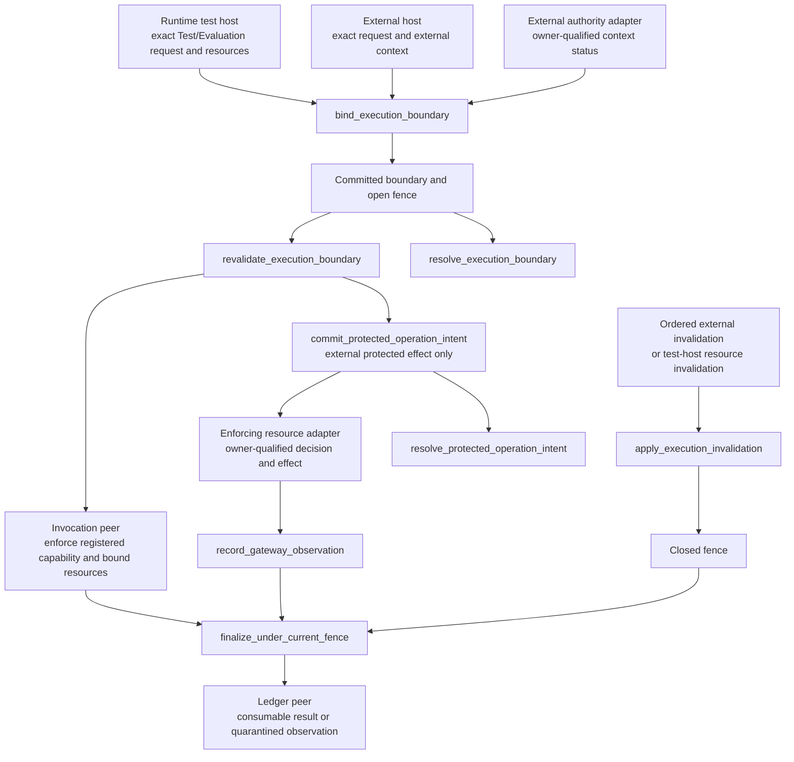

# Agent Runtime External Authority Integration Contract

## 0. Intent Capsule

```yaml
layer: T2
status: candidate
canonical_owner: designDoc/agent_runtime_09_authorization_integration_contract.md
parent: designDoc/agent_runtime_00_execution_charter.md
owned_system_object: Runtime execution boundary binding
scope:
  - distinguish Runtime-hosted self-test resources from external execution authority
  - immutable execution boundary binding and exact release/input closure
  - admission, re-entry, dispatch, invalidation fence and late-result quarantine
  - protected-operation intent and external decision/effect reference propagation
  - Runtime-owned boundary observations and failure evidence
non_goals:
  - caller authentication, identity, tenant, Entitlement or permission policy ownership
  - Product Authorization database-permission decisions or grant issuance
  - provider authentication, credential custody or direct domain database access
  - resource Gateway internals, domain SQL, canonical writes or business invariants
  - execution scheduling, graph transitions, domain quality or release admission
inputs:
  - host-accepted request with exact execution, release and frozen input identity
  - explicit Runtime test-host resource bindings for Test or Evaluation
  - owner-qualified external context and public validation binding when external authority is required
  - registered protected-time predicate and clock profile/evidence bindings when the time judgment requires them
  - exact Module operation intent and enforcing-adapter binding
  - trusted host projection of the external owner's grant requirement for an exact protected operation
  - ordered invalidation event or external decision/effect observation for an existing binding
outputs:
  - immutable Runtime execution boundary binding and current fence result
  - committed protected-operation intent and exact read-only resolution
  - owner-qualified external observation, quarantine or explicit failure
truth_surfaces:
  - designDoc/agent_runtime_09_authorization_integration_contract.md
  - code-owned Runtime boundary contracts and validators
  - committed Runtime boundary, intent, fence and observation records
  - generated Runtime inspection
runtime_triggers:
  - execution creation or re-entry
  - dispatch after wait, external event or requested revision
  - protected-operation dispatch or result acceptance
  - invalidation of a bound external context or test resource
downstream_consumers:
  - Execution, Invocation, Durability, Ledger and Inspection
  - host integration and enforcing resource adapter
  - Agent Capability Verification
open_decisions: []
review_gate: independent design_contract_reviewer review and accountable Runtime external-authority owner decision before implementation
runtime_surface_ledger: generated from committed boundary, intent, fence and observation records
verification_hooks:
  - self-test without production authorization client or synthetic approval
  - exact identity, resource isolation and external-context closure
  - monotonic fence, late-result quarantine and idempotent effect observation
  - opaque credential handling and external failure-owner preservation
```

## 1. Primary System Flow



图中的 operation 属于本 capability，并在 §9 定义完整 interface。Invocation 负责实际 provider/tool
调用和资源限制，resource adapter 负责受保护效果，Ledger 负责事实提交。本 capability 只绑定边界、
检查引用和协调 fence，不执行 peer 的操作。任何失败都保留 §10 指定的真实 owner。

## 2. User Intent

Runtime 可以在自己的测试宿主中重复验证已注册 Module，无需部署生产授权服务，也无需制造一份
“允许所有操作”的生产批准。需要外部受保护效果的执行则继续绑定真实外部决定，在权限失效后停止
推进。两类路径共用执行事实与资源隔离规则，缺少外部授权不能被解释为自动进入自测。

## 3. Reader Gain

- Runtime Maintainer 能判断何时只验证测试资源，何时必须验证外部 context，避免把生产 client 设为每次执行的必填项。
- Host Integrator 能提供精确的入口、资源和外部决定引用，同时把身份、策略与 credential 留在所属宿主。
- Data Access Owner 能区分 Module declared operation、数据库权限与实际效果，不把 Runtime binding 当作数据库许可。
- Security Reviewer 能追踪绑定、重新验证、fence、迟到结果与外部 effect evidence，并确认没有权限升级或重复效果。

## 4. Capability and Operation

本 T2 拥有一个 Runtime execution boundary binding：把一次执行的精确身份与它实际适用的资源边界
固定在一起。它不是用户 permission assignment、生产批准或新的产品身份。

| Concern | Accountable owner | 本 capability 的交接 |
| --- | --- | --- |
| Caller authentication、host API access、workload authentication | 请求所属的 host 与 identity infrastructure | 消费已接受的请求及 opaque identity refs，不读取认证凭据 |
| 普通自测可用的资源 | Runtime 测试宿主；Invocation 执行实际限制 | 验证宿主提供的绑定与本次执行一致，不签发生产权限 |
| 外部 execution context、policy、Entitlement、revocation 与 grant | 明确提供该能力的外部 owner | 经宿主 public adapter 消费 exact context/status refs；不假定该 owner 是 Portable Product Authorization |
| user_key 的 database_id 和 read/write permission | Product Authorization | 由 project data-access adapter 在每次数据库操作前取得决定；Runtime 不缓存或解释 permission |
| Release 与 declared operation | Registry | 消费 exact registered Module release，不把 operation declaration 当成外部许可 |
| 实际资源访问、业务约束与效果 | Data Governance 指定的 adapter 与 domain owner | 发出冻结 intent，记录返回的 decision/effect refs，不接管 SQL 或 credential |
| 执行调度、恢复、事实提交与检查 | Execution、Durability、Ledger、Inspection peers | 提供 boundary/fence 结果，不改变其各自权威 |

外部宿主可以使用 Principal、tenant、Cell 等隔离身份，但它们来自对应 owner 的可信 context；
Runtime 只检查引用的一致性，不从模型或 caller payload 推导它们。发起主体与 Runtime workload actor
保持可区分，Workflow Execution 本身不会变成 Product Principal。普通自测无需创建虚构的这些身份。

## 5. Boundary Binding and Re-entry

### 5.1 Runtime-hosted self-test

只有可信 Runtime 测试入口提供的 Test/Evaluation 请求可以使用 self-test boundary。入口类别与
execution purpose 必须匹配，缺少 external context 本身不构成选择此路径的条件。绑定至少闭合：

- exact execution identity、registered release、frozen input 与 Profile；
- 测试宿主提供的资源身份、所属测试范围与使用限制；
- registered Adapter、declared operations，以及 workspace 和 network 的实际约束；
- Runtime 记录和 artifact 的测试存储绑定；要求外部保存时，另有显式的目的地和保存约束。

资源来源必须可追溯到可信测试宿主的配置，不能接受模型声明“这是测试资源”作为证明。
Registry、Execution 与 Invocation 的既有检查继续分别验证 release、input、Profile、operation 和实际
资源可达性。测试范围外的资源在效果发生前拒绝；不得补一份生产 grant 或悄悄换成外部执行路径。

自测绑定是 Runtime execution evidence，不使用生产 authorization context/status、Entitlement 或 grant
来表示。创建、重入与 dispatch 都不要求 Product Authorization client，也不调用返回伪造 allow 的替身。
其资源失效由测试宿主报告并由 Runtime fence 阻止继续使用；provider 登录失败仍属于 Invocation。

### 5.2 External execution context

需要外部执行授权的路径在创建 execution 前，必须取得可信宿主提供的 exact context 和可用的 public
validation adapter。宿主决定其 policy、identity 和 authority；Runtime 验证以下不可变闭包：

- execution、Workflow 或独立 Module release、input package 的精确身份；
- 外部 context 的 owner、ref/hash，以及它绑定的发起主体与 workload actor；
- 外部 owner 声明的 tenant、Cell 或其他隔离范围；
- decision、policy/catalog release 的 opaque refs，以及有效期和状态引用。

需要受保护时间判断时，boundary 还固定 §5.4 所规定的 predicate 和适用 clock profile 的精确引用。
每次判断另外绑定该次使用的 fresh health evidence；更新健康观察不改变 execution scope，也不把
不断刷新的 evidence 当作 immutable context 本身。

Runtime 不保存 policy expression、Entitlement body、credential、database role 或 mutable permission
list。精确 closure 不同必须创建新 execution 和 binding；外部权限扩大也不能扩大已运行的 scope。
外部 owner 的 validate-execution-context 能力可以由进程内 adapter、HTTP client 或其他 transport
提供，Runtime 不需要 identity administration、policy query 或直接数据库接口。

Portable Product Authorization 只定义数据库 permission。这里的 execution-context validation 属于
宿主明确绑定的外部能力，不要求该 T0 新建 Principal、tenant、Cell、grant 或 execution permission。
该区别不会删除外部路径所需的真实检查，无法取得所需 adapter/status 时仍在受保护 transition 前停止。

### 5.3 Re-entry and fence

创建执行、进程重入或 recovery、等待或外部事件后的 dispatch，以及同一 execution 内的请求修订，
都重新检查原 boundary。普通自测检查测试资源仍可用且范围未变；外部路径验证同一 context 的精确
引用、按 §5.4 判定的时间有效性与当前状态。缺失、冲突或过时的状态不能允许受保护 transition。

Fence 只有 open 与 closed 两种控制含义，并按 execution 单调关闭。收到适用于已绑定 context 的
有序 invalidation，或可信测试宿主报告绑定资源失效后，关闭 fence；后续重新有效的观察不能重开旧
execution。继续工作需要新 execution。无关 context 的事件不会关闭本 execution，但也不会改变其
boundary；冲突或无法验证的事件返回失败，不触发 dispatch。

校验状态、dispatch admission 与结果提交必须受同一 fence 顺序约束；不能先校验再无条件提交。
外部查询失败只允许重试相同验证，不扩大 scope，也不把暂不可用解释成 allow。

### 5.4 Protected time judgment

凡本 capability 对有效期或 fence 作受保护的 cross-role 或 cross-clock 判断，都消费 Timestamp
Semantics §6.7 所规定的 registered predicate。该 predicate 固定 operand role、clock domain、
comparison meaning 与 operation purpose；本 capability 不在 adapter 或 local utility 中另写 raw
timestamp comparison。只验证 UTC 格式不能证明可执行该判断。

跨 clock-domain instant 的判断还必须绑定 immutable DistributedClockProfile 的 exact ref/hash，
以及每个参与 domain 的 fresh、immutable ClockHealthEvidence 的 exact ref/hash。Profile 固定在
原 boundary，health evidence 逐次进入 boundary/fence/结果资格观察，供同一 protected record 复核。
实际阈值和 freshness policy 由 admitted profile 提供，本 T2 不定义固定 skew 数值。

受保护 commit 只能发生在 Timestamp §8 的 conservative half-open window 内：使用 authoritative
store 的 recorded_at_utc，并在 effective 和 expiry 两端保留 profile 指定的 safety margin。
观察时间不能代替 commit time，先前检查通过也不能代替 commit 边界的有效性验证。结果提交仍与
§5.3 的当前 fence 顺序原子一致；clock health 不证明因果顺序，fence 的提交顺序也不证明 clock health。

所需 predicate、profile 或 health evidence 缺失、过期、不健康、退化、身份不匹配或不可验证时，
返回 RUNTIME_BOUNDARY_INVALID，并停止对应 admission、dispatch 或 protected commit。只有相同
predicate/profile 下的新有效 evidence 可用于重试该判断；重试不能重开已关闭的 execution fence。
在有效时钟证据下确认 context 已到期，或通过权威状态/有序事件确认其已撤销时，仍按
RUNTIME_BOUNDARY_FENCED 关闭旧执行。撤销处理不等待 clock health；它依据独立的权威状态与因果顺序。

没有 cross-clock instant 判断的普通自测不因此要求外部 clock profile 或 health service；如果某个
自测操作实际引入受保护的 cross-role/cross-clock 判断，它仍适用上述规则。Runtime 不自行声明
Timestamp §8 的 online-protocol 例外，也不把现有 status 查询假定为已获准的例外。

## 6. Protected Operations and External Grants

外部 protected operation 使用 exact Module release 的 declared operation，并从可信 Runtime 状态
构建 intent。它绑定 execution、Module Run、Module release、external context、operation、
resource/action、enforcing adapter、idempotency identity 与观察时间。未声明 operation 或 closure
不匹配时，在调用 enforcing adapter 前拒绝。Runtime 先提交 intent，再交给该 adapter。
这里的 enforcing resource adapter 也称 Gateway；record_gateway_observation 沿用这一名称，
只负责记录其返回的引用。

Module declaration 与外部决定必须同时允许所需效果。Enforcing adapter 负责验证 Runtime workload、
精确 intent 和相关资源范围，并按其所属 authority 取得当前决定、执行 Data Governance 与 domain
invariants，再返回有界结果及 decision/effect evidence refs。Runtime 只记录这些引用。
数据库操作使用 project data-access adapter 的 Product Authorization 决定；其他效果使用其真实 owner。
外部 denial 保留原 owner，可按 owning Workflow contract 成为失败或 typed outcome，不能改写成 allow。

Grant 是否必需，唯一来源是外部 owner 的 admitted resource contract 经可信 host adapter 提供的
owner-qualified 适用性声明。每个 external protected-operation intent 都明确绑定该声明的 owner、
source ref/hash、operation、resource、enforcing adapter，以及 required 或 not_required 结果。
Runtime 校验来源属于已绑定的可信 adapter、声明与 intent 的精确身份一致，并把声明引用写入 intent；
缺失声明不能默认视为 not_required，模型、Module payload 或 Runtime 的操作分类都不能替代该来源。

声明为 required 时，Runtime 还校验 opaque operation_grant ref 已提供；为 not_required 时不合成
grant 或 grant disposition。实际 grant 有效性与该 operation 的当前权限仍由 enforcing adapter 检查，
它不能仅凭 Runtime 已记录一份声明就执行效果。来源、适用性声明或 grant ref 改变时，不得覆盖已提交
intent；同一 idempotency identity 下的变更仍按冲突处理。普通自测不进入这项外部适用性声明流程。

Publication、external send/disclosure、sensitive export、真实交易或跨服务 canonical mutation 等效果，
仍遵守其 owner 已声明的 grant 要求；Runtime 不重新制定这些类别的权限规则，也不降低既有要求。
Enforcing adapter 负责 issuer、audience、subject、actor、action、resource、context、idempotency、
validity 和 replay-policy 验证。缺少有效 grant 的受控效果在执行前被拒绝。

普通读取、内部检索、model call 或同步调用不会仅因“可观察”就要求 single-use grant；是否需要外部
决定取决于实际效果和 owner contract。普通自测中的受限 provider call 由测试资源与 admitted Adapter
约束，不经过生产 decision/grant 流程。需要真实生产效果的请求不属于 self-test boundary。

## 7. Provider and Data-Access Isolation

Provider adapter 只获得 scoped callbacks 或 frozen input。模型进程不获得外部 authority client、
policy table、Entitlement body、database credential 或 unfiltered resource client。更换 provider、
model、SDK、CLI 或 durable backend 必须遵守原 execution 的 release、Profile、input 和资源边界；
不能借 Variant 变化替换外部身份、context 或扩大范围。

数据库 credential 由宿主取得并提供给指定 storage/data-access adapter。Runtime core 与 Module
只按需要原样携带 opaque handle，不解析、签发、刷新、持久保管或扩大 credential scope；handle 不
进入模型可见 context、日志或 boundary records。Provider-native tool traces 只是 telemetry，
不能代替外部 permission decision 或 effect evidence。

## 8. Evidence and Retention

本 capability 只向 Runtime Ledger 提交自己的记录：boundary binding、状态观察、fence、
protected-operation intent、external decision/effect refs，以及适用的 grant disposition、
invalidation、quarantine 和 closure evidence。普通自测记录资源绑定和检查结果，不伪造生产
authorization evidence。外部身份、策略、决定及 grant 的权威记录仍属于各自 owner 的 store。

测试宿主提供临时记录和 artifact 存储，其创建、证据导出、保留与清理由测试策略约束。没有显式外部
Ledger binding 时，仅写入这些测试资源；有外部保存要求时，宿主另行提供目标和必要凭据。
保存失败由 Ledger/storage owner 返回失败，不能被本地保存成功掩盖。外部保存只增加证据目的地，
不授予模型额外操作能力，也不使已有持久 Registry 或外部记录变为测试清理对象。

存储、transaction 和 retention mechanism 由 Ledger 与测试宿主实现，本 capability 不另建数据库。
清理临时资源后，不声称可以恢复已经销毁的事实。Runtime trace 和 usage 由 execution events 生成；
人工记录或 provider telemetry 均不能替代 committed facts。

## 9. Public Interface and Effects

下表固定 logical interface identity 与最小输入结果。具体 DTO、版本、hash codec、schema、
physical source layout 与 SDK binding 由 code-owned contract 表达。

| interface_id | Owner | Input | Successful output | Effect | error_code |
| --- | --- | --- | --- | --- | --- |
| bind_execution_boundary | External Authority Integration | trusted entry kind、exact execution/release/input/Profile；self-test resource bindings 或 required external context/status；§5.4 适用的 predicate、clock profile 与本次 health evidence refs/hashes | immutable boundary ref/hash 与 open fence | 校验并提交同一 execution 的唯一边界；不创建生产许可或启动 provider | RUNTIME_BOUNDARY_INVALID |
| revalidate_execution_boundary | External Authority Integration | exact boundary、受信任的当前资源/status observation 与 §5.4 适用的本次时间判断证据 | 当前 fence 与绑定检查结果 | 保持原 scope；失效时单调关闭 fence | RUNTIME_BOUNDARY_INVALID、RUNTIME_BOUNDARY_FENCED；external adapter failure 保留 owner |
| commit_protected_operation_intent | External Authority Integration | external boundary、exact Module release/Run、declared operation、resource/action、adapter、idempotency、§6 的 owner-qualified grant 适用性声明、required 时的 grant ref 与 §5.4 时间判断证据 | committed intent ref/hash，含适用性声明引用 | 在 protected effect 前提交唯一 intent | RUNTIME_BOUNDARY_INVALID、RUNTIME_BOUNDARY_FENCED、RUNTIME_OPERATION_INTENT_INVALID |
| resolve_execution_boundary | External Authority Integration | host-accepted exact boundary ref/hash | immutable Runtime boundary record | read-only；不返回 credential 或 peer policy | RUNTIME_BOUNDARY_INVALID |
| resolve_protected_operation_intent | External Authority Integration | host-accepted exact intent ref/hash | committed intent record | read-only；不执行 effect | RUNTIME_OPERATION_INTENT_INVALID |
| record_gateway_observation | External Authority Integration | exact intent、owner-qualified decision/effect refs、适用 grant disposition 与 terminal observation | committed observation ref/hash | 记录外部事实引用；不把它提升为 permission authority | RUNTIME_BOUNDARY_OBSERVATION_INVALID |
| apply_execution_invalidation | External Authority Integration | exact boundary 与可信、相关、有序的 external/test-resource invalidation | closed fence 或无关事件的无变更结果 | 原子地关闭相关 fence；不回滚已提交外部效果 | RUNTIME_BOUNDARY_INVALID |
| finalize_under_current_fence | External Authority Integration | exact boundary、原 Attempt/result identity、待提交的有界 observation 与 §5.4 适用的 commit-time 判断证据 | 与 fence 顺序一致的 consumable result 或 quarantine evidence | 经 Ledger 提交结果资格；不执行或重复外部效果 | RUNTIME_BOUNDARY_INVALID、RUNTIME_BOUNDARY_OBSERVATION_INVALID |

任何记录提交或读取失败都保留 Ledger owner，并阻止依赖该记录的 dispatch 或结果推进。
上述 interface 不能成为绕开 host API access 的新入口。Peer adapter 的 failure 保留其 owner 与原因；
它不是本 capability 新定义的错误码。

## 10. Completion, Failure, and Recovery

一次 boundary operation 只有在 exact input、immutable identity、适用检查与所需 Ledger commit
均成立时才完成。重复相同 idempotency identity 返回已提交的同一事实；同一 identity 携带不同 payload
返回冲突，不生成第二次效果。观察时间只作为具名 predicate 的 typed input 或观察证据，不替代
authoritative commit time；受保护有效期判断按 §5.4 执行。任何 timestamp 都不参加 idempotency identity。

| error_code | Owner | Condition | Meaning | Caller action |
| --- | --- | --- | --- | --- |
| RUNTIME_BOUNDARY_INVALID | External Authority Integration | entry/purpose 不匹配；所需 binding/status 缺失或结构/身份/范围不匹配；invalidation 无法验证；§5.4 所需 predicate/profile/health evidence 缺失、过期、不健康、退化或不可验证 | 原 boundary 无法支持当前操作；不允许 admission、dispatch 或 protected commit；时钟证据失败不冒充外部 revocation | 修复同一 owner 的输入；同一 predicate/profile 下可用新有效 evidence 重试；closure 改变时创建新 execution，不回退为 self-test |
| RUNTIME_BOUNDARY_FENCED | External Authority Integration | external context 已失效、到期或撤销，或 self-test 资源已失效；原 fence 已关闭 | 当前 execution 不再允许新的 dispatch 或 protected operation | 保留原事实；需要继续时以有效的新 boundary 创建新 execution |
| RUNTIME_OPERATION_INTENT_INVALID | External Authority Integration | operation 未声明；Module/Run/adapter/resource 引用不匹配；§6 的 grant 适用性声明缺失、来源无效或与 intent 不一致；声明 required 而 grant ref 缺失；idempotency payload 冲突 | 未形成可交付的 protected-operation intent | 修复同一外部 owner 提供的声明或 intent；不得自行推断适用性、调用替代 Gateway 或直接 credential |
| RUNTIME_BOUNDARY_OBSERVATION_INVALID | External Authority Integration | result、decision、effect 或 grant disposition 不属于 exact intent/Attempt，或 terminal observation 冲突 | 不接受该 observation 为可推进事实 | 保存有界失败证据并交给 observation owner；不重放已发生效果 |

外部 context validation 不可用时，保持该 external adapter failure，暂停受保护 transition，只重试
同一验证。Gateway denial、resource failure 与 grant rejection 都保留 enforcing owner；
Runtime 不借更换 Provider、Gateway、Workflow、policy copy 或 credential 绕过它们。

关闭 fence 后不开始新的 Module dispatch 或 protected operation。迟到 provider output 被隔离为
non-consumable evidence，不能推进 graph；先前已提交的外部效果由对应 owner 核对，不能再次执行。
需要关闭的 provider context 与 pending work 交给 Invocation、Execution 和 Durability 的既有接口。
外部授权失效继续向 Execution 返回 authorization_invalidated 的终止原因；普通自测的资源失效
保留资源失效原因，不伪造外部 revocation。历史输出的历史有效性不被抹去，但它不能重启旧 execution。

## 11. Dependencies and Verification

| Dependency | 本 capability 消费的结果 | 本 capability 返回的结果 |
| --- | --- | --- |
| Runtime T1 | 自测与外部入口的 domain boundary、责任与 failure owner 委派 | 有界的 binding/fence 合同 |
| Registry | exact registered release 和 declared operation | 无 release mutation |
| Invocation | Profile/Adapter compatibility 与资源限制结果 | 冻结 boundary、可执行 intent 或停止结果 |
| Execution 与 Durability | exact execution/Attempt identity 和有序 transition | 重入、dispatch 与最终结果的 boundary/fence 判定 |
| Ledger 与 Inspection | committed fact 与只读 query contract | Runtime-owned evidence 与可关联引用 |
| External authority/data-access owner | status、permission、grant 适用性声明、grant 或 effect 的 owner-qualified observation | exact Runtime intent；不复制 peer policy |
| Timestamp Semantics 的 registered predicate 与 clock evidence binding | 适用的 typed comparison、DistributedClockProfile 与 ClockHealthEvidence | protected record 对 exact profile/evidence 的引用；不另造 clock authority |
| Agent Capability Verification | 自测编排和资源生命周期 | owner-qualified positive、negative 与 unavailable 结果 |

代码必须提供 binding、intent、fence、observation 的 typed contract 和 deterministic validators，并能
把同一 execution 的单调 fence 与结果提交放在同一顺序中验证。所需 schema/validator identity、immutable
Code Projection 与本 T2 identity 绑定；当前 SDK 名称、版本、物理路径、测试结果与迁移状态由 generated
Current Inspection 展示。Code Design 决定既有 port/DTO 如何映射到这些逻辑接口，不因文档改名或改层级
静默重写已注册 release、已有记录或 host API。兼容与迁移必须有各自验证依据。

受保护时间判断还须在 code-owned predicate registration 中闭合本 capability 的 operand role、clock
domain 与 operation purpose，并实现 §5.4 的 exact profile/health-evidence 引用和 fail-closed 验证。
这些 binding 缺失时，对应受保护路径保持不可执行；普通自测没有该判断时不因此被阻塞。

验证必须覆盖：

- 普通自测完全不构造或调用生产 authorization client、context/status 或 grant，仍能执行真实 model call；
- 缺失 external context 的外部请求、伪造测试 entry/purpose、生产资源冒充测试资源都在效果前被拒绝；
- exact release、input、Profile、operation、resource、execution 或 Module 之间的跨绑定重用失败；
- 外部主体与 workload actor 可区分，caller 无法改写 tenant、Cell、release 或 context；
- 外部 scope 扩大不扩大已运行 execution；到期、撤销、资源失效、重入与 dispatch 竞争都遵守 fence；
- 跨时钟判断覆盖 conservative window 两端、时钟不健康/退化/过期/缺失、profile 不匹配与 check-to-commit 竞争；不使用无 profile 的 raw comparison，也不把 health evidence 更新当作 scope 扩大；
- 无关、重复或乱序 invalidation 不重开 fence、不误关联 execution；迟到结果不能推进 graph；
- registered high-risk effect 保留适用 grant 检查，普通自测的 model call 不要求生产 grant；
- grant 适用性声明只来自可信外部 owner：缺失、来源错误、operation/resource 不匹配或模型伪造的声明均拒绝；required 缺少 grant ref 时拒绝；not_required 不生成 grant disposition；adapter 仍独立验证当前权限与 grant；
- provider 只取得 scoped input/callback，telemetry 和 Runtime records 不含 policy、grant body 或 credential；
- 无外部 Ledger binding 时不写外部存储；外部保存失败不冒充成功，已有 Registry records 不被测试清理；
- idempotent intent、observation 与最终结果在 retry/recovery 后不重复 effect，所有 failure 保留真实 owner。

## 12. References

- [Runtime Domain Root](agent_runtime_00_execution_charter.md)
- [Agent Runtime](the_agent_runtime.md)
- [Product Authorization](the_product_authorization.md)
- [Data Governance](the_data_governance.md)
- [Timestamp Semantics](the_timestamp_semantic.md)
- [Design Doc Management](the_design_doc_management.md)
- [Software Delivery](the_software_delivery.md)
