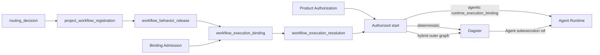

# Workflow Execution Binding and Admission Contract

**Purpose**: Define how the Agency Platform binds one immutable product or
domain workflow release to an admitted deterministic, Agent, or hybrid
execution target without transferring business ownership, authorization, or
Runtime authority to the binding service.

**Required reader gain**: A reader can distinguish a logical workflow release,
a host execution binding, a task authorization decision, a Dagster definition,
an Agent Runtime `workflow_release`, and a Skill projection; then verify that a
task starts only through one exact admitted combination.

## 0. Intent Capsule

```yaml
layer: T1
status: proposal
canonical_owner: designDoc/agent_runtime_10_workflow_execution_binding_and_admission_contract.md
parent: designDoc/the_agency_platform.md
scope:
  - product-workflow registration boundary
  - deterministic, Agent, and hybrid execution classification
  - immutable host execution binding and admission
  - fail-closed resolution from logical workflow release to executable target
  - Dagster and Agent Runtime target coexistence under one Workflow Control Plane
non_goals:
  - business workflow meaning, states, quality rules, or completion semantics
  - semantic task routing
  - Principal, Entitlement, policy, delegation, or operation-grant issuance
  - Dagster asset or schedule semantics
  - Agent Runtime graph, context, evaluation, telemetry, or recovery semantics
  - Skill authoring, migration, or projection governance
outputs:
  - project_workflow_registration-to-workflow_behavior_release boundary
  - workflow_execution_binding
  - workflow_execution_binding_admission_record
  - workflow_execution_resolution
  - runtime_execution_binding
review_gate: design review, deterministic release-binding conformance, and independent platform engineering review
runtime_surface_ledger: generated from code-owned product workflow, execution-binding, and Runtime Release Registry surfaces
```

## 1. Authority Separation

The binding contract connects existing authorities. It does not replace them.

| Object or decision | Canonical owner |
| --- | --- |
| Business objective, workflow states, inputs, outputs, loops, human gates, and completion | Owning product or domain T1 |
| Logical mainline selected for a request | Task Routing |
| Principal eligibility and exact execution permission | Product Authorization |
| Stable logical workflow identity and project-index closure | Artifact Graph `project_workflow_registration` |
| Workflow behavior release and business contract content | Owning product or domain `workflow_behavior_release` |
| Execution class and host target binding | Agency Platform Workflow Control Plane |
| Deterministic asset and fixed-workflow execution | Admitted Dagster integration |
| Agent `workflow_release` admission and execution | Agent Runtime |
| Skill classification and Agent-facing projection | Skill Governance |
| Software release and deployment admission | Software Delivery |

The same stable logical workflow may receive a new behavior release or
executable binding without changing its `project_workflow_registration` identity.
A behavior change creates a new `workflow_behavior_release` before a new binding
can be admitted.

## 2. Workflow Identity and Behavior Release

Every managed product workflow resolves one Artifact Graph
`project_workflow_registration`. That record owns only the stable project-index
identity, the owning T1 Design Contract, the requested outcome, public contract
references, registration lifecycle, and graph entry points. It does not copy
the business contract content.

The owning product or domain T1 publishes immutable
`workflow_behavior_release` records under that stable identity. A behavior
release identifies:

- the exact `project_workflow_registration` and `workflow_index_release` entry;
- the behavior version and typed input and output schema references;
- the business graph or deterministic asset contract;
- the allowed execution classes;
- required authorization action and resource classes;
- domain completion, failure, and human-interaction boundaries;
- compatibility, supersession, and lifecycle state.

The exact record schemas and current instances belong to code. Artifact Graph
owns project-index identity law; the T1 Design Contract owns business behavior.
A Skill, model profile, CLI command, provider session, Dagster job, Runtime
release, or execution binding cannot create either authority.

Primary Agent development tools remain outside this product registry unless
they are deliberately migrated into a managed product workflow under Skill
Governance.

## 3. Execution Classes

The Workflow Control Plane binds one workflow release to exactly one admitted
execution class for a deployment scope.

| Execution class | Host target | Boundary |
| --- | --- | --- |
| `deterministic` | Admitted Dagster definition | No model or Agent call occurs anywhere in a deterministic-class workflow |
| `agentic` | Agent Runtime `workflow_release` | Runtime owns every Module Run, Execution Variant, Attempt, context, evaluation, and usage record |
| `hybrid` | Dagster outer definition plus one or more exact Agent Runtime `workflow_release` targets | Dagster owns fixed orchestration and data assets; each Agent segment is an independently identified Runtime subexecution |

Execution class is an engineering binding. It does not change Task Routing,
authorization, or the domain's completion semantics.

## 4. Workflow Execution Binding

`workflow_execution_binding` is an immutable host record that connects:

- one exact `project_workflow_registration` in one immutable `workflow_index_release`;
- one exact `workflow_behavior_release` under that stable identity;
- one tenant, product, environment, and deployment scope;
- one execution class;
- the exact admitted Dagster definition, Runtime `workflow_release`, or hybrid target set;
- compatible software and contract releases;
- required authorization and data-boundary references;
- activation window, lifecycle, and replacement relation.

The binding contains references and hashes. It does not copy domain graph
semantics, Entitlement statements, prompts, model profiles, credentials, or
customer data.

For `agentic` and every Agent segment of `hybrid`, the binding resolves one
exact `workflow_release`. Runtime independently validates that release, its
Module closure, graph projection, execution release, adapters, store, and
admission state. Host resolution cannot insert or mutate a Runtime release.

For `deterministic` and the outer graph of `hybrid`, the binding resolves an
admitted Dagster definition and its release. Dagster cannot use the binding to
invoke a model provider directly.

After Product Authorization allows an Agent start, the Control Plane issues one
immutable `runtime_execution_binding`. It is the Agent-scope handoff to Runtime
Intake and pins:

- the exact `workflow_execution_resolution` and `workflow_execution_binding`;
- the exact `project_workflow_registration`, `workflow_behavior_release`, and
  `workflow_index_release` entry;
- the exact `workflow_release` for the Agent segment;
- the Product Authorization decision and execution authorization context refs
  and hashes;
- the immutable input closure plus tenant, Cell, data-scope, environment, and
  release bindings; and
- its issuer, creation time, validity window, and canonical hash.

`runtime_execution_binding` is not a second workflow binding and cannot widen the
host resolution or authorization decision. Runtime validates every pinned ref
against `runtime_release_registry` and rejects missing, stale, ambiguous, or incompatible
closure.

## 5. Admission and Resolution

A binding is usable only after an immutable
`workflow_execution_binding_admission_record` proves:

- the project workflow registration and behavior release exist, join through
  the same stable identity, and permit the selected execution class;
- every referenced target exists, is admitted for the declared scope, and has a compatible release;
- input, output, authorization, data, Cell, and environment contracts close;
- deterministic and Runtime conformance evidence required by Software Delivery is present;
- the binding has no duplicate active owner for the same workflow and scope;
- supersession, rollback, and invalidation behavior are defined.

At task start, the Workflow Control Plane returns one immutable
`workflow_execution_resolution` bound to the exact routing decision, logical
workflow registration, behavior release, execution binding, admission record,
deployment scope, and authorization request. The resolution is not execution
permission. Product Authorization still decides whether the exact Principal,
input closure, and operation may run. Only an allow decision permits the
Control Plane to issue the `runtime_execution_binding` used for Agent work.



## 6. Failure and Change Semantics

The Control Plane fails closed when the logical workflow, binding, admission
record, execution target, release, environment, authorization, or data scope is
missing, stale, ambiguous, or incompatible.

It does not reroute to a neighboring workflow, select a different model,
invoke a direct CLI or SDK fallback, or use a Skill as an executable binding.

Changes follow these identity rules:

- workflow index identity or owner-reference change creates a new
  `project_workflow_registration` release under Artifact Graph law;
- business behavior change creates a new `workflow_behavior_release`;
- execution target or deployment change creates a new `workflow_execution_binding`;
- Runtime Module, provider, model, prompt, or tool-policy change follows Agent Runtime release and Variant law;
- Dagster definition or deterministic implementation change follows Software Delivery release law;
- permission change creates a new Product Authorization decision and may invalidate a running execution;
- Agent start authorization or any pinned target change creates a new
  `runtime_execution_binding`;
- Skill wording or projection change follows Skill Governance and cannot mutate any execution record.

## 7. Required Code and Inspection

The implementation requires:

- a code-owned Artifact Graph `project_workflow_registry` for stable project-index identities;
- code-owned domain `workflow_behavior_registry` releases owned by product and domain T1 packages;
- a code-owned `workflow_execution_binding_registry` owned by the Agency Platform composition layer;
- deterministic validation of identity, uniqueness, reference closure, execution-class compatibility, target admission, and scope;
- immutable binding admission, task-start resolution, and Runtime handoff records;
- generated inspection that joins logical workflow releases to their current execution bindings without copying domain or Runtime authority;
- negative tests for missing targets, duplicate bindings, stale releases, cross-tenant or cross-Cell reuse, direct provider bypass, and unauthorized fallback.

Current workflows, Dagster definitions, Runtime plugins, providers, models,
commands, environments, and binding status belong only to code-owned
Registries, deployment configuration, persistent records, and generated
inspection.

## 8. Invariants

1. One stable logical workflow identity has one Artifact Graph registration and one owning product or domain T1.
2. Every behavior release joins one exact project workflow registration; one deployment scope resolves at most one active execution binding for that pair.
3. A binding cannot create business meaning, authorization, or Runtime Release Registry authority.
4. Dagster and Agent Runtime remain separate execution authorities under one host Control Plane.
5. Every model invocation enters Agent Runtime, including model steps inside hybrid workflows.
6. Skill projection and production execution binding remain separate records.
7. Task Routing remains stable when an execution binding changes or fails.
8. Missing or incompatible binding closure fails closed without fallback.
9. Current binding and admission truth comes from code and persistent records.
10. Runtime Intake accepts Agent work only through one hash-bound `runtime_execution_binding` issued after Product Authorization allows the exact resolved target.

## References

- [Agency Platform](the_agency_platform.md)
- [Agent Runtime](the_agent_runtime.md)
- [Product Authorization](the_product_authorization.md)
- [Task Routing](the_task_routing.md)
- [Artifact Graph](the_artifact_graph.md)
- [Software Delivery](the_software_delivery.md)
- [Skill Governance](the_skill_management.md)
