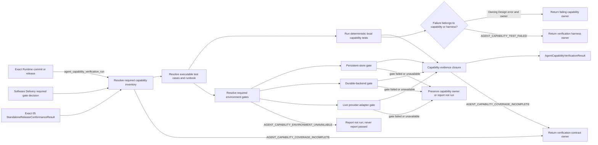
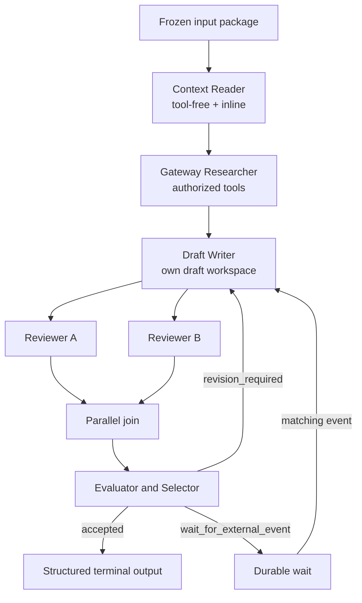

# Agent Capability Verification

## 0. Intent Capsule

```yaml
layer: T2
status: candidate
canonical_owner: designDoc/agent_runtime_11_agent_capability_verification.md
parent: designDoc/agent_runtime_00_execution_charter.md
owned_system_object: Agent Capability Verification Contract
scope:
  - complete Agent-facing capability inventory
  - one canonical Example Workflow covering Module, Workflow, Profile, tools, workspace, retry, parallelism, wait, recovery, Ledger and Inspection
  - deterministic local test set
  - explicit persistent-store, durable-backend and live-provider environment-gate classes
  - exact separation between stable verification intent and mutable code truth
non_goals:
  - define new Runtime execution behavior
  - own Module, Workflow, Registry, Invocation, Durability, Ledger or Inspection production semantics
  - select a provider, model, database, durable backend or host product
  - treat skipped integration tests as passed
  - coordinate one execution across several Runtime instances
inputs:
  - exact Runtime source or immutable release candidate
  - exact registered Module, Workflow, Policy and Execution Profile releases used by the Example
  - admitted verification-suite ref and hash
  - Software Delivery required-environment-gate decision ref and hash
  - host environment-availability inspection ref and hash
  - exact 05 StandaloneReleaseConformanceResult ref and hash
outputs:
  - AgentCapabilityVerificationResult
  - capability-by-capability evidence map
  - local and environment-gated failure report
truth_surfaces:
  - designDoc/agent_runtime_11_agent_capability_verification.md
  - code-owned test inventory and test runner
  - immutable Runtime release refs and hashes under test
  - generated verification result for one exact commit or release
runtime_triggers:
  - Runtime capability change
  - Module or Workflow authoring API change
  - Execution Profile or Adapter admission change
  - Runtime release candidate verification
downstream_consumers:
  - Software Delivery
  - Runtime package release verification
  - Host integration and Example users
open_decisions: []
review_gate: independent design_contract_reviewer review before implementation; engineering_change_reviewer review for the executable test set
runtime_surface_ledger: generated AgentCapabilityVerificationResult; this Design Doc never stores current pass/fail authority
verification_hooks:
  - deterministic local Runtime and Workflow suite
  - persistent Registry and Ledger gate
  - durable-backend integration gate
  - live provider-adapter gate
  - exact 05 StandaloneReleaseConformanceResult
```

## 1. Primary System Flow



本 Flow 只拥有 verification。Module、Workflow、Profile、tool、workspace、authorization、Durability、
Ledger 与 Inspection 的产品语义继续由各自 T2 owner 定义。本 T2 只要求这些能力有完整、可重复、
不会产生 false green 的证明。

## 2. User Intent

Runtime Maintainer 需要用一套固定测试判断“这个 Runtime 里的 Agent 到底会什么”，而不是从数百个测试
文件、README、当前工作树或一次演示中推断能力。Module Author 与 Workflow Author 还需要一个完整 Example，
直接看到 Agent 如何接收 Context、使用工具、写自己的草稿、产生 structured output、重试、并行协作、等待
外部事件、恢复执行，并把完整事实写入 Ledger 与 Inspection。

这套验证必须区分本地确定性能力和依赖真实 environment binding 的能力。selected persistent store、durable
backend 或 live provider adapter 不可用时，
对应 gate 的结果是 `not_run`，不是 `passed`。

## 3. Reader Gain

- Runtime Maintainer 能看到完整 Agent capability inventory，以及每项能力由哪个测试证明。
- Module Author 能从一个 Example 判断 Module registration、Prompt、Schema、Policy 与 Profile 如何形成可执行闭包。
- Workflow Author 能看到一个 graph 如何表达顺序、并行、join、revision loop、wait 与 terminal outcome。
- Host Integrator 能判断同一个 immutable Workflow origin bundle 如何注册到一个或多个 Runtime，以及哪些
  evidence 证明各 Runtime 的 Execution Profile 与 Variant Policy 保持独立。
- Engineering Reviewer 能区分产品能力缺失、测试覆盖缺失、环境不可用和真实测试失败。
- Example 使用者可以从同一份 graph、fixtures 和命令复现实验，而不需要读取 Runtime private code。
- Operator 可以把同一组 executable test cases 当作 runbook，逐项看到 prerequisites、command、expected result、
  evidence、cleanup、failure routing 与 rerun boundary。

## 4. Capability Boundary

### 4.1 Module and release authoring

| capability | Required result | Owning Design | Verification evidence |
| --- | --- | --- | --- |
| Explicit Module loading | caller 提供 exact project root、Skill ID 与 Module ID；无 ambient 或 sibling discovery | 01 Registry | subject-bound executable case |
| Path-free release identity | repository path 不进入 Module candidate、release ref 或 release hash | 01 Registry | subject-bound executable case |
| Schema closure | input/output Schema ref 与 canonical content hash 闭合；invalid Schema fail closed | 01 Registry | subject-bound executable case |
| Prompt closure | Prompt Component source members、Schema members 与 Prompt Bundle ref/hash 完整闭合 | 01 Registry | subject-bound executable case |
| Policy closure | Behavior、Evaluation、Retry 与 Execution Variant Policy 使用 exact registered ref/hash | 01 Registry | subject-bound executable case |
| Profile independence | Module/Workflow release identity 不因 provider、model 或 Profile 改变 | 01 Registry | subject-bound executable case |
| Generic Profile compatibility | tool-free 与 tool-enabled Module 使用同一 operation classification；Profile 不得增删 Module tool capability | 01 Registry，08 Invocation owns Adapter admission | subject-bound executable case |

### 4.2 Agent invocation capabilities

| capability | Required result | Owning Design | Verification evidence |
| --- | --- | --- | --- |
| Inline semantic input | frozen input closure 以 exact bytes 进入 Context | 08 Invocation | subject-bound executable case |
| Structured output | provider-native projection 后仍通过 canonical full Schema validation | 08 Invocation | subject-bound executable case |
| Tool-free execution | tools empty、workspace none、network denied | 08 Invocation | subject-bound executable case |
| Authorized Gateway read | 只有 Module 声明且 Profile 允许的 Gateway tools 可进入 callable | 08 Invocation；09 owns external authorization handoff | subject-bound executable case |
| Attempt workspace | Agent 只读写自己的 draft workspace；其他 Attempt 与 ambient repository 不可见 | 08 Invocation | subject-bound executable case |
| Context isolation | sibling Variant、Attempt 与 Module Run 不共享 provider context 或 workspace | 08 Invocation | subject-bound executable case |
| Network enforcement | `denied` 与 `gateway_only` 由 Adapter 能力机械执行 | 08 Invocation | subject-bound executable case |
| Provider failure normalization | auth、quota、timeout、tool、policy 与 output failure 进入 bounded Runtime failure taxonomy | 08 Invocation | subject-bound executable case |

### 4.3 Execution and decision capabilities

| capability | Required result | Owning Design | Verification evidence |
| --- | --- | --- | --- |
| Module Run | exact Module、input closure、Profile 与 authorization 形成一个 Module Run | 10 Execution | subject-bound executable case |
| Multiple Variants | 同一个 Module release 可用不同 Profile 独立执行 | 10 Execution | subject-bound executable case |
| Evaluation and selection | evaluated candidate set 完整后才能形成 Selection 与 output resolution | 10 Execution | subject-bound executable case |
| Retry budget | Retry Policy 是 `max_attempts` 唯一 authority；每个 Attempt 具有 parent lineage | 10 Execution，07 owns durable retry coordination | subject-bound executable case |
| Idempotent replay | exact request 重放返回同一 committed result，不重复产生 side effect | 10 Execution，07 owns durable replay | subject-bound executable case |
| Operation authorization | model 与 tool operation 在进入 adapter/callable 前获得 exact authorization result | 09 External Authority Integration | subject-bound executable case |
| Cancellation | cancellation request 只改变指定 execution，并产生可检查 terminal fact | 07 Durability，10 owns terminal execution result | subject-bound executable case |

### 4.4 Workflow graph capabilities

| capability | Required result | Owning Design | Verification evidence |
| --- | --- | --- | --- |
| Graph authoring | `Workflow` 由 exact Module release nodes、edges、mappings 与 terminal edges 构成 | 01 Registry | subject-bound executable case |
| Sequential and branch routing | node outcome 只能进入 graph 声明的 target 或 terminal | 10 Execution | subject-bound executable case |
| Parallel fan-out and join | branch Attempt 相互隔离；join 只消费完整 required branch set | 10 Execution，07 owns durable coordination | subject-bound executable case |
| Revision loop | revision outcome 返回已声明 predecessor node，并保留新的 Attempt lineage | 10 Execution，07 owns durable loop | subject-bound executable case |
| Wait and external event | acknowledged wait 只由 matching external event 恢复 | 07 Durability；03 owns event ingress | subject-bound executable case |
| Crash recovery | recovery 从 committed Runtime facts 继续，不重跑已成功 sibling | 07 Durability | subject-bound executable case |
| Portable Workflow registration | 同一 target-independent origin bundle 可注册进多个独立 Registry | 01 Registry | subject-bound executable case |
| Per-Registry execution binding | 各 Registry 的 Profile、Variant Policy 与 active pointer 相互独立 | 01 Registry；10 consumes selected binding | subject-bound executable case |

### 4.5 Evidence and inspection capabilities

| capability | Required result | Owning Design | Verification evidence |
| --- | --- | --- | --- |
| Attempt and Workflow Ledger | input、Profile、Context、output、failure、usage、tool calls、retry 与 Workflow lineage 可还原 | 04 Ledger | subject-bound executable case |
| Usage truth | token、cost 与 provider usage 的缺失值保持 null，不伪造 | 04 Ledger | subject-bound executable case |
| Release Inspection | registered release families 与 active pointer 只读投影，不修改 Registry | 06 Inspection，01 owns source facts | subject-bound executable case comparing the snapshot with exact Registry source facts |
| Execution Inspection | authorized query 返回 exact execution facts；host denial 保留 host owner | 06 Inspection，04 owns source facts | subject-bound executable case comparing the snapshot with exact Ledger source facts |

### 4.6 Persistence, durability, and package capabilities

| capability | Required result | Owning Design | Environment gate or referenced result |
| --- | --- | --- | --- |
| Persistent Registry | selected persistent-store binding 证明 atomic registration、reload、conflict、replay、active pointer 与 migration fence | 01 Registry | `environment_gate` selected by Software Delivery |
| Persistent Ledger | selected persistent-store binding 证明 transaction、Attempt、content visibility、usage 与 Inspector query 持久化 | 04 Ledger | `environment_gate` selected by Software Delivery |
| Persistent Inspection | 同一次测试写入的 selected persistent Registry/Ledger facts 能被 06 Inspection 准确投影 | 06 Inspection；01 与 04 own source facts | `environment_gate` selected by Software Delivery |
| Durable backend | selected durable-backend binding 证明 wait、timer、retry、fan-out、recovery 与 cancellation | 07 Durability | `environment_gate` selected by Software Delivery |
| Live provider adapter | selected provider Adapter 证明真实调用、structured output、usage 与 failure normalization | 08 Invocation | `environment_gate` selected by Software Delivery |
| Public package | clean wheel、public exports 与 Design bundle parity | 05 Standalone Release | consume exact `StandaloneReleaseConformanceResult`; failure retains 05 owner |

本 T2 不要求 peer Design 额外生产本文发明的 conformance result。§4.1 至 §4.5 的 Owning Design 只提供 case
必须满足的语义与 error ownership；code-owned inventory 为每个 capability 解析一个
`AgentCapabilityTestCase`，其执行结果就是本 T2 的 verification evidence。Case result 必须绑定本次 exact
Runtime subject ref/hash、case 所用的 dependency/configuration closure，以及 Owning Design 的 exact document
ref/hash。Case 失败时，产品 failure 继续保留 Owning Design 的 error/owner；只有 harness 自己失败时才使用
`AGENT_CAPABILITY_TEST_FAILED`。

§4.6 的 integration 行由 code-owned integration runner 使用 `environment_gate` case；环境不可用时为
`not_run`，只有 Software Delivery required set 中的 gate 为 `passed` 才能完成 aggregate verification。
Public package 行是唯一固定消费既有 peer result 的行，
只接受 05 owner 的 exact `StandaloneReleaseConformanceResult`。Referenced peer/environment result 只有在它明确
绑定本次 Runtime subject ref/hash 与所需 dependency/configuration closure 时才能计入本次 verification；否则必须
重新取得，不得由 `rerun_boundary` 自行放宽。

## 5. Canonical Example Workflow

完整 Example 使用一个 `agent_capability_example` Workflow。它不是业务 Workflow，也不拥有任何业务数据。



Example 必须使用以下相同 origin closure：

- fixed Module releases；
- fixed Workflow graph；
- fixed Prompt、Schema、Behavior、Evaluation 与 Retry Policies；
- no target Runtime identity；
- no Execution Profile 或 exact Variant Policy identity。

Runtime A 与 Runtime B 注册同一个 origin bundle。两个 Runtime 可以使用不同的已准入 provider/tool Profiles。
两个 Registry 的 active pointer、Profile、Variant Policy、
execution、workspace、Ledger 与 failure 相互独立。一次 execution 只由一个目标 Runtime 承担。

Example 的 tool call 只能读取 test fixture 或 authorized Gateway response；不得读取 ambient repository、用户目录、
credential 或未声明 network。数据库 credential 只由宿主 Adapter 解析，Runtime 与 Module 只携带 opaque binding。

## 6. Code Truth

### 6.1 Stable Code Projection

本 capability 需要一个 immutable Code Projection，把以下 logical identities 绑定到 exact implementation
release ref/hash：

- code-owned capability inventory；
- `AgentCapabilityTestCase` registry；
- verification runner；
- runbook projection；
- generated verification inspection；
- peer result adapter set；
- admitted verification-suite release identity。

Capability-to-test、command、current path、test count 与 environment binding rows 全部由该 Code Projection 与
generated inspection 提供。Design candidate 不保存这些 mutable rows。文件拆分、class 重命名或 test 重组只要
保持 logical identities 与 evidence closure，不改变本 T2。

### 6.2 Current Inspection

当前 commit、test path、case inventory、pass/fail/skip count、environment availability 与 observation timestamp
只存在于 generated verification inspection。本文档只引用其类型，不复制当前 rows。任何 UI、README、runbook
或 release note 显示的当前状态必须来自同一 inspection ref/hash。

## 7. Test Case and Runbook Contract

每个 capability test case 同时是 executable verification input 和 operator runbook。测试与 runbook 共享唯一
code-owned case definition；README、网页或命令示例只投影它，不能手抄第二套流程。

每个 `AgentCapabilityTestCase` 至少包含：

| Field | Meaning |
| --- | --- |
| `case_id` | stable test/runbook identity |
| `capability_ids` | 本 case 证明的第 4 节 capability 集合 |
| `owning_design_refs` | capability failure 保留的 owner-qualified T2 refs |
| `evidence_contract_refs` | case 所验证的 exact Owning Design/interface refs；仅既有 peer result 可作为 result ref |
| `evidence_source_kind` | `executable_owner_case`、`environment_gate` 或 `referenced_peer_result`；由 capability inventory 固定，§4.1 至 §4.5 使用 `executable_owner_case` |
| `subject_requirements` | exact commit/release、Module、Workflow、Profile、Policy 与 fixture requirements |
| `environment_prerequisites` | local、persistent store、durable backend、provider adapter 等 required environment classes；Gateway 不是独立 environment gate |
| `command` | runner 实际执行的唯一 command definition |
| `expected_result` | exit、typed output、state、effect 与 stable error expectation |
| `evidence_outputs` | verification result、Ledger/Inspection refs、bounded logs 与 test artifacts |
| `cleanup` | disposable workspace、schema、namespace、process 与 lease cleanup |
| `failure_routing` | test failure、environment unavailable、coverage incomplete 的真实 owner |
| `rerun_boundary` | 哪些 subject/config 改变要求重跑本 case；不得允许 evidence 跨 subject hash 继承 pass |

Runbook 使用者可以运行一个 case、一组 capability cases 或完整 suite。Runner 必须先验证 prerequisites，再执行
case，并把结果写成 `passed`、`failed` 或 `not_run`。环境缺失时，runbook 展示配置与重跑入口，不执行绕过或
降级路径。

Case definition 不保存 credential、DSN secret、provider token 或 host private path。它只声明需要的 environment
binding identity；credential resolution 由宿主 Adapter 完成。

## 8. Verification Interface

| interface_id | Owner | Input | Output | Effects | Errors |
| --- | --- | --- | --- | --- | --- |
| `agent_capability_verification_run` | Agent Capability Verification | exact Runtime commit/release ref/hash、admitted verification-suite ref/hash、required capability IDs、required case IDs、Software Delivery `required_environment_gate_ids` decision ref/hash、host environment-availability inspection ref/hash、05 `StandaloneReleaseConformanceResult` ref/hash | one subject-bound `AgentCapabilityVerificationResult` containing per-capability case result、required environment result、05 conformance result 与 overall completion state | 创建带 test identity 的临时资源与 verification evidence；不修改 production Runtime release、execution state 或 active pointer | `AGENT_CAPABILITY_TEST_FAILED`, `AGENT_CAPABILITY_ENVIRONMENT_UNAVAILABLE`, `AGENT_CAPABILITY_COVERAGE_INCOMPLETE` |

`AgentCapabilityVerificationResult` 至少包含：subject ref/hash、capability ID、test/gate identity、result、exact evidence、
required-gate decision ref/hash、environment availability、failure owner 和 observation timestamp。它是 code-owned generated result，不由 Design Doc
手写当前 rows。

## 9. Error Contract

| error_code | Owner | Condition | Meaning | Caller action |
| --- | --- | --- | --- | --- |
| `AGENT_CAPABILITY_TEST_FAILED` | Agent Capability Verification | Example/test harness 自己拥有的 case execution 失败；peer capability result 失败继续使用 peer error/owner | 对应 Example/runbook case 未完成；不重写 peer capability failure | 返回 case owner；peer failure 返回第 4 节 owning Design；禁止发布 false pass |
| `AGENT_CAPABILITY_ENVIRONMENT_UNAVAILABLE` | Agent Capability Verification | Software Delivery `required_environment_gate_ids` 中的 persistent-store、durable-backend 或 provider-adapter gate 在 host availability inspection 中不可用 | required capability 是 `not_run`，因此 aggregate verification 未完成 | 配置 selected binding 后重跑；不得改写为 passed；不在 required set 的 gate 可以不执行并保持 `not_run` |
| `AGENT_CAPABILITY_COVERAGE_INCOMPLETE` | Agent Capability Verification | §8 任一 required input ref/hash 无法解析、hash 不匹配、verification suite 未准入，或 required capability 没有唯一 test/gate evidence | verification input 或 evidence closure 未闭合；不开始或不完成 verification | 提供 exact admitted input closure、补齐 capability mapping 后重跑，或返回本 T2 owner；不得自行映射成 environment unavailable |

Test framework exception、provider message 和 subprocess exit detail 可以作为 diagnostic，但不能替代 stable error code。

## 10. State, Effects, and Recovery

Verification 只有 `candidate`、`running`、`completed` 三种 invocation state。每个 capability result 只有
`passed`、`failed` 或 `not_run`。不存在“因为其他 capability passed，所以推断本项 passed”的传播规则。

本 T2 的 test harness 只能创建临时测试资源与 verification evidence：

- disposable Registry、workspace、persistent-store namespace 与 durable-backend namespace 必须带 test identity；
- test 完成后清理临时资源；失败时保留 bounded diagnostic；
- 重新运行相同 subject 与配置不得修改 production active pointer、业务数据库或宿主 release；
- provider adapter、persistent store 或 durable backend 中断后可以重跑对应 gate；本地 deterministic gate 只有在
  subject ref/hash、case definition、dependency/configuration closure 全部相同时才能复用；
- subject bytes 改变后，旧 verification result 只能作为 prior evidence，不能继承 pass。

## 11. Completion Conditions

一个 exact Runtime candidate 只有在以下条件全部成立时，才完成本 T2 的 verification：

1. 第 4 节每项 required capability 都解析到固定 evidence source：§4.1 至 §4.5 具有 subject-bound exact case result；§4.6 具有该行声明的 environment result，Public package 具有 exact 05 peer result；
2. canonical Example graph 的 Module、Workflow、Profile、tool、workspace、parallel、loop、wait、terminal 与
   multi-Runtime registration 路径均有 positive 和必要 negative test；
3. 所有 local deterministic tests 是 `passed`；
4. 输入携带的 Software Delivery `required_environment_gate_ids` decision 已验证，并且其中每个 gate 是 `passed`；
5. 不在 Software Delivery required set 的 environment gate 可以保持 `not_run`；若被单独或随完整 suite 执行，
   其真实 `passed` 或 `failed` 结果照实记录，但不参与本次 aggregate completion 判定；
6. test harness 没有写 production Registry、Ledger、domain database 或 active pointer；
7. exact 05 Standalone Release conformance result 是 `passed`；该结果继续由 05 owner 产生；
8. verification result 绑定 exact commit/release ref 和 hash；
9. 每个被计入的 case、environment 与 referenced peer result 都绑定同一 Runtime subject ref/hash 和所需
   dependency/configuration closure；不能证明该绑定的 evidence 必须重新取得或保持 `not_run`；

## 12. Implementation Handoff

下一步实现使用本 T2 作为 canonical Example 与 test-set authority：

- code-owned Example package 保存 graph、Module registrations、Schemas、fixtures 和运行说明；exact path 由 Code Projection 拥有；
- code-owned capability inventory 生成 required case/evidence set；每个 `AgentCapabilityTestCase` 同时驱动 test runner 与 runbook projection；
- code-owned local runner 执行 deterministic gates；
- code-owned integration runner adapters 执行 selected persistent-store、durable-backend 与 live-provider gates；
- generated result 汇总三态 evidence，不手写 pass；
- Software Delivery 决定哪些 environment gates 是某个 release 的 admission requirement。

Executable verification-suite implementation 在首次准入或自身 bytes 改变时接受独立 Engineering Change Review，
形成 immutable suite release ref/hash。普通 Runtime candidate verification 只消费已准入 suite release，不为每个
candidate 重新审查 test-set implementation。Runtime candidate 的 verification completion 与 suite
implementation admission 是两个独立决定。

Software Delivery 根据 `designDoc/the_software_delivery.md` 拥有 executable suite implementation 的
Engineering Change Review 与 release admission；本 T2 只提供 approved Design handoff，不创建第二条 review path。

实现不得把 Example 变成第二个 Registry、第二个 Workflow record family、host product 或业务数据 owner。
