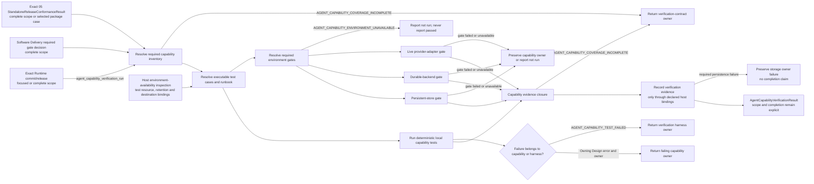
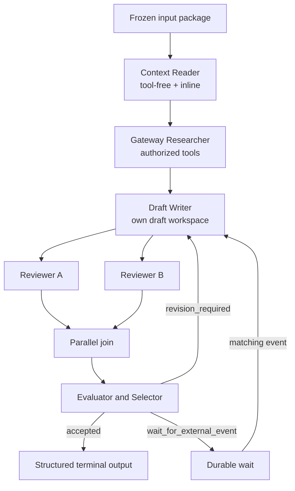

# Agent Capability Verification

## 0. Intent Capsule

```yaml
layer: T2
status: candidate
canonical_owner: designDoc/agent_runtime_11_agent_capability_verification.md
parent: designDoc/agent_runtime_00_execution_charter.md
owned_system_object: Agent Capability Verification Contract
scope:
  - complete Agent-facing capability inventory
  - one canonical Example Workflow covering Module, Workflow, Profile, tools, workspace, retry, parallelism, wait, recovery, Ledger and Inspection
  - deterministic local test set
  - Reviewer default capability, model independence, and registration-to-host execution closure
  - Runtime-hosted self-test independence and explicit temporary-resource lifecycle
  - focused case evidence versus complete Runtime verification
  - explicit persistent-store, durable-backend and live-provider environment-gate classes
  - exact separation between stable verification intent and mutable code truth
non_goals:
  - define new Runtime execution behavior
  - own Module, Workflow, Registry, Invocation, Durability, Ledger or Inspection production semantics
  - select a provider, model, database, durable backend or host product
  - treat skipped integration tests as passed
  - coordinate one execution across several Runtime instances
inputs:
  - exact Runtime source or immutable release candidate
  - exact registered Module, Workflow, Policy and Execution Profile releases required by the selected cases
  - admitted verification-suite ref and hash
  - requested verification scope and selected case identities
  - Software Delivery required-environment-gate decision ref and hash for complete verification
  - host environment-availability inspection ref and hash
  - exact 05 StandaloneReleaseConformanceResult ref and hash when complete verification or a selected package case requires it
  - explicit test-host resource, cleanup and evidence-retention bindings
  - optional explicit external evidence-destination binding; credentials remain host-owned
outputs:
  - AgentCapabilityVerificationResult
  - capability-by-capability evidence map
  - local and environment-gated failure report
truth_surfaces:
  - designDoc/agent_runtime_11_agent_capability_verification.md
  - code-owned test inventory and test runner
  - immutable Runtime release refs and hashes under test
  - generated verification result for one exact commit or release
runtime_triggers:
  - Runtime capability change
  - Module or Workflow authoring API change
  - Execution Profile or Adapter admission change
  - Runtime release candidate verification
downstream_consumers:
  - Software Delivery
  - Runtime package release verification
  - Host integration and Example users
open_decisions: []
review_gate: independent design_contract_reviewer review before implementation; engineering_change_reviewer review for the executable test set
runtime_surface_ledger: generated AgentCapabilityVerificationResult; this Design Doc never stores current pass/fail authority
verification_hooks:
  - deterministic local Runtime and Workflow suite
  - persistent Registry and Ledger gate
  - durable-backend integration gate
  - live provider-adapter gate
  - exact 05 StandaloneReleaseConformanceResult
  - no production authorization prerequisite for ordinary self-tests
  - no external evidence write without an explicit destination binding
```

## 1. Primary System Flow



本 Flow 只拥有 verification。Module、Workflow、Profile、tool、workspace、authorization、Durability、
Ledger 与 Inspection 的产品语义继续由各自 Design owner 定义，Execution 按父级约定由 Runtime T1
直接承接，其余能力遵守对应 T2。本 T2 只要求这些能力有完整、可重复、
不会产生 false green 的证明。

## 2. User Intent

Runtime Maintainer 需要用一套固定测试判断“这个 Runtime 里的 Agent 到底会什么”，而不是从数百个测试
文件、README、当前工作树或一次演示中推断能力。Module Author 与 Workflow Author 还需要一个完整 Example，
直接看到 Agent 如何接收 Context、使用工具、写自己的草稿、产生 structured output、重试、并行协作、等待
外部事件、恢复执行，并把完整事实写入 Ledger 与 Inspection。

这套验证必须区分本地确定性能力和依赖真实 environment binding 的能力。selected persistent store、durable
backend 或 live provider adapter 不可用时，
对应 gate 的结果是 `not_run`，不是 `passed`。

普通自测使用 Runtime 测试宿主提供的资源与已验证的 execution boundary，无需生产授权服务、
Product Authorization client、Entitlement 或伪造的 allow-all 决定。测试仍保留 exact release/input、
Profile/Adapter compatibility、declared operation、资源隔离与 canonical output validation。
一个 focused case 的结果只证明该 case；完整 Runtime 验证还必须满足完整 inventory 和所需环境门。

## 3. Reader Gain

- Runtime Maintainer 能看到完整 Agent capability inventory，以及每项能力由哪个测试证明。
- Module Author 能从一个 Example 判断 Module registration、Prompt、Schema、Policy 与 Profile 如何形成可执行闭包。
- Workflow Author 能看到一个 graph 如何表达顺序、并行、join、revision loop、wait 与 terminal outcome。
- Host Integrator 能判断同一个 immutable Workflow origin bundle 如何注册到一个或多个 Runtime，以及哪些
  evidence 证明各 Runtime 的 Execution Profile 与 Variant Policy 保持独立。
- Engineering Reviewer 能区分产品能力缺失、测试覆盖缺失、环境不可用和真实测试失败。
- Runtime Maintainer 能区分 focused evidence 与完整完成状态，以及真实 Reviewer 输出与仅有进程退出。
- Example 使用者可以从同一份 graph、fixtures 和命令复现实验，而不需要读取 Runtime private code。
- Operator 可以把同一组 executable test cases 当作 runbook，逐项看到 prerequisites、command、expected result、
  evidence、cleanup、failure routing 与 rerun boundary。

## 4. Capability and Operation

### 4.1 Module and release authoring

| capability | Required result | Owning Design | Verification evidence |
| --- | --- | --- | --- |
| Explicit Module loading | caller 提供 exact project root、Skill ID 与 Module ID；无 ambient 或 sibling discovery | 01 Registry | subject-bound executable case |
| Path-free release identity | repository path 不进入 Module candidate、release ref 或 release hash | 01 Registry | subject-bound executable case |
| Schema closure | input/output Schema ref 与 canonical content hash 闭合；invalid Schema fail closed | 01 Registry | subject-bound executable case |
| Prompt closure | Prompt Component source members、Schema members 与 Prompt Bundle ref/hash 完整闭合 | 01 Registry | subject-bound executable case |
| Policy closure | Behavior、Evaluation、Retry 与 Execution Variant Policy 使用 exact registered ref/hash | 01 Registry | subject-bound executable case |
| Profile independence | Module/Workflow release identity 不因 provider、model 或 Profile 改变 | 01 Registry | subject-bound executable case |
| Generic Profile compatibility | 生效 Profile 的工具可追溯到 Module 固定能力及默认规则；模型选择不改变权限；显式操作边界不被原生工具绕过 | 01 Registry，08 Invocation owns Adapter admission | subject-bound executable case |

### 4.2 Agent invocation capabilities

| capability | Required result | Owning Design | Verification evidence |
| --- | --- | --- | --- |
| Inline semantic input | frozen input closure 以 exact bytes 进入 Context | 08 Invocation | subject-bound executable case |
| Structured output | provider-native projection 后仍通过 canonical full Schema validation | 08 Invocation | subject-bound executable case |
| Tool-free execution | tools empty、workspace none、network denied | 08 Invocation | subject-bound executable case |
| Runtime-hosted self-test | 真实 model call 使用可信测试资源 boundary，不构造生产 context、decision 或 grant；伪造 purpose 和资源越界仍拒绝 | 08 Invocation；09 owns boundary validation | subject-bound executable case |
| Authorized Gateway read | 只有 Module 声明且 Profile 允许的 Gateway tools 可进入 callable | 08 Invocation；09 owns external authorization handoff | subject-bound executable case |
| Attempt workspace | 私有草稿与显式项目工作区按所选 Profile 限制读写；其他 Attempt、秘密与未授权材料不可见 | 08 Invocation | subject-bound executable case |
| Context isolation | sibling Variant、Attempt 与 Module Run 不共享 provider context 或 workspace | 08 Invocation | subject-bound executable case |
| Network enforcement | `denied` 与 `gateway_only` 由 Adapter 能力机械执行 | 08 Invocation | subject-bound executable case |
| Provider failure normalization | auth、quota、timeout、tool、policy 与 output failure 进入 bounded Runtime failure taxonomy | 08 Invocation | subject-bound executable case |

### 4.3 Execution and decision capabilities

| capability | Required result | Owning Design | Verification evidence |
| --- | --- | --- | --- |
| Module Run | exact Module、input closure、Profile 与适用的 execution boundary 形成一个 Module Run | Execution；Runtime T1 | subject-bound executable case |
| Multiple Variants | 同一个 Module release 可用不同 Profile 独立执行 | Execution；Runtime T1 | subject-bound executable case |
| Evaluation and selection | evaluated candidate set 完整后才能形成 Selection 与 output resolution | Execution；Runtime T1 | subject-bound executable case |
| Retry budget | Retry Policy 是 `max_attempts` 唯一 authority；每个 Attempt 具有 parent lineage | Execution；Runtime T1，07 owns durable retry coordination | subject-bound executable case |
| Idempotent replay | exact request 重放返回同一 committed result；宿主首次保存并在重发时继续传递同一身份，不重复产生 side effect | Execution；Runtime T1，07 owns durable replay | subject-bound executable case |
| Operation boundary enforcement | 自测操作在进入 callable 前满足测试资源约束；外部受保护操作满足所属 owner 的真实前置决定；效果后观察不能成为同次调用的前置 | 09 External Authority Integration；08 owns callback/result delivery | subject-bound executable case |
| Cancellation | cancellation request 只改变指定 execution，并产生可检查 terminal fact | 07 Durability，10 owns terminal execution result | subject-bound executable case |

### 4.4 Workflow graph capabilities

| capability | Required result | Owning Design | Verification evidence |
| --- | --- | --- | --- |
| Graph authoring | `Workflow` 由 exact Module release nodes、edges、mappings 与 terminal edges 构成 | 01 Registry | subject-bound executable case |
| Sequential and branch routing | node outcome 只能进入 graph 声明的 target 或 terminal | Execution；Runtime T1 | subject-bound executable case |
| Parallel fan-out and join | branch Attempt 相互隔离；join 只消费完整 required branch set | Execution；Runtime T1，07 owns durable coordination | subject-bound executable case |
| Revision loop | revision outcome 返回已声明 predecessor node，并保留新的 Attempt lineage | Execution；Runtime T1，07 owns durable loop | subject-bound executable case |
| Wait and external event | acknowledged wait 只由 matching external event 恢复 | 07 Durability；03 owns event ingress | subject-bound executable case |
| Crash recovery | recovery 从 committed Runtime facts 继续，不重跑已成功 sibling | 07 Durability | subject-bound executable case |
| Portable Workflow registration | 同一 target-independent origin bundle 可注册进多个独立 Registry | 01 Registry | subject-bound executable case |
| Per-Registry execution binding | 各 Registry 的 Profile、Variant Policy 与 active pointer 相互独立 | 01 Registry；10 consumes selected binding | subject-bound executable case |

### 4.5 Evidence and inspection capabilities

| capability | Required result | Owning Design | Verification evidence |
| --- | --- | --- | --- |
| Attempt and Workflow Ledger | input、Profile、Context、output、failure、usage、tool calls、retry 与 Workflow lineage 可还原 | 04 Ledger | subject-bound executable case |
| Usage truth | token、cost 与 provider usage 的缺失值保持 null，不伪造 | 04 Ledger | subject-bound executable case |
| Release Inspection | registered release families 与 active pointer 只读投影，不修改 Registry | 06 Inspection，01 owns source facts | subject-bound executable case comparing the snapshot with exact Registry source facts |
| Execution Inspection | authorized query 返回 exact execution facts；host denial 保留 host owner | 06 Inspection，04 owns source facts | subject-bound executable case comparing the snapshot with exact Ledger source facts |

### 4.6 Persistence, durability, and package capabilities

| capability | Required result | Owning Design | Environment gate or referenced result |
| --- | --- | --- | --- |
| Persistent Registry | selected persistent-store binding 证明 atomic registration、reload、conflict、replay、active pointer 与 migration fence | 01 Registry | `environment_gate` selected by Software Delivery |
| Persistent Ledger | selected persistent-store binding 证明 transaction、Attempt、content visibility、usage 与 Inspector query 持久化 | 04 Ledger | `environment_gate` selected by Software Delivery |
| Persistent Inspection | 同一次测试写入的 selected persistent Registry/Ledger facts 能被 06 Inspection 准确投影 | 06 Inspection；01 与 04 own source facts | `environment_gate` selected by Software Delivery |
| Durable backend | selected durable-backend binding 证明 wait、timer、retry、fan-out、recovery 与 cancellation | 07 Durability | `environment_gate` selected by Software Delivery |
| Live provider adapter | selected provider Adapter 证明真实调用、structured output、usage 与 failure normalization | 08 Invocation | `environment_gate` selected by Software Delivery |
| Registered Module transport | 同一 exact Module、frozen input 和 canonical output schema 在每个 declared transport 上产生有边界的 capability evidence；真实输入交付、Runtime output 与 owner-required validation 满足时才为 supported | 08 Invocation owns Adapter support；01 owns exact Module/Profile/Variant registration；subject authority owns result meaning | subject-bound executable case for static closure plus one environment gate per declared transport |
| Public package | clean wheel、public exports 与 Design bundle parity | 05 Standalone Release | consume exact `StandaloneReleaseConformanceResult`; failure retains 05 owner |

本 T2 不要求 peer Design 额外生产本文发明的 conformance result。§4.1 至 §4.5 的 Owning Design 只提供 case
必须满足的语义与 error ownership；code-owned inventory 为每个 capability 解析一个
`AgentCapabilityTestCase`，其执行结果就是本 T2 的 verification evidence。Case result 必须绑定本次 exact
Runtime subject ref/hash、case 所用的 dependency/configuration closure，以及 Owning Design 的 exact document
ref/hash。Case 失败时，产品 failure 继续保留 Owning Design 的 error/owner；只有 harness 自己失败时才使用
`AGENT_CAPABILITY_TEST_FAILED`。

Execution 的案例依据必须绑定当前 `designDoc/agent_runtime_00_execution_charter.md` 的准确 ref/hash，
不能继续解析归档 Execution T2。Owning Design 和失败 owner 的校验接受这项 T1 承接，不将所有
capability 的设计依据强制限定为 T2；这不改变 Execution 的逻辑职责或减少验证要求。

§4.6 的 integration 行由 code-owned integration runner 使用 `environment_gate` case；环境不可用时为
`not_run`，只有 Software Delivery required set 中的 gate 为 `passed` 才能完成 aggregate verification。
Registered Module transport 行同时需要一项不调用 provider 的 executable owner case，证明 exact
Module、Profile、Variant、Adapter revision、operation binding、input/output schema 和 canonical projection
closure；随后每个 declared transport 使用独立 environment gate。Transport gate 的 `supported` 表示 exact
Profile 已通过 preflight、provider invocation、canonical post-validation、Ledger 和 Inspection closure；
`unsupported` 表示该 exact Adapter revision 无法表达或强制执行 registered schema、operation、workspace、
network 或 authorization boundary，并且 provider invocation 必须保持零次。`unsupported` 是 capability
evidence，不等于 `passed`：当 Software Delivery 把该 transport 放入 required set 时，aggregate verification
保持未完成。正向 transport gate 在 Provider 进入后的非预期执行或输出失败记录为 `failed`，
故障处理 negative case 依 §7.1 判定，不产生 supported evidence；环境或 credential 缺失记录为 `not_run`，
两者都不能改写成 `unsupported`。

Public package 行是唯一固定消费既有 peer result 的行，
只接受 05 owner 的 exact `StandaloneReleaseConformanceResult`。Referenced peer/environment result 只有在它明确
绑定本次 Runtime subject ref/hash 与所需 dependency/configuration closure 时才能计入本次 verification；否则必须
重新取得，不得由 `rerun_boundary` 自行放宽。

### 4.7 Test-host resources and evidence retention

每次 verification 固定可信测试宿主提供的资源 binding，包含测试资源身份、owner、允许使用的范围、
保留与清理策略，以及证据目的地。Binding 必须满足所属 capability 的约束，模型或 caller 只声明
test purpose 不能把生产资源变成测试资源。公共 Suite、Case 和 runbook 不携带 credential、DSN secret
或 provider token；宿主把所需 opaque binding 交给对应 adapter，Runtime core 不解析或保管凭据。

默认使用 Runtime 测试宿主创建的临时 Registry、Ledger、artifact store、workspace 或 namespace。
Persistent-store gate 可以使用带 test identity 的临时数据库 namespace，在其存续期内验证 transaction、
reload 与跨进程持久化；这不要求写生产 store，也不把临时结果表述为长期生产 Ledger。
测试使用已有 immutable release 时保留 exact ref/hash，不能把原 persistent Registry record 纳入清理。

只有显式提供外部 evidence destination binding 和必要访问凭据时，才允许向该目的地保存结果。
没有该 binding 时只写测试宿主的资源；不得自动读取业务环境配置来寻找外部 sink。外部保存仅改变
证据目的地，不扩大模型或测试代码的操作权限。用户明确要求的保存失败由 storage/Ledger owner
返回失败，保留原 case 事实，但不得把本地结果当作已成功外存，也不得声明本次 verification 完成。
外部目的地限于明确允许的 verification evidence 范围；其 credential 不能被用于修改生产 Runtime
records、active pointer 或业务数据。物理数据库共享不改变这种逻辑隔离。

清理前保存 case 要求的结果与有界诊断。只清理本次测试创建且拥有的资源；清理失败照实报告并阻止
要求该清理成功的 run 完成，不扩大删除范围。临时资源销毁后不能声称还能恢复其中未导出的事实。
创建、保留、清理和证据交付状态均进入 generated result，而不是手写成当前 Design truth。

### 4.8 Registered Module result boundary

Registered Module transport 验证消费同一 exact Module、Prompt/Schema、frozen input、Profile、Variant 和
Adapter revision。需要额外 tools、repository command 或数据库检查时，只验证该 Module/Profile
实际声明且 Adapter 能执行的 capability；不因为角色叫 Reviewer 就额外授予代码或 SQL 权限。

正向 transport case 必须证明输入按 Module completeness rule 完整交付、真实调用已执行、Runtime
输出通过 canonical schema 和该 subject authority 声明的必需 validation，并保留 Attempt、usage、
失败、Ledger 与 Inspection evidence。Subject-specific validator 由其真实 owner 提供，Runtime
verification 不重写 Reviewer meaning 或自行生成审核 verdict。

Reviewer 对被审对象返回合法的 non_pass 或 blocked，可以是一次成功的 transport 验证；该结论不
批准被审对象。相反，CLI exit 0、登录成功、普通模型 smoke 或只有自然语言输出都不能证明完整
Reviewer path 成功。输出不是所需 schema、required semantic validation 失败或调用后输出不可用时，
正向 case 为 failed，不能称为 unsupported。压缩、截断和 context recovery 的观察保留给 Invocation
owner；未满足 Module 完整性交付要求的输入不能算通过。

前置 invalid release、input、schema 或必需 validator binding 缺失属于 input/closure 问题，不冒充
Adapter 不支持。只有 exact、合法的前置闭包已成立，且 Adapter 在 provider 进入前明确拒绝一项
不能表达或强制执行的 capability，才形成 unsupported evidence。环境或 credential 前置缺失为
not_run；它与代码已声明但无法执行的 capability 不同。

### 4.9 已解析能力的原生工具验证

本节细化 §4.1 至 §4.6 的已有 capability，以及 §7 的测试/runbook 同源要求；不新建 capability ID、
case 类型或证据对象。Code-owned inventory 把要求并入对应 case；归属见下表。

| 已有 capability 与位置 | 证据来源及归属 | 本项必须证明的结果 |
| --- | --- | --- |
| Generic Profile compatibility、Tool-free execution（§4.1、§4.2） | executable_owner_case；01 Registry、08 Invocation | Module 能力、默认来源、生效工具与参数映射一致；空清单不暴露工具，未知选择在 Provider 前拒绝；旧配置不能隐式获得新默认权限 |
| Attempt workspace、Context isolation、Network enforcement（§4.2） | executable_owner_case；08 Invocation | 项目入口、Skill 发现和读写范围分别生效；安装依赖不扩大模型权限 |
| Registered Module transport（§4.6） | 静态 closure 使用 executable_owner_case；真实调用使用对应 transport 的 environment_gate；08 Invocation，01 保留注册职责 | 通过 Runtime 启动真实 Provider，验证原生工具可读输入、运行 Python、写指定目标，越界读和源码写被拒绝；不能只以参数探针证明支持 |
| Persistent Registry、Persistent Ledger、Persistent Inspection（§4.6） | 对应 persistent-store environment_gate；01、04、06 各保留原行职责 | 使用新连接回读本次 Profile、输入、Attempt、输出或失败和公开事件；工具网络关闭不妨碍可信 Runtime 按安装绑定记账 |
| Sequential and branch routing、Cancellation、Attempt and Workflow Ledger（§4.3 至 §4.5） | executable_owner_case；Execution；Runtime T1、07 Durability、04 Ledger | 验证 §7.2 的成功、失败、取消和证据接续；实际模型节点的执行另由 Registered Module transport environment_gate 证明 |
| 测试/runbook 同源要求（§7）与 code-owned Example package（§10） | executable_owner_case；本 T2 的 case inventory 绑定该生成与调用一致性检查 | 验证 sample、runbook 与包内公共 API 使用同一配置转换，安装后不需要另写启动或日志脚本；05 的 package result 只证明其既有 wheel/exports/bundle 范围，不替代本项 |

本地 case 可使用替身验证参数、边界与接续；这不替代所列真实 Provider 或持久 store 的
environment_gate。§7.2 的两个 Agent 接续是已有顺序/分支 case 的有界 fixture；声明该样例已能
真实运行时，transport gate 必须证明两个模型节点都经过 Runtime。证据分类与完成判定使用 §7.1
和 §9.3，不在本节另设 passed 或 not_run 规则。

本地参数探针、直接 CLI smoke、Runtime 实际调用及完整实验 Workflow 分别记录。
证明只读文件权限的用例不证明 exact command 白名单；证明 Reviewer transport 的用例也不直接证明
被测 Agent 完成任务。不可取得的轨迹或结果标明缺失，不能由 Agent 的自述补成事实。

### 4.10 Reviewer 默认与宿主完整路径

默认能力的确定性验证至少覆盖：只有模型操作声明的 Reviewer，以及另有明确 repository read、
search、sandbox command 等非模型操作声明的 Reviewer。两类都要有默认解析和兼容正例，并对
未知操作、缺少授权、材料越界和命令约束旁路做拒绝验证。不能使用两个只有 prompt 不同的
model-only Module 代替，也不能删除非模型声明或只证明后一类被拒绝后声称兼容。

模型选择独立性须比较固定能力、材料读写、工具网络和默认版本。真实 provider 支持状态分别报告，
未被接纳的执行器即使通过拒绝负例也不产生 supported evidence。默认预设更新不能改变已有 Module、
已发出请求或正在执行的 Attempt；显式旧策略继续按原版本解释。

注册到宿主调用的正向验证使用一个没有作者聊天背景的 Agent。它通过已交付 Skill 找到入口，消费
准确已审 source，自行调用公共注册接口并新连接回读，再把原注册结果直接交给宿主入口完成真实
审核。使用 Workflow 路径时同时回读准确 Module、Workflow、节点 Variant 和依赖。完整 schema、
subject validator、实际工具证据及 Ledger 回读必须来自这一条链，不拼接独立注册和 Adapter 样例。

新增 transport 的 source 修订在该测试之前完成审核并冻结新 Module。执行 Agent 不临时修改声明、
prompt 或 schema。使用哪些 source、transport、宿主和正常配置保护范围由所选 case 声明；更广的
Reviewer 迁移或其他 provider 支持不由本例传播通过。

宿主幂等验证通过真实交付入口进行：在首次发送前取得可恢复 key，模拟 Runtime 提交成功但宿主
响应丢失，重启调用者后从原回执重发，核对相同 execution、定义和输出，并证明 Provider 调用次数
没有增加。同 key 改输入或绑定必须冲突；新材料或明确新逻辑请求使用新身份。运行中重发先查询或
恢复，不触发并行重复调用。只有直接调用 Runtime 的相同 key 测试不足以覆盖该要求。

故障恢复可用受控注入获得可重复证据，真实正向路径仍须有对应 provider/store gate。输出 non_pass
不导致改测试输入或重跑直到 passed；业务结论与执行成功继续按 §4.8 分开。

Execution Profile 注册/准备入口另须验证：只提供合法环境 root 时按公开默认规则定位本地配置及
运行目录；显式凭据位置可被可信 adapter 消费且模型不可读取；已有配置冲突被明确处理；不因
初始化本地目录自动创建数据库。CLI 帮助、docstring、运行副作用和实际错误一致，不能仅在 Skill
中描述默认路径而没有对应入口行为。

## 5. Canonical Example Workflow

完整 Example 使用一个 `agent_capability_example` Workflow。它不是业务 Workflow，也不拥有任何业务数据。



Example 必须使用以下相同 origin closure：

- fixed Module releases；
- fixed Workflow graph；
- fixed Prompt、Schema、Behavior、Evaluation 与 Retry Policies；
- no target Runtime identity；
- no Execution Profile 或 exact Variant Policy identity。

Runtime A 与 Runtime B 注册同一个 origin bundle。两个 Runtime 可以使用不同的已准入 provider/tool Profiles。
两个 Registry 的 active pointer、Profile、Variant Policy、
execution、workspace、Ledger 与 failure 相互独立。一次 execution 只由一个目标 Runtime 承担。

Example 的 tool call 只能读取 test fixture 或 authorized Gateway response；不得读取 ambient repository、用户目录、
credential 或未声明 network。数据库 credential 只由宿主 Adapter 解析，Runtime 与 Module 只携带 opaque binding。

## 6. Code Truth

### 6.1 Stable Code Projection

本 capability 需要一个 immutable Code Projection，把以下 logical identities 绑定到 exact implementation
release ref/hash：

- code-owned capability inventory；
- `AgentCapabilityTestCase` registry；
- verification runner；
- runbook projection；
- generated verification inspection；
- peer result adapter set；
- admitted verification-suite release identity。

Capability-to-test、command、current path、test count 与 environment binding rows 全部由该 Code Projection 与
generated inspection 提供。Design candidate 不保存这些 mutable rows。文件拆分、class 重命名或 test 重组只要
保持 logical identities 与 evidence closure，不改变本 T2。

### 6.2 Current Inspection

当前 commit、test path、case inventory、pass/fail/skip count、environment availability 与 observation timestamp
只存在于 generated verification inspection。本文档只引用其类型，不复制当前 rows。任何 UI、README、runbook
或 release note 显示的当前状态必须来自同一 inspection ref/hash。

## 7. Test Case and Runbook Contract

每个 capability test case 同时是 executable verification input 和 operator runbook。测试与 runbook 共享唯一
code-owned case definition；README、网页或命令示例只投影它，不能手抄第二套流程。

每个 `AgentCapabilityTestCase` 至少包含：

| Field | Meaning |
| --- | --- |
| `case_id` | stable test/runbook identity |
| `capability_ids` | 本 case 证明的第 4 节 capability 集合 |
| `owning_design_refs` | capability failure 保留的 owner-qualified Design refs；Execution 绑定 Runtime T1，其余按对应 T2 |
| `evidence_contract_refs` | case 所验证的 exact Owning Design/interface refs；仅既有 peer result 可作为 result ref |
| `evidence_source_kind` | `executable_owner_case`、`environment_gate` 或 `referenced_peer_result`；由 capability inventory 固定，§4.1 至 §4.5 使用 `executable_owner_case` |
| `subject_requirements` | exact commit/release、Module、Workflow、Profile、Policy 与 fixture requirements |
| `environment_prerequisites` | local、persistent store、durable backend、provider adapter 等 required environment classes；Gateway 不是独立 environment gate |
| `command` | runner 实际执行的唯一 command definition |
| `expected_result` | exit、typed output、state、effect 与 stable error expectation |
| `evidence_outputs` | verification result、Ledger/Inspection refs、bounded logs 与 test artifacts |
| `cleanup` | disposable workspace、schema、namespace、process 与 lease cleanup |
| `failure_routing` | test failure、environment unavailable、coverage incomplete 的真实 owner |
| `rerun_boundary` | 哪些 subject/config 改变要求重跑本 case；不得允许 evidence 跨 subject hash 继承 pass |

### 7.1 Focused and complete verification

Runbook 使用者可以运行一个 case、一组 capability cases 或完整 suite。请求固定 verification_scope，
取值为 focused 或 complete，并绑定 exact suite 与 selected case IDs。Focused 只验证选定 case 的
前置条件与结果，不以未选择的 Example、生产授权服务或 package result 阻止普通自测；如果选定的
case 自身要求 05 package evidence 或某个环境 binding，仍必须满足它。

Complete scope 必须解析完整 required inventory、Example 路径、Software Delivery 的 required
environment-gate decision 和 exact 05 conformance result。调用者不能通过缩小 selected cases 把
focused pass 变成 complete pass。Software Delivery 的 gate decision 是验证与交付要求，不是
Product Authorization 或生产执行许可。

Runner 先验证当前 scope 所需 prerequisites，再执行 case，并把结果写成 passed、failed 或 not_run。
环境缺失时，runbook 展示配置与重跑入口，不执行绕过或降级路径。Case 的 passed 表示观察满足该 case
的预先声明 expected_result；独立的 negative case 可以通过正确拒绝或失败归一化得到 passed，但不能
因此代替证明真实调用成功的正向 transport case。

Registered Module transport gate 在上述三态 case result 之外携带
`transport_capability: supported | unsupported`。正向 case 只有满足 §4.8 的完整实际执行与结果验证时，
才是 passed 且 capability 为 supported。Unsupported negative case 必须预先声明 capability rejection
是 expected_result，并证明 provider invocation 为零；该 case 可以 passed 且 capability 为 unsupported，
但 required-set completion 仍把该 transport 视为未满足。正向 case 若只得到 rejection，则 failed，
不能通过执行后改写 expected_result 变成 passed。Provider-entry 后的非预期失败使用 failed，环境前置
缺失使用 not_run，这两种结果不携带 supported/unsupported verdict。

Case definition 不保存 credential、DSN secret、provider token 或 host private path。它只声明需要的 environment
binding identity；credential resolution 由宿主 Adapter 完成。

### 7.2 配置样例与测试评价接续

随包样例列明审核 source、Runtime 默认能力、独立模型选择、本机资源和每次请求的区别。接口说明
从真实 docstring 导出默认值及来源、返回、错误与副作用；Skill 提供发现和操作入口，不补写底座配置。
实际工具、CLI 参数和验证命令来自相同代码定义；runbook 不手抄第二套实现。注册结果的消费、首次
请求 key 的保存以及响应丢失后的重发必须可由使用者按入口说明完成。

测试与评价的样例 Workflow 使用 Runtime 分别启动被测 Agent 和独立评价 Agent，中间以固定代码
整理本次证据。被测 Agent 的正常完成或失败均可进入评价；用户取消整个 Workflow 则保存记录并停止。
评价 Agent 消费预先声明的标准和本次真实证据，不继承被测 Agent 会话。任务内 Reviewer 必须由
被测 Agent 按任务方法自行调用，外层代码不代做。具体图执行由 Execution 与 Durability 负责，
本 T2 只验证接续和证据是否符合样例；实验任务与评分规则仍由实验 owner 提供。

该样例按 §4.9 映射回已有顺序/分支、取消、Ledger 和 transport 用例。替身接续通过只说明代码
路径成立；真实两个 Agent 都运行并有对应证据，才能报告真实样例完成。

## 8. Public Interface and Effects

| interface_id | Owner | Input | Output | Effects | Errors |
| --- | --- | --- | --- | --- | --- |
| `agent_capability_verification_run` | Agent Capability Verification | exact Runtime commit/release、admitted suite、verification_scope、selected case IDs 与当前 scope 所需 capability/input closure；owner-qualified host environment-availability inspection ref/hash；test-host resource/cleanup/retention binding refs/hashes；complete scope 的 Software Delivery required-gate decision；complete 或 selected package case 所需的 05 conformance result；可选外部 evidence destination | one subject-bound `AgentCapabilityVerificationResult`，包含 scope、选定及执行的 case、三态结果、所用 environment-availability inspection ref/hash 与 environment/peer evidence、资源清理和证据交付状态，以及与 scope 区分的 full Runtime completion | 只创建声明的测试资源和 verification evidence；仅按显式 destination 保存；不修改 production Runtime state 或 active pointer | `AGENT_CAPABILITY_TEST_FAILED`, `AGENT_CAPABILITY_ENVIRONMENT_UNAVAILABLE`, `AGENT_CAPABILITY_COVERAGE_INCOMPLETE`；peer capability/storage failure 保留原 owner |

`AgentCapabilityVerificationResult` 至少包含：subject ref/hash、capability ID、test/gate identity、result、exact evidence、
scope、适用的 required-gate decision ref/hash、host environment-availability inspection ref/hash、
environment availability、resource/retention/destination binding、
cleanup/delivery result、failure owner 和 observation timestamp。它是 code-owned generated result，不由 Design Doc
手写当前 rows。

## 9. Completion, Failure, and Recovery

### 9.1 Error contract

| error_code | Owner | Condition | Meaning | Caller action |
| --- | --- | --- | --- | --- |
| `AGENT_CAPABILITY_TEST_FAILED` | Agent Capability Verification | Example/test harness 自己拥有的 case execution、编排或 required cleanup 失败；peer capability/storage 失败继续保留 peer error/owner | 对应 case 或 run 义务未完成；不重写已取得的 case 事实或 peer failure | 返回 harness/case owner；peer failure 返回实际 owner；清理只重试原测试拥有的范围，禁止发布 false pass |
| `AGENT_CAPABILITY_ENVIRONMENT_UNAVAILABLE` | Agent Capability Verification | 所选 case 所需的 persistent-store、durable-backend 或 provider-adapter binding 在 host availability inspection 中不可用；complete scope 包括 Software Delivery required set | 对应 case 是 not_run，所需正向证据未完成 | 配置 selected binding 后重跑；不改写为 passed；与当前 scope 无关的 gate 不扩大必需输入 |
| `AGENT_CAPABILITY_COVERAGE_INCOMPLETE` | Agent Capability Verification | §8 当前 scope 的 required input ref/hash 无法解析、hash 不匹配、suite 未准入、case selection 与 scope 不符，或 required capability 没有唯一 test/gate evidence | verification input 或 evidence closure 未闭合；不开始或不完成 verification | 提供 exact admitted input closure、补齐 mapping 后重跑，或返回本 T2 owner；不得映射成 environment unavailable 或 unsupported |

Test framework exception、provider message 和 subprocess exit detail 可以作为 diagnostic，但不能替代 stable error code。

### 9.2 State, effects, and recovery

Verification 只有 `candidate`、`running`、`completed` 三种 invocation state。每个 capability result 只有
`passed`、`failed` 或 `not_run`。不存在“因为其他 capability passed，所以推断本项 passed”的传播规则。
completed 仅表示 runner 已结束，不表示所有 case 或完整产品验证通过；full Runtime completion 另按 §9.3 判定。

本 T2 的 test harness 只能创建临时测试资源与 verification evidence：

- disposable Registry、workspace、persistent-store namespace 与 durable-backend namespace 必须带 test identity；
- 按 §4.7 的策略保留或导出证据，再清理测试拥有的临时资源；失败时保留 bounded diagnostic；
- 重新运行相同 subject 与配置不得修改 production active pointer、业务数据库或宿主 release；
- provider adapter、persistent store 或 durable backend 中断后可以重跑对应 gate；本地 deterministic gate 只有在
  subject ref/hash、case definition、dependency/configuration closure 全部相同时才能复用；
- subject bytes 改变后，旧 verification result 只能作为 prior evidence，不能继承 pass。

### 9.3 Completion conditions

Focused run 的选定 case、所需环境、清理与证据交付均满足时，只完成该范围的验证；full Runtime
completion 必须保持未声明通过。Focused 若选择原生工具真实调用、持久回读或双 Agent 真实样例，
相应 environment gate 的 not_run、failed 或 unsupported 均不能算完成；只选本地 case 时不强加
未选的模型或 PG 门，也不宣称这些真实能力已经验证。

当 complete 的验证目标包含原生工作区或 §7.2 的真实样例时，Software Delivery 的 required set
必须纳入对应 Registered Module transport gate；该目标要求持久回读时，还须纳入对应 store gate。
缺少这些要求或证据时，coverage 未闭合；不能跳过后宣称该范围完整通过。其他未选环境仍按
下列条件 5 处理。一个 exact Runtime candidate 只有满足以下全部
条件，才完成本 T2 的完整 verification：

1. 第 4 节每项 required capability 都解析到固定 evidence source：§4.1 至 §4.5 具有 subject-bound exact case result；§4.6 具有该行声明的 environment result，Public package 具有 exact 05 peer result；对应 case/gate 必须覆盖 §4.9 的细化要求及 §7.2 的样例要求；
2. canonical Example graph 的 Module、Workflow、Profile、tool、workspace、parallel、loop、wait、terminal 与
   multi-Runtime registration 路径均有 positive 和必要 negative test；
3. 所有 local deterministic tests 是 `passed`；
4. 输入携带的 Software Delivery `required_environment_gate_ids` decision 已验证，并且其中每个 gate 是 `passed`；
5. 不在 Software Delivery required set 的 environment gate 可以保持 `not_run`；若被单独或随完整 suite 执行，
   其真实 `passed` 或 `failed` 结果照实记录，但不参与本次 aggregate completion 判定；
6. test harness 没有写 production Registry、Ledger、domain database 或 active pointer；
7. exact 05 Standalone Release conformance result 是 `passed`；该结果继续由 05 owner 产生；
8. verification result 绑定 exact commit/release ref 和 hash；
9. 每个被计入的 case、environment 与 referenced peer result 都绑定同一 Runtime subject ref/hash 和所需
   dependency/configuration closure；不能证明该绑定的 evidence 必须重新取得或保持 `not_run`；
10. 每个 required registered Module transport 都具有 `supported` evidence，并绑定同一 exact Module、
    frozen review input、canonical output schema 和 transport-specific Profile、Variant、Adapter revision；
    `unsupported`、`failed` 或 `not_run` 都不能满足 required transport completion；
11. 测试资源策略要求的 cleanup 与 evidence delivery 成功；没有外部 destination 时不写外部 sink，
    明确要求的外部保存失败不能被本地 case pass 掩盖。

## 10. Dependencies and Verification

本 capability 消费 Runtime T1 的自测边界、08 Invocation 与 09 External Authority Integration 的
执行/资源合同、05 Standalone Release 的 exact peer result，以及其他 capability owner 的有界验证要求。
测试资源与 credential 由可信宿主提供，storage failure 保留 storage/Ledger owner，Software Delivery
拥有完整验证的环境要求与后续交付决定。本 T2 只实现验证和 evidence aggregation。

下一步实现使用本 T2 作为 canonical Example 与 test-set authority：

- code-owned Example package 保存 graph、Module registrations、Schemas、fixtures 和运行说明；exact path 由 Code Projection 拥有；
- code-owned capability inventory 生成 required case/evidence set；每个 `AgentCapabilityTestCase` 同时驱动 test runner 与 runbook projection；
- code-owned local runner 执行 deterministic gates；
- code-owned integration runner adapters 执行 selected persistent-store、durable-backend 与 live-provider gates；
- generated result 汇总三态 evidence，不手写 pass；
- runner 明确绑定 focused/complete scope、测试资源与可选外部目的地，按 §4.7 保留、导出与清理；
- Registered Module 的正向/负向用例验证真实 Runtime 输入输出；Reviewer 只是其中一个 owner-supplied case，不能让 CLI exit、无效 JSON、缺失 binding 或未验证的日志冒充有效结果；
- Software Delivery 决定哪些 environment gates 是某个 release 的 admission requirement。

Executable verification-suite implementation 在首次准入或自身 bytes 改变时接受独立 Engineering Change Review，
形成 immutable suite release ref/hash。普通 Runtime candidate verification 只消费已准入 suite release，不为每个
candidate 重新审查 test-set implementation。Runtime candidate 的 verification completion 与 suite
implementation admission 是两个独立决定。

Software Delivery 根据 `designDoc/the_software_delivery.md` 拥有 executable suite implementation 的
Engineering Change Review 与 release admission；本 T2 只提供 approved Design handoff，不创建第二条 review path。

实现不得把 Example 变成第二个 Registry、第二个 Workflow record family、host product 或业务数据 owner。

## 11. References

- [Runtime Domain Root](agent_runtime_00_execution_charter.md)
- [Invocation](agent_runtime_08_agent_execution_adapter_contract.md)
- [External Authority Integration](agent_runtime_09_authorization_integration_contract.md)
- [Standalone Release Conformance](agent_runtime_05_delivery_roadmap.md)
- [Agent Runtime](the_agent_runtime.md)
- [Data Governance](the_data_governance.md)
- [Timestamp Semantics](the_timestamp_semantic.md)
- [Software Delivery](the_software_delivery.md)
- [Design Doc Management](the_design_doc_management.md)
