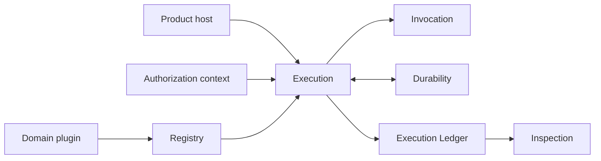
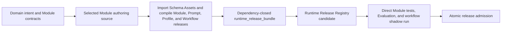
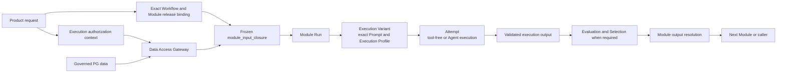
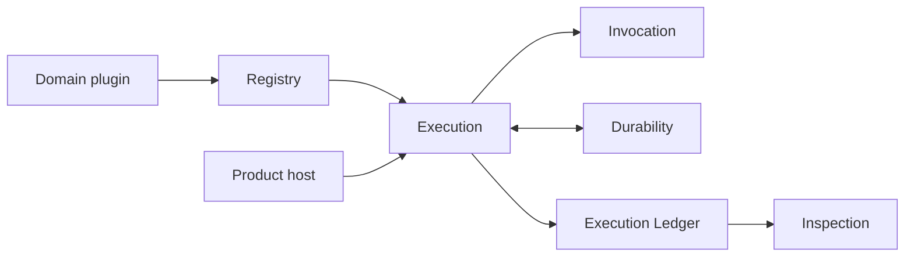
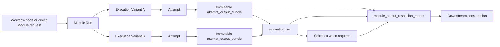
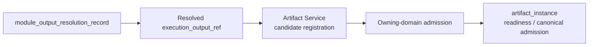

# Agent Runtime Contract

**Purpose**: Define a standalone, business-neutral infrastructure product for
registering independently owned Runtime Modules from fixed authoring sources, assembling Workflow
Graphs from those Modules, and executing, evaluating, observing, recovering,
and evolving each Module independently.

**Required reader gain**: A reader can separate Runtime law from domain
behavior, Skill authoring, product authorization, logical workflow ownership,
data governance, host deployment, and software delivery; identify the portable
plugin and adapter seams; and run one registered Module without relying on a
particular provider, Workflow, or durable backend.

## 0. Contract Capsule

```yaml
layer: T0
t0_layer_id: the_agent_runtime
status: candidate
canonical_owner: designDoc/the_agent_runtime.md
owned_system_object: provider-neutral Agent execution
scope:
  - standalone public Runtime contracts and plugin SDK
  - Runtime admission of independently registered Module candidates
  - dependency-closed Runtime Module and Workflow Release admission
  - Workflow Execution, Module Run, Execution Variant, Attempt, Execution Output, Evaluation, Selection, and Resolution lineage
  - provider-neutral Module invocation
  - provider-specific SDK and CLI invocation governance
  - Temporal Workflow coordination and recovery integration
  - PostgreSQL release, execution, and recorded-content persistence
  - Product Authorization and governed Data Access integration
  - task-scoped portable context
  - authorization-evidence consumption and execution-local fencing
  - data isolation, telemetry, checkpoint, recovery, evaluation, testing, and Module evolution
  - independently distributable Runtime core and extension boundary
non_goals:
  - domain roles, graph meaning, content rubrics, revision policy, or terminal business decisions
  - Principal, Entitlement, policy, delegation, or grant issuance
  - logical product action, domain workflow meaning, business lifecycle, or route selection
  - physical data placement, retention, residency, canonical domain schema, or canonical write approval
  - durable backend, provider, model, SDK, API, CLI, PostgreSQL hosting, driver, pooling, or deployment-topology selection
  - host product composition, user interface, pricing, or software-delivery status
inputs:
  - designDoc/the_charter.md
  - external:agency_platform
  - external:product_authorization
  - external:artifact_graph
  - external:data_governance
  - external:software_delivery
  - external:skill_governance
owned_specialization_contracts:
  - designDoc/agent_runtime_00_execution_charter.md
  - designDoc/agent_runtime_01_module_contract_and_assembly.md
  - designDoc/agent_runtime_03_authorized_external_event_ingress.md
  - designDoc/agent_runtime_06_standalone_package_and_lifecycle_contract.md
  - designDoc/agent_runtime_07_temporal_durable_adapter_contract.md
  - designDoc/agent_runtime_08_agent_execution_adapter_contract.md
  - designDoc/agent_runtime_09_authorization_integration_contract.md
external_authorities:
  - Agency Platform owns product topology and host execution binding.
  - Software Delivery owns mutable delivery roadmaps and release admission.
  - Each host product or domain owns canonical publication transactions.
outputs:
  - public Runtime contract and plugin seam
  - registered Schema Asset, Prompt Component, Prompt Bundle, Execution Profile, Module, and Workflow Releases
  - immutable execution, output-reference, evaluation, resolution, context, telemetry, and recovery lineage
  - provider-neutral conformance and standalone-distribution requirements
truth_surfaces:
  - logical:agent_runtime_release_registry
  - logical:agent_runtime_architecture_registry
runtime_triggers:
  - admitted Workflow Execution request
  - admitted external event or protected-operation request through a Runtime service boundary
downstream_consumers:
  - host composition roots
  - domain workflow plugins
  - provider, Temporal, and PostgreSQL implementations
  - assurance, security, and software-delivery gates
open_decisions: []
review_gate: design_doc_review, standalone import-boundary conformance, and independent engineering review
runtime_surface_ledger:
  - generated from the project-local Runtime architecture registry and Runtime Release Registry
  - never maintained manually in this portable T0 contract
verification_hooks:
  - Release Registry and generated architecture-report parity
  - single-registration-authority enforcement
  - synthetic opaque-plugin and adapter conformance
  - execution lineage, isolation, recovery, telemetry, and release compatibility tests
```

## 1. Runtime Outcome

Agent Runtime is an independently distributable infrastructure product. It
registers explicit business-owned plugins, executes their admitted Workflows,
commits execution facts to its Execution Ledger, and exposes authorized
read-only projections without interpreting business meaning.

Arrows below mean logical call or committed-fact flow. Concrete technology
bindings are intentionally absent.



The Runtime core understands identities, versions, references, hashes, lifecycle states, and declared contracts. It treats domain states, roles, artifacts, evaluator meanings, and terminal outcomes as opaque values.

The owning product or domain T1 defines the logical workflow or product action.
The host Workflow Control Plane resolves its admitted execution class and
supplies an immutable `runtime_execution_binding` for Agent work. Runtime Intake
validates that binding against the exact `workflow_release` in the Runtime
Release Registry and the supplied authorization evidence. Host resolution never
writes, extends, or replaces Runtime Release Registry authority.

### 1.1 Canonical registration and execution flow

Registration establishes what may execute. Execution never reconstructs that
authority from a working-tree Skill or provider session.



Execution carries the admitted releases, authorized data, provider capability,
and output lineage through distinct stages.



The Release Registry contains executable control-plane releases. Governed
content stays in its owning PG-backed data service or Cell-local execution
store. The provider receives the semantic projection of the frozen input plus
only the capabilities admitted by the exact Execution Profile.

## 2. Authority Boundaries

| Concern | Canonical owner | Runtime relationship |
| --- | --- | --- |
| Business objective, graph meaning, content quality, revision, and terminal semantics | Owning domain Intent Contract and typed graph | Consumes opaque releases and validates structural closure |
| Logical product action, behavior release, and business lifecycle | Owning product or domain T1 | Consumes one exact host-resolved Runtime binding without interpreting business meaning |
| Product Principal, Entitlement, resource permission, policy evaluation, Authorization Decision, execution authorization context, revocation, and high-risk grant issuance | [Product Authorization](the_product_authorization.md) | Consumes an execution authorization context and decision or grant references without reading Entitlement bodies |
| Runtime Module and Workflow execution, lineage, context, evaluation mechanics, recovery, and telemetry | Agent Runtime | Owns portable execution records and enforcement |
| Provider, model, execution mode, tool policy, Attempt workspace, network policy, and Context transport | Execution Profile Release and Agent Execution Adapter | Runtime pins the exact profile and admits only an Adapter revision that can enforce every declared capability |
| Stable Project Workflow identity plus Operation, Artifact, Design Contract, dependency, readiness, freshness, and provenance graph | [Artifact Graph](the_artifact_graph.md) and the owning domain | Runtime consumes exact registered identities and emits typed execution evidence; it does not own the project index, create an accepted `artifact_instance`, or grant product-level consumability |
| Physical placement, residency, retention, backup, export, and destruction | [Data Governance](the_data_governance.md) | Uses registered storage bindings and preserves isolation |
| Build, package, release admission, deployment, rollback, and retirement evidence | [Software Delivery](the_software_delivery.md) | Exposes versioned Runtime release units and conformance evidence |
| Product composition, deployment topology, and operator experience | [Agency Platform](the_agency_platform.md) | Is loaded and operated by the host without importing the host into core |
| Skill semantics, authoring, review identity, and lifecycle | [Skill Governance](the_skill_management.md) | Runtime receives fixed Module sources, records stable `source_skill_id` provenance, and owns executable Module admission and invocation |

Domain workflow admission, product authorization, Runtime admission, domain acceptance, and canonical mutation are separate decisions. No record from one authority substitutes for another.

## 3. Public Contract and Plugin Seam

### 3.1 Canonical naming

Every Runtime-owned source file uses the same three-part semantic name:

```text
module_subject_nominalized_action
```

The first term identifies the owning logical responsibility, the second
identifies the subject being acted on, and the third names the action as a
noun. Examples
include `registry_release_registration`, `execution_module_invocation`,
`ledger_record_persistence`, `invocation_prompt_assembly`,
`durability_temporal_coordination`, `registry_postgres_persistence`, and
`inspection_release_rendering`.

The name must remain understandable when copied without its directory. Bare
implementation-pattern or role names such as `service`, `manager`, `utils`,
`helpers`, `store`, `api`, `adapter`, `ports`, `release_control`, or
`persistence` are not valid Runtime filenames. A fully qualified three-part
name may contain `persistence` or `adaptation` as its action only when its
logical responsibility and subject make the behavior explicit. Logical
responsibility identifiers are governed by the architecture registry instead
of this filename guard.

Runtime-owned canonical names use `snake_case`. This includes source and schema
files, directories, variables, functions, fields, tables, columns, events,
serialized `record_type` values, and stable identifiers. A Python class may use
the `PascalCase` projection of the same three semantic terms. Opaque identifiers
owned by an external protocol remain byte-exact. Provider-required filenames
such as `SKILL.md` are protocol exceptions.

The independently published Runtime exposes stable logical responsibilities,
not source directories or currently selected technologies:

| Logical responsibility | Owns |
| --- | --- |
| Registry | Release compilation, validation, registration, activation, and exact retrieval |
| Execution | Workflow initiation and advancement, Module invocation coordination, Cell-local staging, Evaluation, output Resolution, checkpoint, and recovery |
| Invocation | Prompt assembly plus registered model and tool invocation |
| Durability | Acknowledged commands, waits, retries, replay, and recovery through a replaceable durable backend |
| Ledger | Authoritative execution lineage, Attempts, usage, outcomes, and Resolution facts |
| Inspection | Authorized read models and Workflow Inspector rendering |

Authorization and governed Data Access are external authorities consumed by
Execution. Their Runtime clients carry exact execution context; they are not
alternate Runtime control planes.

Database engines, durable backends, provider SDKs and CLIs, and renderers become
implementation bindings only through the code-owned architecture registry.
Each registered binding implements exactly one logical responsibility and
cannot become a peer responsibility or record authority. The generated
architecture projection enumerates the current binding set. Physical source
directories likewise do not become logical responsibilities.

A domain plugin submits one dependency-closed `runtime_release_bundle` through a
`runtime_module_plugin`. The bundle may contain Schema Asset, Prompt
Component, Prompt Bundle, Execution Profile, Runtime Module,
Workflow, and admission
releases. Runtime
validates identity, uniqueness, exact hash closure, declared operation closure,
and release compatibility. It does not infer behavior from names, inspect
domain prose to invent a release, or maintain a parallel stable-registration
object beside the immutable releases.

Logical call and committed-fact flow is fixed. Every node below is a logical
responsibility; arrows do not mean source placement or technology binding:



Runtime imports no domain package, host catalog, product route table, or Skill
projection during production execution. The host installs compatible Runtime,
provider, durability, and domain-plugin releases explicitly. Discovery alone
grants no execution authority.

A code-owned Runtime architecture registration separately registers logical
responsibilities, physical source directories, and concrete implementation
bindings. Every shipped source file maps to exactly one logical responsibility,
one physical directory, and one canonical Design Contract. Only a concrete
technology implementation may also map to an implementation binding.
Repository CI rejects mixed axes, an unregistered or misplaced file, a missing
contract, a generic filename, a duplicate disposition, or undeclared debt.
README and stable Design Contracts explain the module law; the generated
architecture report is the exhaustive current file inventory.

### 3.2 Agentic workflow conformance invariant

Every model-backed workflow that is admitted as a managed product or
engineering workflow binds one immutable, versioned Agentic Workflow
Conformance Package. The package proves the closure of Intent, graph,
Module Releases, typed inputs and outputs, authorization, context and data
boundaries, evaluation, recovery, telemetry, tests, and release evidence. The
package is provider-neutral and domain-neutral; it does not standardize the
business graph, role semantics, rubric, or terminal meaning.

The complete package is control-plane authority. A Module Run receives only a
hash-bound task-plane projection containing the authorized materials and
operations required for that Module. A complete package is therefore not a
license to put every referenced document, prior output, or accessible Source
into every prompt. Runtime rejects both a missing required input and an
undeclared extra input.

Control-plane identity never becomes model task content merely because Runtime
needs it for admission or replay. Artifact refs, content hashes, release and
schema identities, authorization evidence, Entitlement metadata, tenancy,
Cell identity, execution IDs, and accounting fields remain in the Runtime
closure. Before invocation, code creates a declared model-input projection
containing only the semantic content and minimum semantic identifiers that can
change the Module answer. The provider workspace and prompt expose that
projection, not Runtime manifests or the private closure. Runtime joins the
model output back to the private closure and deterministically adds required
lineage after schema validation.

Direct SDK, API, CLI, or primary-Agent execution may exist only in the
`developing` or `migration_planned` lifecycle as bootstrap or advisory
evidence. It is outside formal managed execution and cannot be relabeled by
adding a log after the call. Promotion to `managed` requires the conformance
package, Runtime lineage, required tests and evaluations, and admitted adapter
bindings. `direct_entry_retired` isolates the direct execution entry while
retaining the managed Skill and interface projections.

Agentic workflow authoring is registration-first. Before a model-backed graph
node is accepted as a workflow candidate, its owning plugin declares the exact
Module authoring source and stable source Skill ID, concrete input and output schema assets, declared
operations, Context policy, Evaluation policy, retry policy, output-resolution
policy, Prompt Bundle closure, and focused conformance fixtures needed for one
Runtime Module Release. A Workflow candidate references exact Module Release
refs and hashes; it cannot use a role name, Skill path, prompt file, model call,
or schema-ref string as a substitute for Module registration. Skill authoring
and workflow authoring fail closed when this registration closure is absent.

Repository paths are authoring-time import locators only. Registration imports
the exact schema and prompt content into the Runtime control-plane store. A
production Module Run resolves those persisted releases by ref and hash, so the
standalone Runtime distribution requires neither the originating repository
layout nor a mounted Skill directory.

## 4. Execution Object Model



- A **Workflow Execution** pins one exact admitted `workflow_release`, its graph, execution release, authorization closure, and storage scope for its complete lifecycle.
- A **Module Run** pins one exact Runtime Module Release, execution purpose,
  optional workflow graph position, authorization scope, and immutable input
  closure. It may also be the root of an authorized standalone, Evaluation,
  test, or replay execution.
- An **Execution Variant** pins one behavior-affecting execution configuration.
  Provider, model profile, adapter revision, execution mode, input delivery
  plan, tool policy, network policy, Context policy, or output-normalization
  change creates another Variant under the same Module Run.
- An **Attempt** is one immutable invocation try under one Variant. Retry appends an Attempt and never rewrites a prior result.
- An **attempt_output_bundle** is a Runtime-owned immutable record of output
  handles, hashes, declared output types, and producing lineage. An
  **execution_output_ref** identifies one exact output in that bundle. Neither is
  an Artifact Graph `artifact_instance`; only the Artifact Service and owning
  domain can register a candidate Artifact and determine product readiness or
  canonical admission. Provider workspaces are not outputs or Artifacts.
- An **evaluation_run** judges one exact candidate through a registered evaluator. An **evaluation_set** proves required candidate-by-evaluator coverage.
- A **Selection** identifies the chosen candidate when policy requires comparison.
- A **module_output_resolution_record** is the sole Runtime authority for selecting
  which execution output may advance to a downstream Module or be
  returned to the domain plugin. It grants no Artifact Graph readiness,
  product delivery eligibility, domain acceptance, or canonical admission.

Every Module Release declares one resolution policy: direct single output,
evaluated single output, or selected output. Multiple eligible Variants require
closed evaluation coverage and immutable Selection. A raw Attempt, unresolved
execution output, score, or provider response cannot bypass Resolution.
Product-level consumption additionally requires every Artifact Graph and
domain gate declared for that use.

The product handoff is explicit and ordered:



Runtime owns only the first two identities and returns the exact resolved
`execution_output_ref` with its bundle and Resolution lineage. Artifact Service
candidate registration and owning-domain admission occur outside Runtime. An
execution output does not become an Artifact Graph object merely because it was
committed, resolved, returned, or registered as a candidate.

## 5. Adapter Neutrality and Context Portability

Runtime defines replaceable service-provider interfaces for durable execution,
Agent execution, authorization integration, and host composition. Runtime
selects PostgreSQL as the production system of record for its own releases,
execution lineage, and recorded execution content. PostgreSQL hosting, driver,
pooling, and deployment topology remain replaceable implementation choices;
the persistence semantics and canonical schema do not. No implementation may
choose a domain edge, reinterpret a domain verdict, mutate domain state
directly, or redefine Runtime identity.

An immutable `prompt_component_release` is the Runtime-owned storage
unit for formatted static content that may enter a model Context. Its initial
kinds are task instruction and output constraint. It stores
the exact model-ready content, content hash, producing Formatter version, and
source-release refs and hashes. An ordered `prompt_bundle_release` references
those component releases and stores the complete compiled static Context.
Component and bundle rows are canonical after admission; Markdown is a
generated inspection and recovery projection only.

Execution-selected domain context is not a Prompt Component and does not create
another Module Release. The owning domain stores and versions that semantic
asset. After routing, the authorized Runtime caller resolves its body, ref, and
hash and freezes them into the Module input closure. Runtime records that exact
input binding and the final Prompt Envelope, so every Variant under the same
Module Run receives the same domain context bytes.

An Agent Execution Adapter receives one frozen Variant-bound request and
returns a structured terminal result, immutable output reference, normalized
failure class, Context event, and usage fields available from the provider. It
loads the admitted Prompt Bundle bound by the Module Release and produces the
exact provider request pinned to that Variant. A
content-bearing final provider request is committed in the Cell-local Prompt
Envelope before invocation. The Executor reads that committed UTF-8 body and
sends it unchanged; it must not privately append, reconstruct, or replace
prompt text after the recorded envelope hash is fixed. Consequently an
Inspector can show the actual request from first character to last rather than
reconstructing an approximation from Prompt Bundle members and input metadata.
A durable backend persists scheduling and content-free workflow continuity. A
PostgreSQL implementation enforces the registered Runtime schema and isolation
binding. Provider and durability implementations produce the same public
lineage regardless of implementation.

An Adapter may use refs and hashes to resolve and verify inputs, but it must not
stage a control-plane manifest in the model-readable workspace or render those
fields into the provider prompt. Model-visible filenames, instructions, input
bodies, and output-shape rendering are part of the auditable task-plane
projection.

Permissions are code-enforced Execution Profile and Adapter configuration,
never behavioral prose. Runtime supports two base execution modes. A
`tool_free` Module uses inline delivery only and is admitted only when the
complete semantic projection fits its conservative provider input budget. An
`agent` Module may use inline, Gateway-read, managed-attachment, or hybrid
delivery plus an isolated Attempt work root to write, reread, revise, and
validate its own draft inside one provider invocation. Governed research data
stays behind the PG-backed Data Access Gateway. Local attachments are an
exceptional transport for exact binary objects, not a search surface.

Filesystem and command access are also Profile capabilities; they are not
globally forbidden merely because most content Modules do not need them. A
Module may receive an exact `managed_read_only_tree` execution input when its
registered task must inspect a multi-file artifact such as a frozen source
tree, repository candidate, or build package. The tree is resolved before
invocation, bound by manifest and hash, and mounted only inside that Attempt.
It is not an ambient repository checkout and does not grant access to the host
workspace. A Profile may also expose a sandbox command capability, including a
provider-native `bash` tool, when Runtime can enforce its declared filesystem,
command or executable, cwd, environment, network, timeout, and writable-root
boundary. Such execution is a protected operation and is recorded by Runtime.
The ordinary research/content Profile continues to receive neither capability.

Network is an independent profile dimension: `denied`, `gateway_only`, or
`direct_sandboxed`. Some Verifier, Reviewer, and research Modules require
external retrieval and therefore use an admitted network-capable profile;
others receive a complete frozen input closure and remain offline. A prompt
warning cannot substitute for sandbox or Gateway enforcement.

Canonical governed content is resolved before invocation through the enforcing
data service and the execution authorization context. Runtime freezes the
`module_input_closure`, computes a context budget, and pins an
`input_delivery_plan`. Small closed content may be inlined. Long Sources,
Evidence, drafts, packages, and background corpora use entitlement-filtered,
bounded Gateway reads from PG. Exact binary objects may use managed attachments
when a registered read API cannot carry them. Required content is never
silently truncated, and an Agent never receives a raw PG credential.

Claude Agent SDK, Claude Skill, Codex CLI, and future model or host adapters
are Runtime extensions. Runtime owns their descriptors, release admission,
version compatibility, conformance tests, authorization callbacks, context and
usage normalization, and execution lineage. The owning domain supplies opaque
task semantics and an admitted Skill or prompt release; it does not own or
silently construct the provider adapter. Skill Governance owns the Skill
artifact itself, not its executable provider integration.

Every provider invocation passes through an admitted adapter and creates Module Run,
Variant, Attempt, attempt_output_bundle, usage, and terminal records. A direct
provider invocation is outside Runtime authority and cannot later become
conformant through a handwritten log.

Context is task-scoped, Module-Run-scoped, Variant-scoped, and
data-scope-scoped. Native continuation is an optimization permitted only while
the complete compatibility tuple remains unchanged. That tuple includes
Workflow and Module releases, Prompt Bundle, provider-facing
profile, adapter revision, Context type, resume and read-isolation policies,
execution mode, tool policy, network policy, input-package and Prompt Envelope
hashes, authorization closure, and contract versions.

An incompatible or cross-provider Variant reconstructs context from authorized
immutable input refs, the resolved prior `execution_output_ref`, continuity
state, and a typed task or revision packet. When an input is an Artifact Graph
object, its exact admitted `artifact_instance` ref and authorization evidence
are pinned. Opaque provider state never crosses Variants, executions, tenants,
Cells, providers, or authorization closures.

### 5.1 Task-specific semantic context assembly

Static Prompt Components define reusable Module instructions and output
constraints. Execution-specific domain knowledge is a separate, schema-bound
Module input. It is not copied into a global Prompt Component merely because a
model needs it for one task.

The host integration may resolve task context through a generic selector:

```yaml
category: expertise
content_key: optical_interconnect
release_id: optical_interconnect.v3
```

`category`, `content_key`, and `release_id` are opaque domain identifiers. The
generic interface assigns no parent-child meaning to categories: `expertise`
and `lens`, for example, may occupy peer keys in one task schema. A different
workflow may declare entirely different keys through its own registered Schema
Asset without changing Runtime core.

An authorized domain resolver reads each exact immutable content release from
its PG-backed owner. The resulting `task_prompt_context_resolution` contains:

- a task-schema ref and hash;
- the schema-shaped semantic `content_tree`;
- private selector, release, ordinal, and content-hash bindings; and
- a hash of the complete frozen resolution.

Runtime carries this resolution inside the immutable Module input closure and
validates it against the registered task-context Schema Asset. The model-visible
projection contains only `content_tree`; selector provenance, release refs,
hashes, authorization evidence, tenant data, and storage identity stay in the
private execution closure. Neither the model nor its provider process receives
a raw PG credential or an ambient Skill/repository checkout. An exact frozen
tree may be exposed only through a separately declared `managed_read_only_tree`
execution input and matching Execution Profile. Changing selected content
creates a new input closure and Module Run; changing Module instruction or
schema creates a new Module Release.

## 6. Authorization and Data Isolation

Product Authorization owns effective Entitlements and every allow or deny
decision. Runtime consumes one immutable `execution_authorization_context` and
records Product decision or high-risk grant references returned by enforcing
Gateways. It never reads policy tables, interprets Entitlement bodies, creates a
grant, or widens an externally issued scope. The initiating Product Principal
and authenticated Runtime workload remain distinct subject and actor identities;
a Workflow Execution is not a new Product Principal.

An in-flight execution cannot gain access from a later Entitlement expansion. Loss, expiry, revocation, or invalidation of required authority fences new work, closes or quarantines affected provider state and uncommitted outputs, preserves committed lineage, and requires a newly authorized Workflow Execution for any continued or broader scope. Exact ordering and record shapes belong to the authorization integration specialization.

Each dynamic read, search, model, tool, external action, or canonical effect
must pass the enforcing service for that exact operation. Runtime records the
declared operation intent before dispatch and binds the returned decision and
effect references to the execution origin, Module Run, Variant, Attempt, and
Module declaration. Actions classified as high risk additionally carry a
bounded `operation_grant`; ordinary authorized operations do not. A domain
approval or Resolution does not grant resource access, and an authorization
decision or grant does not establish domain quality.

Data isolation follows these invariants:

- every execution and context is pinned to one tenant and execution data scope;
- content-bearing inputs, outputs, credentials, and authorization-filtered results remain in their governed stores;
- durable histories and shared telemetry carry only permitted identities, references, hashes, timings, usage, and bounded classifications;
- adapters receive scoped resolvers or pre-materialized inputs rather than unrestricted database, filesystem, or provider credentials;
- Runtime does not move, retain, export, or destroy managed data outside registered Data Governance bindings.

## 7. Telemetry, Checkpoint, and Recovery

Runtime code generates execution records. Agents never author their own execution, search, authorization, token, cost, or billing logs.

Telemetry binds each event to its valid execution scope and records trace
identity, Module and release identity, input and output refs and hashes,
provider and adapter metadata, tool or search activity, latency, terminal
classification, and input, output, cache-read, and cache-creation tokens when
exposed. Missing trustworthy usage or cost remains `unknown`; it is never
estimated into authoritative billing data. Shared observability excludes
customer content and secrets.

Checkpoint and recovery preserve committed work and prevent duplicate work:

1. Begin an immutable Attempt and bind required authority before a protected invocation.
2. Finalize the Attempt, `attempt_output_bundle`, calls, usage, and invocation result atomically or leave a recoverable incomplete claim.
3. Complete required Evaluation and Resolution before committing the Module outcome.
4. Commit a checkpoint before acknowledging workflow advancement to the durable backend.
5. Replay an acknowledged identity by returning committed records, not by repeating a provider call or protected effect.

A crash before invocation commitment may create a new Attempt under retry
policy. A crash after invocation commitment reconstructs from committed
records. A crash after Module outcome commitment returns the existing outcome.
Recovery remains pinned to the original graph, Module, Prompt, profile, and
execution releases; it never adopts a latest version silently.

## 8. Evaluation, Testing, and Module Evolution

Domain owners define evaluation meaning, rubrics, veto rules, and required
evaluator sets. Runtime owns evaluator isolation, execution lineage,
scheduling, coverage closure, comparison, Selection, and mechanical Resolution
enforcement. A model-backed evaluator is an ordinary admitted Runtime Module
with its own Module Run, Variant, Attempt, attempt_output_bundle, authorization,
usage, and Context lineage.

Runtime must support independent tests and evaluations at Module scope:

- input, output, declared operation, and permission contract tests;
- graph closure, loop, wait, and terminal simulation using opaque domain values;
- provider, durable, persistence, authorization, and host adapter conformance;
- context compatibility and cross-provider reconstruction;
- tenant, data-scope, and authorization-isolation negatives;
- retry, crash-window, replay, cancellation, and stale-output recovery;
- telemetry completeness and content-leak detection;
- representative-data provider-request inspection proving that the compiled
  instructions and every model-visible input contain no undeclared
  control-plane fields;
- evaluation coverage, veto, Selection, and Resolution enforcement;
- Module compatibility, canary, rollback, and pinned-execution recovery;
- import-boundary tests proving that Runtime core has no domain or host dependency.

Every executable Module and adapter has an immutable release. A
behavior-changing update creates a new release and a new Variant, Module Run,
or Workflow Execution at the correct scope, computes affected release bindings,
runs impacted tests and evaluations, and follows Software Delivery admission.
In-flight executions remain pinned, drain under policy, or restart as newly
authorized executions. Runtime never patches an admitted release in place.

## 9. Standalone Distribution

The Runtime is publishable independently of any host application or domain
plugin. Its public distribution contains the product README, a generated and
hash-bound bundle of Runtime-owned Design Contracts, core contracts, Release
Registry and Execution modules, provider and Temporal integration definitions,
PostgreSQL migrations, conformance fixtures, and the live read-only Workflow
Inspector. Provider implementations and domain plugins may ship as separately
versioned extension distributions.

Standalone conformance requires:

- a clean installation with no host or domain dependency;
- public API compatibility and deterministic Release Registry validation;
- explicit extension loading by the host;
- synthetic opaque-plugin execution and failure tests;
- no built-in business role, graph, rubric, artifact meaning, or provider choice;
- every shipped source file mapped by the Runtime architecture registration to
  one logical responsibility and one canonical Design Contract;
- packaged Design Contract hashes equal the canonical Runtime-owned contract
  sources; and
- the Workflow Inspector lists and renders authorized formal PostgreSQL records
  without a provider credential or mutation endpoint.

The host may select and pin compatible provider, durability, and PostgreSQL
client implementations. PostgreSQL remains the production Runtime record
authority; client-library and deployment selection are release configuration,
not a competing storage contract.

## 10. Owned and Adjacent Contracts

This T0 document owns portable invariants. The public Runtime bundle contains
only Agent Runtime specializations. Adjacent products publish their own
contracts through their own release units.

| Contract | Owner | Responsibility |
| --- | --- | --- |
| [agent_runtime_00](agent_runtime_00_execution_charter.md) | Agent Runtime | Workflow and Module execution lifecycle, Context, telemetry, recovery, Evaluation, testing, and Module evolution |
| [agent_runtime_01](agent_runtime_01_module_contract_and_assembly.md) | Agent Runtime | Module registration sources, Module and Workflow Releases, Prompt releases, graph assembly, execution records, and generated architecture reports |
| [agent_runtime_03](agent_runtime_03_authorized_external_event_ingress.md) | Agent Runtime | Authorized external-event ingress and acknowledged application |
| `publication transaction specialization` | Owning product or domain | Protected canonical publication and idempotent recovery outside Runtime |
| [agent_runtime_06](agent_runtime_06_standalone_package_and_lifecycle_contract.md) | Agent Runtime | Standalone package boundary and append-only execution lifecycle |
| [agent_runtime_07](agent_runtime_07_temporal_durable_adapter_contract.md) | Agent Runtime | One concrete durable-backend adapter specialization and its conformance |
| [agent_runtime_08](agent_runtime_08_agent_execution_adapter_contract.md) | Agent Runtime | Provider-neutral Agent Execution and provider-facing Skill Adapter protocols and adapter admission |
| [agent_runtime_09](agent_runtime_09_authorization_integration_contract.md) | Agent Runtime | Execution authorization context integration, protected-operation handoff, fencing, and invalidation |

Agency Platform owns deployment topology and host execution binding. Software
Delivery owns delivery sequencing and mutable engineering status. Neither
contract family ships inside the Runtime Design Contract bundle.

No specialization may widen Runtime core into domain semantics, product policy, data authority, or host composition.

## 11. Conformance Invariants

An implementation is non-conformant when any of these signals is present:

- Runtime core imports a domain or host package.
- A shared Runtime type embeds a business role, content rubric, or domain edge.
- A discovered plugin, Skill projection, product workflow row, or provider session is treated as execution authority.
- A model or tool call lacks complete Module Run, Variant, Attempt, output, usage, and authorization lineage.
- A behavior-affecting configuration change mutates an existing Variant.
- Provider-native context is the only continuity source or crosses an isolation boundary.
- A raw Attempt, unresolved execution output, evaluation result, or losing Variant advances to another Runtime Module without Resolution.
- A `module_output_resolution_record` is presented as Artifact readiness, product delivery eligibility, domain acceptance, or canonical admission.
- An Agent writes or repairs its own audit log.
- Durable history or shared telemetry contains protected content or secrets.
- Recovery repeats a committed invocation or protected side effect.
- An in-flight execution silently adopts a new graph, Module, Prompt, adapter, data scope, or authorization closure.
- Runtime interprets Entitlements, issues authorization, approves domain content, or writes another domain's canonical state.
- A second workflow, Module, or active-release registration authority exists
  beside `runtime_release_registry`.

## 12. As-Built Truth

Human Design Docs own purpose, boundaries, and invariants. Code-owned schemas
and validators plus the persisted Runtime Release Registry are the sole authority for
whichever Module, Prompt, Workflow, execution-release, adapter,
and admission facts are currently implemented. Runtime inspection is their
deterministic human-readable projection.

This document does not list the current host composition, installed plugins,
selected providers, selected durable backend, commands, implementation
maturity, or delivery status. Those facts belong to code-owned registries,
generated architecture reports, deployment composition, and Software Delivery
records. A manually edited inventory cannot override them.

Each product-local Runtime implementation publishes its own generated
architecture and release inspection from its code-owned registries. This T0
contract defines portable law; it does not supply or override local
implementation facts.

## 13. References

- [Enterprise Constitution](the_charter.md)
- [Agency Platform Boundary Contract](the_agency_platform.md)
- [Product Authorization and Entitlement Governance](the_product_authorization.md)
- [Data Governance, Residency, and Records Management](the_data_governance.md)
- [Software Delivery and Change Governance](the_software_delivery.md)
- [Skill Governance](the_skill_management.md)
- [Contract Audit](the_contract_audit.md)
