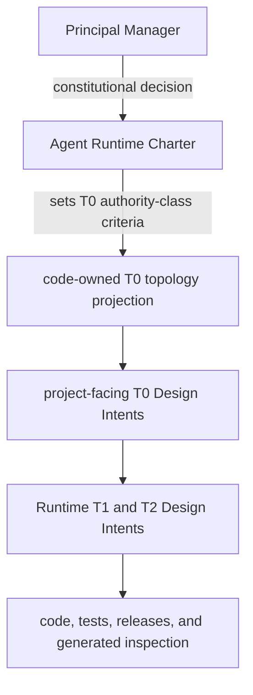

# Agent Runtime Charter

## 0. Intent Capsule

```yaml
layer: Charter
status: candidate
canonical_owner: designDoc/the_charter.md
owned_system_object: standalone Agent Runtime product constitution
scope:
  - independently publishable, domain-neutral Agent Runtime product
  - immutable Module and Workflow release registration
  - provider-neutral execution and invocation
  - durable progress, retry, replay, wait, and recovery
  - authoritative execution ledger and authorized inspection
non_goals:
  - business workflow meaning, role semantics, prompt content, or quality rubric
  - user Entitlement issuance or product authorization policy
  - product task routing or workflow selection
  - governed domain-data ownership or canonical domain writes
  - Agency Platform control plane, user interface, or tenant administration
  - provider, database, or durable-backend product selection
inputs:
  - Principal Manager constitutional decisions
  - exact reviewed SystemChangePlan step for a Charter amendment
outputs:
  - Agent Runtime product identity, constitutional scope, and human authority
  - constitutional constraints inherited by every Runtime T0, T1, and T2 Design Intent
truth_surfaces:
  - designDoc/the_charter.md
  - logical:t0_contract_registry
runtime_triggers:
  - proposal to change the standalone Agent Runtime product constitution
  - proposal to add, remove, or reassign a Runtime T0 authority class
downstream_consumers:
  - Agent Runtime T0, T1, and T2 Design owners
  - Runtime maintainers, host integrators, domain plugin owners, and security reviewers
open_decisions: []
review_gate: Principal Manager or explicitly delegated Charter owner decision after independent design_contract_reviewer review
runtime_surface_ledger: code-generated T0 topology and Design conformance inspection
verification_hooks:
  - Charter required-section and constitutional-authority validation
  - standalone package and domain-neutral dependency closure
  - Charter, T0, T1, and T2 hierarchy plus Design Contract bundle parity
```

## 1. Constitutional Authority Map



本图表达 constitutional authority 和 Design/code handoff，不表达 Runtime operational flow。
当前 T0 identity、owner binding 和 implementation status 只来自 code-owned projection。

## 2. User Intent

本 Charter 定义一个可独立发布、与业务无关的 Agent Runtime 产品。任何宿主产品都可以注册自己的
Module 与 Workflow，同时业务语义、用户权限策略和业务数据权威继续留在宿主 owner。

## 3. Reader Gain

- Principal Manager 能判断一项产品决定是否改变 Runtime constitution。
- Runtime Maintainer 能判断能力属于 Runtime、宿主产品还是外部 authority。
- Host Integrator 能判断必须提供哪些外部决定，而不会把它们写进 Runtime core。
- Domain Plugin Owner 能判断自己的 Module/Workflow 如何进入 Runtime，同时保留业务所有权。
- Security Reviewer 能判断 Runtime 是否越过 authorization、data 或 inspection boundary。

## 4. Product Identity and Scope

Agent Runtime 的产品结果是让已注册的 Agent capability 能够被精确版本化、可靠执行、失败后恢复、
独立测试并被授权还原。Runtime 只解释执行合同，不解释业务内容。Writer、Verifier、Router、
Reviewer、Debater 和 Expert 都是宿主领域注册的 Module role，不是 Runtime 内建子系统。

产品范围包含 Registry、Execution、Invocation、Durability、Ledger 和 Inspection 六项同层逻辑职责。
PostgreSQL、Temporal、Claude、Codex 和其他 provider 都是可替换 binding。

## 5. Human Authority

Principal Manager 拥有 Agent Runtime product constitution 的最终人类决策权，包括 product identity、
constitutional scope、T0 authority class 和 Charter amendment。Principal Manager 可以明确委派某次
Charter decision，但委派必须可识别且不能由 Runtime、Reviewer、Registry、代码状态或测试结果推断。

Design author 形成 candidate；`design_contract_reviewer` 独立形成审查判断；两者都不能批准自己的
Charter。Runtime 只执行 Reviewer Module，也不能取得 Charter decision authority。

## 6. Runtime Responsibility Boundary

| Responsibility | Owns |
| --- | --- |
| Registry | Module、Workflow、Prompt、Schema 与 Execution Profile release 的编译、校验、注册和激活 |
| Execution | Workflow 启动、Module 调度、状态推进、Evaluation 与 output resolution |
| Invocation | 完整 Context 的组装，以及注册后的 model/tool provider 调用 |
| Durability | wait、retry、replay、recovery 与可替换 durable backend 协调 |
| Ledger | Attempt、output、usage、failure、outcome 与 resolution 的权威执行事实 |
| Inspection | 对 Runtime release 和 execution 的授权只读投影 |

代码目录和具体技术实现不能成为新的同层职责。

## 7. External Authorities

| External concern | Runtime behavior |
| --- | --- |
| Product Authorization | 接收并携带精确 authorization context；不签发 Entitlement 或扩大权限 |
| Governed Data Access | 通过宿主授权接口读取冻结输入；不拥有 domain SQL、schema 或 canonical write |
| Task Routing | 接收已选择的 Module 或 Workflow binding；不从自然语言重新选择业务 owner |
| Project Artifact Index | 发出可关联的 release、execution 和 output refs；不接管宿主项目索引 |
| Agency Platform | 提供稳定 Runtime API 与 inspection；不实现用户、产品或控制面职责 |
| Software Delivery | 提供可测试、可打包的 release unit；不自批生产部署 |

## 8. Design Contract Hierarchy

- Design authority、layer 和 parent 由获批准的 owning Design decision 与 code-owned Design
  registration 共同绑定；filename、directory 或 nearby Skill 不能自行创造 authority；
- 项目 T0 使用 `the_*` naming shape，Runtime domain 必须恰有一个 admitted T1 root；
- Runtime T1 使用 `agent_runtime_00_*` naming shape，其 admitted children 使用
  `agent_runtime_<NN>_*` 且 `NN != 00` 的 T2 naming shape；
- filename 必须与已批准的 layer、domain 和 parent binding 一致；不一致时 validator 拒绝 candidate，
  不能反向用 filename 覆盖 Design decision 或 registration；
- 属于其他产品的合同进入其真实 owner，不通过 metadata 留在 Runtime domain。

一个 T0 authority class 只有在它回答一个多个独立 T1 必须一致回答的稳定 system-wide question、
拥有一个不可与现有 T0 重叠的单一 governed object，并且能够向 T1 委派具体业务或 workflow
detail 时才成立。新增、移除或重新指派该 class 会改变 constitutional authority topology，必须经过
§13 的 Charter amendment。当前 T0 identity、owner 和 lifecycle rows 继续只来自 §14 的 code-owned
projection。

## 9. Correctness Priority

结果正确性高于仪式性的流程完成。测试、review 和 admission 用于提高正确性，不能为错误设计盖章。
发现职责错误、合同断裂或实现根因时，修正 owning Design Intent 和 code truth；不得增加 shadow
registry、平行状态或临时旁路来保留旧结构。

## 10. Product Completion Conditions

1. 外部 domain plugin 只通过公开接口即可注册 immutable Module 和 Workflow releases。
2. 同一 Module 可在不同 provider/profile Variant 下独立测试，不复制业务 Workflow。
3. 执行在 crash、retry、wait 和恢复后保持同一权威 execution lineage。
4. 每个 Attempt 的 Context、Profile、provider、输出、usage、错误和 retry 关系可被授权还原。
5. Runtime core 不 import host product、domain Skill tree 或业务数据库实现。
6. published Runtime release unit 内的 Design Contract bundle 与 canonical Design Docs 字节一致。

## 11. Constitutional Invariants

1. Runtime 始终是可独立发布、domain-neutral 的产品。
2. 六项 Runtime responsibility 保持同层；目录、provider 和 storage binding 不改变 logical ownership。
3. 宿主业务语义、authorization policy 和 domain data authority 不进入 Runtime core。
4. 人类 constitutional decision、独立 review、Runtime execution 和 Software Delivery admission 保持分离。
5. project-facing T0 topology 来自 code-owned projection，Charter 不维护当前 inventory。
6. Design Intent 与 code-owned current truth 保持分离。

## 12. Design and Code Boundary

Design Docs 维护稳定 intent、authority、boundary 和 required result。代码、测试、release Registry、
authoritative Runtime records 与 generated inspection 维护当前实现、版本、binding、状态和执行事实。

Provider session、CLI workspace、Temporal history、README 或页面都不能替代 Runtime Ledger、Release
Registry 或 Design authority。Generated projection 只能由 canonical source 重建，不能手工成为第二权威。

## 13. Amendment Authority

任何改变 product identity、constitutional scope、Human Authority、T0 authority class 或本章
Constitutional Invariants 的提案都是 material Charter amendment。它必须形成 exact Charter candidate，
通过 `design_contract_reviewer`，再由 Principal Manager 或明确委派的 Charter owner 决定。

T0/T1/T2 的普通更新、code implementation、Runtime release 和 deployment 不自动修改 Charter。

## 14. T0 Topology Reference

本 Charter 只要求项目具有能够解析的 `logical:t0_contract_registry` 和 code-generated T0 topology
inspection。该 projection 提供当前 T0 identity、owner、lifecycle 和 dependency facts。Charter 不复制
其当前 rows，也不根据目录扫描推断 T0 inventory。

## 15. References

- [Agent Runtime](the_agent_runtime.md)
- [Design Doc Management](the_design_doc_management.md)
- [Review Contract](the_review_contract.md)
- [Software Delivery](the_software_delivery.md)
