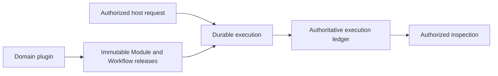

# Agent Runtime Charter

**目的**：定义独立发布、与业务无关的 Agent Runtime 产品边界。任何宿主产品都可以
注册自己的 Module 与 Workflow，但不能把业务语义、用户权限策略或业务数据权威塞进
Runtime core。

**读者应获得的结果**：能够直接判断一项能力是否属于 Runtime、由哪一个 Runtime
责任模块实现、哪些决定必须由宿主系统提供，以及当前 Design Doc 属于 T0、T1 还是
T2。

## 0. Intent Capsule

```yaml
layer: T0
t0_layer_id: the_charter
status: candidate
canonical_owner: designDoc/the_charter.md
owned_system_object: standalone Agent Runtime product constitution
scope:
  - immutable Module and Workflow release registration
  - provider-neutral execution and invocation
  - durable progress, retry, replay, wait, and recovery
  - authoritative execution ledger and authorized inspection
  - independently installable Runtime core and extension interfaces
non_goals:
  - business workflow meaning, role semantics, prompt content, or quality rubric
  - user Entitlement issuance or product authorization policy
  - product task routing or workflow selection
  - governed domain-data ownership or canonical domain writes
  - Agency Platform control plane, user interface, or tenant administration
  - provider, database, or durable-backend product selection
inputs:
  - admitted Runtime release bundles
  - exact host-selected execution binding and authorization context
  - authorized, frozen Module inputs
outputs:
  - immutable Runtime releases
  - durable Workflow and Module execution
  - authoritative execution, usage, failure, recovery, and output lineage
  - authorized read-only inspection
truth_surfaces:
  - designDoc/the_charter.md
  - designDoc/the_agent_runtime.md
  - code-owned Runtime registries and contracts
  - authoritative Runtime release and execution records
```

## 1. Product Result

Agent Runtime 的产品结果不是“调用一次模型”，而是让一个已注册的 Agent capability
能够被精确版本化、可靠执行、失败后恢复、独立测试，并被完整还原。



Runtime 只解释执行合同，不解释业务内容。Writer、Verifier、Router、Reviewer 和
Expert 都是宿主领域注册的 Module role，不是 Runtime 内建子系统。

## 2. Runtime Responsibility Boundary

Runtime 只有六个同层级的逻辑职责。代码目录和具体技术实现不得被画成新的同级职责。

| Responsibility | Owns |
| --- | --- |
| Registry | Module、Workflow、Prompt、Schema 与 Execution Profile release 的编译、校验、注册和激活 |
| Execution | Workflow 启动、Module 调度、状态推进、Evaluation 与 output resolution |
| Invocation | 完整模型 Context 的组装，以及注册后的 model/tool provider 调用 |
| Durability | wait、retry、replay、recovery 与可替换 durable backend 协调 |
| Ledger | Attempt、output、usage、failure、outcome 与 resolution 的权威执行事实 |
| Inspection | 对 Runtime release 和 execution 的授权只读投影与展示 |

PostgreSQL、Temporal、Claude SDK、Claude CLI、Codex CLI 和 HTML renderer 都是
implementation binding，不是新的产品职责。`contracts/`、`testing/` 等目录是物理
代码组织，也不是逻辑职责。

## 3. External Authorities

Runtime 消费外部决定，但不复制外部权威。

| External concern | Runtime behavior |
| --- | --- |
| Product Authorization | 接收并携带精确 authorization context；不签发 Entitlement 或自行扩大权限 |
| Governed Data Access | 通过宿主提供的授权接口读取冻结输入；不持有域数据库长期凭据或业务写权限 |
| Task Routing | 接收已经选定的 Module 或 Workflow binding；不从自然语言重新选择业务 owner |
| Artifact Graph | 发出可关联的 release、execution 和 output refs；不接管宿主项目索引 |
| Agency Platform | 提供稳定 Runtime API 与检查面；不实现用户、产品或控制面职责 |
| Software Delivery | 提供可测试、可打包的 release unit；不自批生产部署 |

## 4. Design Contract Hierarchy

本仓库的 Design Contract 命名规则是：

- `the_*` 是 T0；
- `agent_runtime_00_execution_charter.md` 是 Agent Runtime 领域唯一的 T1 root；
- `agent_runtime_<NN>_*.md`（`NN != 00`）都是这个 T1 下的 T2；
- 文件名决定层级和父级。frontmatter、Registry 或 prose 只能校验，不能覆盖这条关系；
- 如果一个合同实际上属于其他产品，应迁到那个产品的领域，而不是保留
  `agent_runtime_*` 文件名再用 `authority` 字段改写归属。

这条规则只确定 Design Contract 层级，不创造新的运行时对象或 Registry 字段。

## 5. Intent and Code Truth

Design Docs 只维护稳定 intent、职责边界和应达到的结果。代码、测试、release
registry 与 PostgreSQL records 维护当前实现、版本、绑定、状态和执行事实。

生成的 architecture、release inventory 和 Workflow Inspector 是可重建的 inspection，
不能成为第二套可编辑权威。Provider session、CLI workspace 和 Temporal history 也不能
替代 Runtime Ledger 或 domain system of record。

## 6. Correctness Priority

结果正确性高于仪式性的流程完成。测试、review 和 admission 的作用是提高结果正确性，
不是为错误设计盖章。发现职责错误、合同断裂或实现根因时，应直接修 owning Design
Doc 与 code truth；不得为了保留旧流程而增加 shadow registry、平行状态或临时旁路。

## 7. Product Completion Conditions

Agent Runtime 达到可独立发布的最低条件是：

1. 一个外部 domain plugin 可以只通过公开接口注册 immutable Module 和 Workflow releases；
2. 同一 Module 可在不同 provider/profile Variant 下独立测试，而不复制业务 Workflow；
3. 执行可在 crash、retry、wait 和恢复后保持同一权威 lineage；
4. 每个 Attempt 的输入 Context、profile、provider、输出、usage、错误与 retry 关系可被授权还原；
5. Runtime core 不 import host product、domain Skill tree 或业务数据库实现；
6. wheel 内的 Design Contract bundle 与本仓库 canonical Design Docs 字节一致。

未满足这些条件时，应报告真实缺口，不得用 README 声明或演示页替代完成状态。
