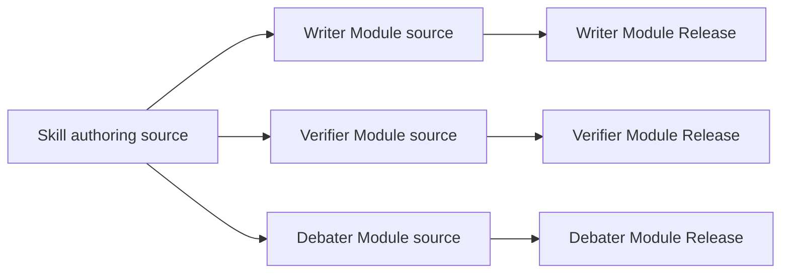
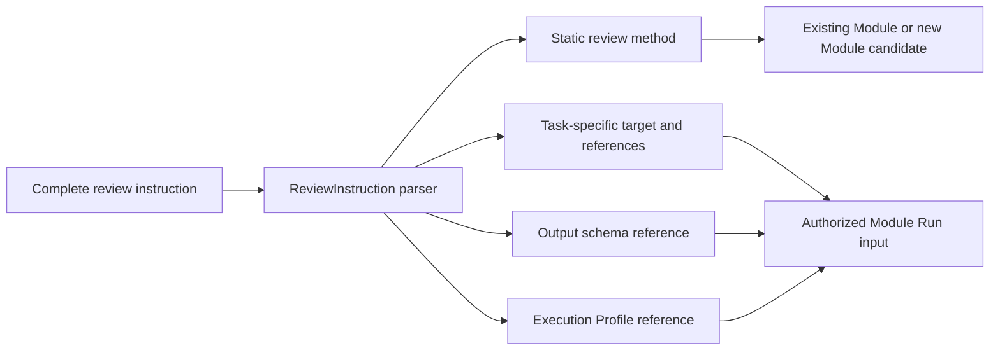
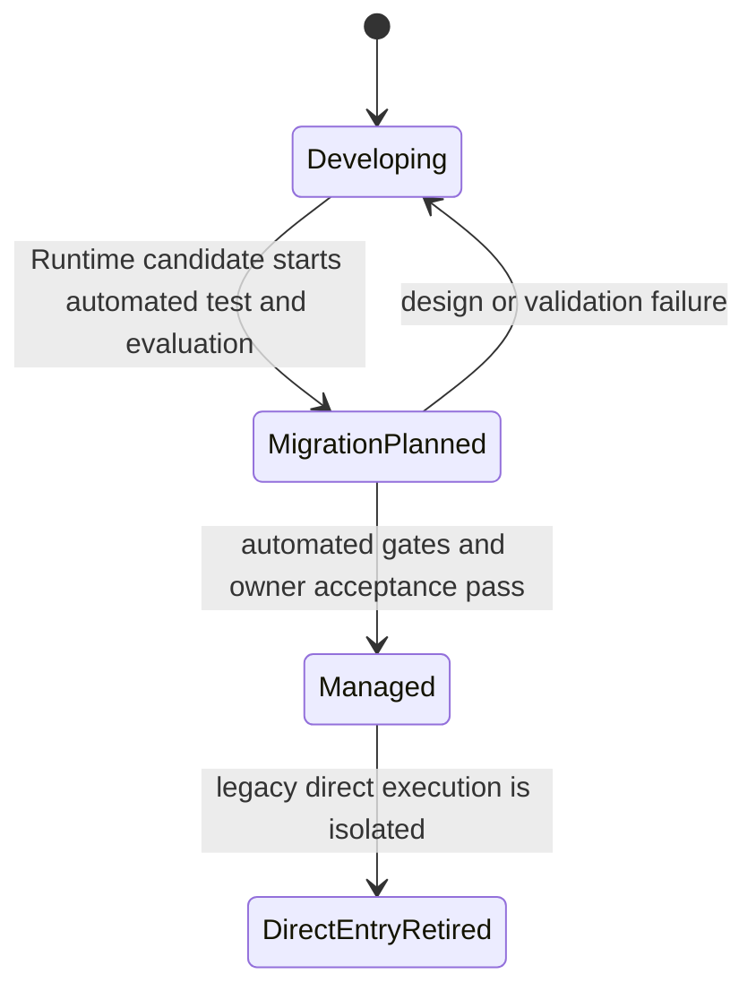

# Skill Governance

**Purpose**: Govern repository Skills as Primary Agent development tools,
product-facing Skills that define zero-to-many Runtime Module registration
sources, or managed Workflow entry projections.

**Required reader gain**: A reader can decide whether a Skill remains a direct
Primary Agent tool, defines one or many Runtime Module registration sources,
routes to a managed Workflow, or serves only as an interface projection, and
can retire legacy direct execution without deleting the managed Skill.

## 0. Intent Capsule

```yaml
layer: T1
parent: designDoc/the_design_doc_management.md
status: candidate
canonical_owner: designDoc/the_skill_management.md
scope:
  - Skill identity, ownership, classification, projection, migration, and retirement
  - Primary Agent development Skills
  - Dagster-managed and Agent-Runtime-managed product Skills
  - zero-to-many Skill-owned Runtime Module registration sources
  - managed Skill and Workflow entry projections and legacy direct-entry isolation
non_goals:
  - domain workflow behavior or business quality rules
  - Product Authorization or customer Entitlement policy
  - Dagster or Agent Runtime execution mechanics
  - provider, model, SDK, API, CLI, or provider-facing Skill adapters
  - software release admission
outputs:
  - classified Skill registration
  - workflow binding and migration disposition
  - managed Skill projection
  - legacy direct-entry retirement evidence
registry_path: src/audit/modules/the_skill_management/registry.py
```

## 1. Skill Classes

| Class | Direct use | Product execution |
| --- | --- | --- |
| `primary_agent_development` | Primary Agent may invoke `SKILL.md` directly for design, coding, migration, repository review, and external-review coordination | Direct `SKILL.md` product execution is forbidden; separately registered Runtime Modules are allowed |
| `product_deterministic` | Skill routes to the registered workflow | Dagster |
| `product_agentic` | Skill defines one or more Runtime Module registration sources or routes to one admitted Workflow | Agent Runtime |
| `product_hybrid` | Skill defines every Agent Module registration source used by the hybrid graph | Fixed outer graph with Agent Runtime Modules |
| `projection_only` | Skill explains or invokes an already managed target | No direct executor |

One Skill has one class and may define zero, one, or many Runtime Module
registration sources. Every resulting Runtime Module Release is registered,
versioned, tested, and admitted independently. Shared deterministic behavior
belongs in code; shared Agent instructions must be selected explicitly by each
Module registration source.

Every governance meta Skill that is directly callable by the Primary Agent
declares exactly one `primary_agent_entry_role` and one
`primary_agent_entry_subject`. The role states what that direct host entry
does; the subject states which artifact or request class it accepts. Together
they control where the Skill may appear in an `EngineeringChangeRoute`:

- `routing` selects an owner and does not author or review;
- `authoring` creates or revises one declared candidate and cannot independently
  pass it;
- `operator` applies an already approved registration, migration, generation, or
  validation procedure and cannot invent upstream intent;
- `review` reads one frozen subject and never edits or admits it;
- `support` preserves or transfers bounded context without changing truth.

An authoring workflow may invoke a separately bound reviewer, but its own role
remains `authoring`. A Skill name, directory, or bundled checklist cannot grant
another entry role. These entry fields do not define or limit product Runtime
registrations. A Skill may define zero, one, or many Runtime Modules, and
every real Module source is declared only by its own fixed
`runtime_modules/<module_id>/module_registration.json` plus `prompt.md`.

The registered governance subjects are `task_request`, `skill_candidate`,
`runtime_registration_candidate`, `engineering_change_candidate`,
`contract_subject`, and `session_handoff`. Product Runtime roles such as
Producer, Writer, Verifier, Router, or Debater remain Module roles and do not
replace this Primary Agent entry role/subject pair.

## 2. Authoring and Development Rule

### 2.1 Mandatory authoring basis

Every material creation, revision, migration, or retirement of a repository
Skill must enter through `the-skill-management` and freeze the following
authoring basis before a candidate is written:

1. this Skill Governance contract;
2. the owning T0 or T1 Design Contract;
3. the code-owned registration and current generated inspection, when present;
4. the existing Skill projection and target-host interface constraints;
5. the provider-neutral Axioms [A14 Prompt Boundary Hygiene] and [A21 Skill /
   Agent Boundary];
6. the managed workflow registration and migration evidence when the Skill is
   product-facing.

The containing Engineering Change Batch must first route the Skill surface to
this authoring workflow. `the-skill-management` is not a general project
reviewer, and its independent reviewer component is a separate review identity.

The authoring record, frozen review input, and acceptance evidence identify these
surfaces by path and freeze their exact content or hash. A manually written
`SKILL.md` that bypasses this basis is an unadmitted candidate even when its
syntax is valid.

The Axioms guide authoring judgment; they do not grant repository authority.
This contract governs Skill lifecycle, the owning domain contract defines
behavior, and code registration defines current binding and migration truth.
Host-specific authoring guidance may add format checks but cannot replace or
override those repository sources.

Governance and Axiom text are authoring control-plane inputs. Do not copy them
mechanically into the final Skill projection. Per A14, the final `SKILL.md`
contains only the task-plane instructions needed by its Agent reader, while
the authoring and review evidence retain the governing references.

The Primary Agent authoring loop also closes cold-reader quality before a Skill
candidate is accepted. The Writer establishes the intended reader's starting
state and executable end state, introduces new concepts only after an
operational object, task, or plain-language role makes them usable, and keeps
each explanatory section's object, reason, and execution effect recoverable.
Formal schema or protocol definitions may appear first when precision requires
it, but their operational role must be supplied at first use.

The independent Reviewer treats every prose check as a defect search:
`finding` means the defect is present, while `pass` means no defect was found.
It checks premature abstraction, concept overload, disconnected contract
statements, and wording drift against the frozen authority package. Identity,
numbers, authority direction, compatibility, uncertainty, failure, and stop
semantics are protected meaning. The Reviewer reports findings and never
rewrites the candidate.

### 2.2 Skill candidate review identity

Skill review uses structured authoring fields. It never borrows Runtime Release
syntax:

```yaml
skill_id: the-contract-audit
candidate_revision: 33
candidate_sha256: <sha256 of the exact Skill candidate>
```

The tuple `skill_id`, `candidate_revision`, and `candidate_sha256` identifies
the exact Skill candidate under review. `candidate_revision` is a Skill
authoring counter only. It does not enter Agent Runtime, alter a Module or
Workflow version, or become an execution dependency.

Composite identities such as `the-contract-audit@candidate_v33` are invalid for
Skill review. Runtime keeps its own typed release references, such as
`runtime-module:<module_id>@candidate_vN` and
`workflow:<workflow_id>@candidate_vN`. A Runtime Module may retain the stable
`source_skill_id` for provenance, but it never retains the Skill candidate
revision.

### 2.3 New Skill and product projection rule

A Primary Agent development Skill may be created directly when its durable
output is a design, code change, migration, test, engineering review, or
external-review package. It cannot become a product route or process tenant
work.

A product Skill starts from an owning T1 contract and its intended
Module or Workflow registrations. Module input and output schemas, authorization
boundary, Artifact lineage, tests, Evaluation, logging, and Runtime binding
precede managed admission. A standalone `SKILL.md` cannot admit a Runtime
Module, product Workflow, or action.

Skill Governance owns the provider-neutral Skill artifact and its lifecycle.
Agent Runtime owns every executable adapter that loads, packages, translates,
or invokes an admitted Module's registered Prompt for a provider. This includes
Claude SDK, Claude Skill, Codex CLI, and future model or host adapters. A Skill
may declare compatible interfaces for its Module sources, but it cannot
define the Adapter protocol, select an unregistered implementation, or carry
provider credentials and execution policy.

When a Skill is itself an executable or semantic projection of another logical
object, its code-owned binding must identify that exact object and release.
Stable discovery entries are different: a compatibility Skill may name a
logical capability while carrying no release content or execution semantics.
In that case the logical registry owns identity, version, domain content, and
active resolution; the Skill remains release-independent and production must
not read it. Generated inspection or recovery files may mirror the active
release, but drift is a projection defect rather than an admission change.
Creating or editing either kind of Skill cannot register, activate, retire, or
mutate the projected logical object.

In enterprise boundary language, Agent Runtime owns provider-facing Skill and model adapters; Skill Governance owns the provider-neutral instruction artifact.

### 2.4 Skill Module registration sources

A product-facing Skill may define multiple independently executable Modules.
Each Module directory declares one target `module_id` and the closed instruction
assets intended for that Module. Runtime registration adds the owner contract,
schemas, operations, Context, Evaluation, Prompt Bundle, entry policy, release,
and admission required to make that Module executable.



The Skill is the authoring surface. Runtime Module Release is the execution and
admission unit. A Workflow references exact Module Releases rather than the
Skill candidate or a filesystem path.

Every Skill that defines Runtime Modules uses one registry-declared canonical
source root. The layout is the same whether the Skill also offers a direct
Primary Agent host entry:

```text
<registered_skill_source_root>/<skill_id>/
├── SKILL.md
└── runtime_modules/
    └── <module_id>/
        ├── module_registration.json
        ├── prompt.md              # editable next-release candidate and recovery copy
        ├── schemas/
        │   ├── input.schema.json
        │   └── output.schema.json
        └── tests/                 # optional admission fixtures
            ├── positive_cases.json
            └── negative_cases.json
```

The Module directory name and manifest `module_id` are identical `snake_case`
values. `module_registration.json` conforms to the code-owned
`runtime_module_registration_v2` shape and contains no provider prompt prose.
`prompt.md` is the only editable static prompt candidate for that Module and
also serves as a recovery copy. It has no post-registration or
production authority. The optional `tests` directory contains authoring and
admission fixtures and is not model input.

`SKILL.md` describes the Skill, its declared Modules, and the managed entry
or registration workflow. It does not repeat a Module's prompt. A
Skill defining several Modules gives each Module its own directory and prompt;
one Module registration cannot read a sibling directory or ambient Skill file.

Every fixed model-backed Module registration must also name one owning Design Doc in
`module_registration.json`. The canonical `SKILL.md` and that Design Doc both
declare the exact `module_id`: the Skill explains the managed entry, and
the Design Doc explains the Module's semantic purpose and responsibility
boundary. Skill review must reject a registration when either surface is missing or
uses only a generic role name that cannot be joined mechanically to the
manifest. Neither surface duplicates `prompt.md`.

The Skill Registry names the canonical source file for every declared asset.
For portable Hoveath Governance Skills, that source is
`09_soul/governance/skills/<skill_id>/`; `.claude/skills/<skill_id>/` and
`.agents/skills/<skill_id>/` are generated host projections. Other projects may
declare a different canonical source root, but no path becomes authoritative by
convention alone.

A host projection may include `runtime_modules/` only when the Registry
declares each projected file, its hash, and its target. The projection is then
a registration input for that host, not an editing authority or production
Runtime state. Module prompt text has exactly one canonical source and one
registered Runtime release after admission.

### 2.5 External review instruction intake

Primary Agent may ask many independent Claude, Codex, or future provider
Agents to review different frozen subjects. Those calls do not justify a
parallel prompt registry or hand-maintained provider files. A complete external
review instruction first enters one structured `ReviewInstructionEnvelope` and
is deterministically decomposed before provider selection:



The envelope marks one disposition:

- `existing_module_run`: resolve an admitted Module whose registered static
  instructions and schemas already own the requested review method. The target,
  exact review questions, and frozen references remain task input. A generic
  reviewer may accept bounded review questions only when its registered input
  schema explicitly permits them.
- `reusable_module_candidate`: create the fixed
  `runtime_modules/<module_id>/module_registration.json` and `prompt.md`
  candidate. Static review method enters `prompt.md`; target content, one-run
  references, provider/model choice, and execution metadata must not enter that
  file. Independent review and Runtime registration are still required before
  execution.

The parser does not infer stable versus dynamic meaning from an arbitrary flat
prompt. It accepts explicit envelope fields produced by the common Formatter,
rejects missing or overlapping components, and preserves the full compiled
model Context as a recorded invocation projection. Claude and Codex consume
the same semantic components; their provider and reasoning differences belong
only to separately registered Execution Profiles.

Git retains these files as a reviewable candidate surface and recovery copy.
Registration first reads the current Runtime releases as its authoritative
baseline, then compares the local Module folder as a proposed next release.
It resolves the proposed structured instruction, domain-context, and
output-contract inputs and writes immutable `model_context_component_release`
records to Runtime PostgreSQL. One `prompt_bundle_release` orders those
components and stores the Formatter's complete compiled static Context.
Runtime tooling may reconstruct a missing or stale local candidate from the
registered release, but a local edit can affect execution only by creating and
admitting a new immutable release. Every permitted execution reads the database
releases. Admission determines whether that permission is limited to tests,
shadow execution, canary execution, or production. The working tree is never a
production prompt or schema source.

The three initial component kinds are `task_instruction`, `domain_context`,
and `output_constraint`. Their component releases are immutable and carry
their own content and source-lineage hashes. A domain-owned structured release,
such as one Digestion Expertise/Lens release, remains the semantic authority;
the Runtime component is its model-ready formatted projection. The Prompt
Bundle is the sole ordered static assembly. The committed Prompt Envelope is
the sole record of the final complete provider-visible Context for one
Attempt.

Each Module receives only its selected instruction closure. Shared Skill
assets must be explicitly referenced by the Module source. A Writer receiving
Verifier or Debater instructions is a failed projection even when all content
comes from the same Skill.

A workflow-entry Skill may point to one admitted `workflow_release_ref` and
define no Module. A `primary_agent_development` Skill may also define zero or
more separately registered Runtime Modules. Those Modules are independent
product execution units and never inherit the Skill's direct host-entry
authority.

Product-agentic Skill authoring is registration-first. Before drafting the
task-plane instructions for a Module, the authoring record must contain:

- the target `module_id`, owning contract, and intended workflow node;
- concrete input and output schema assets with content hashes;
- the declared operation set and data/context closure;
- Context, Evaluation, retry, and output-resolution policies;
- the Prompt Bundle member closure and provider-neutral failure contract;
- positive, negative, and schema-drift fixtures for the independent Module.

The Skill owns the method and judgment instructions needed to transform the
declared input into the declared output. It does not own release identity,
schema identity, model/provider selection, authorization, loop state, or
workflow edges. JSON examples in `SKILL.md` are illustrative projections of the
registered schema and never an independent field authority. Deterministic
checks reject a missing schema asset, a schema hash derived only from its ref
string, a Skill output field absent from the registered schema, and a Reviewer
finding that requires an undeclared candidate field.

`agent-runtime-registration` is the Primary Agent development workflow for
this registration boundary only: Skill Module source to Runtime Module
Release, exact Module assembly into a Workflow Release, release registration,
admission evidence, and managed migration. General Agent Runtime architecture,
core, adapter, authorization, ingress, persistence, and observability
engineering bypasses that Builder and follows the owning Runtime contract plus
the ordinary engineering implementation workflow.

## 3. Migration Lifecycle



### 3.1 `developing`

The existing Skill and direct implementation may continue inside its declared
scope. Product expansion is blocked until classification and target workflow
design are approved.

### 3.2 `migration_planned`

This is an executable validation stage. Agent Runtime registers candidate
Module registrations and runs automated tests, Evaluations, A/B Variants, replay,
failure injection, authorization negatives, and observability checks. Fixed
and hybrid workflows also validate their outer-graph binding. The direct entry
remains the production comparison path.

### 3.3 `managed`

Product routing switches to the admitted fixed workflow, Runtime Module, or
Runtime Workflow target. The Skill remains active as the managed
instruction source and Agent-facing projection. It contains no direct provider
call, unmanaged subprocess, or canonical write.

### 3.4 `direct_entry_retired`

The canonical managed Skill remains active. The legacy direct runner, embedded
prompt, compatibility alias, and direct write path are removed from active and
archived discovery roots. Code retains a non-executable tombstone with the old
entry ID, replacement workflow, final hash, reason, and retirement timestamp.
Historical recovery uses Git history or a separately authorized audit store.

## 4. Migration Gates

Migration preserves:

- owning T1 semantics and legal graph edges;
- input, output, failure, and quality contracts;
- Product Authorization and Entitlement scope;
- Artifact identity and lineage;
- Data Governance and Timestamp obligations;
- context, token, tool, and run logging for model-backed work;
- replay, idempotency, rollback, and human gates.

The transition to `managed` requires fixture or shadow parity, negative tests,
failure recovery, observability, and accountable owner acceptance. These are
gates rather than additional lifecycle states.

## 5. Required Machine Contract

Code-owned Skill registration records the stable Skill ID, owner, class,
Primary Agent role when applicable, T1 contract, zero-to-many Module source
declarations, optional Workflow entry binding, product exposure, migration
state, active projection, direct-entry disposition, and retirement tombstone.
Skill review records preserve the structured candidate identity from section
2.2. Agent Runtime independently persists immutable Module Releases and their
exact prompt, schema, policy, profile, and provenance hashes. Generated
inspection shows the current inventory and flags unclassified, unbound, or
directly executed product Skills.

The code-owned writer and reviewer package assemblers always include this
contract and the two authoring Axioms from section 2.1. Their task-plane prompt
templates project the cold-reader and protected-meaning requirements from the
same section. Deterministic tests fail if any required authoring source is
absent or if the registered review-check range drifts from either package.

## 6. Invariants

1. Primary Agent development Skills never become product routes.
2. Product Skills execute through a registered fixed workflow, Runtime Module,
   or Runtime Workflow.
3. Every model-backed product execution resolves one admitted Runtime Module
   Release.
4. The managed Skill projection remains available after direct-entry retirement.
5. Retired direct-execution instructions are absent from normal and archived
   Skill discovery.
6. Skill text never grants permission, release admission, or canonical-write
   authority.
7. Provider-facing Skill and model adapters are registered, admitted, tested,
   and observed by Agent Runtime rather than Skill Governance.
8. A semantic or executable Skill projection binds to one exact active release;
   a stable compatibility entry carries no release semantics. Neither becomes
   the logical object's source of truth or a production read channel.
9. Every material Skill change loads Skill Governance plus A14 and A21
   before authoring; host guidance supplements but never replaces them.
10. Authoring control-plane material remains in authoring and review evidence,
    not in the task-plane Skill projection unless it changes task execution.
11. One Skill may define multiple Modules, and each Module has an independently
    testable instruction closure, release identity, and Runtime admission.
12. A Workflow references exact Module Release refs and hashes rather than a
    Skill path or package name.
13. Every product-agentic Module source is drafted from a complete candidate
    Module registration and validated against the same concrete schemas used
    by execution and Evaluation.
14. Skill review identifies candidates with separate `skill_id`,
    `candidate_revision`, and `candidate_sha256` fields. The
    `<skill_id>@candidate_vN` shape is invalid for Skill review and cannot
    become a Runtime dependency.

## References

- [Design Doc Management](the_design_doc_management.md)
- [Agency Platform](the_agency_platform.md)
- [Agent Runtime](the_agent_runtime.md)
- [Product Authorization](the_product_authorization.md)
- [Software Delivery](the_software_delivery.md)
- [A14 Prompt Boundary Hygiene](../09_soul/axioms/a14_prompt_boundary_hygiene.md)
- [A21 Skill / Agent Boundary](../09_soul/axioms/a21_skill_agent_boundary.md)
