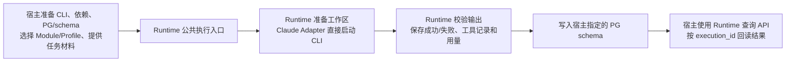

# Claude 原生工具执行

## 1. 使用方式

`ClaudeCliNativeToolsModuleExecutor` 直接启动本机 Claude CLI。模型、effort、
工具和超时来自 Execution Profile；同一个 Adapter 可用于不同 Reviewer 和其他相容 Module。
本机提供 CLI 路径、工作区根和必要的只读运行依赖。

### 1.1 宿主需要准备的环境

这里的宿主是使用 Runtime 的项目，例如 Analyst Billie（AB）。环境配置放在宿主，下面的执行和
存储代码使用 Runtime 包内实现。先准备表中的实际值，再使用 §1.2 的 sample；表中名称对应现有
Python 参数或对象，不要求创建新的配置文件格式。

| 宿主准备什么 | 交给哪个现有入口 | 必须明确的内容 |
| --- | --- | --- |
| Runtime 与 Python | 安装同一候选版本的 Runtime；运行同版本源码中的 sample | 实际 import 来源与源码一致；安装所选用例需要的 pytest、jsonschema、psycopg 等依赖。直接 Claude CLI 路径不要求 Claude Agent SDK |
| Claude CLI 与现有登录 | Adapter 的 `cli_path` | 可执行文件的准确路径；认证检查使用这个文件，不自动发起登录 |
| Python、Git 等工具 | Adapter 的 `read_only_dependencies` | 真实安装目录，包含程序及必要库；当前 Adapter 将这些目录下的 `bin` 加入 PATH，不依赖 Agent 临时寻找程序 |
| 本次运行位置 | Adapter 的 `workspace_root` | 宿主拥有且可写的专用运行根目录；Runtime 在其下创建 Attempt/work、materials 和 scratch，不把宿主整个仓库默认为可读材料 |
| 审核材料与任务 | 公共执行入口的 `input_payload` 和授权内容读取接口 | 核心内容与明确辅助材料来自调用方；辅助材料由 Runtime 读取、核验并准备，不由 Adapter 扫描仓库 |
| Module 与 Profile | `release_registry`、Workflow、Variant Policy | 通过 Registration Runbook 注册完整依赖；本次选择的 Module 必须声明支持 `claude_cli`，Provider 工具组合必须被 Adapter 接纳 |
| Runtime 数据库 | `PostgresRuntimeReleaseStore`、`PostgresRuntimeExecutionRecordStore`、`PostgresRuntimeExecutionQueryStore` 的 `from_dsn(..., schema=...)` | 宿主提供连接与注册/执行 schema；二者可在同一个 PG 数据库内。管理员先通过 Runtime 安装/迁移 API 准备结构，普通注册和调用不自动执行 DDL |
| 宿主授权与内容存储 | `authorize`、`context_client`、`operation_client`、`artifact_host`、`record_store`、`content_store` 等公共入口参数 | 按当前 public API 提供真实绑定；测试里的 `_Host` 是替身，不是可以复制进生产的授权服务 |

具体环境值不放入 Runtime core。AB 可以继续使用自己的 `governance_bindings/` 保存配置和一个薄调用
入口；它不负责重新实现 CLI 参数组装、进程管理、输出解析、执行日志或 PG 持久化。
数据库连接由宿主注入，不写进 prompt、公开文档或 CLI argv，也不提供给模型的 Bash 环境。



### 1.2 组装现有 Adapter

```python
from pathlib import Path
from agent_runtime.registry import ExecutionProfileReleaseSpec, compile_execution_profile_release
from agent_runtime.invocation.invocation_claude_cli_execution import ClaudeCliNativeToolsModuleExecutor

profile = compile_execution_profile_release(ExecutionProfileReleaseSpec(
    execution_profile_id="claude_cli_reviewer_sample", release_version="v1",
    executor_adapter_id="claude_cli_native_tools_executor", executor_adapter_revision="v1",
    transport_kind="claude_cli", provider_id="anthropic",
    model_id="claude-opus-5[1m]", reasoning_profile="xhigh",
    execution_mode="agent", semantic_input_delivery_mode="inline",
    attempt_workspace_policy="own_draft_read_write", gateway_access_reasons=(),
    output_constraint_mode="native_structured_output",
    tool_policy=("read", "search", "shell"), network_policy="denied", timeout_seconds=1200,
))

adapter = ClaudeCliNativeToolsModuleExecutor(
    release_registry=registry, artifact_host=cell_artifacts,
    workspace_root=Path(host_workspace_root), cli_path=Path(host_claude_cli),
    read_only_dependencies=tuple(Path(p) for p in host_test_dependencies),
)
adapters.register(adapter)
```

示例中的 registry、cell_artifacts、adapters 和 host_* 由宿主提供。通过
`run_registered_workflow_module` 或 `run_workflow_module` 使用该 Adapter；完整参数沿用现有公共入口。
Profile 与对应 Variant Policy 按 [注册 runbook](agent_runtime_registration_runbook.md) 注册，
Module 指令和 schema 不因更换 Profile 而修改。

## 2. 参数与材料

| Profile 工具 ID | Claude 原生工具 |
| --- | --- |
| read | Read |
| search | Grep |
| shell | Bash |

可以选择这些工具的子集。model_id 原样传入 CLI，包含 Claude 支持的 `[1m]` 选择形式；不依赖
API-key-only beta。CLI 不锁定某一个版本，代码检查所需选项，并在 trace 中记录实际版本。
新 CLI 的实际行为仍需要相应测试，不能仅凭 `--help` 断言隔离或输出能力。

Runtime 在 Attempt 的 work 目录运行模型，将授权输入按安全的 logical_name 放入只读 materials，
提供路径索引。scratch 可用于补充测试；local_handle 只经过 host 查表。CLI 的 restricted 模式约束 Read/Grep 的
实际路径，Bash 使用原生 sandbox；运行依赖显式只读提供，网络默认关闭。旧 draft 的隐含工具权限
不会继续执行，需使用显式工具配置。

所有 argv 由 Adapter 的 build_command 组装，实际调用也使用它；命令与配置记录在 trace 中。
原生 Bash 中可使用 head、git diff、ls、grep 等普通命令，不设命令白名单。safe-mode 关闭自动加载的
CLAUDE.md、Skills、Plugins 和 hooks，MCP 与会话持久化也关闭；原生工具会话的临时目录由 Runtime 独立创建，退出后清理。原始任务、工具记录、实际配置与
结果通过现有私有 trace 和 Ledger 保存；执行失败与 Reviewer 的 non_pass 分开解释。

私有 trace 中的 exit_code 保留操作系统实际返回值；无法取得时为 null。Runtime 中止读取时，
stop_reason 单独说明事件观察停止、事件流错误、输出超限、超时或清理失败；cleanup_error 保留
附加清理诊断。即使 exit_code 为 0，中止或不完整捕获仍形成失败，不提交成功输出。
stream_error 和 event_error 保留附加的流处理或事件解析诊断，不覆盖已确定的 stop_reason。
stdout/stderr 保留有界原始输出，process_output_complete=false 表示它们不能视为完整轨迹。
自定义 process_runner 仍可使用标准 subprocess 异常；Runtime runner 的停止和超时异常分别
兼容 CalledProcessError 和 TimeoutExpired，不能将 Runtime 停止原因解释为进程退出码。

CLI 使用 auto 模式处理其内置的确认判断，不使用 bypassPermissions；文件与网络窗口继续强制执行。
实际 permissionMode 与请求值一致才继续。Git/Python 由宿主显式提供真实运行目录，避免命中系统启动
代理；Git 不加载用户或系统配置。trace 同时保存 argv 与安全环境值，便于复现，不依赖 Agent 临时修环境。

## 3. 重复验证

### 3.1 本地回归与工具测试

完整测试在同版本源码 checkout 中。普通本地回归：

```sh
python -B -m pytest -q -p no:cacheprovider tests/test_agent_runtime_claude_native_tools.py
```

真实 AB 工具用例需要显式设置 `RUN_PROVIDER_INTEGRATION=1`、
`AGENT_RUNTIME_TEST_AB_WORKSPACE` 与 `AGENT_RUNTIME_TEST_CLAUDE_BIN`。工作区必须属于测试者授权的
AB 目录。`AGENT_RUNTIME_TEST_AB_WORKSPACE` 指向已存在的专用可写运行根目录，每批选新目录以免覆盖
导出的报告；不设为 AB 仓库根。当前 sample 的 Python/Git 目录以测试源码中的
`read_only_dependencies` 为准，环境需要安装在这些位置；换机器时由宿主调整测试 fixture 的依赖绑定，
不把这两处本机路径写成 Runtime 的全局默认。

```sh
python -B -m pytest -q -s -p no:cacheprovider \
  tests/test_agent_runtime_claude_native_tools.py::test_live_claude_native_tools_in_ab \
  tests/test_agent_runtime_claude_native_tools.py::test_live_claude_rejects_ab_sibling_read \
  tests/test_agent_runtime_claude_native_tools.py::test_live_claude_resource_boundaries_in_ab
```

### 3.2 AB 的注册 Reviewer 与 PG sample

这个用例演示宿主搭好环境之后，如何使用 Runtime 完成注册、执行和回读；它不是替所有宿主自动
安装环境的工具，也不会迁移 AB 的默认 Reviewer 配置。

| 已有配置/环境变量 | 该用例实际读取或要求的内容 |
| --- | --- |
| `RUN_PROVIDER_INTEGRATION=1`、`RUN_AB_REVIEWER_PG=1` | 明确开启真实模型和 AB 持久测试；缺少任一个时用例 skipped，不算已执行 |
| `AGENT_RUNTIME_TEST_AB_ROOT` | AB 项目根，含 `.claude/skills/the-design-authoring/runtime_modules/design_contract_reviewer/` 的完整 source，以及所属 Portable validator |
| `AGENT_RUNTIME_TEST_AB_WORKSPACE` | §3.1 的专用运行根目录；Runtime 工作区和该用例导出的报告位于这里 |
| `AGENT_RUNTIME_TEST_CLAUDE_BIN` | §1.1 已检查登录和版本的实际 Claude executable |
| `AGENT_RUNTIME_TEST_REVIEW_INPUT` | 已由所属 DDM builder 生成的完整输入 JSON；可直接是 payload，也可由已有记录的 `semantic_input` 字段提供，module_id 必须是 design_contract_reviewer |
| `governance_bindings/ddm_runtime.json` | 用例读取 `database_url_env`、`registry_schema`、`execution_schema`、`module_release_ref`、`module_release_sha256`；原 Module 和它的 Policy 依赖必须已能从目标 Registry 解析 |
| `database_url_env` 指名的环境变量 | 宿主在调用进程中注入连接；变量名和连接值均由宿主选择，不由 Runtime 猜测 |

AB 的注册和执行可以共用一个 PG 接口，同时分别使用 AB 自己的 Runtime control 与 execution schema。
其他项目选择自己的 schema；schema 内的表名和安装结构仍由 Runtime 管理，宿主不手写另一套表结构。
环境准备和注册方法见 [Registration Runbook](agent_runtime_registration_runbook.md) §3 至 §8。

已注册 Reviewer 与 PostgreSQL 回读用例另外要求 `RUN_AB_REVIEWER_PG=1`、
`AGENT_RUNTIME_TEST_AB_ROOT`、`AGENT_RUNTIME_TEST_REVIEW_INPUT` 及 AB 配置所指的数据库环境变量。
它复用已注册 Design Reviewer 的指令与 schema，编译支持 claude_cli 的测试 release 和 Workflow，
消费真实原始审核输入，使用测试授权 ports，写入样例 Profile/Variant 及执行记录，不修改现有 active pointer。该用例不是生产宿主授权实现。

```sh
python -B -m pytest -q -s -p no:cacheprovider \
  tests/test_agent_runtime_claude_native_tools.py::test_live_ab_registered_design_reviewer_and_postgres
```

工具与 schema 测试通过只说明对应能力成立。是否完成某份实际审核，仍由该 Reviewer 的完整 schema
和语义 validator 判断；sample 不改变审核要求。

### 3.3 结果与缺口归属

用例会导出 `registered_review_execution.json`、`registered_review_trace.json` 和
`registered_review_result.json`。核对同一 execution_id 的 Module/Profile、执行状态、真实工具事件、
完整输出校验，以及 PG 新连接回读，而不是只看 CLI 退出零或 Reviewer 写了 passed。
这里的 `_Host` 来自 `tests/test_agent_runtime_registered_module_execution.py`，只用于验证 Runtime 的
调用与记录边界。真实宿主授权仍需项目自己实现并验证；本 sample 通过不代表它已经完成。

缺少 CLI/登录/运行库/PG/schema/source/input 时，补宿主对应的环境或注册输入；Runtime 公共入口、
Adapter、记录或查询实现有缺陷时，回到 Runtime 修复并随包交付。审核内容本身的缺陷交给所属
Reviewer/文稿负责人，不通过改启动参数或替换 schema 让它通过。
