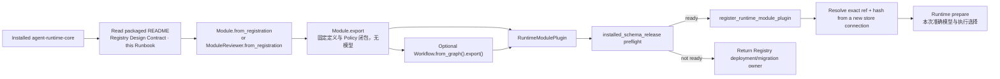

# Agent Runtime Registration Runbook

本 Runbook 面向把已批准 Module 或 Workflow 接入 Agent Runtime 的宿主开发者。它随
`agent-runtime-core` 分发，说明如何使用当前 package 的 public API 完成 source loading、release
compilation、定义保存和准确回读。注册后的执行选择由 Runtime 单独准备。

Runtime Design Contract 定义稳定语义，public Python API 定义当前可执行接口。本 Runbook 不创造新的
release 类型、权限规则或持久化协议；当文字与 public API 不一致时，停止 registration 并报告 package
drift。

接口定义见从源码自动生成的 [Reviewer API reference](agent_runtime_reviewer_api.md)。
先读其中的 Module 和 ModuleReviewer 类说明，确定固定定义、独立执行参数和存储归属；再按本 Runbook
完成一次注册。注册只保存固定定义；每次审核独立选择模型，提交本次输入与执行 key。
当前单节点执行入口的参数、授权依赖、重放限制和失败处理也在该接口参考中。
测试用途不要求复制 Reviewer。Module 内容不变时切换模型只形成新的执行选择；相容性由 Runtime 根据通用运行要求、实际 Adapter 和本次资源判断，source 不再声明 transport。

<a id="local-runtime-setup"></a>

## 使用工具前的轻量 setup

安装当前 Runtime 包后，直接使用下面的现有注册、查询或 evaluation 命令，并提供明确 root。
这些入口在参数解析成功后共用 [setup_runtime](agent_runtime_reviewer_api.md#setup_runtime)：
首次准备 `.runtime` 和两个随包操作 Skill，放入宿主的 `.agents/skills` 与 `.claude/skills`；
已就绪时只做固定少量本地检查，不重复写文件，无需另执行 Skill 安装命令。

setup 不扫描项目或注册历史，不安装软件、连接 PG 或登录 Provider。它只维护自身的 setup 元数据
和可识别的操作 Skill，保留 Module、Workflow 定义和其他用户内容。同名本地修改或非法元数据会
返回具体冲突，后续操作不会开始；I/O 失败后可用同包继续完成准备。精确效果与失败见上述自动接口说明。
程序化宿主可在已有初始化中调用 `from agent_runtime import setup_runtime`；普通 import、CLI help
和参数用法错误不会创建环境。无 root 的快照检查不猜测当前目录为 Runtime 环境。

CLI 查询仍只读注册定义，但首次调用可能补齐环境；普通 evaluation 的 `persistence=not_requested`
指本次执行事实不写持久存储，与环境 setup 文件的必要写入分开。

<a id="new-reviewer"></a>

## 0. 注册新的 Reviewer 并在宿主测试 / Register a new reviewer and test it

本节是日常操作入口。你无需读取 Runtime 生产源码或测试 fixture；先按当前任务选择：

| 当前已有的东西 | 下一步 |
| --- | --- |
| 只有“我需要一个新的 Reviewer”的想法 | 由该审核对象的负责人完成 Reviewer 定义与审核；注册工具不会替你编写职责、prompt 或 schema |
| 已批准的准确 Reviewer source，尚未注册 | [准备](#prepare-reviewer)，然后[注册固定定义](#register-reviewer) |
| 已有准确 Module release，想运行一份新材料 | 直接进入[首次或再次测试](#test-reviewer)，不重新编译或注册 |
| 已有 execution ID，想看结果或排错 | 进入[查询](#inspect-reviewer)，不再次调用模型 |

参数含义以 [ModuleReviewer](agent_runtime_reviewer_api.md#modulereviewer) 及其公开方法说明为准。
下列示例只组合现有 public API，不创建新的 wrapper、数据库结构或测试 Reviewer。

<a id="prepare-reviewer"></a>

### 0.1 通过 CLI 注册固定定义

已有完整且已审的 Reviewer source 时，优先使用正式 CLI：

```sh
agent-runtime-registry register-reviewer --help
agent-runtime-registry register-reviewer --root /path/to/host --source-root /path/to/source \
  --skill-id reviewed-skill --module-id reviewed_reviewer --version v1
agent-runtime-registry load --root /path/to/host --kind workflow --id reviewed_reviewer
agent-runtime-registry load --root /path/to/host --kind workflow --id reviewed_reviewer --version v1
```

示例中的身份与版本应替换为准确已审 source 的值。source-root 省略时使用 root。
单节点 Workflow 默认与 Module 同名、同版本，通过 `--kind module` 和 `--kind workflow` 区分。
需要其他图名称时，在注册命令中传入 `--workflow-id explicit_name`；显式组装的图保留自己的名称。
这项共同能力由 [Module.to_workflow](agent_runtime_reviewer_api.md#moduleto_workflow) 提供，
Reviewer 通过继承使用。方法消费准确 export，不重新读取 source 或解析默认值。
命令直接读取 source，自动解析 Runtime 默认、编译固定单节点 Workflow 并保存、回读；不需要
先手写 Policy、Profile 或 bundle。软件安装使用宿主明确的标准安装命令，与注册分开。
该命令的前置 setup 只准备本地 Runtime 环境；不会安装依赖、登录 Provider、创建 PG schema 或调用模型。

新注册使用 runtime_module_registration_v4 的八个任务字段：source 身份、owner 路径和输入输出 schema 引用及路径。prompt 仍来自同一 source 目录。Policy、模型、transport 和工具参数由 Runtime 的定义或执行责任提供，调用者无需写入 source。
v2/v3 可按既有合同读取历史内容；当前高层 authoring 不把这些旧技术字段静默忽略，新的 source 必须由负责人明确迁到 v4。
注册无需 CLI 或登录。重复同版本核对原任务内容并返回原定义及依赖，不重新应用当前 Reviewer 预设；真实 source 变化仍需新版本。同版本 Module 已保存而 Workflow 保存失败时，重试原请求复用 Module 并补齐图，再准确回读。
register-reviewer 不接受 --model-id 或 --reasoning-profile，误传退出 2；Python 注册 API 已移除这两个参数和 release_registry，误传由签名在操作 IO 前返回 TypeError。模型参数交给下方执行准备接口。
切换模型后的新调用使用新执行身份；历史执行按原 execution ID 查询 Ledger，不读取当前默认来重跑。

stdout 包含真实注册 records、保存路径和 readback=verified。失败返回非零退出码，stderr 返回
error_type、原生 error_code（若存在）和 detail；保留错误，不随机换版本或换模型继续。

**客户端兼容与升级顺序。** 新 Module 记录包含参与 hash 的 execution_requirements；执行选择还可能包含 model_defaults_version。不认识这些字段的旧 Runtime 会因 hash 不匹配而拒绝读取。
PostgreSQL 的 load_release_registry 会解码整个 catalog，所以即使调用者仍选旧 Module、
未切换 active pointer，共享 catalog 中的一条新记录也可能使旧客户端无法加载。
本地 register 同样需要恢复已有 catalog；单个旧版本文件可读，不证明整个混合目录可读。
向共享 store 注册前，先升级所有受影响读取者并核对实际构建身份；相同 dev 版本字符串不足以判断。
可以在独立测试目标验证兼容，不自动更改生产连接或迁移 schema。
旧记录内容保持不变。新记录写入后，恢复可用性应恢复支持新格式的客户端；仅降级软件并保留
混合 catalog 不能恢复读取，也不应通过删改历史记录或增加 DDL 绕过内容校验。

本地保存、版本加载和 CLI 验证：

宿主已有注册调用可传入 `root`：

```python
registration = register_runtime_module_plugin(store, plugin, root=project_root)
```

注册成功后，Module 保存到 `.runtime/module/<module_id>/<version>.json`，Workflow 保存到
`.runtime/workflow/<workflow_id>/<version>.json`。单节点 Workflow 同样在 workflow 中。
保存内容包含该对象的固定依赖，旧 Workflow 不会因其他 Module 文件更新而被重新拼装。

也可直接从已编译的完整 bundle JSON 通过安装的 CLI 注册、加载：

```sh
agent-runtime-registry register --root /path/to/host --bundle bundle.json --plugin-id review_package --plugin-version v1
agent-runtime-registry load --root /path/to/host --kind workflow --id review_workflow
agent-runtime-registry load --root /path/to/host --kind workflow --id review_workflow --version v1
```

CLI register 使用既有内存 Registry 校验并保存结果，不自行连接 PG；宿主要同时登记 PG 时使用上面的
既有 store 调用。未指定版本时选最近成功保存的新定义版本；重复保存不改变顺序，不使用文件 mtime。
这里没有 active/latest 指针文件或激活步骤。PG 既有入口不因此改义。

直接加载用 `load_runtime_registration(root, "workflow", workflow_id, version)`；新的单节点 Reviewer
执行从 `prepare_local_workflow_module` 取得固定定义与本次模型配置，见下方首次测试说明。
宿主继续提供原有实时授权、Adapter 和 Ledger 端口。旧 `run_local_workflow_module` 保留执行
已保存明确绑定的兼容行为，不用于新的 definition-only 注册流程。多节点图继续使用既有图执行入口。

这些接口的实际参数、返回和错误见[源码生成的 API 手册](agent_runtime_reviewer_api.md#load_runtime_registration)。
正常 Reviewer source 注册使用上面的 CLI。下方 Python 示例演示把相同固定定义注册到已经授权的 PG store，仍无需手工组装 Policy 或 Profile。

先使用当前宿主选定的 Python 确认安装来源，并打开同一安装包里的说明：

```python
from importlib.metadata import version
from importlib.resources import files
import agent_runtime

print(version("agent-runtime-core"))
print(agent_runtime.__file__)
print(files("agent_runtime").joinpath("README.md"))
print(files("agent_runtime").joinpath("docs/agent_runtime_registration_runbook.md"))
```

保存准确安装来源；相同版本字符串不证明相同源码。缺失文档或安装与目标版本不一致时，先由
Runtime 安装维护者处理。PostgreSQL 操作需要安装包的 `postgres` 可选依赖；连接由宿主注入。

以下是示例所需的输入来源表，不是新的配置文件格式。值必须由负责人提供，不能采用 fixture 中的
ID、hash、数据库或授权替身。表中的名称是后续 Python 示例使用的变量。

| 输入 | 提供方与内容 |
| --- | --- |
| `project_root`、`skill_id`、`module_id`、`module_version` | Source owner 提供准确、已审的 Skill/Module source 与批准版本；根目录为 Path，两个 ID 对应真实注册文件 |
| `database_url`、`registry_schema` | 宿主提供本次获准使用的 Registry 连接与 schema；凭据不写入任务材料、日志或本手册 |
| `plugin_id`、`plugin_version` | 注册操作者提供本次明确的发布包身份；与 Reviewer 的 Module 版本分开 |
| 需要外部授权的宿主执行入口 | 宿主提供实际授权/存储资源；Runtime prepare 返回准确 Workflow、Variant 和 Profile，宿主不另选一份模型配置 |
| 本次审核输入、输出 validator | Source owner 按该 Reviewer 的真实输入 schema 提供；输出由该对象的 schema 与语义 validator 判断 |

source 注册与执行准备分开验证。注册完成后使用 Runtime prepare 核对该 Module 的通用要求及所选 Adapter；具体资源在执行前校验。每次新审核提交新材料和新执行 key，保持未改变的定义。注册时不要求提前提供模型、CLI 或生产授权。

<a id="register-reviewer"></a>

### 0.2 将固定定义注册到已授权 PG

本段会写入明确提供的 Registry，仅在本次注册已授权且上表输入齐备后执行。它注册 Module 及其
固定依赖，不生成 Workflow，不设置 active pointer，也不调用模型。具体接口见
[加载 Reviewer source](agent_runtime_reviewer_api.md#load_reviewer_registration)、
[export](agent_runtime_reviewer_api.md#modulereviewerexport) 和
[origin_bundle](agent_runtime_reviewer_api.md#moduleexportorigin_bundle)。

<!-- example:register-reviewer:start -->
```python
from agent_runtime import (
    ModuleReviewer, RuntimeModulePlugin, load_reviewer_registration,
    register_runtime_module_plugin,
)
from agent_runtime.registry import PostgresRuntimeReleaseStore

store = PostgresRuntimeReleaseStore.from_dsn(database_url, schema=registry_schema)
if store.installed_schema_release().state != "ready":
    raise RuntimeError("Registry schema is not ready; return to the schema owner")
source = load_reviewer_registration(
    project_root, skill_id=skill_id, module_id=module_id,
)
reviewer = ModuleReviewer(source)
exported = reviewer.export(module_version=module_version)
plugin = RuntimeModulePlugin(
    plugin_id=plugin_id, plugin_version=plugin_version,
    release_bundle=exported.origin_bundle,
)
registration = register_runtime_module_plugin(store, plugin)
registration.validate()
module_ref = exported.module_release.release_ref
module_hash = exported.module_release.release_sha256

# Fresh persistent read: do not use the in-memory export as readback evidence.
reopened = PostgresRuntimeReleaseStore.from_dsn(database_url, schema=registry_schema)
resolved = reopened.load_release_registry().get_module(module_ref, module_hash)
if resolved != exported.module_release:
    raise RuntimeError("Registered Module readback differs from the compiled release")
print({"module_release_ref": module_ref, "module_release_sha256": module_hash})
```
<!-- example:register-reviewer:end -->

保存这组 ref/hash 以及本次 Runtime 安装来源、目标 Registry 和 source 审核依据。相同 bundle
重复提交使用原生幂等注册；同一 ref 的内容冲突应返回发布负责人，不覆盖已有记录或临时改个版本绕过。
数据库结构未就绪时停止，本段不会自动建表或迁移。

`origin_bundle` 不含 Profile 和 Variant。此底层示例只注册 Module；需要当前本地 evaluation 入口时，以 Module.to_workflow(exported).export() 的 origin_bundle 注册真实 Workflow，或直接使用 0.1 的 register-reviewer CLI 一次完成。
[Workflow 组装](#5-可选-workflow-assembly)仍允许明确命名和多节点图。注册依赖闭合不等于执行资源已准备；普通自测和外部授权执行按下一节分别进入。

<a id="test-reviewer"></a>

### 0.3 首次测试与再次调用 / Test a reviewer

普通自测可以直接使用安装包中的正式命令，不需要 PG 或生产授权：

```sh
agent-runtime-evaluate --root /path/to/host --workflow example_reviewer \
  --input /path/to/prepared_input.json --transport claude_cli
```

输入由该 Reviewer 所属工具按注册 schema 准备。root 只定位已保存定义，不向模型开放整个项目。
省略 --version 使用最近注册的新定义；--model/--effort 是本次选择，省略时使用 Runtime 默认，
不读取旧文件保存的模型绑定。支持范围和参数来自
[Evaluation CLI](agent_runtime_reviewer_api.md#evaluation-cli) 与
[evaluate_local_workflow_module](agent_runtime_reviewer_api.md#evaluate_local_workflow_module)。

命令用临时资源执行已有单节点 Workflow，stdout 返回结果及内存执行事实，标注
persistence=not_requested；不会写 PG、注册定义或持久请求回执。CLI 前置 setup 可能补齐环境文件。
测试资源退出时清理，不能用本次
execution ID 查询持久历史，也不提供跨进程重放。操作者可以明确保存 stdout 作为测试证据，
但该文件不是持久 Runtime Ledger。当前此命令不接 PG；保存类参数会被拒绝，不自动忽略。
已完成并通过注册输出 schema 的执行退出 0（包括有效 non_pass），技术失败退出 1，
用法错误退出 2，中断退出 130。所属语义 validator 仍由宿主调用，不能将 schema 通过当作审核通过。

无工具普通Module也可以通过同一命令选择Codex：

```sh
agent-runtime-evaluate --root /path/to/workspace --workflow summarize_note \
  --input /path/to/input.json --transport codex_cli --model YOUR_CODEX_MODEL --effort high \
  --cli-path /path/to/codex
```

Codex要求显式模型与effort，只接纳tool_free、inline、空工具、workspace none和network denied。
要求工具的Module不会被自动降为无工具。省略transport继续原Claude默认；模型名不决定transport。
命令使用宿主标准CODEX_HOME/auth.json，未设置CODEX_HOME时使用用户标准.codex/auth.json。
当前Codex认证方式是file-based；缺文件就返回环境错误，不登录或寻找其他账号。
Runtime为每次调用准备独立Provider state，不载入宿主Skills/Plugins/会话；实际启动受本次活资源
约束。凭据内容不进入模型材料，CLI仍自行管理认证。CLI替换临时认证引用时，Runtime保留独立
state并返回清理失败，私有诊断给出恢复目录；不自动覆盖源凭据。该目录只提供本机临时恢复。

新的Codex配置使用codex_cli_agent_executor@v4。旧v3 Profile和已保存结果保持原样；相同准确
请求的committed结果可在没有旧Adapter时重放。再次执行需通过prepare或现有compiler创建v4
Profile/Variant，不能把旧v3静默改成v4。Module/Workflow定义不因新执行配置而修改。

需要外部授权和持久记录时，使用已有宿主项目文档的“Reviewer 测试/运行”入口。宿主提供授权和存储，
使用 Runtime 的执行准备接口解析本次固定定义与独立模型选择，不复制 Reviewer 默认工具参数：

```python
from agent_runtime import prepare_local_workflow_module

prepared, selection = prepare_local_workflow_module(
    project_root, workflow_id, version=None,
    # 可省略模型参数；省略时使用 Runtime 模型默认，不读取旧文件的模型选择。
    model_id=requested_model, reasoning_profile=requested_effort,
    release_store=execution_release_store,
)
```

prepared.release 是已经解析的准确 Workflow；prepared.registry 包含其固定依赖及本次 Profile；
selection 是本次准确 Variant。宿主从这些结果取得 Profile 并注入既有 Adapter、授权和 Ledger，
直接交给下方执行内核，不重新读取 root 或重新选择最新版本、模型。
release_store 是宿主明确的现有 Registry，要求已建好 schema；准备函数自动保存本次完整闭包并回读，
不会重注册 source 或写 .runtime。省略该参数只形成内存结果，不能声称完整配置已持久保存。
支持范围、默认模型和原错误合同由 [prepare_local_workflow_module](agent_runtime_reviewer_api.md#prepare_local_workflow_module)
的 docstring 自动导出；不支持的 transport 明确拒绝，不按模型名字猜 provider 或自动回落。
旧文件附带的模型配置保持可回读，但不会成为这个新入口的默认。

外部授权持久执行的公共入口是
[run_registered_workflow_module](agent_runtime_reviewer_api.md#run_registered_workflow_module)，
它支持已注册的单节点 Workflow evaluation，并保留明确的宿主授权接口要求；不能从这个函数存在
推断任意宿主、任意工具或 Claude/Codex 配置已接通。已有接口参考列出了完整参数及失败限制。

**要求持久执行却找不到实际授权/存储接入时，交给宿主集成维护者。** 不把该缺口转成普通自测的
前置条件。Runtime 开发者的 live pytest sample 验证其声明的 fixture 与能力；它不能
代替你的新 Reviewer 配置，也不能为了测试而悄悄创建另一个 Module release。

下表仅用于已明确选择外部授权持久执行的调用：

| 时点 | 操作者要核对的事实 |
| --- | --- |
| 调用前 | 当前输入符合该 Reviewer 的 schema；实际固定 Module/Profile/Workflow 与批准值一致；入口支持操作声明；使用明确的新执行 key |
| 调用后 | 保存返回的 execution ID、真实执行状态、Attempt、Module/Profile 身份和用量；调用异常时保留原始错误及已取得的执行 ID |
| 输出判断 | 按该 Reviewer 的输出 schema 和语义 validator 判断，区分“执行完成”与文稿 verdict；合法 non_pass 可以表示被审材料需要修改 |
| 持久性 | 使用下一节的新查询连接读取同一 execution ID；即时内存结果不能代替 PG 回读 |

再次审查新材料时保持同一固定 Module/Workflow，独立准备本次模型，提交新的输入与 key；
无需重新读取 authoring source 或重新注册定义。明确更换模型使用新 key；
相同 key 用于同一准确执行重放，不能换材料、模型或配置。已有 started 记录但没有 committed 结果时，使用
Runtime 原恢复入口；不要换 key 重复不明效果。是否激活或正式部署另行决定。

<a id="inspect-reviewer"></a>

### 0.4 查询执行结果与失败 / Inspect a review

优先用宿主现成的 inspect 命令。直接使用公共查询 API 时，`execution_id` 来自刚才的真实返回；
`database_url` 与 `execution_schema` 来自该次执行使用的 Ledger 配置。连接和查询权限由宿主提供。
这里的 schema 是 Execution Ledger，不是上段的 Registry schema。

<!-- example:inspect-reviewer:start -->
```python
from agent_runtime.ledger import PostgresRuntimeExecutionQueryStore

query = PostgresRuntimeExecutionQueryStore.from_dsn(
    database_url, schema=execution_schema,
)
trace = query.load_trace(execution_id)
if not trace.records:
    raise RuntimeError("No committed records; verify the execution ID and Ledger binding")
metadata = query.list_content_metadata(execution_id)
print({"execution_id": execution_id, "record_count": len(trace.records),
       "content_metadata": [dict(item) for item in metadata]})
```
<!-- example:inspect-reviewer:end -->

这一步只读取已提交事实，不重跑模型。按 trace 中的 Attempt 状态、failure 和输出引用检查结果。
需要正文时，用实际记录的 `content_ref` 调用 `query.load_content(execution_id, content_ref)`；返回
None 表示该引用没有可读内容，不能当成成功空输出。输出、prompt、诊断可能包含私有材料，只向
获授权读者展示，不把凭据或原文发到共享日志。

完整工具日志由 Runtime 提供。普通 `agent-runtime-evaluate` 返回的 `execution_log` 包含全部 Attempt，
每项带实际工具请求、结果、原始事件位置和完整性信息；`provider_log.raw_streams` 保存原始 stdout/stderr
的 base64 字节。它在临时资源清理前生成，调用者可保存完整 stdout JSON；无需 PG 或新的日志命令。
`complete=false` 和 `issues` 表示日志存在缺口，不能将部分记录或空列表当成已确认没有工具调用。
日志完整不等于执行成功。每个 Attempt 的 `failure_detail` 返回最终失败或取消原因；
`claude_cli_cleanup_failed` 表示临时资源清理失败，`claude_cli_interrupted` 表示取消且禁止重试。
进程收尾时取消，先前超时或输出上限保留在 `provider_log.prior_stop_reason`；
失败已交到 Adapter 后才取消，原失败保留在 `provider_log.adapter_failure`，不被取消状态覆盖。

持久执行使用同一个日志读取实现，凭据仍由已有查询配置提供：

```python
from agent_runtime.inspection import PostgresWorkflowInspectionRepository

repository = PostgresWorkflowInspectionRepository(query)
log = repository.read_execution_log(execution_id, include_private_content=True)
```

省略 `include_private_content` 时只返回元数据，不读取正文。内存调用者可用
[read_execution_log](agent_runtime_reviewer_api.md#read_execution_log) 读取真实 `ModuleRunRecord` 及其 Attempts；
该接口与持久查询共用同一实现。权限、缺失内容和 hash 不符保留原错误，不扫描目录寻找替代日志。
历史 trace 未记录新日志格式时明确不完整，不补造数据。Provider 原生调用与 Gateway 授权操作分开展示。

工具拒绝与整次执行失败分别记录。Claude 实时拒绝、工具结果与最终拒绝摘要可关联同一准确
tool_use_id；缺少或冲突的身份保持不完整。Codex 日志保留实际命令、聚合输出、可得退出码和
Provider 终态；命令失败不自动使整个 turn 失败。文件变更事件只报告路径与变更种类，搜索事件
只报告公开 query/action 时，缺少的 patch 或搜索结果在 issues 中明确说明，不补造正文。
这些数据从同一个 Runtime 日志接口读取；退出码 0、日志完整和业务审核通过分别判断。

新调用与显式历史绑定使用当前安装软件的修复实现，Runtime descriptor 和执行结果记录实际
package version。Adapter revision 表示参数转换与能力合同；本次结果判定修正未改变这些参数。
旧 Profile、Variant、已提交结果和已保存日志保持原样，不用新 parser 覆盖历史记录。

当前新的执行准备使用 ClaudeAdapter 的 claude_cli_adapter@v1，已注册 Module/Workflow 不因此改变。旧 claude_cli_native_tools_executor@v2 绑定按其原能力通过同一实现显式执行，原 Profile/Variant 内容保持；不能把旧 revision 静默换成新 revision。准确接口与迁移说明见 [Claude Adapter](agent_runtime_reviewer_api.md#claudeadapter)。
独立 CLI 审核的助引日志可由 Runtime 的 [parse_cli_log](agent_runtime_reviewer_api.md#parse_cli_log) 解释，
其来源仍是独立 CLI，不因此成为 managed Runtime execution。业务接受规则由 Portable validator 判断。

本轮注册、模型执行、输出校验、持久回读要分别有证据。注册成功不等于实际测试成功；测试环境缺件
也不等于 Reviewer 对文稿给出 blocked。具体失败保留原生错误和所属负责人：源或 schema 问题找
source owner，Profile/Adapter/入口不相容找宿主集成维护者，Registry/Ledger 不可用找存储维护者。

## 1. 开始前确认

调用方必须已经拥有：

- 已批准的 Module 或 Workflow meaning；
- 精确的 Skill、Module registration、prompt、input/output schemas 和 owner contract；
- 普通 Module 的明确通用运行要求，或 ModuleReviewer 的固定默认环境；
- 新导出自动得到的 Policy 依赖，无需调用者另传；
- 明确提供的 Runtime Release Store；
- 只有使用 PostgreSQL store 时才需要宿主明确提供 DSN 和 schema name；本地文件注册无需 PG。

Registration 不负责创作这些输入，也不解析 credential。它不会调用 provider、执行 Reviewer、设置产品
权限或写入业务数据库。

## 2. Registration Flow



## 3. 读取随包文档与 public API

从当前 Python environment 解析真实安装来源：

```python
from importlib.metadata import version
from importlib.resources import files
import agent_runtime

runtime_version = version("agent-runtime-core")
runtime_origin = agent_runtime.__file__
runtime_readme = files("agent_runtime").joinpath("README.md")
registration_runbook = files("agent_runtime.docs").joinpath(
    "agent_runtime_registration_runbook.md"
)
registry_design = files("agent_runtime.design_contract").joinpath(
    "agent_runtime_01_module_contract_and_assembly.md"
)
```

Registration 只使用公开导出：

```python
from agent_runtime import (
    Module,
    ModuleReviewer,
    load_reviewer_registration,
    ReleaseSubjectKind,
    RuntimeModulePlugin,
    RuntimeReleaseBundle,
    Workflow,
    register_runtime_module_plugin,
)
from agent_runtime.registry import PostgresRuntimeReleaseStore
```

缺少所需 public symbol、随包文档或安装来源时停止。不要导入 private module、已删除 symbol 或宿主保存的
compatibility facade。

Editable install 需要额外记录 source root、exact commit 和 Runtime package source 的工作树状态。相同
package version 不足以证明相同 code identity。

## 4. 加载并编译 Module

Reviewer source 使用专用格式入口，构造和 export 由继承的 Module 实现：

```python
source = load_reviewer_registration(project_root, skill_id=skill_id, module_id=module_id)
reviewer = ModuleReviewer(source)
exported = reviewer.export(module_version=module_version)
```

普通 Agent 直接使用 Module.from_registration(..., execution_requirements=requirements)，可接受自己的非审核 schema；无需创建一个 Reviewer 或新 subclass。固定环境类型可以继承 Module。当前 loader 只读取调用方明确提供的 project root 下的固定
authoring closure：

```text
.claude/skills/<skill_id>/runtime_modules/<module_id>/
├── module_registration.json
├── prompt.md
└── schemas/
    ├── input.schema.json
    └── output.schema.json
```

调用 export 只提供 module_version；Runtime 从固定要求派生 Policy，返回的 ModuleExport 只包含定义与依赖，不包含 Profile、Variant 或执行 blocker。source 目录绝对路径不进入 release identity，也不参与执行时的定义回读。

Module release 与 Execution Profile 分开。Profile 或 provider 变化通过新的 Profile 与 Variant Policy
release 表达，不要求重写未变化的 Module。

## 5. 可选 Workflow assembly

Workflow graph 只引用 exact Module refs/hashes：

```python
workflow = Workflow.from_graph(
    workflow_candidate,
    module_exports=module_exports,
).export()
```

`module_exports` 必须与 graph 中的 Module closure 完全相等。缺少、额外或 hash 不一致都会在 Registry
mutation 前失败。

## 6. 形成 RuntimeModulePlugin

使用 ModuleExport.origin_bundle 或 WorkflowExport.origin_bundle 取得固定定义闭包，直接作为 release_bundle 注册。执行准备另生成本次 Profile 和 Variant。既有低层 bundle API 仍可接收显式准确执行选择，但它们不是 source 注册的默认输入。
同一 ref 只能对应同一内容；不得手工改变 compiler 返回的 Prompt、Schema、Policy、Module 或 Workflow
records。

```python
plugin = RuntimeModulePlugin(
    plugin_id=plugin_id,
    plugin_version=plugin_version,
    release_bundle=release_bundle,
)
plugin.validate()
```

RuntimeReleaseRegistry 提供内存校验；root 文件保存及新进程 load 形成本地持久注册证据。使用 PG 时，只有目标 PostgresRuntimeReleaseStore 写入及新连接准确回读才能证明 PG 注册完成。两种证据分别报告。

## 7. PostgreSQL schema preflight

调用方提供 DSN；Runtime 不读取 Infisical、环境文件或其他 credential source：

```python
store = PostgresRuntimeReleaseStore.from_dsn(
    database_url,
    schema=runtime_schema,
)
installation = store.installed_schema_release()
```

只有 `installation.state == "ready"`，且 schema release 与 structure hash 均受当前 Runtime 支持时，才进入
registration。`unknown`、`installing`、结构漂移或不受支持时停止；保留实际安装状态与 Runtime 返回的
异常信息，交给 schema 安装或迁移负责人。

首次安装干净 schema 是独立管理员操作：

```python
store.create_schema(installed_at_utc=installed_at_utc)
```

已有 schema 的升级使用已审核的 `RegistrySchemaMigrationPlan`，再调用 `migrate_schema(...)` 或
`resume_schema_migration(...)`。Registration 不能把 schema installation 或 migration 当成 fallback；未经
明确 DDL 授权时只返回 Registry deployment/migration owner。

<a id="8-registerresolve-与-active-pointer"></a>

## 8. 注册、准确回读与已有 PG pointer

Persistent registration 只调用 public sink：

```python
result = register_runtime_module_plugin(store, plugin)
```

Registration 事务性写入整个 dependency-closed bundle。任一 dependency、schema 或 ref/hash conflict
失败时不产生部分结果。相同 exact bundle replay 返回等价 registration result；相同 ref 对应不同内容时
永久冲突。

注册后，使用同一 PostgreSQL schema 的新 store connection 按 exact ref/hash 解析 Module 或 Workflow，
并与 export 比较。Production resolution 不再读取 authoring source。

本地 .runtime 和新的 CLI 没有 active 操作，未指定版本就是最近成功注册的新版本。下面仅说明原 PG 公共接口中仍存在、需独立授权的 pointer 操作；它不参与本地最新版本选择：

```python
pointer = store.set_active_release(
    ReleaseSubjectKind.MODULE,
    module_id,
    module_release_ref,
    module_release_sha256,
)
```

清除 pointer 必须携带 expected current ref/hash。Registration 不自动 activation；pointer 变化也不修改
任何 immutable release。

## 9. 完成检查

一次注册按实际使用的 store 验证：

1. package version、import origin、随包文档与所需 public API 均可解析；
2. Module source closure 完整，owner、prompt 和 schemas 均绑定 exact content；
3. 固定 Module/Workflow、Prompt、Schema 和 Policy 的准确依赖闭合，新增定义不带模型；
4. 使用 PG 时 schema preflight 为 ready，本地文件注册无需这个前置；
5. registration、identical replay 和 conflicting-ref refusal 均符合原生结果；
6. PG 新连接或本地新进程能够准确回读已注册 release；
7. active pointer 只有在单独请求后才改变；
8. registration 后删除或改变 authoring source 不会改变已注册 release；
9. generated inspection 与持久 store 的 exact records 一致；
10. 没有 provider invocation、业务数据库写入或 Runtime core 对宿主包的 import。

只报告实际运行过的验证。纯内存是 conformance_only，本地文件回读是本地持久注册，PG 新连接回读是 PG 持久注册；一种证据不替代另一种。
