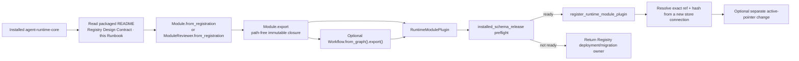

# Agent Runtime Registration Runbook

本 Runbook 面向把已批准 Module 或 Workflow 接入 Agent Runtime 的宿主开发者。它随
`agent-runtime-core` 分发，说明如何使用当前 package 的 public API 完成 source loading、release
compilation、persistent registration、exact resolution 和 active selection。

Runtime Design Contract 定义稳定语义，public Python API 定义当前可执行接口。本 Runbook 不创造新的
release 类型、权限规则或持久化协议；当文字与 public API 不一致时，停止 registration 并报告 package
drift。

接口定义见从源码自动生成的 [Reviewer API reference](agent_runtime_reviewer_api.md)。
先读其中的 ModuleReviewer 类说明，确定固定定义、独立执行参数和存储归属；再按本 Runbook
完成一次注册。注册完成后的每次审核交给固定执行绑定，只提交本次输入与执行 key。
当前单节点执行入口的参数、授权依赖、重放限制和失败处理也在该接口参考中。
测试用途不要求复制 Reviewer；切换 Profile 是否需要新的 Module，取决于 Module 内容是否改变及
兼容声明是否满足，具体规则以类说明和现有 Registry 合同为准。

## 1. 开始前确认

调用方必须已经拥有：

- 已批准的 Module 或 Workflow meaning；
- 精确的 Skill、Module registration、prompt、input/output schemas 和 owner contract；
- Module 所需的 Behavior、Evaluation、Retry Policy releases；
- 需要执行时使用的 exact Execution Profile release；
- 明确提供的 Runtime Release Store；
- PostgreSQL store 使用的 host-supplied DSN 和 schema name。

Registration 不负责创作这些输入，也不解析 credential。它不会调用 provider、执行 Reviewer、设置产品
权限或写入业务数据库。

## 2. Registration Flow



## 3. 读取随包文档与 public API

从当前 Python environment 解析真实安装来源：

```python
from importlib.metadata import version
from importlib.resources import files
import agent_runtime

runtime_version = version("agent-runtime-core")
runtime_origin = agent_runtime.__file__
runtime_readme = files("agent_runtime").joinpath("README.md")
registration_runbook = files("agent_runtime.docs").joinpath(
    "agent_runtime_registration_runbook.md"
)
registry_design = files("agent_runtime.design_contract").joinpath(
    "agent_runtime_01_module_contract_and_assembly.md"
)
```

Registration 只使用公开导出：

```python
from agent_runtime import (
    Module,
    ModuleReviewer,
    ReleaseSubjectKind,
    RuntimeModulePlugin,
    RuntimeReleaseBundle,
    Workflow,
    register_runtime_module_plugin,
)
from agent_runtime.registry import PostgresRuntimeReleaseStore
```

缺少所需 public symbol、随包文档或安装来源时停止。不要导入 private module、已删除 symbol 或宿主保存的
compatibility facade。

Editable install 需要额外记录 source root、exact commit 和 Runtime package source 的工作树状态。相同
package version 不足以证明相同 code identity。

## 4. 加载并编译 Module

Reviewer 使用当前公开 loader：

```python
reviewer = ModuleReviewer.from_registration(
    project_root,
    skill_id=skill_id,
    module_id=module_id,
)
```

其他 role 使用其已实现的 `Module` subclass。当前 loader 只读取调用方明确提供的 project root 下的固定
authoring closure：

```text
.claude/skills/<skill_id>/runtime_modules/<module_id>/
├── module_registration.json
├── prompt.md
└── schemas/
    ├── input.schema.json
    └── output.schema.json
```

调用 `.export(...)` 时显式提供 Module version，以及 exact Behavior、Evaluation、Retry Policy 和可选
Execution Profile releases。返回的 `ModuleExport` 包含 path-free Module origin closure；source path 不进入
release identity，也不参与 production resolution。

Module release 与 Execution Profile 分开。Profile 或 provider 变化通过新的 Profile 与 Variant Policy
release 表达，不要求重写未变化的 Module。

## 5. 可选 Workflow assembly

Workflow graph 只引用 exact Module refs/hashes：

```python
workflow = Workflow.from_graph(
    workflow_candidate,
    module_exports=module_exports,
).export()
```

`module_exports` 必须与 graph 中的 Module closure 完全相等。缺少、额外或 hash 不一致都会在 Registry
mutation 前失败。

## 6. 形成 RuntimeModulePlugin

使用 `ModuleExport.origin_bundle` 或 `WorkflowExport.origin_bundle` 取得 target-independent closure，再把
需要的 Execution Profile 与 Execution Variant Policy releases 合并进一个 `RuntimeReleaseBundle`。
同一 ref 只能对应同一内容；不得手工改变 compiler 返回的 Prompt、Schema、Policy、Module 或 Workflow
records。

```python
plugin = RuntimeModulePlugin(
    plugin_id=plugin_id,
    plugin_version=plugin_version,
    release_bundle=release_bundle,
)
plugin.validate()
```

In-memory `RuntimeReleaseRegistry` 只用于 isolated conformance。只有目标 `PostgresRuntimeReleaseStore`
成功写入并从新连接 round-trip，才能形成 persistent registration evidence。

## 7. PostgreSQL schema preflight

调用方提供 DSN；Runtime 不读取 Infisical、环境文件或其他 credential source：

```python
store = PostgresRuntimeReleaseStore.from_dsn(
    database_url,
    schema=runtime_schema,
)
installation = store.installed_schema_release()
```

只有 `installation.state == "ready"`，且 schema release 与 structure hash 均受当前 Runtime 支持时，才进入
registration。`unknown`、`installing`、结构漂移或不受支持时停止；保留实际安装状态与 Runtime 返回的
异常信息，交给 schema 安装或迁移负责人。

首次安装干净 schema 是独立管理员操作：

```python
store.create_schema(installed_at_utc=installed_at_utc)
```

已有 schema 的升级使用已审核的 `RegistrySchemaMigrationPlan`，再调用 `migrate_schema(...)` 或
`resume_schema_migration(...)`。Registration 不能把 schema installation 或 migration 当成 fallback；未经
明确 DDL 授权时只返回 Registry deployment/migration owner。

## 8. Register、resolve 与 active pointer

Persistent registration 只调用 public sink：

```python
result = register_runtime_module_plugin(store, plugin)
```

Registration 事务性写入整个 dependency-closed bundle。任一 dependency、schema 或 ref/hash conflict
失败时不产生部分结果。相同 exact bundle replay 返回等价 registration result；相同 ref 对应不同内容时
永久冲突。

注册后，使用同一 PostgreSQL schema 的新 store connection 按 exact ref/hash 解析 Module 或 Workflow，
并与 export 比较。Production resolution 不再读取 authoring source。

设置 active pointer 是独立操作：

```python
pointer = store.set_active_release(
    ReleaseSubjectKind.MODULE,
    module_id,
    module_release_ref,
    module_release_sha256,
)
```

清除 pointer 必须携带 expected current ref/hash。Registration 不自动 activation；pointer 变化也不修改
任何 immutable release。

## 9. 完成检查

一次 persistent registration 至少验证：

1. package version、import origin、随包文档与所需 public API 均可解析；
2. Module source closure 完整，owner、prompt 和 schemas 均绑定 exact content；
3. Policy、Profile、Module 与 Workflow dependency refs/hashes 闭合；
4. PostgreSQL schema preflight 为 `ready`；
5. registration、identical replay 和 conflicting-ref refusal 均符合原生结果；
6. 新连接能够按 exact ref/hash 解析已注册 release；
7. active pointer 只有在单独请求后才改变；
8. registration 后删除或改变 authoring source 不会改变已注册 release；
9. generated inspection 与持久 store 的 exact records 一致；
10. 没有 provider invocation、业务数据库写入或 Runtime core 对宿主包的 import。

只报告实际运行过的验证。没有 PostgreSQL binding 时可以形成 `conformance_only`，不能把它表述为
persistent registration。
