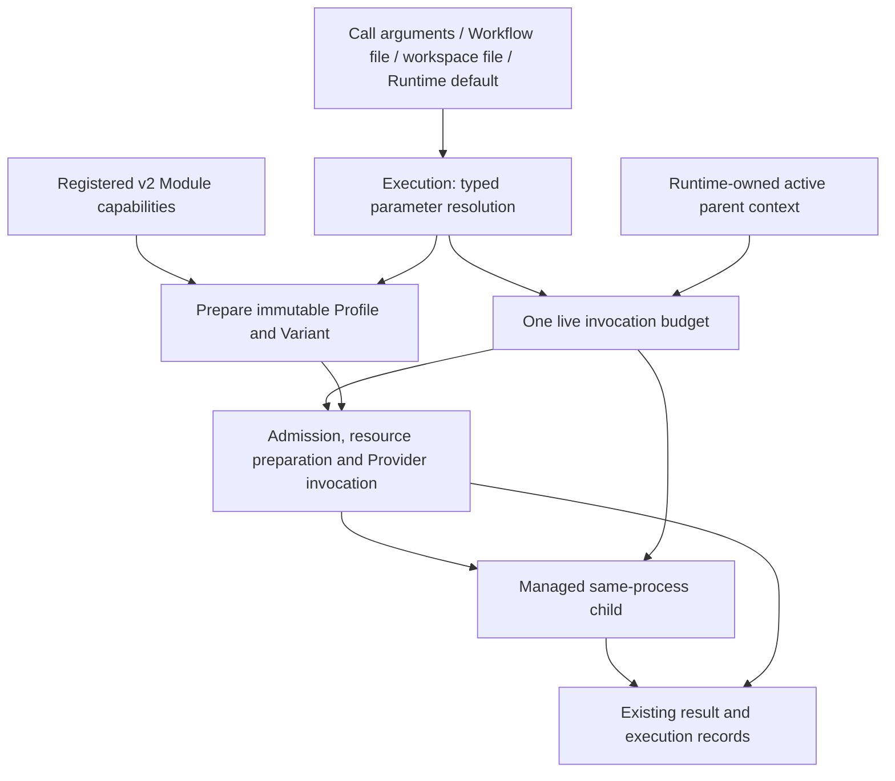

# Runtime execution parameters and bounded synchronous runs

## 1. Outcome, authority and delivery boundary

A caller can give one synchronous Runtime invocation a 1200-second default work budget or an explicit 3600-second budget through the existing four parameter sources. Managed child work and retries cannot extend the enclosing deadline. Selecting a longer run does not require editing Python, changing a Reviewer prompt, or registering a differently timed Reviewer for every invocation.

The user accepted this parameter direction and requested a complete CodeDesignBasis using engineering-code-design's schema method. This document is the engineering plan submitted for independent plan review. It authorizes no implementation by itself. The initial plan and owner Designs have passed independent review, and budget implementation is underway under that approval. This revision reviews an additional process-cleanup dependency before it is adopted; it does not retrospectively approve the existing implementation candidate. Installed-package changes and definition adoption remain later delivery steps. TP business code, its Charter and old host assembly are excluded.

The Runtime owner is responsible for the complete behavior. Its existing Registry, Execution, Invocation and record boundaries carry the change. Portable owns only shared argument forwarding and object-result validation; AB supplies configuration and consumes the public package. No host parameter resolver, executor, budget database or new review schema is introduced.

Baseline Runtime source is d3efbf908a74222ffd00a0b486307c3743c1352a. Portable forwarding uses the reviewed 389b4044504b5ec8c0066a37d3bbb680f83e8cff source. Runtime Design 00 owns responsibilities; Design 01 owns immutable definitions; Design 08 owns parameters, Profile and Adapter enforcement. The accepted user requirement deliberately changes their current placement of timeout inside immutable Module capability requirements. Before implementation admission, update these affected owner passages and their generated package copies through the existing Design authoring/review process. This prerequisite is explicit; this engineering review does not claim those Design revisions already passed.

Timestamp Semantics applies to local elapsed-time measurement: monotonic readings are process-local, never persisted as UTC timestamps. Identifier and Reference Semantics applies to new encoding/version discrimination: old release payloads and hashes keep their original meaning. Their portable sources are review context only and are not copied into Runtime.

## 2. Current behavior and the concrete defect

The current four-layer resolver accepts only transport_kind, model_id and reasoning_profile. The Test Run CLI and API expose no timeout override. ModuleReviewer embeds timeout_seconds=1200 and max_attempts=3 in ModuleExecutionRequirements. The shared assert_profile compares timeout exactly, so changing only a command-line parser would still fail in Registry, binding, Invocation or kernel validation.

The Provider helper starts a per-process deadline after Popen. Version/help checks, resource preparation and cleanup are not one enclosing timed operation. A synchronous child callback consumes parent Provider waiting time. The bundled child example passes cancellation and session-closed signals but not remaining time. Workflow drive limits dispatch count, not total elapsed time. There is no universal outer 1200-second Workflow limit.

Relevant code: execution/execution_parameter_resolution.py; execution/execution_local_invocation.py; contracts/registry_release_definition.py; registry/registry_module_authoring.py; registry/registry_release_registration.py; execution/execution_self_test_binding.py; execution/execution_workflow_evaluation.py; testing/conformance_local_test_run.py; testing/conformance_agent_execution.py; invocation/invocation_process_execution.py and the Claude/Codex invocation implementations.

## 3. Target flow and supported entry points



The new public parameter is run_timeout_seconds and the CLI spelling is --run-timeout-seconds. No second alias or per-Reviewer wrapper is required. The parameter applies to run_local_workflow_test in both local-definition and read-only PG-definition modes, and to run_agent_example. The latter shares one budget across all drive calls, nodes, parallel branches, managed children and test fixture wait/resume actions within that API invocation.

A trusted Python caller can supply parent_run only as a live Runtime-issued context from its currently active managed callback. It is not a CLI option, JSON field or task-input field. A root call omits it. The existing callback example passes this context explicitly; no ambient global/context-variable inheritance is assumed. An independently submitted task, arbitrary Shell child, remote worker or cross-process Runtime does not automatically inherit it.

Exact-Profile low-level APIs (run_module, run_workflow_module, run_registered_workflow_module) keep their explicit per-Attempt contract. A high-level call propagates its live budget when it uses the same kernel underneath; callers using those lower-level APIs directly do not acquire an undocumented total-run default. This batch does not change durable/Temporal Workflow lifetimes, persisted WAIT time or recovery across API invocations.

The budget starts at high-level API entry using the local monotonic clock. Arguments and definition resolution determine its configured duration; elapsed preparation time is then charged against that original start. If preparation already consumed the budget, no Provider starts. Validation and storage errors retain their own causes. This is a work deadline, not a hard-real-time guarantee for the entire Python function: non-interruptible local I/O and bounded teardown may complete after it. Runtime-owned subprocess preflights and newly dispatched work are bounded by remaining time; no new task work is admitted after expiry.

## 4. Parameter and record schema decisions

All parameter selection and type validation remain in execution_parameter_resolution.py. Use one closed per-field specification there to supply allowed names and validators, rather than keeping separate string-only and integer-only lists in hosts. Existing model validation and transport consistency checks remain. Unknown or invalid values fail; they never silently fall through.

| Field / containing object | Unique question | Values and default | Producer | Consumer and branch | Verification |
| --- | --- | --- | --- | --- | --- |
| Parameter file schema_version | Which parameter-file contract is this? | Existing runtime_execution_parameters_v1 accepts only its three strings. New runtime_execution_parameters_v2 accepts those strings plus run_timeout_seconds. Writers/examples use v2; v1 remains readable unchanged | Operator / shipped examples | Same resolver: exact known shape, reject unknown version or extra key | Both formats, old format with new key rejected, duplicates rejected |
| transport_kind | Which transport is selected? | Existing claude_cli/codex_cli; omission resolves lower layers | Call, Workflow file, workspace file, default | Existing Profile/Adapter mapping; no fallback | Existing precedence and mismatch tests |
| model_id | Which exact model is selected? | Nonempty supported model ID; Codex has no implicit model | Same four layers | Existing model capability admission | Identity and unsupported-model cases |
| reasoning_profile | Which effort is selected? | Existing Adapter-supported values | Same four layers | Existing effort mapping | Allowed/denied values and source |
| run_timeout_seconds | How much task-work time may this synchronous invocation consume? | Exact integer 1..86400; default 1200 for the named high-level APIs. Explicit 3600 selects one hour. CLI omission/Python None means fall through; JSON null, bool, float, zero, negative and overflow fail | Same four layers | Resolve once; create live deadline from API-entry monotonic start; retain source in execution_parameter_sources | All precedence/type cases; no config writes; one call's override does not affect the next |
| Module requirements schema_version | Is timeout a frozen capability in this stored definition? | New module_execution_requirements_v2 is explicit and omits timeout_seconds. The existing untagged shape is historical v1 and includes its original timeout | Registry compiler; decoder preserves old data | New authoring emits only v2. Historical v1 decodes/serializes exactly; new managed execution requires v2 | Closed shapes; old bytes/hash roundtrip; malformed mixed shape rejected |
| Module requirements capability fields | Which execution capabilities are required? | Existing context_isolation, execution_mode, semantic_input_delivery_mode, attempt_workspace_policy, tool_policy, gateway_access_reasons, network_policy, output_constraint_mode | Module owner / ModuleReviewer defaults | Shared capability validation and assert_profile keep exact equality | A time/model override cannot enable tools, network or alter result format |
| Module requirements max_attempts | How many attempts does the existing Retry Policy allow? | Existing 1..100, Reviewer default 3, includes the first | Existing definition/Retry Policy | Existing scheduling and admission; not made configurable in this batch; actual retries also consume the run budget | Existing count behavior plus retry cannot reset run deadline |
| ExecutionProfileRelease.timeout_seconds | What is the nominal maximum for a Provider Attempt under this selected execution? | Existing integer 1..86400 and existing field meaning. For v2 high-level preparation use resolved run_timeout_seconds, not the old Reviewer constant and not a changing clock reading | Execution preparation | Compile once with Profile/Variant hashes; actual invocation additionally obeys the live remaining budget | 1200 and 3600 produce different Profiles/Variants, unchanged Module hash; registry and all binding checks accept valid v2 capabilities |
| Live run context | Which deadline and cancellation constrain this managed work? | Runtime-issued in-memory object: entry clock reading, resolved duration, effective deadline, owning process, active/closed state, optional active parent context and existing parent identities. No serialization or user-supplied deadline string | Execution | Child deadline=min(child entry+child duration, parent deadline); reject inactive/cross-process/foreign parent; close invalidates future child admission | Deadline arithmetic, parent expiry, scope mismatch, parent close, parallel children |
| execution_budget.requested_timeout_seconds | What duration did this call resolve before parent constraints? | Integer 1..86400 | Execution resolver | Returned record/Inspection explanation; its source remains the existing execution_parameter_sources entry | Record equals resolved value |
| execution_budget.effective_timeout_seconds | How much total allowance was available at this call's start under its parent? | Finite JSON number in seconds (not bool), 0..requested; fractional values retain the local floating-point measurement without manual rounding. Zero means no work can start | Execution budget creation | Record and admission; not another parameter | Parent shorter/longer/equal; zero remaining |
| execution_budget.elapsed_seconds | How much local elapsed time was observed when the result was collected? | Finite JSON number in seconds (not bool), >=0; retain fractional measurement without manual rounding; may exceed allowance due to bounded cleanup | Execution monotonic clock | Record explains elapsed time without claiming a strict API-return deadline | Includes preparation and cleanup; never a persisted monotonic instant |
| execution_budget.limiting_scope | Whose work deadline is effective? | local or parent; exact equal deadlines choose parent so ancestor expiry remains attributable | Execution budget creation | Timeout explanation and existing failure handling | Both values and tie case |
| execution_budget.parent_attempt_id | Which managed parent Attempt initiated this child? | Existing accurate parent Attempt ID or null for root; no newly invented identity | Validated live parent binding | Existing nested lineage/Inspection | Matches active callback request; unrelated ID rejected |
| Command declaration timeout_seconds | How long may this one declared command run? | Existing positive integer; definition admission still validates command shape and nominal Profile compatibility | Caller resources | Actual command deadline=min(command start+declared timeout, run deadline); no rounding upward that grants extra work | Command wins, run wins, late launch denied, output retained |

Example v2 parameter file:

```json
{"schema_version":"runtime_execution_parameters_v2","transport_kind":"codex_cli","model_id":"gpt-6-astra","reasoning_profile":"xhigh","run_timeout_seconds":3600}
```

New result metadata uses standard JSON finite numbers with allow_nan=False. Enforcement consumes the live monotonic deadline, never a serialized or display-rounded duration. Old records lacking execution_budget remain unchanged; reading them does not synthesize missing budget observations.

The general parameter inventory also examined max_parallel_dispatches (coordinator default 16), max_dispatches (drive-call default 100), max_output_bytes (process-capture default 16777216), CLI paths, materials and read-only dependencies. Their current owning interfaces remain unchanged in this batch. Generation tokens, temperature, context-window selection and money limits are not advertised as supported: each requires a real Adapter mapping and enforcement contract before becoming a common parameter. Observed token usage is not a configurable token budget.

## 5. Immutable definitions and one-time adoption

ModuleExecutionRequirements supports exactly two stored encodings inside the existing ModuleRelease serializer. Its current untagged dictionary is v1; the new dictionary contains schema_version=module_execution_requirements_v2 and all existing requirement fields except timeout_seconds. max_attempts remains because Retry Policy ownership is unchanged. The in-memory implementation may use an encoding discriminator and optional legacy timeout, but v2 serialization must omit that key entirely and v1 serialization must not add a marker. No generic permissive dict decoder is allowed.

Separate capability validation from concrete Profile timeout validation in _validate_execution_capabilities and its callers. New authoring/default construction emits v2; explicit old timeout constructor usage must receive an actionable error, not silently be discarded. v1 remains available through historical decoding. ModuleRelease._payload/from_dict, get_execution_requirements and the earlier ReviewerDefaults decoder preserve each old shape and its original hash.

The shared assert_profile handles its actual version centrally. Historical v1 retains exact timeout checking when verifying old records. v2 compares the capability fields and separately validates Profile timeout bounds. Registry Variant validation, self-test binding, Invocation context preparation and kernel validation continue using this shared method; none adds an ad hoc local exception.

Before any new Provider Attempt, execution admission rejects a selected v1 Module with a ValueError naming its exact release and requiring re-registration from its approved source. Completed historical executions remain readable/replayable without a Provider call. A historical replay must be resolved before the new-Attempt version gate. No v1 executor fallback or silent upgrade is introduced. The public compatibility note must state this intentional new-execution boundary.

Adoption uses the existing Runtime register_reviewer/register APIs with a new explicit version for each affected definition. For the seven unchanged Portable sources, an operator may use portable_3836d30d_budget_v2 after checking that the version is unused; this is a registration label, not a second schema authority. A conflicting existing ref is an error. Compile/current-source comparison and exact readback prove adoption. Historical local or PG definitions are not edited or deleted. Ordinary calls never perform registration. Implementation validation uses isolated local roots and, for the already supported read-only PG-definition entry, an explicitly configured isolated PostgreSQL test namespace. Test fixture setup/teardown may register synthetic definitions in that namespace through existing test utilities; the Test Run under test must make zero PostgreSQL writes. Production registry adoption and real user/database content are excluded.

Once adopted, 1200 and 3600 invocations use the same Module/Workflow definitions and differ only in their current Profile/Variant and execution record. This removes the requirement to register a new Reviewer for each budget choice.

## 6. Budget enforcement through existing owners

Add one small execution_run_budget.py module under Execution to implement pure deadline arithmetic and the live context lifecycle. It owns no Registry or external service. A contract-level read-only protocol may be added to the existing invocation_adapter_definition.py for Invocation to consume; Invocation must not import Execution implementation. Integrate the new file into the existing source responsibility map and package architecture checks.

The high-level entries capture entry_monotonic, resolve parameters, load/validate definitions and inputs, then create the budget against that original start. After each preparation stage, check expiry before the next operation. Local files/PG definition resolution do not become writable. If a blocking host/storage operation cannot be interrupted, finish its bounded/native operation and then reject work after expiry; do not claim the API itself has hard-real-time termination. Provider version/help preflights receive min(their existing bound, remaining time) so they cannot reset the budget.

ModuleSelfTestResources and WorkflowSelfTestResources retain the live context with their existing closure/binding checks. _AttemptExecutionHost exposes remaining-budget/expiry queries only for its bound request. AuthorizedAgentExecutionRequest's immutable authorization payload receives no Python object and no model-supplied budget. The live context travels through trusted resources, just as current cancellation does. High-level argument parent_run accepts only the Runtime-issued active context for a managed parent in this process; the example callback binds it to session.request.attempt_id before starting a child.

Profile.timeout_seconds stays an immutable nominal Attempt cap. Invocation and the process helper consume that cap plus the live deadline separately. Use the precise monotonic deadline in the process loop rather than repeatedly rounding remaining seconds upward or mutating a Profile hash mid-execution. The launch guard checks expiry immediately before Popen. At dispatch and final result acceptance, Execution checks the same live budget; a late Provider result cannot be accepted as completed.

User cancellation, resource closure and timeout remain distinct observed reasons. Expiry must map to the existing timeout failure class, not an authorization failure merely because a resource guard noticed it. Before an Attempt exists, raise TimeoutError with the work-budget explanation and no fabricated execution ID. After an Attempt starts, preserve its raw output, actual timeout result and cleanup facts through the current record path. Graph completion uses its existing failed outcome/stop representation with timeout detail; do not add another workflow state machine.

A Runtime-issued parent context constrains children even if they ask for more time. Parent/child timeouts can only shorten the active deadline. A child that finishes early does not stop the parent. A parent that expires closes the callback/child resources through the existing cancellation chain, and the active child checks that deadline independently rather than waiting only for session close. A parent and parallel children share one wall-clock deadline, not additive time counters. No new concurrency semaphore is introduced.

The current process helper's cleanup and tool-session draining keep their existing ownership. Reuse psutil (declared runtime dependency >=7.2.2,<8) for descendant Process objects, creation identity, PID-reuse checks before signals, and bounded wait_procs; remove the temporary handwritten ps/lstart parser rather than maintaining both paths. The installed 7.2.2 implementation and official API describe identity checks and the limitation that ancestry can be lost when an intermediate process disappears (https://psutil.io/7.2/#psutil.Process.children; https://psutil.io/7.2/#psutil.Process.send_signal). Native creation identity is stronger than parsing seconds from formatted ps output; it is not a claim of an atomic OS process handle on every platform.

Track only descendants observed from this invocation's known process objects during its existing wait loop. Retain their Process objects across reparenting; query no unrelated command lines or environments, and do not select processes by command-name matching. The existing known Provider group must still be stopped and reaped if descendant discovery is denied or fails; retain that failure instead of reporting complete cleanup. A signal permission failure, survivors after the cleanup bound, or loss of required ownership evidence is a cleanup failure. Record timeout and cleanup facts distinctly. Discovery cannot guarantee unseen short-lived ancestry or arbitrary detached daemon containment; documentation and evidence must not advertise that stronger guarantee. Actual parent/child Runtime calls still share their live budget regardless of OS process sampling.

 Review changes to every newly budgeted preflight, Provider process, declared command and managed child. Ensure failed cleanup is reported and no child is abandoned while the outer result claims complete. No automatic retry, model fallback, resubmission or extension occurs on timeout.

## 7. Exact public interfaces and forwarding

Extend resolve_execution_parameters, prepare_local_workflow_module, prepare_local_workflow and their internal source-returning preparation functions with optional run_timeout_seconds. Preparation alone resolves/validates a requested budget and compiles a Profile; it does not start a running clock. A high-level run owns the actual entry clock and live context.

Extend run_local_workflow_test and run_agent_example with run_timeout_seconds=None and parent_run=None. Keep their existing definition-source mutual exclusions. Add --run-timeout-seconds to the common Test Run parser, forwarding it for registered and example targets. Publish parent_run only on the trusted Python path and its callback integration, never in resource JSON. Add the existing record metadata fields above without modifying the business output schema.

Portable's shared runtime_review.py gains one --run-timeout-seconds argument and one runtime_kwargs mapping to run_timeout_seconds. All seven object review tools consume that same definition. Their frozen semantic inputs, validation rules and Reviewer prompts are unchanged. No separate per-Reviewer parsing, timeout enforcement or callback is added. AB's thin entry requires no custom code change; acceptance calls it after installing the revised shared components in an isolated adoption environment.

## 8. File-level implementation map

| Owner | Existing or bounded new locations | Required change |
| --- | --- | --- |
| Registry/contracts | contracts/registry_release_definition.py; registry/registry_release_compilation.py; registry/registry_module_authoring.py; registry/registry_release_registration.py | v2 capability encoding, exact historical decoding, shared Profile check, new authoring defaults and new-execution admission |
| Execution | execution/execution_parameter_resolution.py; execution/execution_local_invocation.py; execution/execution_run_budget.py (new); execution/execution_module_invocation.py | Typed four-layer timeout, stable Profile/Variant selection, one budget, expiry admission and terminal checks |
| Live binding/graph | execution/execution_self_test_binding.py; execution/execution_workflow_evaluation.py; contracts/invocation_adapter_definition.py | Bind/read live budget through existing resources; no authorization-payload mutation |
| Invocation | invocation/invocation_process_execution.py; invocation/invocation_claude_cli_execution.py; invocation/invocation_codex_module_invocation.py; invocation/invocation_local_command_execution.py; invocation/invocation_local_resource_preparation.py | Remaining-time preflights, launch/process/command deadline and accurate timeout cause |
| Public Test Run/examples | testing/conformance_local_test_run.py; testing/conformance_agent_execution.py; testing/conformance_agent_examples.py; public facade exports where necessary | Public arguments, CLI, managed child context, new-format sample definitions and current result metadata |
| Package dependency | pyproject.toml and package boundary tests | Declare psutil >=7.2.2,<8 and verify it is installed by the distribution; no manual dependency search or host vendoring |
| Source/Docs | Runtime owner Design 00/01/08; README and registration/API runbooks; src/agent_runtime/skills/agent-runtime-test-run/SKILL.md; generated Design/API bundle and existing architecture source map | State exact budget and adoption semantics; update the Test Run Skill's explicit v1/three-key restriction to the supported v1/v2 contract and new option; remove old immutable-timeout claims; generate copies with existing tools |
| Portable shared entry | 09_soul/governance/t0/validation/runtime_review.py and its existing tests, on the authorized Portable source worktree | One argument mapping; same current seven consumers |

No AB provider code, TP project implementation, database schema, production authorization service or multi-host time protocol is added. Runtime changes ship from its own repository without Portable T0. Portable changes ship from its own source and installation mechanism.

## 9. Implementation order and checkpoints

1. Revise the limited Runtime owner-contract passages for the accepted parameter/budget meaning and obtain their Design review. This is the authority prerequisite to implementing the new definition meaning; it does not require rebuilding the surrounding Runtime architecture.
2. Implement typed parameter resolution and v2 definition encoding. Complete deterministic schema, capability and historical-identity tests. New source registration occurs only in isolated test roots.
3. Implement the live budget in the existing execution/binding paths, then Provider/command enforcement and managed child propagation. Preserve the existing exact Profile/Variant and actual failure-record boundary.
4. Add shared CLI/API forwarding and records/docs. Assign a new package version rather than reusing 0.2.0.dev7; finish pyproject.toml and CHANGELOG.md, including the definition adoption boundary, before final source freezing. Update the packaged Test Run Skill through the-skill-authoring and obtain its independent skill_candidate_reviewer result before adopting its new instructions; its source currently explicitly permits only v1 and three keys, so this update is required. Update generated API/Design copies and the responsibility map with existing tools; run their checks. Apply the same one-option mapping in Portable.
5. Freeze the final source commits in the respective repositories after all version, generated and documentation changes. Build the final wheel from that exact Runtime source and identify its hash. Run deterministic, real_run and packaging/install gates separately against these final sources and that artifact, then obtain independent implementation review bound to the same exact commits and approved plan. Any source change, including a version or generated-document change, produces a new commit and requires applicable checks and independent implementation review again. A passed plan is not a deployed package.
6. Publish the exact reviewed source commits and the wheel verified in step 5; install that same artifact in explicitly selected environments under the existing delivery authorization. Do not edit version files or rebuild a different unverified artifact after review; any required source or artifact change returns to step 5. One-time local registration adopts v2. Database content, credentials, local binding exports and run ledgers remain outside publication. Production PG registration is not part of this plan.

Recover by selecting the prior Git/package version through the normal delivery mechanism. Keep immutable old records readable; do not create backup directories, parallel executors or a separate local tracking store. An older Runtime can only execute definitions it understands, so a package rollback must explicitly select its old definition version rather than overwriting new ones.

## 10. Verification and acceptance

New or behavior-modified tests use exactly one marker, deterministic or real_run, registered in each repository's existing pytest configuration. Legacy fake_run tests are not counted as real evidence; no new FakeCLI substitutes for a Provider, Runtime execution or database path. Existing unrelated failures are reported separately and do not expand this change into TP or AB cleanup.

| Requirement | Meaningful proof |
| --- | --- |
| Four-layer integer contract | Pure tests for call/Workflow/workspace/default; v1/v2 files; omitted versus null; bool/float/zero/negative/overflow/unknown/duplicate keys; model/transport mismatch remains rejected; no files changed by a call override |
| Identity and capability boundaries | Original stored v1/ReviewerDefaults fixture bytes and hashes roundtrip; v2 exact fields; tamper rejection; changing 1200 to3600 changes Profile/Variant but not Module; all shared assert_profile consumers still reject changed tools/network/output; new execution of old definition reports required adoption |
| Shared deadline arithmetic | Pure injected clock values prove parent-shorter, child-shorter, equal, exhausted, fractional remaining, parallel children and retry accounting; no wall-clock/monotonic mixing or serialized monotonic values |
| Owned process cleanup | Real local/Provider processes prove separate-group background cleanup after timeout and normal completion. Inject discovery-denied failure while an actual known process runs; it must still be killed/reaped and incomplete cleanup reported. Verify only observed descendants are selected, use library identity checks rather than rounded ps timestamps, and keep the unobserved-daemon limit explicit |
| Actual timeout enforcement | real_run of actual short-lived local processes and declared commands proves run-limited termination, late launch rejection, correct cause and retained output; no fake executable |
| Actual model/entry behavior | Real Codex CLI run through the public Test Run and one Portable/AB thin review entry verifies requested3600 in source/Profile/record while allowing the task to finish early. A separate short-budget real Provider run proves timeout; no hour-long wait is required |
| Read-only PostgreSQL definition mode | With AGENT_RUNTIME_TEST_DATABASE_URL pointing only to an isolated test database, use a v2 synthetic Module/Workflow registered by test setup. Run the actual Test Run entry with exact ref/hash and 3600 through a read-only PG role/connection; verify the loaded identity and effective parameter. Read-only database enforcement must allow the run and reject a direct control write from the same role, proving no silent writes. Keep setup distinct from execution; absent PG configuration means this mode is unverified, never replaced by local or fake store evidence |
| Actual managed nesting | Use the existing supported callback-enabled Provider path: real parent/child invocations with parent shorter than child, child shorter than parent and parent cancellation. Assert child process ends, parent cause is accurate and both records remain available. This does not promise Codex callback support that the current Adapter does not provide |
| Preparation and teardown | Charge preparation against the entry clock; expiry before Provider creates no fake Attempt. Bound actual subprocess preflights. Cancellation/timeout must not discard logs or report abandoned child work as completed |
| Surface parity | Runtime CLI/Python and Portable's seven parsers map the same integer; object schemas/prompt hashes stay unchanged; normal Business verdict interpretation remains with each owning validator |
| Packaging | Existing package/API/Design generation, architecture and public-repository checks pass; clean wheel import and actual entry help exposes the option; no PG/private execution material enters published commits |

Primary deterministic targets include tests/test_agent_runtime_execution_parameters.py, test_agent_runtime_local_model_preparation.py, test_agent_runtime_registry_candidate_compilation.py and new focused test_agent_runtime_run_budget.py. Existing local-resource, command, process, Codex workspace and managed-example tests supply the applicable actual paths. Use pytest collection first to confirm exact existing names and marker selection; test authoring changes the relevant files rather than introducing another test-runner layer.

Run deterministic selections with python -B -m pytest -q -p no:cacheprovider <affected files> -m deterministic. PostgreSQL integration setup uses only its dedicated test database/schema and synthetic fixtures; no production connection, DSN value or database export is committed or sent as review material. Provider gates use the same installed Runtime interpreter and AGENT_RUNTIME_REAL_RUN=1 (plus any existing case-specific environment gate), selecting real_run. Record the actual Provider/CLI, source/package version, selected definitions, inputs and validators. An unavailable Provider or credential means that gate is unverified, not passed or silently substituted. Reuse the current AST/API generation checks and isolate temporary writes from subject files. The plan review itself requires no execution of future tests.

## 11. Complete-plan review binding

Use the existing engineering_change_reviewer_input_v6, review_purpose=code_design, the exact plan body/hash, required checks 1..9, the supplied owner context and this plan's acceptance requirements. No implementation commit is fabricated. Author self-check is generated by --check-only --self-check-template, completed with evidence from these sections, then validated by the existing tool. Independent plan review uses the registered engineering_change_reviewer through Runtime, model gpt-6-astra and effort xhigh. Review output must be schema-valid and bound to this exact input. Changes following findings require another exact-plan review.

This plan proposes one bounded execution capability. The separate independent results for authoring a plan, changing owner Designs, implementing code and installing it are not interchangeable. This plan revision seeks independent approval of the additional cleanup dependency and its verification within the same authorized budget outcome. Implementation review must consume this final plan, its passed review and the already passed owner Design revisions; a plan result does not replace that exact-code review.
