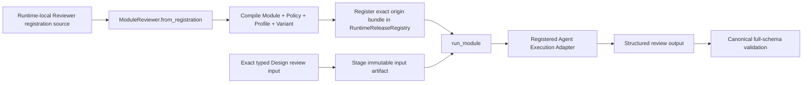

# Managed Design Reviewer Smoke — Code Design Basis

Status: approved implementation basis for this bounded test-only Slice; independent engineering review remains required.

## 1. Requested Result

证明 Runtime 可以从 `the-design-authoring` 的 registration source 载入
`design_contract_reviewer`，编译并注册 immutable Module、Policy、Execution Profile 与 Variant，随后通过
公开 `run_module()` 入口完成一次 tool-free、inline、native structured-output 的 Opus 5 xhigh 审查。

这条 smoke 只验证 Runtime managed execution path。它不把 Reviewer prompt 复制进测试，不建立第二套
registration，不修改 production Adapter，也不代替 Design review 本身。

## 2. Flow and Interface



Test-owned input:

- exact Runtime-local Reviewer source;
- exact candidate and declared context documents;
- fixed required check IDs from the registered input schema;
- Runtime authorization evidence for the exact model operation.

Test-owned output:

- one completed Runtime Attempt;
- one output artifact that passes the registered full output schema;
- a `passed` Design verdict for the exact live-review candidate;
- non-null live provider token usage when provider integration is enabled.

## 3. Code Boundary

Only `tests/test_agent_runtime_managed_design_reviewer.py` is implementation scope.

```yaml
package_id: agent_runtime_core
primary_module_id: test.agent_runtime_managed_design_reviewer
slice_id: agent_capability_managed_design_reviewer_smoke
included_surface:
  - tests/test_agent_runtime_managed_design_reviewer.py
changed_resource_ids:
  - runtime_managed_design_reviewer_smoke
public_interface_change: none
generated_projection_change: none
migration_guidance_refs: []
migration_log_ref: null
deferred_integration: []
external_dependency_roots:
  - existing Runtime public Python API
  - Runtime-local design_contract_reviewer registration source
  - Runtime-local Design review candidate/context documents declared by the test
  - installed claude_agent_sdk import dependency for test collection; provider credentials and network remain live-test only
  - optional Anthropic provider integration selected by the test environment
rollback_boundary:
  - remove the added smoke test; no production or persisted Runtime state changes
```

The test may use public Runtime contracts and existing in-memory stores. It must not:

- add or alter production Registry、Execution、Invocation or Adapter behavior;
- read a Reviewer from Trading Platform or an ambient sibling checkout;
- bypass `ModuleReviewer.from_registration` or `run_module()`;
- call Claude CLI directly;
- make provider access mandatory for the ordinary local suite.

The default smoke resolves only the exact candidate/context set declared in the test: DDM、Charter、Runtime T0、
Software Delivery、Runtime T1 and Runtime T2 01–10. Those documents are semantic test inputs, not additional change
subjects. Test collection imports the existing Claude SDK Adapter module and therefore requires the SDK package to be
installed; only the live branch requires provider credentials or network access.

## 4. Test Split

1. Static adapter test runs by default and proves registration、authorization、Runtime dispatch、artifact staging and
   full-schema validation deterministically.
2. Live provider test runs only when `RUN_PROVIDER_INTEGRATION=1` and proves the same registered Module through
   `ClaudeAgentSdkInlineModuleExecutor` with Opus 5 xhigh.
3. A provider verdict other than `passed` is a semantic review result, not a transport failure; the assertion prints
   the full registered output object so the candidate owner can adjudicate exact findings.

## 5. Failure and Recovery

- invalid registration、Schema or hash closure fails before provider invocation;
- missing authorization prevents the protected model operation;
- provider/auth/quota/timeout failure remains the Runtime Adapter failure;
- schema-invalid output fails canonical validation;
- valid `non_pass` remains a Reviewer verdict and requires a new candidate hash before rerun;
- rerun uses a fresh Attempt workspace and does not mutate Runtime releases or production state.

## 6. Acceptance Gates

- `git diff --check` on the exact test and this basis;
- default static smoke passes without provider access;
- live smoke completes through the registered Runtime Module and returns a schema-valid `passed` result;
- focused Runtime tests covering Module authoring、registration、authorization、prompt assembly and native structured
  output remain green;
- independent `engineering_change_reviewer` returns `ready_to_commit` for the exact test diff against this basis.
