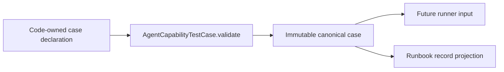

# Agent Capability Verification Slice 11A — Code Design Basis

Status: approved implementation basis for the bounded case-definition Slice.

## 1. Requested Result

把已准入 T2 §7 的 `AgentCapabilityTestCase` 固定为 Runtime-owned immutable Python definition，并从同一个
object 机械生成 operator runbook record。测试与 runbook 不得分别手写第二份 case meaning。

## 2. Flow and Interface



Input 是一个完整 case declaration；output 是验证后的 immutable case 与确定性 JSON-ready runbook record。
Slice 11A 不执行 command，也不产生 capability verdict。

## 3. Module Boundary

```yaml
package_id: agent_runtime_core
primary_module_id: testing.agent_capability_verification
slice_id: agent_capability_verification_11a_case_contract
included_surface:
  - src/agent_runtime/testing/agent_capability_verification.py
  - src/agent_runtime/testing/__init__.py
  - tests/test_agent_runtime_capability_verification.py
excluded_surface:
  - capability inventory rows
  - command execution and environment inspection
  - aggregate AgentCapabilityVerificationResult
  - canonical Example Workflow execution
  - provider, Gateway, database, durable-backend or attachment integration
public_interface:
  - AgentCapabilityEvidenceSourceKind
  - AgentCapabilityCommand
  - AgentCapabilityTestCase
  - render_agent_capability_runbook
state_and_persistence: none
deferred_integration:
  - slice_id: agent_capability_verification_11b_inventory
    gate: Slice 11A exact class/projection tests pass
  - slice_id: agent_capability_verification_11c_runner
    gate: admitted inventory resolves every required capability uniquely
  - slice_id: agent_capability_verification_11d_example_workflow
    gate: runner produces subject-bound case results
rollback_boundary:
  - remove the new testing module, its exports and tests; no persistent state exists
```

## 4. Case Contract

`AgentCapabilityTestCase` carries exactly the T2 §7 fields:

- `case_id`;
- `capability_ids`;
- `owning_design_refs`;
- `evidence_contract_refs`;
- `evidence_source_kind`;
- `subject_requirements`;
- `environment_prerequisites`;
- `command`;
- `expected_result`;
- `evidence_outputs`;
- `cleanup`;
- `failure_routing`;
- `rerun_boundary`.

`AgentCapabilityCommand` contains one stable `command_id`、non-empty argv 与 logical working-directory ref。它不
执行 shell，也不解析 credential。argv 拒绝 inline secret marker、absolute host path 与 home-relative path；
working directory 必须是 logical opaque ref。

Validation rejects invalid/duplicate identity、empty required closure、unsupported evidence kind、empty argv 和
incomplete result/cleanup/failure/rerun instructions before a runner sees the case. These are construction errors, not
the T2 runtime failure codes; Slice 11C owns conversion into a verification result.

## 5. Projection Rule

`as_runbook_record()` returns every field in one stable key order and preserves tuple order. The renderer:

- wraps the case records in the internal envelope
  `{"schema_version": "agent_capability_runbook_v1", "cases": [...]}`; the version constant is not a public export;
- accepts one or more validated cases;
- rejects duplicate `case_id` across the projection;
- orders cases by `case_id` so registration order cannot change bytes;
- renders prerequisites、command、expected result、evidence、cleanup、failure routing and rerun boundary from the
  exact object only;
- contains no current pass/fail state.

## 6. Acceptance Gates

- exact valid case validates and produces the expected JSON-ready record;
- invalid identity、duplicates、empty field groups and unsupported evidence kind fail closed;
- runbook output is byte-stable across input ordering;
- duplicate case IDs across one runbook fail closed;
- `agent_runtime.testing` exports only the four declared public symbols in addition to its existing surface;
- focused tests and `git diff --check` pass;
- independent `engineering_change_reviewer` returns `ready_to_commit` for the exact Slice diff.
