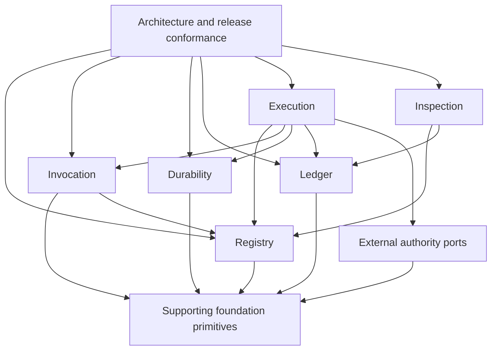
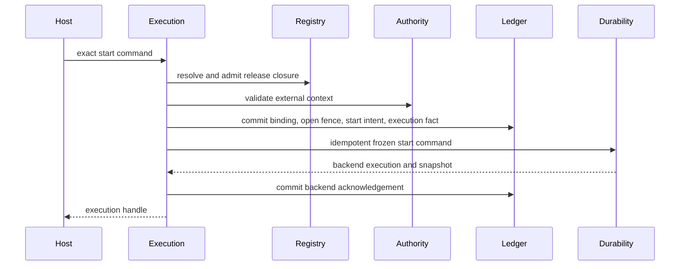

# Agent Runtime Code Architecture Audit and Target Design

Audit baseline: `e8366e7` on `codex/workflow_execution_services`, including the
current protected dirty worktree.

Audit status: Primary Agent proposal. This artifact is read-only evidence and a
target design. It does not authorize implementation edits.

Required reader gain: after reading this audit, a Runtime maintainer can see
which capabilities are implemented, which production paths are only declared,
which dependency directions violate the six-responsibility model, and which
code families must be kept, split, moved, or retired before implementation
work resumes.

## 1. Decision

The repository contains substantial working Registry, Invocation, Durability,
Ledger, and Inspection components. It does not yet contain one production
Execution service that assembles them into the public host lifecycle.

Implementation restructuring must therefore begin from an explicit target
Execution composition, not from directory cleanup. The first implementation
milestone is one end-to-end, crash-recoverable path:

1. accept one exact host-selected Workflow Execution;
2. validate Registry release and admission closure;
3. bind external authorization and input authority;
4. commit the Execution start in the canonical Ledger;
5. start or recover one durable cursor;
6. dispatch one Module Attempt through Invocation;
7. commit output bytes, Attempt facts, outcome, and backend acknowledgement in
   the required order; and
8. expose the resulting state through authorized Inspection.

Every retained class and adapter must support that path or be explicitly
classified as conformance tooling. Compatibility models, rejected backend
decisions, authoring-repository discovery, and host topology do not belong in
the Runtime core wheel.

## 2. Audit Boundary and Reproducible Evidence

The audit covers every Python file under `src/agent_runtime`, the 37 repository
test modules, package exports and entry points, the code-owned architecture
registration, the protected dirty lane, and the current test baseline.

| Evidence | Verified result |
| --- | --- |
| Runtime Python files | 75 files and 32,910 lines |
| Architecture dispositions | 61 target files, 9 structural files, 5 migration-debt files |
| Largest physical family | `contracts/`, 16 files and 11,877 lines |
| Source concentration | The ten largest files contain 44.3 percent of Runtime Python lines |
| Public facade | `agent_runtime.__all__` exports 120 names |
| Contracts facade | `agent_runtime.contracts.__all__` exports 111 names |
| Test source | 37 files and 337 syntactic test functions before parametrization |
| Reproduced full repository suite | 427 passed, 4 failed, 20 skipped using `../trading_platform/.venv/bin/python` |
| Architecture validation | 13 passed; current validation covers registration and repository closure, not import direction |
| Targeted audit validation | 134 passed across architecture, Host API, cutover, and public-adapter contract tests |
| Current downstream import census | 103 `trading_platform` source or test files contain 307 `agent_runtime` import sites |

The full test baseline was reproduced from the Runtime repository with:

```text
../trading_platform/.venv/bin/python -m pytest -q -rs
```

The reproduced result was `427 passed, 4 failed, 20 skipped`. One failure is a
canonical inline-name violation, two are stale generated Design Contract bundle
failures, and one is a count-based canonical-path assertion. The skipped tests
comprise four live Provider tests, fourteen real PostgreSQL tests, and two real
Temporal tests. The passing count therefore does not establish current live
Provider, PostgreSQL, or Temporal conformance.

The current code-owned responsibility counts are:

| Responsibility | Target-classified files |
| --- | ---: |
| Registry | 12 |
| Execution | 11 |
| Invocation | 10 |
| Durability | 9 |
| Ledger | 10 |
| Inspection | 9 |

The five explicit migration-debt files are:

- `contracts/execution_operation_definition.py`;
- `contracts/registry_workflow_definition.py`;
- `execution/execution_event_ingestion.py`;
- `execution/execution_operation_authorization.py`; and
- `registry/registry_workflow_registration.py`.

### 2.1 Evidence status and limitation

This report is a code-architecture proposal supported by repository inspection.
It is not yet a reproducible engineering verdict over an immutable subject. The
baseline names a commit and the current protected dirty worktree, but it does
not contain a frozen path manifest, hashes for modified and untracked files, a
dirty-diff hash, or one command-and-output ledger for every claimed check.

This distinction affects the decision that a reader may make. The findings are
sufficient to design the next architecture candidate. They are not sufficient
to attest that a later implementation is the same subject reviewed here. A
terminal pre-commit verdict requires a frozen review package containing the
exact subject manifest, content hashes, commands, raw outputs, and reviewer
identity. The separate Design System Review remains the authority for Design
Contract findings; this report does not duplicate that review.

## 3. Current Runtime Shape

### 3.1 Implemented components

The following components contain material executable behavior:

- immutable release validation, in-memory registration, admission transitions,
  exact retrieval, and PostgreSQL persistence;
- provider-neutral Module request and result contracts;
- Codex CLI and Claude Agent SDK invocation adapters;
- Attempt workspace preparation and process-local duplicate fencing;
- a provider-neutral durable cursor protocol and Temporal cursor adapter;
- a Workflow-driving coordinator with serial and bounded parallel dispatch;
- append-only Ledger records, in-memory validation, and PostgreSQL persistence;
- authorized live Inspection, offline review bundles, and HTML rendering; and
- deterministic conformance and architecture checks.

These are valuable implementation assets. The problem is their composition and
authority boundary, not their existence.

### 3.2 Missing product composition

`AgentRuntimeProductHostApi` is a Protocol only. No Runtime source implements
its start, status, cancellation, external-event, or reconciliation methods.

`WorkflowExecutionLedgerRecorder`, `DurableExecutionCoordinator`,
`WorkflowModuleLedgerRecorder`, and `run_workflow_module` are not assembled by
one Runtime-owned service. Their production use is demonstrated by isolated
tests and caller-supplied bridges, not by a shipped host-facing implementation.

The current wheel is therefore a component kit with several conformance paths.
It is not yet the independently operable Runtime described by the Charter.

### 3.3 Current responsibility dependency graph

AST inspection of runtime imports, excluding `TYPE_CHECKING` branches and
package initializers, finds bidirectional responsibility dependencies between:

- Registry and Invocation;
- Registry and Durability;
- Execution and Invocation;
- Execution and Ledger; and
- Invocation and Ledger.

The central examples are:

| Direction | Current edge |
| --- | --- |
| Registry to Invocation | `registry_release_compilation` imports `invocation_schema_projection` |
| Invocation to Registry | provider adapters and context preparation import the concrete in-memory Registry |
| Registry to Durability | graph projection returns types from `durability_topology_definition` |
| Durability to Registry | the coordinator and Temporal adapter retrieve releases and project Registry graphs |
| Execution to Ledger | Module execution imports a concrete Workflow Ledger recorder |
| Ledger to Execution | Ledger recorders import Execution request and result records |
| Invocation to Ledger | Invocation contracts import Ledger-owned observations |
| Ledger to Invocation | the Workflow Ledger recorder imports Invocation tool contracts |
| Inspection to Durability | release inventory imports the concrete Temporal descriptor |

The architecture registration assigns every target file one responsibility,
but it does not validate these import edges, cycles, or public exports. Passing
architecture registration is therefore necessary but insufficient evidence of
responsibility isolation.

## 4. Blocking Correctness Findings

### P0.1 No end-to-end Execution authority

Evidence:

- the host API has records and a Protocol but no implementation;
- production `run_module` raises `NotImplementedError`;
- Workflow Execution start recording has no Runtime caller;
- the durable coordinator depends on a caller-provided Activity bridge; and
- outcome and backend acknowledgement recording are not assembled with that
  coordinator in Runtime source.

Impact: no source path proves the public start-to-terminal lifecycle, including
crash windows, using one authority model.

Required design: target document 10 must define a `RuntimeExecutionService` and
its internal Module Activity and recovery services before implementation files
are moved.

### P0.2 Authorization finalization is not durably atomic

`ExecutionAuthorizationController.finalize_under_current_fence` holds an
`InMemoryExecutionAuthorizationLedger` lock while its callback may commit to a
separate PostgreSQL Execution Ledger. That lock coordinates one Python object,
not all workers and not the durable record transaction. `ModuleExecutionAuthority`
also requires the exact concrete controller type.

Impact: another process can commit an invalidation independently of an Attempt
finalization. The current method name and docstring promise an atomic boundary
that the persistence topology cannot provide.

Required design: the Runtime-owned authorization fence must be stored and
compared in the same per-execution durable transaction that finalizes an
Attempt. Product status remains external authority, but its Runtime observation
and monotonic fence become canonical Ledger facts.

### P0.3 Release identity has more than one serialization domain

The protected dirty `ExecutionProfileRelease` lane accepts both a legacy hash
without `max_attempts` and a current hash with `max_attempts`, then changes
`as_dict()` according to the accepted hash.

Separate existing compiler behavior also derives non-Agent input and output
schema hashes from reference text rather than schema bytes. Context,
evaluation, and retry policy hashes are likewise derived from their ref strings,
so those hashes cannot prove the referenced policy content.

Impact: one logical release class can have multiple canonical shapes, and some
fields named as content hashes do not bind content. Immutable identity and
behavior-complete admission cannot be established.

Required design:

- one record version has one canonical payload and one hash domain;
- legacy decoding, if required, lives in an explicit external migration reader;
- every behavior-bearing policy is an immutable release or an inline canonical
  value; and
- every `*_sha256` binds the exact bytes or canonical value named by its ref.

### P0.4 The execution kernel dual-writes two Ledger models

Workflow execution uses both the predecessor `ModuleExecutionLedger` and the
canonical `WorkflowModuleLedgerRecorder`. Canonical Workflow records are
committed during execution, then the predecessor result is committed separately.
The two stores do not share one transaction.

`ledger_lineage_definition.py` and `ledger_record_definition.py` also define
overlapping Module Run, Variant, Attempt, output, and authorization fact
families.

Impact: failure between writes can leave divergent replay authorities. Callers
must know which model is canonical, even though both are exported.

Required design: one `RuntimeExecutionRecordStore` is the sole execution-fact
authority for isolated and Workflow-bound execution. Invocation returns
observations. Execution translates them into one atomic Ledger finalization
batch. The predecessor in-memory result Ledger is retired.

### P0.5 Declared retry and Evaluation behavior is not executed

Evidence:

- `ExecutionProfileRelease.max_attempts` is recorded and validated but the
  execution kernel always constructs Attempt ordinal 1;
- recovery helpers are called only by tests, not by an Execution service;
- Workflow execution currently admits one Variant per Activity;
- evaluated Workflow output canonicalization raises `NotImplementedError`; and
- production Module execution is explicitly blocked.

Impact: the release model advertises behavior that the production execution
path cannot realize.

Required design: Execution owns a single Attempt state machine that consumes a
pinned retry policy, creates monotonic Attempt ordinals, delegates timers to
Durability, commits Evaluation and Selection facts, and resolves exactly one
Module Outcome.

### P0.6 External-event atomicity exists only in an in-memory model

`InMemoryExternalEventIngress` stores ingress and application records in
dictionaries. Its `apply` method validates caller-supplied snapshots but does
not call a durable backend, mutate a durable cursor, or commit a canonical
Ledger transaction. It is also not protected by a concurrency lock.

Impact: the module is useful as a semantic test model but cannot prove the
production claim that wait revalidation, application, and acknowledgement are
atomic.

Required design: external-event processing uses an explicit recoverable
protocol:

1. commit an idempotent ingress intent and expected snapshot in Ledger;
2. submit an idempotent event to Durability;
3. receive the backend-authoritative resulting snapshot;
4. commit application and backend acknowledgement facts; and
5. reconcile any intent lacking acknowledgement after a crash.

Cross-system atomicity must not be claimed. Idempotency and reconciliation are
the correct contract.

## 5. Major Architecture and Security Findings

### P1.1 The central contracts package hides responsibility cycles

`contracts/` contains Registry releases, Execution commands, Durability
topology, Invocation requests, Ledger facts, external authorization records,
and compatibility types. Files inside the package import one another across
responsibilities, while consumers treat `agent_runtime.contracts` as one layer.

The package accounts for more than one third of Runtime Python source. It is a
physical directory, not a coherent logical responsibility.

Required design: responsibility-owned contracts live with their responsibility.
Only pure shared primitives remain below all six responsibilities.

### P1.2 Host topology and authority remain inside Runtime code

`durability_topology_definition.py` defines Region, LLM supply, deployment
mode, Entitlement snapshot, Cell binding, Principal context, Tenant router,
backend candidates, graph projection, and cursor types in one file.

Impact: host placement and identity models are presented as Durability
contracts. The Temporal adapter also receives a concrete `CellRuntimeBinding`
and a concrete Registry instead of a frozen Runtime start command.

Required design: Region, tenant routing, host placement, Entitlement, and
backend selection move to host authority. Durability receives a provider-neutral
command containing only the exact execution identity and frozen graph closure.

### P1.3 Public compatibility is wider than the target product

The top-level package exports 120 names, including in-memory implementations,
predecessor authorization types, domain plugin registration, the old Workflow
registry, and both Ledger models. The cutover checker lists many of these names
as forbidden, but the repository-level cutover test filters out forbidden-name
violations and asserts only duplicate or missing target fields.

Impact: compatibility debt is advertised as current public API while the gate
that describes its removal does not enforce removal.

Required design: because this is an unreleased `0.x.dev` extraction, perform a
hard public-surface cutover. Public namespaces expose deliberate responsibility
ports and records. Legacy data conversion, if needed, is an external tool, not
a Runtime import alias.

The hard cutover still requires downstream consumer closure. The current
`trading_platform` workspace contains 103 source or test files with 307 Runtime
import sites. Twenty-four files import the broad `agent_runtime.contracts`
facade, eight use `agent_runtime.testing`, and five still reference predecessor
surfaces. A cutover gate must generate a symbol-level consumer manifest, assign
one keep, replace, or retire disposition to every site, and run consumer
compatibility tests before removing exports. This evidence requirement does not
create a permanent compatibility layer.

The 103-file and 307-site census counts matching Python import statements. It
is a reproducible blast-radius measure, not yet the required symbol-level
consumer closure.

### P1.4 Provider behavior and isolation are not fully pinned

The Claude adapter accepts `max_turns` as constructor configuration, but that
value is absent from the Execution Profile identity. The Codex subprocess
inherits the worker environment because no explicit environment allowlist is
passed. Its workspace Agent mode enables the shell while the module docstring
acknowledges that ambient filesystem reads are not confined to the Attempt cwd.

Both provider adapters catch broad exceptions around provider execution and
frequently classify them as retryable provider failures. The Codex adapter
captures complete stdout and stderr before truncating only the committed trace.

Impact: behavior may vary without release identity, worker secrets may be
visible to a shell-capable provider subprocess, programming defects may enter
retry loops, and provider output can exhaust worker memory.

Required design:

- pin every behavior-bearing adapter option in an Execution Profile or Adapter
  Release;
- use an explicit minimal subprocess environment;
- keep non-confined workspace modes outside production admission;
- bound process output during collection; and
- distinguish expected provider failures from Runtime or adapter defects.

### P1.5 Temporal history and snapshots are unbounded

The Temporal cursor stores every applied event in an in-memory list mirrored in
Workflow history and returns the full list in every snapshot. There is no
continue-as-new or compaction boundary.

Impact: long-running Workflows can grow history, query payloads, and replay cost
without a contract bound.

Required design: Durability defines a bounded cursor snapshot, a monotonic event
position, and a history rollover or compaction contract. Ledger, not the
durable backend snapshot, owns complete execution history.

### P1.6 Release conformance and rejected decisions ship as Runtime behavior

The wheel includes `testing/durability_hatchet_evaluation.py` and
`testing/durability_native_evaluation.py`, which contain rejected or probe-only
backend descriptors. Inspection defaults to a concrete Temporal descriptor
when the caller supplies no backend set.

Impact: historical product decisions and an ambient provider default appear as
current Runtime capability.

Required design: rejected alternatives become review evidence or decision
records outside the wheel. Conformance helpers live in a test kit. Inspection
renders only explicitly registered current bindings.

### P1.7 Authoring-repository discovery is inside Registry core

Registry compilation reads repository files and fixed Skill paths. The protected
dirty lane expands this to project-wide `.claude/skills` discovery and prose
token checks.

Impact: a standalone Runtime service becomes coupled to one authoring layout and
must inspect mutable repository prose to admit immutable releases.

Required design: an external authoring adapter produces one structured,
content-addressed candidate bundle. Registry validates that bundle without
discovering a working tree or vendor-specific Skill directory.

### P1.8 Architecture enforcement stops before the import and API boundaries

The source registry verifies file membership, names, current ownership, and
binding registration. It does not validate the import DAG, cycle freedom,
responsibility-level public symbols, or that migration debt only shrinks.

Required design: target source architecture document 02 defines machine-checked
allowed dependency edges, public namespace manifests, file size and cohesion
signals, and a committed migration-debt high-water mark.

### P1.9 PostgreSQL schema lifecycle is not versioned

Registry and Ledger PostgreSQL adapters create tables and triggers with
`CREATE TABLE IF NOT EXISTS` during `initialize_schema`. Neither adapter records
the installed database schema release or provides an ordered migration path.
The `schema_version` values in record fixtures describe payload schemas, not the
physical PostgreSQL schema.

Impact: a newer package can accept an older or partially upgraded database as
initialized. Compatibility, rollback, and partial-migration recovery cannot be
proven from the current database state.

Required design: PostgreSQL adapters declare an exact supported schema release.
A separate migration runner owns ordered forward upgrades and an explicit
failure-recovery policy. Downgrade support must be declared rather than assumed;
the design does not require every migration to have safe reverse DDL. Service
startup performs a compatibility check and refuses unsupported or incomplete
schema states. Real PostgreSQL tests cover clean creation, upgrade, interrupted
migration recovery, compatibility refusal, and the documented restore or
forward-repair path.

### P1.10 Inspection authorization follows broad database retrieval

The live Inspector fails closed before returning an Execution, which is a
valuable property. Its list path nevertheless reads up to 5,000 global
Workflow Execution rows and then calls `can_read_execution` for each row. The
Ledger query port has no tenant, Cell, Principal, or authorized Execution scope.

Impact: the database credential can enumerate cross-tenant execution metadata,
and the application repeatedly scans records that the caller may not read. A
future authorization defect therefore has a larger blast radius than required.
This is a query-authority and scaling defect, not a claim that the current HTTP
response bypasses authorization.

Required design: host authorization first resolves an opaque authorized query
scope. The Inspection repository consumes that scope and applies tenant, Cell,
or permitted-Execution filtering at the database query boundary. Per-Execution
and per-content authorization checks remain in place as defense in depth.

### P1.11 Immutable content has no retention or erasure lifecycle

The canonical Ledger stores prompt, output, and trace bodies in
`execution_content.body`. PostgreSQL triggers reject updates and deletes for
that table, and tests enforce the rejection. No Runtime contract defines
retention expiry, tenant offboarding, legally required disposal, key
destruction, or body detachment while preserving lineage.

Impact: immutable execution identity is currently coupled to indefinite
retention of governed content. That coupling conflicts with data-retention and
erasure obligations once prompts or outputs contain user or entitlement-scoped
material.

Required design: immutable lineage facts, hashes, and tombstones remain in the
Ledger. Content-body custody follows an external Data Governance policy through
a narrow content-retention port. Expiry or disposition records the governing
decision and preserves verifiable lineage without pretending that the original
body remains readable. Data Governance selects the custody mechanism, which may
include external object disposal or key destruction; Runtime does not prescribe
one mechanism. Tests cover retention, authorized retrieval before expiry,
denied retrieval after expiry, and integrity verification after body disposal.

### P1.12 Full execution traces are loaded and returned without bounds

The PostgreSQL query adapter reconstructs the complete trace, the HTTP endpoint
serializes every trace record and content metadata item, and the browser polls
the same detail surface every three seconds.

Impact: a long or loopy Workflow can produce an unbounded database read,
application response, and browser render. Repeated polling multiplies the cost
even when no new records exist.

Required design: Inspection separates bounded Execution summaries from paged
detail. Trace records and content metadata use stable sequence cursors, response
budgets, and incremental `since` queries. The UI polls only the summary or the
next cursor range and loads large content bodies on an individually authorized
request.

## 6. Maintainability Findings

### P2.1 Oversized files combine independent fact families

The largest files are:

- `ledger_record_definition.py`, 3,383 lines;
- `registry_release_definition.py`, 1,825 lines;
- `execution_module_invocation.py`, 1,688 lines;
- `ledger_postgres_persistence.py`, 1,373 lines; and
- `ledger_workflow_module_recording.py`, 1,250 lines.

Line count alone is not a defect. Here it corresponds to separable release,
Attempt, authorization, content, persistence, replay, and migration families.

### P2.2 Common primitives are repeatedly implemented

Canonical JSON, SHA-256, stable IDs, timestamp parsing, token validation, and
ref validation are duplicated across Registry, Execution, Durability, and
Ledger modules.

Impact: subtly different validation domains and serialization choices can
silently diverge.

Required design: a small import-free foundation owns exact identity and
serialization primitives. It contains no product workflow or provider logic.

### P2.3 Attempt workspace recovery is not fully crash-safe

Attempt directories are deterministic and OS-locked, which is valuable. The
marker is written directly rather than atomically. A crash during marker write
can leave a non-empty partial marker that future recovery treats as a permanent
identity conflict. Workspace retention and unreferenced staged-content
collection are also unspecified.

Required design: atomically publish the marker, define trusted root permissions,
and define retention and garbage-collection ownership.

### P2.4 Dependency intent is inconsistent

`jsonschema` is a required core dependency in `pyproject.toml`, while Registry
compilation still contains a fallback that skips meta-schema validation when
`jsonschema` is absent and describes a dependency-free core check.

Required design: package conformance declares one dependency model and removes
dead fallback semantics.

### P2.5 Canonical-path conformance relies on a magic count

`test_canonical_runtime_truth_surface_paths_exist` asserts that the extracted
path list contains exactly 72 entries. The current extraction yields 63, so the
test reports only a count mismatch and cannot identify whether a required path
disappeared or an obsolete path was intentionally removed.

Required design: compare the exact registered path set with a generated,
versioned manifest. Portable T0 logical references and project-local code
bindings remain separate collections so a valid governance deployment does not
require changing an unrelated magic number.

## 7. Target Code Architecture

### 7.1 Required dependency direction



An arrow means the source consumes a public contract or port from the target.
There is no peer reverse edge. Concrete adapters may depend on their own SDK
and their responsibility's public contracts, but another responsibility does
not import that concrete adapter.

### 7.2 Responsibility surfaces

| Responsibility | Owns | Required public ports | Must not own |
| --- | --- | --- | --- |
| Registry | immutable releases, closure, admission, activation, retrieval | release reader, release writer, candidate validator | working-tree discovery, provider projection, execution state |
| Invocation | one provider or tool Attempt and normalized observations | invocation adapter, adapter descriptor, tool session, content access | retry, Workflow routing, Ledger records |
| Durability | acknowledged commands, cursor, timer, replay, recovery | durable backend, frozen start command, bounded snapshot | Registry lookup, business routing, complete history |
| Ledger | canonical facts, content refs, atomic batches, query ports | execution record store, content store, query store | execution decisions, provider sessions, UI policy |
| Execution | host lifecycle, dispatch, retries, Evaluation, Resolution, reconciliation | host API, Module Activity, recovery service | Product authorization decisions, provider internals, storage implementation |
| Inspection | authorized read models and rendering | inspection repository, authorizer, renderer | mutation, retry, approval, ambient backend selection |

External authorization and governed data remain external authorities. Runtime
document 09 owns the ports, Runtime observations, fencing rules, and handoff
ordering used by Execution.

### 7.3 Supporting foundation

The supporting foundation is not a seventh Runtime responsibility. It may own:

- canonical JSON and content hashing;
- ID, token, ref, timestamp, and exact-record validation;
- immutable byte and content-reference primitives;
- provider-neutral schema traversal required by more than one responsibility;
  and
- error base types that contain no responsibility policy.

It may not own releases, Workflows, Attempts, authorization, backends, or
inspection models.

### 7.4 Target Execution service

The public implementation target is one `RuntimeExecutionService` that
implements the host API and owns these internal collaborators:

| Collaborator | Responsibility |
| --- | --- |
| `RegistryReleaseReader` | resolves exact releases and current admission |
| `ExecutionAuthorityPort` | resolves external context and operation decisions |
| `RuntimeExecutionRecordStore` | commits starts, fences, Attempts, outcomes, checkpoints, and acknowledgements |
| `RuntimeExecutionContentStore` | stages immutable bytes and exposes integrity checks |
| `DurableBackendAdapter` | starts, advances, queries, and recovers the cursor |
| `InvocationAdapterRegistry` | resolves an exact admitted adapter release |
| `RuntimeModuleActivity` | executes one dispatch with claim, fence, and replay control |

The service receives interfaces. It does not require exact concrete in-memory
classes.

### 7.5 Start and recovery ordering



If the process crashes after the Ledger start intent but before acknowledgement,
recovery replays the same durable start command and commits the acknowledgement.
No second Workflow Execution identity is created.

### 7.6 Attempt and outcome ordering

One Module Activity follows this order:

1. load the exact dispatch and current Ledger state;
2. return the committed Outcome when it already exists;
3. claim the next legal Attempt ordinal in Ledger;
4. commit required protected-operation intent and current fence observation;
5. call one exact Invocation adapter;
6. stage bounded output, failure, and trace bytes;
7. in one Ledger transaction, compare the active claim and current durable
   fence, then commit terminal Attempt, calls, usage, content refs, Evaluation,
   Selection, Resolution, Outcome, and checkpoint facts that are ready;
8. submit the committed Outcome ref to Durability; and
9. commit the backend acknowledgement.

An unexpected adapter or Runtime exception does not become a provider retry.
Only a typed failure with a policy-admitted retry disposition can create the
next Attempt.

### 7.7 Public API rule

The top-level package becomes a small intentional facade, or exports no product
types. Detailed public surfaces live under responsibility namespaces:

- `agent_runtime.registry`;
- `agent_runtime.execution`;
- `agent_runtime.invocation`;
- `agent_runtime.durability`;
- `agent_runtime.ledger`; and
- `agent_runtime.inspection`.

`agent_runtime.contracts` is not a permanent cross-responsibility public API.
Compatibility aliases are not added during the hard cutover.

### 7.8 Repository planes outside Runtime product responsibilities

The 75-file disposition in this report covers the installable Runtime product
under `src/agent_runtime`. The repository also contains code and projections
that support building, governing, or operating that product. Those files need
owners and tests, but they do not become additional Runtime responsibilities.

| Repository plane | Current examples | Authority and packaging rule |
| --- | --- | --- |
| Runtime product wheel | `src/agent_runtime/**` | Implements the six Runtime responsibilities and the supporting foundation |
| Build and conformance tooling | `tools/build_agent_runtime_design_contract_bundle.py` | Runs outside the product service and may generate or validate committed projections |
| Portable governance source | `09_soul/governance/**` | Supplies deployable governance authority; it is not imported by Runtime business execution |
| Agent interface projections | `09_claude/**`, `09_codex/**` | Project the same governance and session contract into provider-specific entry surfaces |
| Project Design Contract projection | `designDoc/the_*.md` and `src/agent_runtime/design_contract/**` | Human-facing canonical project surface and generated package mirror remain distinguishable |

Architecture review must declare which plane it covers. Import boundaries,
release evidence, and generated-file ownership are checked per plane. A build
tool or governance deployment script cannot be hidden inside a Runtime product
responsibility merely because it lives in the same repository.

## 8. Code-to-Contract Disposition

The rows below cover all current Runtime Python families. Proposed target
owners use the proposed T2 numbering from the Design Contract system review.

### 8.1 Structural and shared surfaces

| Current file | Target owner | Disposition |
| --- | --- | --- |
| `__init__.py` | 00 and 02 | Rewrite as a minimal deliberate facade; remove predecessor and in-memory exports |
| `contracts/__init__.py` | 02 | Retire as a cross-responsibility facade after contracts move to their owners |
| `registry/__init__.py` | 01 | Narrow to Registry ports and records; remove Workflow predecessor exports |
| `execution/__init__.py` | 10 | Export the host service and stable Execution contracts only |
| `invocation/__init__.py` | 08 | Export provider-neutral Invocation SPI without importing optional adapters |
| `durability/__init__.py` | 07 | Export provider-neutral Durability SPI only |
| `ledger/__init__.py` | 04 | Export the canonical store, query, content, and record surfaces only |
| `inspection/__init__.py` | 06 | Keep and narrow to authorized read and rendering surfaces |
| `testing/__init__.py` | 05 | Move to an explicit conformance kit rather than the core facade |
| `contracts/registry_contract_validation.py` | 02 | Split into import-free foundation identity and serialization primitives |

### 8.2 Registry and release conformance

| Current file | Target owner | Disposition |
| --- | --- | --- |
| `contracts/registry_release_definition.py` | 01 | Split by release family; restore one canonical payload per version |
| `contracts/registry_workflow_definition.py` | external host or retire | Retire predecessor Workflow definitions after host migration evidence |
| `contracts/registry_package_definition.py` | 05 and 01 | Split release-conformance packages from Registry-owned release inputs |
| `registry/registry_release_registration.py` | 01 | Keep; replace concrete cross-responsibility types with Registry contracts |
| `registry/registry_release_retrieval.py` | 01 | Keep as the narrow exact-release reader port |
| `registry/registry_postgres_persistence.py` | 01 | Keep PostgreSQL adapter; split query and mutation surfaces if needed |
| `registry/registry_release_compilation.py` | 01 and external tooling | Split pure structured compilation from repository authoring discovery |
| `registry/registry_module_exporting.py` | external build tooling | Move working-tree and Skill-path discovery out of Runtime core |
| `registry/registry_graph_projection.py` | 01 | Keep graph compilation in Registry-owned types; stop returning Durability types |
| `registry/registry_plugin_registration.py` | 01 | Split structured Runtime registration from predecessor domain plugin API |
| `registry/registry_workflow_registration.py` | external host or retire | Retire predecessor Workflow registry after host migration evidence |
| `registry/registry_architecture_registration.py` | 02 | Move from Registry product responsibility to source-architecture enforcement |
| `testing/registry_migration_validation.py` | 02 and 05 | Move to build-time architecture and cutover tooling; enforce all declared violations |

### 8.3 Execution and external authority

| Current file | Target owner | Disposition |
| --- | --- | --- |
| `contracts/execution_host_definition.py` | 10 | Keep host-neutral records; add one Runtime-owned service implementation |
| `contracts/execution_module_definition.py` | 10 | Split Execution commands/results; retire `ModuleExecutionLedger` |
| `execution/execution_module_invocation.py` | 10 | Split into Activity orchestration, Attempt policy, result coordination, and recovery |
| `execution/execution_content_staging.py` | 04 and 05 | Move the in-memory content implementation to Ledger conformance tooling |
| `execution/execution_context_resolution.py` | 09 and 08 | Split governed-data resolution from model-visible context projection |
| `contracts/execution_authorization_definition.py` | 09 | Keep and consolidate the current external-authority model |
| `execution/execution_authorization_resolution.py` | 09 | Keep external Product Authorization status port |
| `execution/execution_operation_resolution.py` | 09 | Keep protected-operation resolution port |
| `execution/execution_authorization_coordination.py` | 09 and 10 | Rewrite against a durable Ledger fence port; remove exact in-memory type requirements |
| `contracts/execution_operation_definition.py` | retire | Retire predecessor authorization records after explicit data migration decision |
| `execution/execution_operation_authorization.py` | retire | Retire the second authorization coordinator |
| `contracts/execution_event_definition.py` | 03 | Keep and narrow host ingress commands and acknowledgements |
| `execution/execution_event_ingestion.py` | 03 and 10 | Replace in-memory atomicity claims with Ledger and Durability reconciliation service |
| `testing/execution_module_evaluation.py` | 05 and 10 | Keep as conformance tooling after it uses the canonical Execution service |

### 8.4 Invocation

| Current file | Target owner | Disposition |
| --- | --- | --- |
| `contracts/invocation_adapter_definition.py` | 08 | Split requests, results, observations, descriptors, and ports; remove Ledger imports |
| `invocation/invocation_context_preparation.py` | 08 | Keep; consume a narrow Registry reader or pre-resolved immutable closure |
| `invocation/invocation_prompt_assembly.py` | 08 and foundation | Split provider-neutral schema traversal from provider-specific prompt and native projections |
| `invocation/invocation_schema_projection.py` | 08 and foundation | Move canonical shared traversal below Registry and Invocation; keep provider projections in Invocation |
| `invocation/invocation_tool_definition.py` | 08 | Keep tool-session SPI; move observations into Invocation-owned types |
| `invocation/invocation_result_assembly.py` | 08 | Keep and narrow typed result assembly |
| `invocation/invocation_failure_recording.py` | 08 | Keep bounded provider failure materialization |
| `invocation/invocation_workspace_preparation.py` | 08 | Keep after atomic marker publication, root-permission, and retention contracts |
| `invocation/invocation_codex_module_invocation.py` | 08 | Keep adapter; add environment and output bounds; keep workspace mode non-production |
| `invocation/invocation_claude_module_invocation.py` | 08 | Keep adapter; pin `max_turns` and narrow exception classification |

### 8.5 Durability

| Current file | Target owner | Disposition |
| --- | --- | --- |
| `contracts/durability_backend_definition.py` | 07 | Keep and narrow to frozen commands, bounded snapshots, and acknowledgements |
| `contracts/durability_topology_definition.py` | 07, 02, and external host | Split cursor types from host topology, Registry projection, and external identity |
| `durability/durability_backend_registration.py` | 07 | Keep explicit adapter descriptor; remove ambient default selection |
| `durability/durability_temporal_coordination.py` | 07 | Keep Temporal adapter; receive frozen commands and remove Registry and Cell authority |
| `durability/durability_workflow_coordination.py` | 10 | Move Workflow routing and Module dispatch coordination to Execution |
| `testing/durability_backend_conformance.py` | 05 and 07 | Keep as provider-neutral conformance kit |
| `testing/durability_temporal_conformance.py` | 05 and 07 | Keep as Temporal adapter conformance kit |
| `testing/durability_hatchet_evaluation.py` | review evidence | Remove rejected candidate descriptor from wheel |
| `testing/durability_native_evaluation.py` | external experiment or retire | Remove probe-only descriptor from wheel |

### 8.6 Ledger

| Current file | Target owner | Disposition |
| --- | --- | --- |
| `contracts/ledger_content_definition.py` | 04 | Keep immutable content value |
| `contracts/ledger_lineage_definition.py` | 04 and 08 | Retire duplicate Module facts; move provider observations to Invocation |
| `contracts/ledger_record_definition.py` | 04 | Split by execution, Attempt, operation, outcome, checkpoint, and batch families; remove Legacy records |
| `ledger/ledger_record_persistence.py` | 04 | Keep canonical validation and store port; remove Legacy batch support |
| `ledger/ledger_postgres_persistence.py` | 04 | Keep adapter; split schema, mutation, query, codec, and integrity surfaces |
| `ledger/ledger_execution_content_recording.py` | 04 | Keep content staging and reference-commit boundary |
| `ledger/ledger_workflow_execution_recording.py` | 04 and 10 | Split Ledger batch construction from Execution ordering decisions |
| `ledger/ledger_workflow_module_recording.py` | 04 and 10 | Split canonical record construction from Attempt and authorization orchestration |
| `ledger/ledger_usage_aggregation.py` | 04 | Keep under Ledger rather than Execution charter ownership |
| `ledger/ledger_lineage_recording.py` | retire | Remove predecessor second Ledger after canonical store cutover |

### 8.7 Inspection

| Current file | Target owner | Disposition |
| --- | --- | --- |
| `inspection/inspection_architecture_rendering.py` | 06 and 02 | Keep generated read model; consume source-architecture projection port |
| `inspection/inspection_release_rendering.py` | 06 | Keep; require explicit binding inventory and remove Temporal default |
| `inspection/inspection_record_schema_rendering.py` | 06 | Keep after canonical Ledger record split |
| `inspection/inspection_execution_projecting.py` | 06 | Split projection families while preserving fail-closed lineage validation |
| `inspection/inspection_postgres_querying.py` | 06 | Keep adapter; compose Registry and Ledger query ports without mutation access |
| `inspection/inspection_http_serving.py` | 06 | Split WSGI application, secure assembly, static assets, and CLI serving adapter |
| `inspection/inspection_snapshot_definition.py` | 06 | Keep already-authorized offline bundle contract |
| `inspection/inspection_snapshot_rendering.py` | 06 | Keep deterministic escaped rendering |
| `inspection/inspection_snapshot_exporting.py` | 06 | Keep offline renderer entry point; state that bundle hashes prove integrity, not authority provenance |

## 9. Implementation Sequence After Design Approval

1. Rewrite and approve the T0, T1, and T2 contracts that own the target graph.
2. Freeze the implementation baseline with a path manifest, content hashes,
   commands, and raw validation outputs before the first implementation edit.
3. Produce the downstream symbol-level consumer manifest and assign every
   import a keep, replace, or retire disposition before public contracts change.
4. Add machine-checked allowed imports, public-surface manifests, and a
   migration-debt high-water mark before moving behavior.
5. Introduce import-free foundation primitives and responsibility-owned public
   contracts without compatibility aliases.
6. Introduce versioned PostgreSQL migrations and startup compatibility refusal
   before changing persisted Registry or Ledger shapes.
7. Correct Registry identity to one payload and content-bound policy closure.
8. Establish one canonical Ledger model and remove the second Module result
   Ledger from the target path.
9. Define content custody, retention disposition, and body-unavailability facts
   without weakening immutable lineage.
10. Put Runtime authorization binding, fence, and invalidation facts behind the
   canonical Ledger transaction boundary.
11. Implement `RuntimeExecutionService` start, status, cancellation, dispatch,
   recovery, and acknowledgement composition.
12. Integrate one Attempt state machine with retry, Evaluation, Selection, and
   Resolution semantics.
13. Rewrite Durability adapters to accept frozen commands and add bounded
   history rollover.
14. Replace in-memory external-event atomicity with idempotent Ledger and
    Durability reconciliation.
15. Harden provider adapter environment, output, workspace, option identity,
    and failure classification.
16. Add authorized query scopes, paged trace retrieval, incremental cursors,
    and bounded summaries to Inspection.
17. Pass downstream consumer compatibility tests, then retire migration debt,
    rejected backend descriptors, authoring discovery, and broad package
    exports.
18. Build the standalone wheel, regenerate Design Contract projections, and run
    conformance plus full integration tests.

No step changes behavior until its owning Design Contract and failure semantics
are approved.

## 10. Validation and Trading-Platform Instance Selection

This audit required repository evidence only. No trading-platform business
instance was selected.

The implementation program uses `../trading_platform/.venv/bin/python`, but a
business instance is selected only for a stated cross-repository contract:

| Contract under validation | Required instance |
| --- | --- |
| Host start and exact release closure | One host binding with immutable Workflow, Runtime release, authorization context, and input-package refs |
| Fence race and late-result quarantine | One revocable authorization context, two Runtime workers, and a controllable provider completion barrier |
| Retry and recovery | One Module profile with an exact retry policy and deterministic first-Attempt failure |
| External wait | One execution at a typed wait with a stable snapshot token and legal Product-authorized event |
| Crash after outcome commit | One dispatch whose provider result and Outcome can commit before durable acknowledgement |
| Governed data access | One Module with declared Gateway reads and observable allow, deny, invalidation, and replay cases |

Synthetic Runtime conformance tests remain the primary evidence for domain
neutrality. A trading-platform instance proves host composition, not Runtime
core correctness by itself.

### 10.1 Current unreproduced integration gates

The current full suite leaves these production boundaries unverified in the
reproduced baseline:

| Skipped group | Count | Evidence required before production admission |
| --- | ---: | --- |
| Live Provider native structured output | 4 | Exact Provider account, model, Execution Profile, request, response, usage, and normalized failure records |
| Real PostgreSQL execution Ledger | 14 | Supported PostgreSQL release, exact migration state, transaction and concurrency cases, and cleanup evidence |
| Real Temporal coordination | 2 | Supported Temporal release, worker topology, replay, cancellation, and recovery evidence |

These are validation debts, not automatic design failures. Production
admission requires executing them against declared instances and attaching the
raw results to the frozen implementation candidate.

## 11. Approval Boundary and Next Artifacts

Approval of this audit authorizes drafting the target code architecture in the
canonical Design Contracts. It does not authorize:

- editing the protected dirty implementation and test lane;
- preserving the current legacy hash fallback as accepted design;
- moving host files into `trading_platform` without explicit scope;
- deleting compatibility or rejected-backend code before migration evidence;
- changing public imports; or
- implementing the proposed service graph.

Because the inspected dirty worktree is not frozen by content hash, this report
also cannot serve as the terminal engineering verdict for a later commit. The
implementation candidate must receive a new review against its immutable
subject package.

The next canonical candidate should contain:

1. document 02 source architecture and allowed import graph;
2. document 04 canonical Ledger and transaction semantics;
3. document 09 durable external-authority fencing;
4. document 10 Execution service, Attempt state machine, and recovery ordering;
5. the narrowed Registry, Invocation, Durability, and Inspection contracts; and
6. a machine-readable code ownership and public-surface manifest.

That candidate requires a new author self-review and independent architecture
review before implementation begins.
