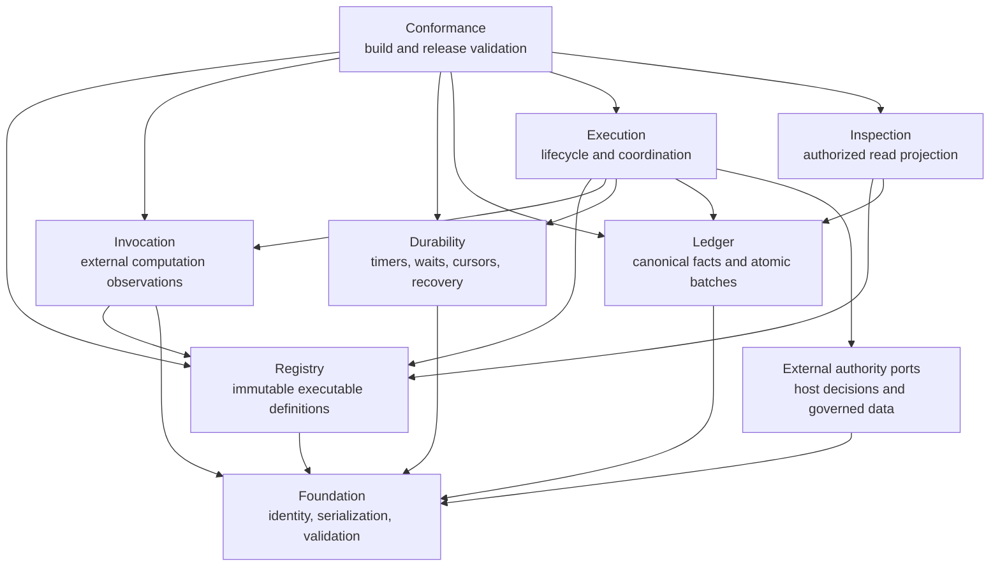
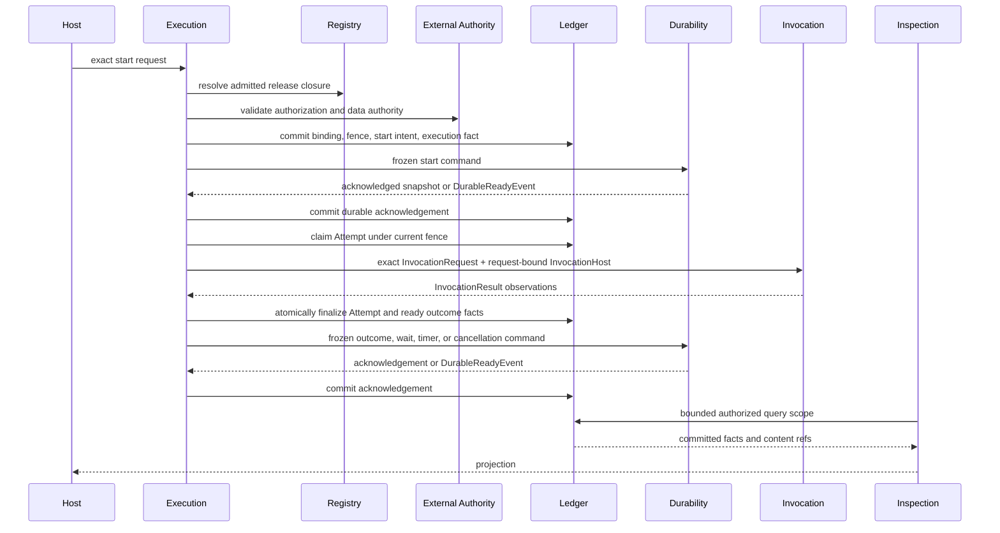

# Agent Runtime Code Design Basis

Status: approved by the Design Owner on 2026-08-17 for the ordered
implementation slices in section 9.

Machine-readable basis:
`review_artifacts/agent_runtime_code_design_basis/code_design_basis.json`.

Package: `agent_runtime_core`.

Primary implementation module for Slice 1: `runtime_conformance`.

Compatibility slices: import-free Runtime Foundation, the current
`agent_runtime.contracts` compatibility facade, and the frozen
`trading_platform` downstream consumer surface. This Slice is an architecture
refactor, not the downstream consumer migration itself.

Change route: `agent_runtime_architecture_rebuild`.

Design subject:
`review_artifacts/agent_runtime_complete_candidate/subject_manifest.json`
with SHA-256
`09ee88f6751bee4db1a259a27a08822e4900c1d62af2ce16cb406c2b34e4954a`.

Code-audit basis:
`review_artifacts/agent_runtime_code_architecture_audit.md`
with SHA-256
`e558c73561a078dcac4ddf70a07e93d6b3afa46ba2187559fc679c13a907dc93`.

Implementation baseline commit:
`294a3bd3778c0a6df7adabe2816221e953223e49`.

The current Runtime Python source-set digest is
`648267d5f910c5057c4bc1ba74512b27e4da373b8b4f3e570547180834f5d492`;
the current Python test-set digest is
`12e69026285ea3b6d0e3fa008acc8f2bf7087727a97c1e0f2896c6c825430f4e`.

## 1. Requested result

Turn the existing component kit into one independently publishable Agent
Runtime whose code directly expresses the approved six-responsibility model:

1. Registry owns immutable executable definitions;
2. Execution owns lifecycle decisions and coordination;
3. Invocation performs one external computation and returns observations;
4. Durability owns acknowledged timers, waits, replay cursors, and recovery;
5. Ledger atomically records canonical execution facts; and
6. Inspection serves authorized projections of committed facts.

The first implementation milestone is not a directory cleanup. It is one
recoverable path from an exact host start request through one Module Attempt to
an authorized inspection result, using one Registry identity model, one Ledger,
and one durable cursor.

## 2. Architecture disposition

`systematic_refactor`

The retained implementation contains useful behavior, but its current
dependencies and public facades contradict the approved ownership model. Code
is therefore retained, split, moved, or retired according to the audited
disposition table; the existing directory layout is not treated as authority.

No compatibility alias, local side service, or duplicate record family may be
introduced merely to keep the old composition running. Compatibility work is
allowed only when the frozen downstream consumer manifest proves that a
specific transition is required.

## 3. Logical architecture



Arrows mean that the source imports a public contract or port from the target.
Reverse peer edges are forbidden. Foundation and Conformance are supporting
planes, not additional Runtime product responsibilities.

The external authority ports do not turn Product Authorization, entitlement,
or governed-data policy into Runtime-owned decisions. They define the exact
request and evidence Runtime must obtain and bind to an execution.

## 4. End-to-end execution boundary



This sequence fixes four boundaries:

- Invocation does not write execution history. It returns observations.
- Execution converts observations into canonical facts and submits one atomic
  finalization batch to Ledger.
- Ledger records; it does not choose lifecycle actions.
- Inspection never records Context or execution activity. It projects facts
  that have already been committed.

## 5. Logical module designs

### 5.1 Registry

Responsibility: validate, admit, activate, and retrieve exact immutable release
closures required for execution.

Owned resources and state:

- Module, Workflow, Prompt, Schema, Execution Profile, Evaluation Policy,
  Retry Policy, Behavior Policy, and Execution Variant Policy releases;
- content-addressed release closure and admission state;
- supported Registry persistence schema release.

Public interfaces:

- `registry_release_reader`;
- `registry_candidate_validator`;
- `registry_release_writer`;
- `registry_admission_writer`.

Allowed dependencies: Foundation and Registry-owned persistence ports.

Prohibited ownership: repository or Skill-directory discovery, provider
projection, Execution state, durable cursor types, and host authorization.

Failure and recovery:

- malformed or incomplete candidates fail before registration;
- replay of identical release bytes returns the same identity;
- conflicting bytes under an existing identity fail closed;
- service startup refuses unsupported or incomplete database schema releases.

Required tests:

- canonical serialization and one-hash-domain tests for every release family;
- exact closure, admission, activation, replay, and conflict tests;
- clean PostgreSQL creation, ordered upgrade, interrupted migration recovery,
  and incompatible-schema refusal;
- proof that compilation consumes a structured candidate bundle and never
  discovers a working tree.

Future capability boundary: a new release family is added through a Registry
contract and migration, not through an untyped metadata bag.

Current binding and disposition: retain the release validators, registration,
retrieval, and PostgreSQL behavior; split release families; move authoring
discovery outside the wheel; remove predecessor Workflow registry and
cross-responsibility return types.

### 5.2 Execution

Responsibility: implement the public Runtime lifecycle and make all start,
dispatch, retry, evaluation, selection, resolution, wait, cancellation, and
reconciliation decisions.

Owned resources and state:

- host request and response contracts;
- in-process lifecycle state only;
- Attempt state machine and legal transition rules;
- request-bound `InvocationHost` implementation;
- reconciliation work selection.

Canonical execution history is not an Execution-owned store; it is committed
through Ledger ports.

Public interfaces:

- `runtime_execution_service`;
- `runtime_module_activity`;
- `execution_recovery_service`;
- host lifecycle commands and results, including the only pushed-invalidation
  entry `submit_authority_invalidation`.

Allowed dependencies: Registry, Invocation, Durability, Ledger, External
Authority ports, and Foundation.

Prohibited ownership: Product Authorization decisions, provider SDK internals,
database implementation, and projection/UI policy.

Failure and recovery:

- every mutating action is idempotent under an exact request identity;
- pushed invalidation enters only through Execution's authorized public action
  and then its intra-Execution invalidation sink;
- only typed, policy-admitted failures create another Attempt;
- committed outcomes win over late provider results;
- intent without acknowledgement is reconciled by replaying the exact frozen
  command;
- cancellation and authority invalidation prevent later finalization under an
  obsolete fence.

Required tests:

- one complete start-to-inspection path;
- duplicate start, duplicate dispatch, and duplicate outcome replay;
- crash after start intent, Attempt finalization, and outcome commit;
- retry ordinal and retry-policy exhaustion;
- Evaluation, Selection, Resolution, and exactly-one Outcome;
- cancellation/invalidation race and late-result quarantine;
- untrusted, cross-binding, conflicting, and regressed pushed invalidation;
- external wait/event reconciliation.

Future capability boundary: new Workflow coordination semantics are expressed
through registered graph and policy releases; they do not add provider or
storage conditionals to `RuntimeExecutionService`.

Current binding and disposition: create the missing production
`RuntimeExecutionService`; retain useful orchestration logic only after it uses
interfaces and the canonical Ledger; retire the predecessor result Ledger and
the duplicate authorization coordinator.

### 5.3 Invocation

Responsibility: execute one exact provider, tool, or deterministic computation
under a pinned Execution Profile and return bounded normalized observations.

Owned resources and state:

- Invocation request/result and observation types;
- provider and tool adapter SPI;
- semantic Context assembly and delivery projection;
- Attempt workspace lifecycle;
- the resource Permission Enforcement Point for repository, workspace, shell,
  network, environment, credential injection, and Gateway tools;
- provider session material that is recoverable context but not canonical
  execution state.

Public interfaces:

- `invocation_adapter`;
- `invocation_adapter_registry`;
- `invocation_host`;
- `invocation_resource_permission_manifest`;
- normalized `invocation_result`.

Allowed dependencies: Registry read ports and Foundation. A request-bound
`InvocationHost` is supplied by Execution through dependency inversion;
Invocation does not import Execution or Ledger.

Prohibited ownership: Workflow routing, retry decisions, Ledger facts,
admission, billing aggregation, and Product Authorization policy.

Failure and recovery:

- denied resources fail before provider entry and return typed denial
  observations with authorization evidence refs;
- provider failures are separated from adapter/Runtime defects;
- output and trace collection are bounded while reading, not after full
  buffering;
- workspace markers are atomically published; stale workspace cleanup follows
  a declared retention owner;
- provider session loss rebuilds from canonical Runtime inputs.

Required tests:

- ResourcePermissionManifest allow/deny tests for every resource class;
- proof that dynamic resource intent is committed through InvocationHost before
  the external operation;
- Codex and Claude adapter conformance for output, timeout, cancellation,
  usage, typed failures, native structured output, and Context overflow;
- minimal environment allowlist and no ambient secret inheritance;
- bounded stdout/stderr and malformed provider response tests;
- workspace crash recovery and retention tests.

Future capability boundary: a new provider or tool implements the same SPI and
declares a pinned Adapter/Execution Profile; it cannot add Workflow-specific
logic.

Current binding and disposition: keep context, result, workspace, tool, Claude,
and Codex components after removing concrete Registry/Ledger imports and
pinning all behavior-bearing adapter options.

### 5.4 Durability

Responsibility: durably acknowledge frozen commands and return bounded cursor
snapshots or typed readiness events after timers, waits, replay, and recovery.

Owned resources and state:

- frozen durable commands;
- command idempotency and acknowledgement identity;
- bounded cursor snapshots and monotonic event position;
- `DurableReadyEvent`;
- backend adapter descriptors.

Public interfaces:

- `durable_backend_adapter`;
- frozen start, advance, wait, timer, cancellation, and outcome commands;
- bounded snapshot, acknowledgement, and readiness event.

Allowed dependencies: Foundation only. Concrete adapters may depend on their
SDK, but may not discover Registry releases or host topology.

Prohibited ownership: Workflow routing, Module dispatch, Registry lookup,
complete execution history, Product Authorization, tenant placement, and
deployment configuration.

The unique command/configuration boundary is:

- frozen command: execution identity, command identity, expected cursor/fence,
  registered operation, and immutable payload refs;
- deployment configuration: namespace, task queue, endpoint, credential
  handle, worker placement, timeout tuning, and backend connection details.

Failure and recovery:

- duplicate command returns the same acknowledgement or current snapshot;
- crash before acknowledgement is recovered by exact command replay;
- timer or wait satisfaction emits `DurableReadyEvent` containing command id,
  execution id, resulting cursor position, readiness kind, and backend evidence
  ref;
- unbounded history is prevented through declared rollover/compaction;
- stale or conflicting cursor expectations fail closed.

Required tests:

- exact frozen-command serialization and config exclusion;
- start/advance/wait/timer/cancel idempotency;
- required `DurableReadyEvent` fields and stale-cursor rejection;
- crash/replay around command application and acknowledgement;
- snapshot bound and history rollover;
- Temporal adapter conformance without Temporal-specific types in the stable
  port.

Future capability boundary: another durable backend implements the same frozen
command and event protocol; its deployment parameters stay in its adapter
configuration.

Current binding and disposition: keep the provider-neutral backend and Temporal
adapter behavior; move Workflow coordination to Execution; remove host
topology, Registry retrieval, ambient default adapters, and rejected experiment
descriptors from the wheel.

### 5.5 Ledger

Responsibility: validate and atomically append canonical execution facts,
content references, authority fences, intents, observations, outcomes, and
backend acknowledgements.

Owned resources and state:

- canonical execution record families and sequence law;
- one `runtime_execution_record_store`;
- content reference and integrity metadata;
- PostgreSQL Ledger schema release and migration state;
- bounded query ports used by Inspection.

Public interfaces:

- `runtime_execution_record_store`;
- `runtime_execution_content_store`;
- `runtime_execution_query_store`;
- atomic start, claim, intent, finalization, and acknowledgement batches.

Allowed dependencies: Foundation only. Ledger consumes canonical values; it
does not import Execution or Invocation orchestration types.

Prohibited ownership: lifecycle decisions, provider calls, durable commands,
authorization-policy decisions, UI projection, and content-retention policy.

Cross-clock fence input and decision:

- input: active claim identity, stored monotonic fence, proposed fence,
  registered predicate, `DistributedClockProfile`, `ClockHealthEvidence`, and
  terminal fact batch;
- decision: accept only when claim, fence, predicate, and declared clock-health
  bounds all hold in the same durable transaction;
- failure: reject the whole batch with a typed stale-claim, stale-fence,
  unsatisfied-predicate, missing-clock-evidence, or unhealthy-clock result.

Failure and recovery:

- batches are all-or-nothing;
- an identical replay returns the existing committed facts;
- conflicting identity or sequence fails closed;
- immutable lineage remains after governed content disposal; content
  readability follows an external Data Governance decision through a narrow
  custody port;
- unsupported or partially migrated PostgreSQL schema prevents startup.

Required tests:

- exact batch atomicity and replay;
- cross-process fence races covering every failure result above;
- root Module Run creation for Workflow and independent Module starts;
- complete `(module_run, variant, attempt)` lineage closure;
- usage-call, output-attempt, outcome-evaluation-selection-resolution closure;
- PostgreSQL concurrency and migration tests;
- content retrieval before retention expiry, denial after disposition, and
  lineage integrity after body unavailability.

Future capability boundary: new fact families require versioned canonical
records and migrations; they cannot be appended as arbitrary JSON events.

Current binding and disposition: retain canonical validation, PostgreSQL,
content, usage, and recording behavior; remove the second Ledger, Legacy
batches, and orchestration decisions from record builders.

### 5.6 Inspection

Responsibility: transform committed Registry and Ledger facts into bounded,
authorized live or offline read models.

Owned resources and state:

- read-model schemas;
- authorized query-scope protocol;
- bounded summary and paged detail projection;
- deterministic HTML/JSON rendering and offline snapshot format.

Inspection does not own canonical data. Its read models and snapshots are
rebuildable projections.

Public interfaces:

- `inspection_service`;
- `inspection_query_authorizer`;
- `inspection_repository`;
- summary/detail/content query and rendering interfaces.

Allowed dependencies: Registry read ports, Ledger query ports, and Foundation.

Prohibited ownership: mutation, execution activity, provider sessions, retry,
approval, content custody, and ambient backend selection.

Failure and recovery:

- authorization is resolved into an opaque query scope before database
  retrieval;
- inaccessible executions and content fail closed;
- summaries and traces are bounded and cursor-paged;
- malformed or inconsistent lineage refuses projection;
- projections may be discarded and rebuilt from canonical facts.

Required tests:

- cross-tenant enumeration denial at the query boundary;
- separate summary, detail, trace-page, and content-body authorization;
- stable cursor, response budget, and incremental `since` behavior;
- malformed lineage rejection and successful retry-status projection;
- deterministic escaped HTML and byte-stable offline bundle rendering;
- explicit adapter inventory with no ambient Temporal or provider default.

Future capability boundary: new UI and telemetry consumers use the same
authorized read ports; they do not receive direct Registry/Ledger database
credentials.

Current binding and disposition: retain existing projections and renderers
after splitting secure query assembly from HTTP/HTML delivery and introducing
bounded query contracts.

## 6. Supporting planes

### 6.1 Foundation

Foundation owns only import-free canonical JSON, hashing, immutable bytes,
identifier/ref/token/timestamp validation, shared schema traversal, and
responsibility-neutral error bases. It may not own a release, execution,
Attempt, authorization decision, provider, backend, record store, or view.

Its first purpose is to remove duplicated and divergent identity logic. It is
not a utility drawer; every exported primitive must have at least two valid
responsibility consumers and one exact conformance test.

### 6.2 Conformance

Conformance is build/test tooling, not a peer service. It owns:

- allowed-import and cycle validation;
- public-surface manifests;
- source ownership and migration-debt high-water marks;
- release/adapter conformance kits;
- generated Design Contract and package projection validation;
- downstream consumer closure before public cutover.

Conformance code may inspect all responsibility surfaces. Product code never
imports Conformance. Conformance may ship in the standalone wheel so the
published product can carry its own technical assurance tools, but it never
enters the product execution import or call path.

The shipped `agent_runtime.testing` package is a stable public facade over
responsibility-owned evaluation and Adapter-conformance entry points. It is
not a temporary compatibility slice. Its individual source files retain their
registered Registry, Execution, or Durability owner; it is not another
Conformance implementation namespace.

### 6.3 External authority

Document 09 defines provider-neutral Runtime ports for host Product
Authorization, governed-data resolution, operation authorization, and current
authority observations. The external systems remain decision owners.
Execution owns when the decisions are requested and how their evidence and
fences are bound to the Ledger.

## 7. Physical code rules

Logical ownership and physical layout are separate views. Concrete technology
names appear only in adapter filenames, never as a peer architecture layer.

Target namespaces:

```text
src/agent_runtime/
  foundation/
  registry/
  execution/
  invocation/
  durability/
  ledger/
  inspection/
  conformance/
```

Every production filename uses snake case and the three-part pattern
`<module>_<subject>_<nominalized_action>.py`, for example:

- `execution_runtime_coordinating.py`;
- `execution_attempt_transitioning.py`;
- `invocation_resource_authorizing.py`;
- `durability_command_acknowledging.py`;
- `ledger_attempt_finalizing.py`;
- `inspection_trace_projecting.py`.

Adapter names add the concrete binding only inside the owning namespace, for
example `invocation_claude_invoking.py`,
`durability_temporal_coordinating.py`, and
`ledger_postgres_persisting.py`.

The current `contracts/` package is retired. Responsibility-owned contracts
live beside their owner. Only Foundation types can be imported across multiple
responsibilities without an owner port.

## 8. Public surface and dependency enforcement

Before behavioral code moves, Conformance must generate and enforce:

1. exact allowed responsibility import edges;
2. cycle freedom across responsibilities;
3. an explicit public symbol manifest per responsibility;
4. no product import of `agent_runtime.contracts` or `agent_runtime.testing`;
5. a migration-debt manifest whose count and path set may only shrink unless
   this Code Design Basis is revised;
6. a symbol-level downstream consumer manifest for `trading_platform`, with
   `keep`, `replace`, or `retire` assigned to every imported Runtime symbol and
   an explicit distinction between generated defaults and owner decisions.

Compatibility-facade retirement requires an owner decision for every consumer
site. A mechanically derived default freezes the current surface but cannot
satisfy that retirement gate.

The top-level `agent_runtime` package may expose a deliberately small host
surface. It must not re-export concrete in-memory stores, provider adapters,
PostgreSQL adapters, Temporal types, compatibility records, or test helpers.

## 9. Implementation slices

Each slice is independently reviewable and must leave tests green. A later
slice cannot silently change an earlier slice's contracts.

### Slice 1: architecture enforcement and foundation

- freeze current consumers and public exports;
- add responsibility dependency/public-surface/debt manifests and validators;
- introduce import-free Foundation primitives with characterization tests;
- do not move execution behavior yet.

Acceptance: current code is fully classified, existing violations are explicit
debt, new violations fail CI, and duplicated primitives have one tested target.

### Slice 2: Registry identity and authoring boundary

- move structured candidate generation out of the wheel;
- split release families and establish one payload/hash domain;
- introduce versioned Registry PostgreSQL migration and startup checks.

Acceptance: exact releases compile, register, persist, retrieve, and replay
without working-tree discovery or cross-responsibility types.

### Slice 3: canonical Ledger

- split canonical fact families and store ports;
- remove the predecessor Module result Ledger from the target path;
- add versioned Ledger PostgreSQL migrations and cross-clock fence transaction;
- preserve content lineage while separating retention custody.

Acceptance: one store is authoritative for all start/Attempt/outcome paths and
passes real PostgreSQL concurrency/fence tests.

### Slice 4: Runtime Execution service

- implement `RuntimeExecutionService` and `RuntimeModuleActivity`;
- assemble Registry, external authority, Ledger, Durability, and Invocation
  through ports;
- execute retry, Evaluation, Selection, Resolution, and recovery.

Acceptance: the first complete start-to-terminal path and crash windows pass.

### Slice 5: Durability and ingress

- accept only frozen commands;
- return bounded snapshots, acknowledgements, and `DurableReadyEvent`;
- add rollover and idempotent external-event reconciliation;
- keep deployment configuration in adapter assembly.

Acceptance: provider-neutral and real Temporal replay/recovery tests pass.

### Slice 6: Invocation hardening

- remove peer reverse imports;
- enforce resource permission manifests and InvocationHost intent ordering;
- pin adapter behavior, restrict environment, bound output, and classify
  failures.

Acceptance: Claude and Codex adapter conformance passes with the same Module,
Formatter, and output schema where both providers support it.

### Slice 7: Inspection cutover

- add authorized query scopes, bounded summaries, and cursor-paged details;
- project all Attempt/provider/context/usage/failure/retry facts from Ledger;
- retain deterministic HTML/offline bundle rendering.

Acceptance: the live Inspector reads formal Runtime records only and no longer
needs predecessor observability storage.

### Slice 8: downstream and release closure

- migrate every downstream consumer according to the frozen manifest;
- remove compatibility facades, migration debt, and rejected adapters;
- regenerate Design Contract projections and build the standalone wheel.

Acceptance: Runtime and declared downstream suites pass, public API matches its
manifest exactly, and the final engineering review finds no undeclared path.

## 10. Test strategy

The minimum evidence set is cumulative:

| Test family | Proves |
| --- | --- |
| deterministic unit | identity, serialization, state transition, bounds, and typed failure law |
| responsibility architecture | allowed imports, cycle freedom, public exports, and shrinking debt |
| contract conformance | every port implementation obeys provider-neutral request/result semantics |
| PostgreSQL integration | transactions, concurrent fences, schema migration, query scope, and recovery |
| Temporal integration | replay, wait/timer readiness, cancellation, rollover, and crash recovery |
| Provider integration | exact Context, permissions, structured output, usage, timeout, and failure normalization |
| end-to-end Runtime | one start-to-terminal/recovered execution and authorized Inspection projection |
| downstream compatibility | every retained trading-platform consumer uses the admitted Runtime public surface |

Skipping a live integration test is evidence of an unverified binding, not a
pass. Production admission must name the real PostgreSQL, Temporal, and Provider
instances used and retain raw results.

## 11. Compatibility, rollback, and data migration

This is a pre-release hard architecture cutover, but persisted data and active
executions remain protected:

- public aliases are not the rollback mechanism;
- each database schema change has an ordered forward migration and explicit
  interrupted-migration recovery;
- downgrade support is declared per migration rather than assumed;
- a service refuses an unsupported schema rather than partially operating;
- active executions remain on their admitted Runtime release until terminal or
  explicitly migrated by an approved replay procedure;
- rollback restores the prior deployable Runtime release and its compatible
  schema, or follows the declared forward-repair path;
- removal of any old symbol waits for frozen downstream consumer closure.

## 12. Implementation completion conditions

The architecture rebuild is complete only when:

1. one shipped `RuntimeExecutionService` owns the public lifecycle;
2. all six responsibilities obey the allowed dependency direction;
3. Invocation observations become canonical only through Execution and Ledger;
4. every Invocation resource entry has a permission manifest and authorization
   evidence;
5. Ledger cross-clock fence success and all failure modes pass real concurrent
   PostgreSQL tests;
6. every timer or wait yields the declared `DurableReadyEvent` and frozen
   commands contain no deployment configuration;
7. Inspection projects bounded authorized facts and never records Context;
8. one canonical Registry identity and one canonical Ledger remain;
9. all migration debt and downstream Runtime imports have a closed disposition;
10. the standalone wheel, generated Design Contract, Runtime suites, live
    binding suites, and independent engineering review all pass.

Approval of this Code Design Basis authorizes only the ordered implementation
slices above. A material change to responsibility ownership, dependency
direction, durable ordering, public surface, or persistence model requires an
updated Code Design Basis before code changes continue.
