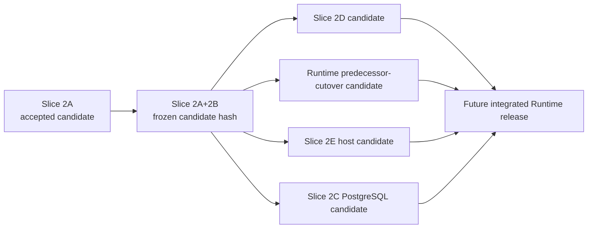
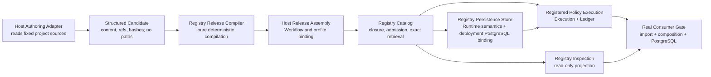
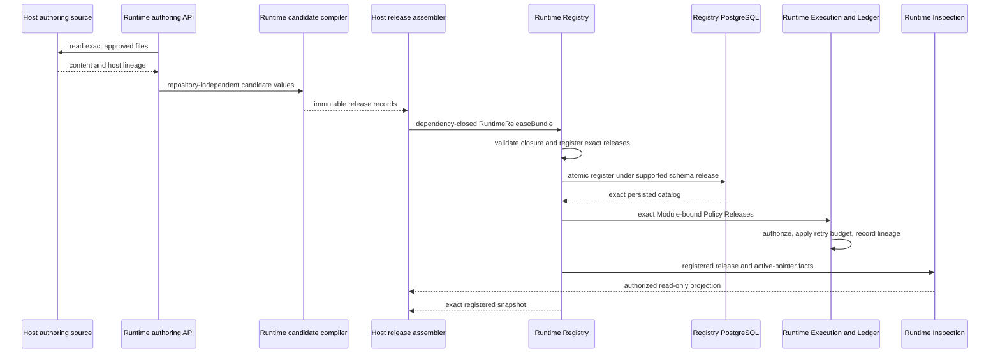

# Slice 2 Registry Code Design Basis

Status: approved revision 18 by the Design Owner on 2026-09-01. Slice 2A is
accepted and Slice 2B is the current frozen-candidate subject.

Machine-readable candidate:
`review_artifacts/agent_runtime_code_design_basis/slice_2_registry_code_design_basis.json`.

Engineering change route:
`engineering_change_route:agent_runtime_architecture_rebuild@v1`.

## 1. Requested result

Complete the already approved Slice 2 result from the Agent Runtime Code Design
Basis:

1. replace ambient authoring discovery with one explicit Runtime-owned Module authoring API that accepts a caller-supplied project root and exact Skill/Module identity;
2. give every Registry release family one canonical payload and hash domain;
3. make Registry PostgreSQL schema identity, explicit migration, startup
   compatibility refusal, registration, reload, and replay real; and
4. migrate the registered `trading_platform` consumer to that boundary without
   a compatibility shim or a second release authority.

The failed `trading_platform` import/composition case is implementation
evidence and a final acceptance gate. It does not define Slice 2 scope.

### 1.1 Strict implementation Slices

The historical “Slice 2” label identifies the Registry program phase. It does
not authorize one implementation candidate to span every responsibility in
that phase. Implementation proceeds through these ordered, independently
reviewable Slices:

| Slice | Intended result | Included logical surface | Explicitly excluded now |
| --- | --- | --- | --- |
| `slice_2a_runtime_module_candidate_io` | Compile one content-only Agent Module candidate and prove its Prompt, Policy, input, and output contracts. | Agent Module candidate and compiled result; Behavior, Evaluation, and Retry Policy candidates/compilers and Runtime-owned Schema Assets; Prompt Bundle compiler; canonical text hashing | all remaining release compilers, Registry registration, migration candidates, PostgreSQL, provider invocation, host repository, and `trading_platform` |
| `slice_2b_in_memory_registry_closure` | Close the remaining content-only release compilers, register the dependency-closed release bundle in memory, and prove exact retrieval, Module/Workflow active-pointer behavior, conflict, replay, and predecessor profile-selection retirement. | non-Agent Module, Execution Variant Policy, Execution Profile, Workflow, Registry release catalog and Module/Workflow active pointer | migration candidate compilation, PostgreSQL, and host integration |
| `slice_2d_registered_policy_execution` | Resolve Module-bound Policy Releases, apply them during Execution, enforce retry lineage in Ledger, and project releases read-only for inspection. | `runtime_registered_policy_execution` and `runtime_registry_inspection_projection` | host authoring and product integration |
| `slice_2c_registry_postgres_persistence` | Compile the explicit migration candidate, then persist and reload registered Registry releases and Module/Workflow active pointers under the supported PostgreSQL schema release; legacy v1 admission rows are decoded and removed. | all `registry_migration_candidate_set` public candidate/compiler results and `runtime_registry_postgres_persistence` | host authoring and product integration |
| `slice_2e_registered_host_cutover` | Prove explicit Module authoring, host release assembly, and downstream conformance against the registered Runtime surface. | `runtime_module_authoring`, `host_runtime_release_assembly`, `runtime_downstream_release_conformance` | no ambient discovery or undeclared compatibility surface |

Slice 2B closes the remaining content-only release compilers and proves
dependency-closed in-memory registration, exact retrieval, Module/Workflow
active-pointer set/clear/replace, immutable conflict refusal, atomic failure, idempotent
replay, and predecessor profile-selection retirement. It does not claim that
the predecessor Runtime, Trading Platform, or a real Workflow already consumes
the new API.

Every exported interface of `registry_release_compilation` and
`registry_migration_candidate_set`, plus every later logical module, is
included by exactly one implementation Slice. Every
surface excluded from an earlier Slice is repeated in that Slice's
`deferred_integrations` with its later owner and completion gate. A failure in
2B, 2C, 2D, or 2E is routing evidence for that Slice and cannot widen 2A.

The dirty-code registration that caused revision 11 is recorded at
`review_artifacts/agent_runtime_code_design_basis/slice_2_change_registration_audit.md`.
Already-present later-Slice code is candidate material only; it is not evidence
for 2A and is not admitted by this basis revision.

### 1.2 Frozen upstream candidates

An implementation Slice is an independent responsibility, test, and review
unit. After its focused completion gate passes, it may be committed and pushed
as an immutable upstream candidate even when explicitly excluded downstream
consumers have not migrated. That candidate is not a shared Runtime release and
does not replace the current production baseline.

Later Slices bind the exact upstream candidate commit and hash. A later failure
changes the later Slice unless it proves that the frozen upstream contract is
wrong; in that case the upstream owner issues a new candidate revision rather
than mutating the frozen one.

The current Work Package ends at the frozen Slice 2A+2B candidate. Complete
predecessor-suite compatibility, full Workflow execution, host integration,
Trading Platform use, and PostgreSQL persistence are explicit downstream gates,
not Slice 2A or Slice 2B acceptance criteria.

## 2. Owning design and evidence

- approved architecture basis:
  `review_artifacts/agent_runtime_code_design_basis/code_design_basis.json`;
- target Registry intent:
  `review_artifacts/agent_runtime_t2_candidate/agent_runtime_01_registry_contract.md`;
- target source ownership:
  `review_artifacts/agent_runtime_t2_candidate/agent_runtime_02_source_architecture_contract.md`;
- current implementation audit:
  `review_artifacts/agent_runtime_code_architecture_audit.md`;
- real consumer failure:
  `review_artifacts/agent_runtime_code_design_basis/slice_1_real_downstream_gate.json`.

The T2 files remain candidate intent within the larger Runtime admission lane.
This Code Design Basis uses only the decisions already repeated in the approved
root basis: Runtime production does not discover a host tree; the explicit authoring API reads only a caller-supplied root and exact Module closure; release identity is
content-bound; Registry registration and authoring-time loading are separate; and PostgreSQL state
is versioned and checked rather than silently repaired at startup.

## 3. Current-state assessment

### 3.1 Ambient authoring discovery remains inside Runtime

The predecessor loader discovered repository content as part of compilation and returned path-bearing values. The target API keeps only the portable validation once requested explicitly:
`Module.from_registration(project_root, skill_id, module_id)` loads one fixed closure, performs no sibling or ambient discovery, and returns content-only `ModuleRegistrationSource`. Compilation, registration, and production execution never receive or reread the project root.

### 3.2 Module and model release compilation are coupled

`compile_agent_module_release` produces an `ExecutionProfileRelease` together
with the Module. As a result, the authoring structure suggests that changing a
model/profile is part of compiling the semantic Module even though the release
model says the same Module must support provider/model A/B through independently
registered profiles.

### 3.3 Registry release families are incomplete

The current Registry persists Schema Asset, Prompt Component, Prompt Bundle,
Execution Profile, Runtime Module, and Workflow records, but:

- Schema Asset is not an admissible `ReleaseSubjectKind`;
- Context, Evaluation, and Retry policies are unregistered ref strings whose
  hashes are currently derived from the ref text rather than policy content;
- `WorkflowExecutionProfileSelection` and
  `WorkflowNodeExecutionProfileBinding` are predecessor, non-admitted
  selections rather than an independently admitted Execution Variant Policy
  Release; and
- the Execution Profile still duplicates Context and retry bindings that belong
  to the semantic Module release.

This does not meet the approved one-payload/one-hash-domain result.
Adapter release admission is outside Slice 2 and is proposed for Slice 6; it is
not used to expand this candidate.

### 3.4 PostgreSQL has tables but no installed schema identity

The adapter exposes explicit `initialize_schema()`, but the DDL is an
unversioned set of `CREATE ... IF NOT EXISTS` statements. Normal reads and
writes do not first prove one supported installed schema release. There is no
ordered migration record, interrupted-migration state, or startup refusal for
an incomplete schema.

### 3.5 The real host remains on a retired model

`trading_platform` still imports `registry_module_exporting`, constructs
`skill_package` releases, and expects `RuntimeReleaseBundle.skill_packages`.
The current Runtime deliberately contains none of those contracts. Restoring
the deleted module would preserve the wrong ownership and recreate a parallel
release family.

## 4. Target logical modules

The arrows are data and dependency direction. Runtime owns `C`, `K`, `R`, `E`,
and `I`; `P` implements the persistence boundary defined by
`agent_runtime_06` §2.4 and `agent_runtime_01` §10. The consuming host owns `A`,
`H`, and its real gate. PostgreSQL remains an implementation binding, not a
peer responsibility.

### 4.1 `runtime_foundation_schema_support`

Responsibility: own provider-neutral Draft 2020-12 validation and strict
output-schema projection primitives shared by Registry compilation and
Invocation.

Owned resources:

- Runtime JSON Schema validation rules; and
- strict output-schema projection rules.

Public interfaces:

- `validate_json_schema_document()`;
- `validate_json_document_against_schema()`; and
- `strict_output_schema_projection()`.

Allowed dependencies: Python standard library and the optional JSON Schema
validator loaded only when validation is requested.

Prohibited dependencies: Registry, Invocation, Execution, provider adapters,
PostgreSQL, or host authoring.

Failure and recovery: fail closed when optional validation support is
unavailable, reject invalid schemas and instances deterministically, and
produce byte-identical strict projections for identical inputs.

Disposition: retain these primitives in Foundation, expose one public owner,
and let Registry and Invocation depend on that surface without reverse imports.

### 4.2 `runtime_registry_candidate_compilation`

Responsibility: receive repository-independent structured content and compile
exact immutable Runtime release records.

Owned resources:

- candidate value schemas;
- canonical serialization and content validation;
- deterministic construction of Schema Asset, Prompt Component, Prompt Bundle,
  Behavior Policy, Evaluation Policy, Retry Policy, Execution Variant Policy,
  Execution Profile, and Runtime Module release records.

Public interfaces:

- `AgentModuleReleaseCandidate` and `NonAgentModuleReleaseCandidate`;
- `BehaviorPolicyReleaseCandidate`, `EvaluationPolicyReleaseCandidate`, and
  `RetryPolicyReleaseCandidate`;
- `ExecutionVariantPolicyReleaseCandidate`;
- `WorkflowReleaseCandidate`;
- `RegistryMigrationCandidateSet`;
- `runtime_owned_policy_schema_assets()`;
- `compile_agent_module_release(candidate)`;
- `compile_non_agent_module_release(candidate)`;
- `compile_behavior_policy_release(candidate)`;
- `compile_evaluation_policy_release(candidate)`;
- `compile_retry_policy_release(candidate)`;
- `compile_execution_variant_policy_release(candidate)`;
- `compile_workflow_release(candidate)`;
- existing profile compiler, made explicitly independent from Module
  compilation.

`AgentModuleReleaseCandidate` contains values, not locations:

- Module ID and version;
- owner-contract ref plus exact UTF-8 owner-contract content;
- input/output schema refs plus exact UTF-8 JSON documents;
- instruction source ref plus exact prompt text;
- operation IDs, compatible transports, every policy release ref paired with
  its exact `release_sha256`, entry policy, and output-resolution policy.

The candidate contains no `Path`, project root, `.claude`, `.agents`, schema
path, prompt path, provider/model choice, or database handle. An opaque
provenance ref may name a host source, but Runtime never dereferences it. The
compiler hashes supplied content itself; it never trusts a caller-supplied
content hash without recomputation.

The compiled `RuntimeModuleRelease` removes `source_skill_id` and contains no
authoring-source provenance. `module_kind` and the exclusive Prompt-Bundle
versus executable binding distinguish Agent from non-Agent Modules. Skill or
file lineage remains host build/audit evidence and does not change Runtime
Module identity.

`NonAgentModuleReleaseCandidate` contains the same owner-contract and exact
input/output Schema Asset content as the Agent candidate, plus executable ref
and exact executable bytes. Runtime computes the executable hash from those
bytes and stores only ref/hash in the Module Release. The candidate does not
grant Runtime repository access. A later distribution builder may substitute
an exact wheel-member byte source through the same field without changing
Registry semantics.

`ExecutionProfileRelease` contains provider, model, effort, adapter identity,
tool, network, workspace, timeout, output mode, and adapter options only. Slice
2 removes `context_policy_ref`, `context_policy_sha256`, and `max_attempts` from
that record. Context, Evaluation, and Retry semantics are owned by the Module's
exact policy closure. Therefore changing a model/profile does not recompile the
Module, while changing a policy does not masquerade as provider configuration.

Policy families are separate because the approved root basis names Evaluation
Policy, Retry Policy, Behavior Policy, and Execution Variant Policy as peer
Registry resources. Slice 2 does not collapse them into one discriminator:

| Family | Ref grammar | Canonical payload beyond ID/version/ref/hash | Closure consumer |
| --- | --- | --- | --- |
| Behavior Policy | `behavior-policy:<id>@<version>` | policy-schema ref/hash, canonical Context-policy JSON and content hash | `RuntimeModuleRelease.behavior_policy_ref/sha256`; never Execution Profile |
| Evaluation Policy | `evaluation-policy:<id>@<version>` | policy-schema ref/hash, canonical evaluation-policy JSON and content hash | `RuntimeModuleRelease.evaluation_policy_ref/sha256` |
| Retry Policy | `retry-policy:<id>@<version>` | policy-schema ref/hash, canonical retry-policy JSON and content hash | `RuntimeModuleRelease.retry_policy_ref/sha256` |
| Execution Variant Policy | `execution-variant-policy:<id>@<version>` | origin kind/ref/hash plus an ordered tuple of Variant definitions; each Variant owns a unique ID and exact position-to-Execution-Profile bindings | host execution binding; Execution later validates exact origin coverage |

Entry and output-resolution policies remain inline canonical enum values in the
Module payload, as permitted by the upstream rule that a behavior-bearing rule
may be an inline canonical value. `declared_operation_ids` remain capability
requirements, not another policy family.

Every `*_ref` that names a Registry release is paired with that named release's
`release_sha256`, with one deliberate Schema Asset exception. Input, output,
and policy-schema refs are paired with the resolved Schema Asset's canonical
`schema_sha256`, because that content hash is also the long-lived schema fact
recorded by Ledger and compared by provider projections. The Schema Asset ref
plus content hash still resolves one exact registered schema document; Registry
rejects a correct ref paired with either the wrong release hash or, for this
declared exception, the wrong schema-document hash.

Each policy document is a JSON object whose family envelope and document schema
are Runtime-code-owned. The exact schema bytes are code constants compiled by
`runtime_owned_policy_schema_assets()` into four registered Schema Asset
releases. Re-supplying a byte-identical built-in Schema Asset is idempotent. A Policy Release Candidate
does not accept a caller-selected policy schema: its compiler attaches the
matching built-in Schema Asset ref/hash. That Schema Asset must already be in
the Registry or accompany the Policy Release in the same dependency-closed
bundle; there is no implicit schema seeding during PostgreSQL DDL. The host
supplies policy values but cannot substitute an arbitrary schema. Registry
registration validates the canonical policy document against the exact registered
Schema Asset before registering the Policy Release. If the required JSON
Schema validator is unavailable, registration refuses the candidate rather than
accepting an unchecked policy. Runtime stores canonical JSON and computes both
its internal content hash and the enclosing release hash. The Behavior Policy
family itself denotes Context behavior; no single-valued `behavior_kind`
discriminator is stored.

The same fail-closed validation applies to every host-supplied Schema Asset,
not only policy schemas. New registration never catches a missing validator and
silently skips meta-schema validation. The dependency-free wheel check is an
import-time packaging test; schema compilation/admission is an optional-feature
operation that must refuse when its declared validator dependency is absent.

The initial Runtime-owned policy documents are closed schemas, not empty
metadata bags:

- Behavior Policy requires `context_isolation` with the sole Slice 2 value
  `workflow_execution_isolated`;
- Evaluation Policy requires only `evaluation_mode` in `module_candidate`,
  `deterministic_candidate`, or `none`. Slice 2 introduces no rubric release or
  caller-supplied rubric content; a later slice must add a resolvable rubric
  release before Evaluation Policy may bind one;
- Retry Policy requires bounded integer `max_attempts`; and
- Execution Variant Policy requires the origin and ordered position/profile
  bindings already defined above.

All four documents reject undeclared keys. Later semantic expansion requires a
new Policy Release schema/version; Runtime does not infer meaning from the
policy ID.

The Runtime-owned Retry Policy schema requires integer `max_attempts` in the
inclusive range 1..100. The Module's Retry Policy release, not the Execution
Profile, is the canonical source of retry exhaustion. When the Ledger records
a Variant, its caller supplies primitive `retry_policy_ref`,
`retry_policy_sha256`, and bounded `max_attempts` values after resolving and
validating the exact Policy against the Module. The recorder accepts no
`RetryPolicyRelease` type; it refuses unless the primitive ref/hash exactly
equal `module.retry_policy_ref` and `module.retry_policy_sha256`, then projects
only `max_attempts` into the existing
Variant field for ordinal enforcement and inspection. Ledger does not read the
Registry, adds no retry-policy field, changes no record decoder or PostgreSQL
schema, and continues to record `output_schema_sha256` as the Schema Asset
content hash. Historical Variant rows therefore remain byte- and
meaning-compatible. The recorder's broader existing Module/Profile contract
dependencies remain declared predecessor debt owned by Slice 3; Slice 2 does
not add another Registry edge or pretend that larger Ledger cutover is done.

An Execution Variant Policy supports Workflow and standalone Module origins.
Every binding uses `position_id`: a Workflow node ID for a Workflow origin or
the Module ID for a standalone origin, plus an exact Execution Profile
ref/hash. Registry validates identity and referenced profiles; Execution owns
the later full-coverage check against the pinned origin graph.

`WorkflowReleaseCandidate` contains no paths. It carries Workflow identity and
version, owner-contract ref plus exact bytes, canonical node/edge/parallel-group
values, exact input-mapping documents keyed by mapping ref, authorization
manifest ref plus exact canonical JSON, and execution-binding ref plus exact
canonical JSON. Runtime derives `graph_sha256` from the canonical graph values
and hashes every supplied content object itself. Workflow fields are classified
as follows:

- Module refs and hashes name admitted Runtime Module releases and bind their
  `release_sha256`;
- owner-contract, input-mapping, authorization-manifest, and the legacy-named
  `execution_release_ref`/`execution_release_sha256` execution-binding refs name
  exact supplied content and bind the canonical content SHA-256;
- `graph_ref` is opaque host provenance for the canonical inline graph and
  `graph_sha256` is computed from that graph; and
- no Workflow ref is accepted with a caller hash that Runtime cannot
  recompute or resolve.

`execution_release_ref` is not an eleventh Registry release family. Slice 2
retains that existing field name only to preserve Ledger/Durability record
decode; its defined value is an opaque host execution-binding content ref whose
SHA-256 Runtime computes from candidate JSON. The former standalone
"execution release" concept is retired from canonical design. A physical field
rename, if still useful, belongs to the versioned Ledger migration in Slice 3.

Adapter is not added as a Slice 2 Registry family. Adapter admission is outside
Slice 2 and is proposed for Slice 6 alongside provider Adapter hardening and
conformance. Slice 2 preserves
the current exact `executor_adapter_id` and revision values inside the
Execution Profile payload; registering Adapter content and adding that closure
edge is a proposed Slice 6 change requiring its own Code Design Basis, not an
invented Slice 2 migration.

The existing Registry-to-Invocation call to `task_plane_output_schema` is
removed in this rewrite. Its provider-neutral transformation moves into the
existing `foundation_schema_traversal.py` as
`strict_output_schema_projection`; Invocation imports the same primitive, and a byte-for-byte
characterization test proves existing output-constraint content does not
change merely because the function moved.

Allowed dependencies: Runtime Foundation, Registry-owned release records, and
the optional JSON Schema validator used by candidate validation. Importing the
base wheel does not import that optional dependency.

Prohibited dependencies: host filesystem, Skill Governance implementation,
provider adapters, Execution, Ledger, Durability, Inspection, and PostgreSQL.

Failure and recovery:

- malformed content, ref/content mismatch, missing policy release, or duplicate
  identity fails before registration;
- byte-identical candidate replay produces identical releases;
- compilation has no external effect and therefore requires no compensating
  action.

Disposition: keep `registry_release_compilation.py` path-free. Slice 2E retains
`registry_module_loading.py` only as the explicit authoring-time loader behind
`Module.from_registration(...)`; registration and production execution never call it.

### 4.3 `runtime_registry_release_catalog`

Responsibility: validate exact dependency closure, register immutable releases,
retrieve exact identities, and set, clear, or resolve the sole active pointer
for a Module or Workflow subject.

Owned resources:

- all registered immutable release records and dependency closures;
- zero or one active pointer per Module/Workflow stable-object scope.

Public interfaces:

- `RuntimeReleaseBundle`;
- `RuntimeReleaseRegistry`, `RuntimeReleaseRegistrationResult`, and exact readers;
- `RuntimeActiveReleasePointerResult`, `set_active_release()`,
  `clear_active_release()`, and `resolve_active_release()`.

Both the in-memory Registry and PostgreSQL store return the same immutable
`RuntimeReleaseRegistrationResult`: the exact submitted bundle plus the post-transaction
`RuntimeReleaseRegistrySnapshot`. Neither returns a mutable Registry object as the public success
value. Failure leaves both stores unchanged and preserves the same stable Runtime-owned error
classification at their shared interface.

Persisted release families in Slice 2:

1. Schema Asset;
2. Prompt Component;
3. Prompt Bundle;
4. Behavior Policy;
5. Evaluation Policy;
6. Retry Policy;
7. Execution Variant Policy;
8. Execution Profile;
9. Runtime Module; and
10. Workflow.

`RuntimeReleaseBundle` is an atomic registration batch only. It has no
independent version, owner, or lifecycle. Skill and Package are not
release families.

Allowed dependencies: Foundation, Registry persistence ports, and the optional
JSON Schema validator used by new Schema Asset and policy registration. Importing
the base wheel does not import that optional dependency.

Prohibited dependencies: repository discovery, provider invocation, Workflow
execution state, and host routing.

Failure and recovery:

- a closure registers atomically or not at all;
- identical replay is idempotent;
- identity-equal/content-different registration fails closed;
- a bundle may contain any dependency-closed batch, including a Workflow, a
  standalone Module, an Execution Variant Policy, or shared dependency-only
  releases; the whole submitted batch commits or fails atomically;
- callers that need independent failure isolation submit independent siblings
  as separate bundles and may reuse byte-identical dependencies.

Slice 2 does not implement partial success inside one `RuntimeReleaseBundle`.
The broader T2 candidate's same-transport sibling rule remains an upstream
candidate obligation until a transport above the atomic bundle is designed;
it is not claimed by this CodeDesignBasis.

Disposition: refactor current release definitions, registration, and
persistence closure; do not add a compatibility facade.

#### 4.3.1 Predecessor Registry surface cutover

Slice 2 removes the predecessor Workflow registry instead of leaving it beside
the release catalog:

- retire `registry_workflow_registration.py`, `WorkflowRuntimeRegistry`,
  `WorkflowRuntimeRegistration`, `WorkflowAdmissionState`,
  `DomainRuntimePlugin`, `WorkflowRegistrationSink`, and
  `register_runtime_plugin` after every registered host assembler migrates;
- retire `WorkflowExecutionProfileSelection` and
  `WorkflowNodeExecutionProfileBinding`; the admitted Execution Variant Policy
  Release replaces their profile-selection responsibility, while the pinned
  Workflow or standalone Module origin graph carries the per-position Module
  identity;
- retain `RuntimeModulePlugin` only as the narrow release-bundle registration
  adapter;
- split and delete `contracts/registry_workflow_definition.py`: migrate its
  still-live Ledger facts to Ledger contracts, its execution requests/results
  to the existing Execution contract modules, and its external-event values to
  the existing Event contract module without changing their bytes or behavior;
  predecessor types already replaced by target contracts are retired rather
  than rehomed;
- retire `compile_registered_graph()` and `project_graph_authority()`; move the
  target `project_workflow_release_graph()` unchanged to
  `durability/durability_graph_projection.py`, because a backend cursor
  projection is a Durability responsibility; and
- remove the Registry-to-Durability dependency and all predecessor public-root
  exports in the same cutover.

Direct consumers are part of that inventory, including
`ledger_workflow_execution_recording.py`, `inspection_execution_projecting.py`,
`durability_topology_definition.py`, `execution_content_staging.py`,
`durability_workflow_coordination.py`,
`durability_temporal_coordination.py`, and their responsibility `__init__`
exports.

The class-by-class move/retire map is frozen as an implementation inventory
before edits. A moved surviving type must pass byte-level serialization
characterization; this slice does not redesign Execution or Ledger behavior.
The published Slice 2 state contains no predecessor Workflow registry and no
Registry-owned return type whose semantic owner is another Runtime module.

### 4.4 `runtime_registry_postgres_persistence`

Responsibility: persist and reload the Registry catalog under one explicit,
supported PostgreSQL schema release.

Implementation follows `agent_runtime_06` §2.4: retain the injected connection
factory and fixed `store.schema` boundary, keep `from_dsn()` as a convenience
constructor, and make every ordinary and migration operation validate the
configured namespace and installed schema release before mutation.

Owned resources:

- Runtime Registry logical tables and schema-release metadata;
- ordered Registry migrations;
- transaction lock, immutable release rows, and Module/Workflow active pointers.

Public interfaces:

- `installed_schema_release()`;
- explicit administrator `create_schema()` for a clean database;
- content-only `RegistrySchemaMigrationPlan`, produced by caller-owned migration
  tooling and carrying expected source/target fingerprints, the exact
  dependency-closed new/reissued v2 release bundles, and the complete v1-row
  disposition map;
- explicit administrator `migrate_schema(plan)`;
- explicit administrator `resume_schema_migration(plan)` for an existing
  compatible target in `installing` state;
- explicit administrator `abort_schema_migration(plan)`, which refuses to
  remove the trigger fence until the unselected v2 target is absent;
- ordinary `load_release_registry()`, `register_bundle()`,
  `set_active_release()`, and `clear_active_release()` that first verify
  compatibility and perform no DDL.

`register_bundle()`、`set_active_release()` 与 `clear_active_release()` 使用同一
catalog-mutation advisory lock。Registration 不重写 active-pointer rows；pointer
change 使用 exact targeted upsert/delete。重复 set 当前 exact target 或在 pointer
已为空时重复 clear 返回相同结果且不产生数据库写入。

Catalog reload 同时读取 normalized identity columns 与 payload。每条 row 的
subject id、version、release ref 和 release hash 必须与 decoded payload 完全一致；
任一 column/payload drift 都拒绝整个 reload。

`_validate_migration_plan_target()` refuses a migration plan whose
`target_schema` differs from the already constructed store. Focused tests prove
that execution and registration inputs contain no database, credential, Proxy,
or schema-routing field.

Target migration uses a side-by-side schema cutover rather than mutating the
unversioned source schema in place:

1. compare the configured source with the exact predecessor table, column, key,
   and constraint fingerprint supplied in the reviewed migration plan;
   an absent schema is `empty`, and every other unversioned shape is
   `partial_or_unknown` and refused;
2. require an absent target schema, acquire a session-level PostgreSQL advisory
   lock for `(database, source_schema, target_schema)`, and hold it until the
   migration command finishes or the connection dies;
3. create the PostgreSQL Registry migration-control row and install a
   database-level write-fence trigger on every v1 Registry table; the trigger
   rejects insert, update, and delete while source state is `write_fenced` and
   therefore does not require an intermediate Runtime writer deployment;
4. in one transaction, create the complete target `v2` schema and a singleton
   `registry_schema_installation` row in `installing` state; commit that marker
   before population so a real interruption is observable;
5. through a migration-only writer, copy only release rows whose canonical
   payload is unchanged, then register reissued/new releases supplied by the
   host compiler and append exact old-ref/hash to new-ref/hash dispositions to
   `registry_release_identity_migration`; decode every v1 admission row and
   require an explicit removal disposition; copy, replace, or remove only
   Module/Workflow active pointers according to the plan; block `ready` when
   any v1 admission or active pointer lacks a disposition;
6. validate the complete v2 table fingerprint, release closure,
   identity map, and active-pointer plan; re-read the fenced v1 row-identity
   set and refuse `ready` if it differs from the migration snapshot; in one
   final transaction change the target installation state to `ready`;
7. ordinary `load_release_registry()` and `register_bundle()` accept only an
   exact v2 fingerprint with state `ready` and perform zero DDL; Software
   Delivery changes the configured schema only after that gate passes.

`load_release_registry()` verifies persisted record hashes, dependency closure,
active pointers, and the installed PostgreSQL schema release but does not rerun JSON
meta-schema validation on already registered Schema Assets. `register_bundle()`
and candidate compilation do validate new Schema Assets and fail explicitly if
the optional validator is unavailable. The dependency-free base wheel may
therefore import and reload an existing verified catalog; schema authoring and
new registration require the declared Registry validation dependency.

If the process dies after step 4, the session lock is released but the target
remains `installing`; ordinary operations refuse it. The explicit migration
command `resume_schema_migration(plan)` may continue only
after revalidating the existing `installing` target, the fenced source, and the
identity-map state,
or an administrator may run an explicit out-of-band PostgreSQL
`DROP SCHEMA <target> CASCADE` for the named unselected target and then call
`abort_schema_migration(plan)`. The Runtime abort interface never drops the
schema itself and never guesses that a partial target is usable.

### 4.4.1 Release identity migration

The v1 schema remains a read-only predecessor authority during the rollback
window. V2 never loads v1 rows through current `from_dict` methods and never
assigns new meaning to their existing hashes.

| Existing family | V2 disposition |
| --- | --- |
| Schema Asset | copy only when canonical payload bytes validate unchanged; otherwise reissue |
| Prompt Component | copy only when the Foundation projection characterization proves identical formatted bytes and payload; otherwise reissue |
| Prompt Bundle | copy only when all member identities and canonical payload remain identical; otherwise reissue |
| Execution Profile | reissue because Context and retry fields are removed; provider/model/tool/network/workspace/timeout/output/adapter-option fields remain |
| Runtime Module | reissue at an owner-declared new version because policy refs now bind registered Policy Release hashes and non-Agent schema/executable closure becomes real |
| Workflow | reissue at an owner-declared new version because its exact Module refs/hashes change |
| Behavior, Evaluation, Retry, Execution Variant Policy | create as new v2 families; no v1 Registry row exists |

Legacy v1 admission rows are decoded, identity-checked, and removed; v2 has no
release lifecycle table. Module/Workflow active pointers for unchanged or
reissued identities receive the exact copy, replacement, or removal disposition
declared by the plan. The identity-migration table records
`unchanged`, `reissued`, or `retired` for every v1 release row. A v1 release,
legacy admission, or active-pointer row that cannot be decoded by the external
migration reader or matched to a plan disposition blocks `ready`; it is never
silently skipped.

The v1 write fence is part of the Slice 2 PostgreSQL migration protocol, not a
process convention. One Runtime-owned logical
`registry_schema_migration_control` table lives outside both versioned catalog
schemas and records source schema, target schema, migration ID, and source
write-fence state. It contains no release data. Its exact column structure is
validated before a migration may install a fence. The migration-owned triggers are installed
only after the exact v1 fingerprint passes and are themselves included in the
recognized fenced-source fingerprint. Before consumer cutover, an explicit
rollback may remove the triggers and fence row and restore v1 writes only after
discarding the unselected v2 target. A test must prove that a concurrent v1
registration is refused at PostgreSQL and cannot be omitted from a target that
reaches `ready`.

The migration reader is build/migration tooling outside Runtime product
execution. It reads frozen v1 JSON payloads without changing the current v2
public record decoder. `installed_schema_release()` reports only exact v2,
`installing`, or `unknown`; no predecessor fingerprint or v1 decoder enters the
Runtime wheel. Historical v1 rows and the identity-migration map are retained
for later archival or inspection tooling, but Slice 2 exposes no Runtime
interface that resolves a v1 release. A later separate archival migration owns
v1 retirement.

The plan producer is `tools/registry_schema_migration_planning.py` in the
Runtime repository's build/migration plane, outside the `agent_runtime` product
import graph and wheel. Its required second input is one host-produced
`RegistryMigrationCandidateSet` JSON artifact plus the artifact SHA-256. The
artifact contains exact serialized content-only Module, Workflow, Profile, and
Policy candidates and no path-bearing value. `trading_platform` produces it
through `src/runtime_host/runtime_registry_migration_candidate_export.py`.
The migration tool derives the v1 fingerprint, decodes frozen v1 rows,
requires an owner disposition for every row, validates the artifact hash and
path-free schema, invokes the public content-only v2 compilers for the supplied
reissued releases, and emits `RegistrySchemaMigrationPlan`. It never discovers
or resolves a host tree.
Its tests cover fingerprint derivation, frozen-row decode, complete disposition
assignment, reissue compilation, and byte-identical plan replay. The same tool
invokes `abort_schema_migration(plan)` for rollback; tests prove abort cannot
remove the fence while any v2 target schema remains. A separate negative test
rejects every migration candidate artifact containing a path-bearing field or
value.

Allowed dependencies: Registry records, Foundation, an injected DB-API
connection factory or the optional PostgreSQL convenience adapter, and the
optional JSON Schema validator required by new Schema Asset and policy
admission. Candidate compilation and catalog modules declare the same optional
validator; base-wheel import remains dependency-free.

Prohibited dependencies: host authoring, domain plugins, Invocation,
Durability, Ledger, Inspection policy, raw Agent credentials, and caller- or
task-selected database/schema routing.

Failure and recovery:

- a failed target transaction leaves `v1` authoritative and the v2 target
  unselected;
- a committed `installing` marker causes target-startup refusal until the
  explicit migration command resumes or the unselected target is removed;
- no `CREATE TABLE IF NOT EXISTS` occurs in ordinary service startup;
- rollback before any v2-only release is activated may restore the prior
  Runtime build; after v2-only activation, recovery is forward repair because
  the predecessor cannot validate the new closure, and that later migration is
  outside Slice 2.

Disposition: refactor and version the current PostgreSQL adapter; retain its
atomic release registration behavior.

### 4.5 `runtime_registered_policy_execution`

Responsibility: resolve the exact Behavior, Evaluation, and Retry Policy
Releases bound to an admitted Module, apply those values during authorized
Execution, and preserve the same retry budget and Policy lineage through crash
replay.

Owned resources:

- Module Policy resolution for one Execution;
- the Attempt retry-budget binding; and
- the Policy ref/hash/value lineage handed to Ledger.

Public interfaces:

- exact registered Module Policy resolution;
- Workflow Module request Policy binding;
- Retry Policy execution binding; and
- Retry Policy Ledger binding.

Execution applies the initial policy values as follows:

- `context_isolation=workflow_execution_isolated` requires the already frozen isolated Module or Workflow execution scope; any unsupported value fails before Invocation;
- `evaluation_mode=module_candidate` permits only `test` or `evaluation` purpose for a Module that declares the model operation;
- `evaluation_mode=deterministic_candidate` permits only `test` or `evaluation` purpose for an operation-free Module;
- `evaluation_mode=none` adds no candidate-evaluation eligibility and leaves ordinary purpose, exact-release, and active-entry rules in control; and
- `max_attempts` is checked together with contiguous durable parent/ordinal lineage before a retry may invoke a provider.

Allowed dependencies: Registry public readers, Execution, Ledger public write
contracts, and Foundation.

Prohibited dependencies: provider/model profile policy, host authoring,
Registry PostgreSQL implementation, or Inspection mutation.

Failure and recovery:

- a missing or hash-mismatched Policy Release fails before Invocation;
- a Behavior or Evaluation Policy whose value does not match the request purpose and Module operation class fails before Invocation;
- one exact registered Retry Policy remains authoritative across Attempt replay; and
- a retry whose parent is not the durable preceding Attempt, or whose ordinal skips a predecessor, fails before Invocation; and
- Ledger records the primitive Policy ref, release hash, and bounded value
  without becoming another Policy authority.

Disposition: refactor the already-present Execution and Ledger changes as an
independent Slice. They are not Registry-compilation or host-cutover evidence.

### 4.6 `runtime_registry_inspection_projection`

Responsibility: project registered Registry release families through the existing
authorized read-only inspection surface.

Owned resource: the Registry release inventory projection.

Public interfaces: `build_runtime_release_inventory()` and
`render_runtime_release_markdown()`.

Allowed dependencies: Registry public readers and Foundation.

Prohibited dependencies: Registry mutation, Execution, provider invocation,
or host authoring.

Failure and recovery: unknown release families fail projection; the projection
is rebuilt from canonical Registry facts and never becomes another ledger.

`inspection_release_rendering.py` drops its predecessor
`WorkflowRuntimeRegistry` rendering section as Inspection-owned Slice 2D work;
the Ledger-backed replacement read model remains the already planned Slice 7
Inspection work and is not simulated here.

Disposition: keep this as an Inspection-owned projection in Slice 2D rather
than hiding it inside Registry release registration.

### 4.7 `runtime_module_authoring`

Responsibility: publish one Runtime-owned authoring-time API that reads an explicitly supplied project root and exact Skill/Module identity, validates the fixed Module closure, and returns repository-independent content for Runtime compilation.

Owned resources:

- the portable `.claude/skills/<skill_id>/runtime_modules/<module_id>` authoring convention;
- `module_registration.json`, `prompt.md`, Module-owned schemas, containing Skill declaration, and owner Design Doc resolution;
- symlink, undeclared-file, identity, source-closure, and UTF-8 checks.

Public interfaces: `Module.from_registration(...)`, `ModuleReviewer.from_registration(...)`, and `load_module_registration(...)`. They load exactly one Module authoring source and return content-only authoring values. Project-wide discovery remains host audit/build work and is never a Runtime execution entry.

Allowed dependencies: caller-supplied project root, the portable Skill authoring layout, and Runtime public candidate value types.

Prohibited dependencies: ambient repository discovery, sibling Module scan, Registry PostgreSQL, provider invocation, or canonical execution state.

Failure and recovery: authoring errors fail before candidate compilation and
produce no Registry mutation.

Disposition: retain the generic loader and `Module` role classes in the Runtime distribution; the host only supplies the explicit root and identities. No path enters a candidate, release, Registry record, or production execution.

### 4.8 `host_runtime_release_assembly`

Responsibility: assemble domain-owned Module and Workflow candidates,
independently compiled Execution Profiles, deterministic/service Modules,
explicit Module/Workflow active-pointer requests, and one exact release bundle
after reading current Registry authority.

Owned resources:

- domain Workflow graphs and owner contracts;
- provider/model profile choices;
- domain operation and authorization declarations;
- host registration command and report.

Public interface: one side-effect-free candidate builder per domain Workflow,
followed by Runtime compilation and the existing explicit host registration
command. The host never constructs a hash-bearing `WorkflowRelease` directly.

Allowed dependencies: Runtime Module authoring API and Runtime Registry public interfaces.

Prohibited dependencies: Runtime private loaders, Package release objects,
module-import-time repository reads, or direct Registry database writes.

Failure and recovery:

- importing a domain plugin does not read files or compile releases;
- candidate construction occurs only after current Registry authority is read;
- identical registration is idempotent;
- a failed candidate leaves the catalog unchanged.

Disposition: refactor every affected `trading_platform` Module release plugin;
remove `compiled.skill_package`, `skill_packages=`, and Package-era tests.

### 4.9 `runtime_downstream_release_conformance`

Responsibility: prove the candidate Runtime is consumable, not merely that a
static import manifest can be regenerated.

Owned resources: release evidence only; no host repository logic.

Required evidence per registered host:

1. static symbol manifest closure;
2. import of host-declared integration roots in the real host environment;
3. host-owned composition/registration smoke;
4. real PostgreSQL registration, reload, and idempotent replay when the Slice
   changes Registry persistence.

Runtime records the exact commands and results. It does not store executable
shell from an untrusted manifest and does not learn host directory conventions.

Disposition: extend release evidence; retain the existing static consumer
manifest as the first gate rather than treating it as sufficient proof.

## 5. Cross-module seams

Rules:

- only the caller supplies a project root; the Runtime authoring API reads one fixed closure and returns no path-bearing candidate;
- only Runtime compiler code defines Runtime release serialization and hashing;
- only the host assembler selects provider/model profiles and Workflow
  placement;
- only Registry validates and registers release closure and owns Module/Workflow active pointers;
- only Registry PostgreSQL persistence writes Registry tables;
- only Execution applies registered Module Policies and only Ledger records the
  resulting execution facts;
- Inspection projects Registry facts read-only and never registers or executes a
  release;
- Skill review metadata never enters normal Module execution identity.

## 6. Migration and compatibility

1. Close the Agent Module candidate, Prompt, Policy, and I/O result in Slice 2A.
2. Close remaining release compilation, in-memory Registry registration, and
   Module/Workflow active-pointer behavior in
   Slice 2B.
3. Freeze and push the exact Slice 2A+2B candidate after both focused gates and
   independent reviews pass. Record every known downstream incompatibility as
   a later-Slice gate; do not relabel it as an upstream failure or pass.
4. Resolve and apply Module-bound Policies through Execution, Ledger, recovery,
   and read-only Inspection in Slice 2D against the frozen candidate hash.
5. Add the v1-to-v2 Registry PostgreSQL migration and startup refusal tests in
   Slice 2C.
6. Bind `trading_platform` to the Runtime-owned Module authoring API using its current `.claude` authority against the frozen candidate hash, and characterize every validation rule.
7. Migrate Source-to-Evidence first as the real seam proof; the full recorded
   composition gate may remain red while other imported assemblers still use
   predecessor interfaces.
8. Prove real PostgreSQL register, reload, and identical replay with the
   migrated Source-to-Evidence release.
9. Migrate the remaining registered domain Workflow assemblers and their tests.
10. Turn the recorded 7-failure/5-pass real composition gate green, then delete ambient Runtime repository discovery and all host Package-era references in the same accepted cutover; keep only the explicit authoring API and do not leave an import alias or dual compiler.
11. Move the provider-neutral output-schema projection to Foundation; update
   Invocation and the real host consumer to that one public surface.
12. Rebuild the downstream consumer manifest with explicit owner decisions for
   the affected sites.

The migration is ordered through immutable candidate hashes. A candidate may
leave declared downstream gates red, but every test owned by the candidate
itself must pass. Only the later integrated Runtime release claims complete
predecessor compatibility or product readiness.

## 7. Required tests

### Test-layering rule

A representative host case enters Runtime testing first as one fixed,
content-only JSON candidate fixture. The first gate compiles exactly one Module
and validates its Prompt and Policy closure, input Schema Asset, output Schema
Asset, positive I/O examples, and negative I/O examples. This gate uses no host
repository lookup and no PostgreSQL.

After the Module-local gate passes, an in-memory Registry test may register the
compiled dependency-closed bundle and prove exact retrieval, active-pointer
behavior, and idempotent replay. PostgreSQL testing begins only at the Registry
persistence layer. It receives a complete compiled release bundle and proves
schema installation, atomic registration, reload, conflict behavior, and
replay. PostgreSQL does not serve as the setup mechanism for a Module semantic
or I/O test.

After Registry and persistence close, Runtime policy-execution tests resolve
the exact Module-bound Policies, enforce authorization and one retry budget
through crash/external-event/parallel recovery, record Policy lineage in
Ledger, and project the registered releases through Inspection. Those tests do
not read a host authoring repository.

The final real host case proves the cross-product seam only after these lower
gates pass. A host integration failure is evidence for the owning boundary. It
does not authorize an ad hoc Runtime, host-data, or domain-registry change.

### Runtime module-local tests

- one fixed `tests/digestion_case` JSON candidate compiles one Agent Module and
  validates positive and negative input/output examples before any PostgreSQL
  test;
- content-only candidate compilation from memory with filesystem access
  unavailable;
- prompt, schema, owner-contract, policy, input-mapping, authorization,
  execution-binding, Module, and Workflow hash sensitivity;
- identical candidate replay identity;
- model/profile A/B leaves the semantic Module release unchanged;
- all ten release families register, persist, reload, admit, and conflict
  correctly;
- missing dependency or correct-ref/wrong-release-hash rejection for every
  family, plus correct-schema-ref/wrong-schema-content-hash rejection for the
  declared Schema Asset exception;
- Execution Profile contains no Context or retry semantic binding;
- every Policy Release document validates against its Runtime-owned family
  Schema Asset, and missing validation support fails closed;
- every host-supplied Schema Asset fails admission when meta-schema validation
  support is unavailable or the document is invalid;
- a Policy Release cannot substitute a host-supplied policy schema and its
  built-in Schema Asset must resolve in the same bundle or Registry;
- Retry Policy is the only `max_attempts` authority; the caller validates the
  exact Policy against the Module and supplies primitive ref/hash/value inputs,
  and the recorder mechanically projects the bounded value into the unchanged
  Ledger field;
- Workflow, standalone Module, Execution Variant Policy, and dependency-only
  bundles are legal atomic batches; invalid mixed batches roll back wholly;
- predecessor `WorkflowExecutionProfileSelection` and
  `WorkflowNodeExecutionProfileBinding` are absent from the public surface and
  all direct consumers use the Execution Variant Policy plus pinned origin;
- ordinary PostgreSQL load/register performs zero DDL;
- clean v2 create, exact v1/empty/partial detection, side-by-side migration,
  interrupted installation refusal/resume, and unsupported version refusal;
- a concurrent v1 registration after `write_fenced` is refused and cannot be
  absent from a v2 target that reaches `ready`;
- migration-plan fingerprint/row-decode/release-and-lifecycle-disposition/
  reissue/replay tests;
- both Durability graph-projection consumers, including Temporal coordination,
  import the moved Durability-owned projection;
- abort refuses to remove the v1 trigger fence while a v2 target remains;
- base wheel contains no host path convention or authoring-tree walker.

### Host module-local tests

- exact fixed authoring source success;
- symlink, traversal, extra file, invalid encoding, undeclared schema, identity,
  owner declaration, and prompt-shape refusal;
- one Skill can source several independently compiled Modules with distinct
  owners and versions;
- compiling one Module does not read or validate a sibling;
- domain plugin import has no repository-read or compilation side effect;
- bundles and inspection contain no Skill Package family.

### Seam and real-case tests

- existing `test_runtime_host_release_registration.py` and
  `test_split_workflow_driver_smoke.py` pass in the real host environment;
- `src.runtime_composition --format release-json --pretty` succeeds;
- real PostgreSQL Source-to-Evidence release registration, reload, and replay;
- one real Lumentum canonical Source reaches the first actual
  Source-to-Evidence Module path under the registered release closure using
  `ModuleExecutionPurpose.EVALUATION`; the gate requires one live configured
  provider Adapter call, output that validates against the registered output
  Schema Asset, and a completed evaluation result bound to the exact Module,
  Profile, input, and output hashes. It does not claim the production Workflow
  Execution service scheduled for Slice 4;
- Runtime full suite, host focused suite, wheel isolation, and static consumer
  closure pass.

The Lumentum case is a downstream integration proof. It does not replace the
Registry family, migration, and module-local gates above.

## 8. Implementation bindings

Runtime target bindings:

- `src/agent_runtime/foundation/foundation_schema_traversal.py`;
- `src/agent_runtime/contracts/registry_release_definition.py`;
- `src/agent_runtime/contracts/ledger_lineage_definition.py`;
- `src/agent_runtime/contracts/ledger_record_definition.py`;
- `src/agent_runtime/registry/registry_release_compilation.py`;
- `src/agent_runtime/registry/registry_release_registration.py`;
- `src/agent_runtime/registry/registry_release_retrieval.py`;
- `src/agent_runtime/registry/registry_postgres_persistence.py`;
- `src/agent_runtime/registry/registry_plugin_registration.py`;
- `src/agent_runtime/registry/registry_graph_projection.py`;
- `src/agent_runtime/registry/registry_workflow_registration.py`;
- `src/agent_runtime/registry/__init__.py`;
- `src/agent_runtime/contracts/registry_workflow_definition.py`;
- `src/agent_runtime/durability/durability_graph_projection.py`;
- `src/agent_runtime/contracts/durability_topology_definition.py`;
- `src/agent_runtime/execution/execution_content_staging.py`;
- `src/agent_runtime/durability/durability_workflow_coordination.py`;
- `src/agent_runtime/durability/durability_temporal_coordination.py`;
- `src/agent_runtime/ledger/ledger_workflow_execution_recording.py`;
- `src/agent_runtime/inspection/inspection_execution_projecting.py`;
- `src/agent_runtime/inspection/inspection_release_rendering.py`;
- `src/agent_runtime/durability/__init__.py`;
- `src/agent_runtime/execution/__init__.py`;
- `src/agent_runtime/ledger/__init__.py`;
- `src/agent_runtime/inspection/__init__.py`;
- `src/agent_runtime/ledger/ledger_workflow_module_recording.py`;
- `src/agent_runtime/ledger/ledger_record_persistence.py`;
- `src/agent_runtime/ledger/ledger_postgres_persistence.py`;
- `src/agent_runtime/invocation/invocation_schema_projection.py`;
- `src/agent_runtime/invocation/invocation_prompt_assembly.py`;
- `src/agent_runtime/invocation/__init__.py`;
- `src/agent_runtime/contracts/__init__.py`;
- `src/agent_runtime/__init__.py`;
- Runtime architecture/public-surface manifests and Registry tests.

Canonical Design Doc bindings updated in the same slice, followed by their
generated standalone-package projections:

- `designDoc/the_agent_runtime.md`;
- `designDoc/agent_runtime_00_execution_charter.md`, especially section 10;
- `designDoc/agent_runtime_01_module_contract_and_assembly.md`;
- affected Registry/Durability sections in the remaining canonical Runtime
  Design Docs;
- `src/agent_runtime/design_contract/the_agent_runtime.md`;
- `src/agent_runtime/design_contract/agent_runtime_00_execution_charter.md`;
- `src/agent_runtime/design_contract/agent_runtime_01_module_contract_and_assembly.md`;
- `src/agent_runtime/design_contract/manifest.json`.

Before T2 admission, update
`review_artifacts/agent_runtime_t2_candidate/agent_runtime_01_registry_contract.md`
to replace its broad Behavior Policy wording with the four peer Policy Release
families and the declared Schema Asset content-hash binding. This is candidate
alignment, not a new runtime dependency.

Slice 2B Registry retirement binding:

- predecessor `WorkflowExecutionProfileSelection` and
  `WorkflowNodeExecutionProfileBinding` types and public exports. Their single
  replacement is the admitted Execution Variant Policy Release.

Slice 2E host and distribution retirement binding:

- `src/agent_runtime/registry/registry_module_loading.py`;
- predecessor host authoring and package-cutover surfaces listed in section
  4.3.1, excluding the two profile-selection types retired by Slice 2B.

These host and distribution surfaces are Slice 2E bindings. Their presence in
the current worktree is not 2A, 2B, or 2C evidence.

Build/migration tooling binding, excluded from the Runtime wheel and product
import graph:

- `tools/registry_schema_migration_planning.py`;
- `tests/test_registry_schema_migration_planning_tool.py`.

Host target bindings:

- one host binding that calls the Runtime-owned Module authoring API under `src/runtime_host/`;
- `src/runtime_host/runtime_release_registration.py`;
- `src/runtime_host/runtime_registry_migration_candidate_export.py`;
- `src/design_governance/design_review_module_release.py`;
- the real `task_plane_output_schema` consumer currently recorded at
  `tests/knowledge_graph_overview_workflow/test_overview_workflow_registration.py`;
- affected domain `module_release_plugin.py` and mechanism registration files;
- `src/audit/runtime_module_authoring_validation.py`;
- affected Skill bindings and tests recorded by the Slice 1 consumer manifest;
- `tests/test_runtime_registry_migration_candidate_export.py`.

Physical paths are implementation bindings, not logical responsibility names.

## 9. Rollback boundary

Before Registry v2-only releases are activated, rollback restores the prior
Runtime and host commit and leaves existing immutable v1 records untouched.
The explicit migration must either roll back transactionally or leave an
interrupted state that all ordinary operations refuse.
Rollback also removes the durable v1 writer fence only after an administrator
explicitly drops the named unselected v2 target out of band; Runtime's abort
interface never drops schemas and never reopens v1 while a selectable v2 target
remains.

After a v2 execution is committed or a v2-only release is selected for new
work, rollback to the predecessor is not permitted because it cannot validate
that closure. Recovery then requires a separately reviewed later Registry
migration and is outside Slice 2; Slice 2 defines no generic forward-repair
command. No rollback path may restore Skill Package authority or repository
discovery inside Runtime.

## 10. Acceptance criteria

- Runtime production contains no authoring-tree read; the explicit authoring API requires caller-supplied root and exact identities, performs no ambient or sibling discovery, and returns no path-bearing candidate or release.
- Runtime Module Release contains no Skill or authoring-source provenance.
- Module compilation is independent of provider/model profile compilation.
- Workflow releases are compiled by Runtime from repository-independent exact
  content candidates; hosts do not construct hash-bearing Workflow records.
- `execution_release_ref` is defined only as a legacy-named exact host
  execution-binding content ref, not an additional Registry release family.
- all ten release families use one canonical payload/hash identity; Registry
  refs bind the named release hash except the declared Schema Asset content-hash
  binding, and Registry enforces exact closure for both forms;
- ordinary Registry PostgreSQL startup/read/write proves one committed
  supported schema release and performs no implicit DDL;
- all new Schema Asset registration validates fail closed; ordinary persisted
  catalog reload does not rerun authoring-time schema validation;
- every v1 Registry release row has an explicit unchanged/reissued/retired
  identity disposition, every legacy admission has a removal disposition,
  every Module/Workflow active pointer has a copy, replacement, or removal
  disposition, and only unchanged canonical payloads
  retain exact identity;
- caller-owned build/migration tooling produces a complete reproducible plan,
  accepts only a hash-pinned path-free host candidate artifact, and abort cannot
  unfence v1 while a v2 target remains;
- `trading_platform` uses the single Runtime-owned Module authoring API and no Package-era Runtime contract;
- the predecessor Workflow registry, Registry-to-Durability projection edge,
  and cross-responsibility Registry contract facade are removed;
- canonical Runtime Design Docs and generated package projections match the
  implemented release model;
- the T2 Registry candidate uses the same four peer Policy families and hash
  bindings before registration;
- the recorded real consumer composition gate is green;
- real PostgreSQL and Lumentum downstream gates pass;
- no compatibility shim, duplicate release family, or second authoring
  authority remains;
- independent Opus 5 xhigh engineering review accepts the implemented subject.

## 11. Unresolved decisions

None at approved revision 18. Adapter admission remains outside Slice 2 and is
proposed for Slice 6 rather than silently added here. Partial sibling
success inside one transport is not claimed; one dependency-closed
`RuntimeReleaseBundle` is the atomic batch for this slice and has no required
Workflow-or-Module root.
