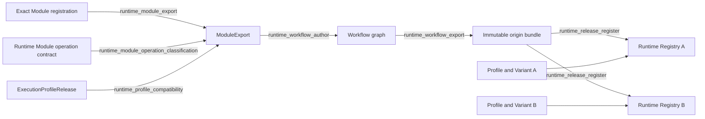

# Runtime Slice 2E: Workflow authoring and Profile compatibility

## 1. Requested result

Runtime 提供通用的 Module 与 Execution Profile capability closure，并提供一个以 graph 为核心的
`Workflow` authoring class。同一个 `WorkflowExport` 不携带目标 Runtime identity，因此宿主可以把同一份
immutable release bundle 原样注册到多个独立 Runtime Registry。

本 Slice 不迁移 Trading Platform plugin，不实现 Runtime client network transport，也不协调一次 execution
跨多个 Runtime instance 运行。

## 2. Primary flow

`Workflow` 只描述 graph 与固定 dependency closure。它的 origin bundle 不含 Execution Profile 或 Execution
Variant Policy。Registry A 和 Registry B 可以为同一 Workflow release 注册不同的 Profile 与 Variant
Policy，并分别保存自己的 active pointer；一个 Registry 的选择不影响另一个 Registry。

## 3. Interfaces

| interface_id | input | output | owner |
| --- | --- | --- | --- |
| `runtime_module_export` | exact Module source、Behavior/Evaluation/Retry releases、optional Execution Profile | dependency-closed `ModuleExport` | `runtime_module_authoring` |
| `runtime_module_operation_classification` | Module declared operation IDs | exactly one model operation 与 exact non-model operation set | `runtime_module_operation_contract` |
| `runtime_profile_compatibility` | Module operations/transports 与 exact `ExecutionProfileRelease` | 可用于 Variant compilation 的 compatible binding | `runtime_module_authoring` |
| `runtime_workflow_author` | repository-independent `WorkflowReleaseCandidate` 与 graph 引用的 exact `ModuleExport` | graph-backed `Workflow` | `runtime_workflow_authoring` |
| `runtime_workflow_export` | validated `Workflow` | `WorkflowRelease` 与不含 Profile/Variant Policy 的 canonical origin bundle | `runtime_workflow_authoring` |
| `runtime_release_register` | exact `RuntimeReleaseBundle` | target Registry registration result | `runtime_registry_release_catalog` |

## 4. Error codes

| error_code | condition | result | caller action |
| --- | --- | --- | --- |
| `MODULE_EXECUTION_PROFILE_UNAVAILABLE` | optional Profile 未提供 | 产生 non-executable `ModuleExport`；Profile 与 Variant 都为空 | 提供 exact Profile，或保留 non-executable export |
| `MODULE_OPERATION_DECLARATION_INVALID` | Module 声明零个或多个 model operation | 不产生 `ModuleExport`，不进入 Profile compatibility | 修正 Module operation declaration；`ModuleAuthoringError.error_code` 返回该 code |
| `MODULE_EXECUTION_PROFILE_INCOMPATIBLE` | transport 不兼容，或 Profile tools 与 Module non-model operations 不一致 | 不产生 `ModuleExport`，也不产生 Variant binding | 选择 capability 完全匹配的 Profile；`ModuleAuthoringError.error_code` 返回该 code |
| `WORKFLOW_MODULE_CLOSURE_INVALID` | graph node 缺少 exact Module ref/hash，或传入 graph 外 Module | 不产生 Workflow bundle | 只提供 graph 精确引用的 Module exports |
| `WORKFLOW_EXECUTION_BINDING_INVALID` | execution binding ref/document 不是固定 target-independent shape | 不产生 `WorkflowRelease` 或 bundle | 提供 exact `workflow_execution_binding_v1` descriptor |
| `REGISTRY_DEPENDENCY_UNRESOLVED` | bundle 缺少 referenced release | target Registry 不变 | 修复 bundle closure 后重试 |
| `REGISTRY_RELEASE_CONFLICT` | 同一 release identity 已对应不同 bytes | target Registry 不变 | 使用新版本，或恢复 identical content |

## 5. Module boundaries

### 5.1 `runtime_module_operation_contract`

`src/agent_runtime/contracts/execution_module_definition.py` 持有唯一的 model-operation ID 集合与 operation
classification。Registry authoring 和 Execution admission 消费同一份定义，不能各自维护 private set。每个
Module 必须声明且只声明一个 model operation，其余 operation 组成 exact non-model operation set。cardinality
错误通过 `ModuleAuthoringError.error_code=MODULE_OPERATION_DECLARATION_INVALID` 返回；Profile mismatch 使用
`MODULE_EXECUTION_PROFILE_INCOMPATIBLE`，两种失败都不产生 `ModuleExport`。

### 5.2 `runtime_module_authoring`

`ModuleReviewer` 不再拥有 tool-free 特例。所有 Module role 使用同一条 compatibility rule：Profile transport
必须属于 Module 声明；Profile 的 exact `tool_policy` 必须等于 shared contract 得到的 non-model operations。
Profile 缺失时允许产生 non-executable `ModuleExport`；supplied Profile 不兼容时直接失败，不产生 export 或
Variant binding。Execution 与 Invocation 继续决定某个 adapter/profile conjunction 是否已准入；authoring
不替它们做 provider admission。

现有 `Module.project(registry, exported)` 与 `ModuleReviewer.project(...)` 只读 registered facts，本 Slice 原样
保留。`runtime_module_authoring` 可以依赖 Registry public read interface，但不能直接写 Registry persistence。

### 5.3 `runtime_workflow_authoring`

`Workflow` 使用现有 `WorkflowReleaseCandidate` 与 `compile_workflow_release`。它不创建第二种 Workflow
record。`Workflow.export()` 合并 graph 引用的 `ModuleExport` fixed dependency closure，生成一份 canonical
origin bundle。该 bundle 包含 Schema、Prompt、Behavior、Evaluation、Retry、Module 和 Workflow releases，
明确排除 Execution Profile 与 Execution Variant Policy。相同 ref/hash 只保留一次；同一 Module 被多个 node
复用时仍只提供一份 export；相同 ref 对应不同 hash 时由 `runtime_workflow_authoring` 在构造 bundle 前拒绝。
graph 中每个 Module node 必须有且只有一个 exact ref/hash matching export；graph 外 Module 不进入 bundle。

`ModuleExport` 因此必须保留生成 fresh Registry origin bundle 所需的 exact Behavior、Evaluation、Retry、
Schema、Prompt 和 Module releases；optional Profile 与 Variant 继续作为 fixed origin closure 外的独立 records。

进入 Workflow hash 的 execution binding 也必须 target-independent。`execution_binding_ref` 只能由
`workflow_id + workflow_version` 得到；`execution_binding_document` 只能包含三个字段：
`schema_version=workflow_execution_binding_v1`、matching `workflow_id` 和
`variant_policy_family=execution_variant_policy`。额外字段、target Runtime identity、Profile ref 或 exact
Variant Policy ref 都由 compiler 拒绝。测试必须证明改变 target-local Profile/Variant 不改变 Workflow ref/hash。

`Workflow` 的 public exports 同时由 `src/agent_runtime/registry/__init__.py`、`src/agent_runtime/__init__.py` 和
Runtime conformance manifest 管理，并由 `tests/test_agent_runtime_workflow_authoring.py` 验证。

### 5.4 `runtime_registry_release_catalog`

Registry API 保持不变。所谓“加入多个 Runtime”是 caller 将同一个 immutable origin bundle 分别提交给多个
独立 Registry，再为各 Registry 分别注册 Profile 与 Variant Policy，不是 Runtime 新建跨 Registry coordinator。
每个 Registry 的 registration、failure、execution binding 和 active pointer 互相隔离。该 seam 的新增测试
统一放在 `tests/test_agent_runtime_workflow_authoring.py`；Registry 自身已有测试不重复增加。

## 6. Slice boundary and tests

本 Slice 只修改 Runtime authoring 与对应测试：

- tool-free Profile 正例；
- Gateway tool Profile 正例；
- authoring 与 Execution 使用同一份 model-operation classification；
- transport、extra tool 和 missing tool 负例；
- Workflow graph exact Module closure；
- Workflow export hash 与 dependency closure；
- Workflow execution binding 的 target/Profile/Variant identity absence；
- 同一 export 注册到两个独立 Registry；
- 两个 Registry 的 active pointer 独立；
- 两个 Registry 为同一 Workflow 注册不同 Profile 与 Variant Policy；
- identical registration replay。

Trading Platform migration、provider invocation、network client、cross-Runtime execution coordination 和
PostgreSQL schema change 都不进入本 Slice。

## 7. Completion and rollback

完成条件是 focused authoring tests 与 Runtime full regression 全部通过，且 frozen candidate 通过独立
Engineering Change Review。回滚只恢复本 Slice 的 Runtime authoring 与测试文件；Registry schema、现有
release、active pointer 和 Trading Platform source 都不改变。
