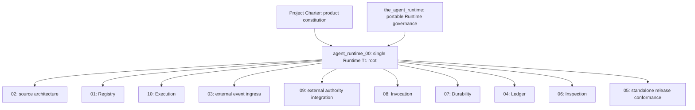

# Agent Runtime Design Contract System Review

Review baseline: `e8366e7` on `codex/workflow_execution_services`, including the
current protected dirty worktree.

Review status: Primary Agent proposal. The target map requires accountable-owner
approval before canonical Design Docs or implementation are changed.

Required reader gain: after reading this review, a Runtime maintainer can decide
the target authority hierarchy, assign every current contract to one semantic
owner, preserve valid technical law while removing host and domain ownership,
and execute the canonical rewrite without reopening all 6,747 source lines.

## 1. Decision

The current Design Contract set needs a structural rewrite before implementation
architecture changes continue.

The target system has three authority layers. Here, T0 means project-level
governing authority, T1 means the single Runtime domain root, and T2 means a
specialized contract delegated by that root.

1. T0 authority defines product identity and portable governance law.
2. The T1 root owns the complete Agent Runtime domain and delegates its
   internal responsibilities.
3. T2 contracts own cohesive Runtime responsibilities or cross-responsibility
   engineering contracts under that root.

The target Runtime responsibilities remain Registry, Execution, Invocation,
Durability, Ledger, and Inspection. Source architecture and standalone release
conformance govern these responsibilities without becoming additional product
responsibilities.

The present set cannot be corrected by changing frontmatter alone. The current
documents assign T1 status to every numbered contract, point several
`agent_runtime_*` files at external parents, combine unrelated architecture axes,
and ship host-owned contracts inside the Runtime wheel.

## 2. Review Boundary and Evidence

This review covers:

- `designDoc/the_charter.md`;
- `designDoc/the_agent_runtime.md`;
- `designDoc/agent_runtime_00_execution_charter.md`;
- `designDoc/agent_runtime_01` through `agent_runtime_10`;
- the code-owned architecture registration;
- the Design Contract bundle builder and generated bundle;
- the protected dirty implementation and test lane; and
- the existing systematic rebuild assessment and independent review.

This review does not change canonical Design Docs, generated package files,
Runtime implementation, tests, or the neighboring `trading_platform` repository.

### 2.1 Verified repository evidence

| Evidence surface | Verified result |
| --- | --- |
| Branch and baseline | `codex/workflow_execution_services` at `e8366e7` |
| Canonical Runtime contract size | 6,747 lines across the Charter, Runtime T0, and eleven numbered documents |
| Full test run | 427 passed, 4 failed, 20 skipped using `../trading_platform/.venv/bin/python` |
| Architecture registration | Internal and repository validation pass |
| Test failures | One naming failure, two generated-bundle parity failures, and one truth-surface denominator failure |
| Generated bundle drift | `the_agent_runtime.md`, `agent_runtime_01_module_contract_and_assembly.md`, and `manifest.json` |
| Runtime source map | 75 Python files with five explicit migration-debt files |
| Runtime package ownership | Documents 02, 05, and 10 are labeled external authority but still ship; document 04 is labeled Runtime-owned despite having no Runtime implementation |

### 2.2 Status of prior review evidence

`review_artifacts/systematic_rebuild_e8366e7/architecture_assessment.md` remains
useful evidence for the six responsibilities, current import problems, oversized
contract families, source ownership defects, and the target dependency direction.
It predates the filename-defined T1 and T2 hierarchy and therefore does not own
the final contract map.

The existing independent architecture review blocks implementation on release
identity, package ownership, authoring-repository discovery, and missing
architecture enforcement. Those findings remain relevant after the correction
below.

The prior review describes the 36 generated-only lines in packaged
`agent_runtime_01` as schema-projection rules. Direct byte comparison shows a
different current fact. The lines require Skill and Design Doc prose to contain
an exact Module ID and introduce `.claude/skills/.../runtime_workflows` authoring
paths. The canonical document already contains the native structured-output
projection rules. The generated-only lines must therefore be routed as
authoring-governance and build-tooling material, not copied into Invocation.

## 3. Classification Axes

The rewrite must keep four views separate.

| Axis | Governing question | Examples |
| --- | --- | --- |
| Authority hierarchy | Which Design Doc may define the meaning? | T0, T1 root, T2 specialization |
| Logical responsibility | Which Runtime capability owns the behavior? | Registry, Execution, Invocation, Durability, Ledger, Inspection |
| Physical implementation | Where is code currently placed? | `contracts/`, `registry/`, `testing/` |
| Technology binding | Which replaceable implementation realizes a port? | PostgreSQL, Temporal, Claude Agent SDK, Codex CLI, HTTP, HTML |

A document may relate several axes, but every section must identify the axis it
describes. A directory or technology cannot become a peer Runtime responsibility.
A T2 contract may govern a cross-responsibility architecture rule, but it must
state that mapping instead of creating a seventh product responsibility.
Provider-neutral types shared by multiple responsibilities are supporting
foundation primitives governed by source architecture. They are not a seventh
responsibility and must not create a reverse dependency on a higher-level
responsibility.

## 4. Target Authority Map

### 4.1 Target contract set

The filenames below are proposed canonical names. Final filenames are approved
with the map before any rename occurs.

| Target contract | Layer | Single semantic owner | Runtime responsibility mapping | Primary result |
| --- | --- | --- | --- | --- |
| `the_charter.md` | T0 | Agent Runtime product constitution | All six | Defines the independently publishable product boundary and completion conditions |
| `the_agent_runtime.md` | T0 | Portable provider-neutral Runtime governance | All six | Defines stable cross-project Runtime law and external authority boundaries |
| `agent_runtime_00_runtime_domain_contract.md` | T1 | Agent Runtime domain | All six | Owns the domain outcome, public handoffs, delegation map, and shared invariants |
| `agent_runtime_01_registry_contract.md` | T2 | Runtime Registry | Registry | Owns immutable release compilation, validation, admission, activation, and retrieval |
| `agent_runtime_02_source_architecture_contract.md` | T2 | Agent Runtime source architecture | All six | Owns source ownership, import direction, public surfaces, supporting foundation primitives, file cohesion, and migration-debt enforcement |
| `agent_runtime_03_external_event_ingress_contract.md` | T2 | Runtime Execution event boundary | Execution | Owns external-event intake, application, idempotency, and acknowledgement ordering |
| `agent_runtime_04_execution_ledger_contract.md` | T2 | Runtime Execution Ledger | Ledger | Owns append-only execution facts, record families, persistence ordering, and lineage validation |
| `agent_runtime_05_standalone_release_conformance_contract.md` | T2 | Runtime release conformance | All six | Owns wheel contents, package closure, technical conformance, and release evidence exposed to Software Delivery |
| `agent_runtime_06_inspection_contract.md` | T2 | Runtime Inspection | Inspection | Owns authorized read models, query boundaries, live inspection, and offline export |
| `agent_runtime_07_durability_contract.md` | T2 | Runtime Durability | Durability | Owns the provider-neutral durable port, ref-only coordination, replay, recovery, and adapter conformance |
| `agent_runtime_08_invocation_contract.md` | T2 | Runtime Invocation | Invocation | Owns Context assembly, capability enforcement, provider and tool ports, normalization, and adapter conformance |
| `agent_runtime_09_external_authority_integration_contract.md` | T2 | Runtime external-authority ports | Execution | Owns consumption of host authorization and governed-data decisions, fencing, and protected-operation handoff |
| `agent_runtime_10_execution_contract.md` | T2 | Runtime Execution | Execution | Owns Workflow and Module execution lifecycle, state advancement, Evaluation, Resolution, and coordination ordering |

### 4.2 Root contract correction

The current `agent_runtime_00_execution_charter.md` is the only filename-defined
T1 root, but its Purpose and body primarily own Execution mechanics. A T1 root
must cover the complete Runtime domain and delegate all six responsibilities.

The proposed correction rewrites and renames document 00 as the Runtime domain
root. Its detailed execution lifecycle moves to document 10. This preserves one
root while giving Execution a peer T2 contract beside Registry, Invocation,
Durability, Ledger, and Inspection.

### 4.3 T0 separation

The Charter and `the_agent_runtime.md` serve different readers.

- The Charter defines this repository's product identity, scope, authority
  topology, and minimum independently publishable result.
- `the_agent_runtime.md` defines reusable provider-neutral Runtime law inherited
  by a T1 implementation domain.
- The T1 root defines how this product realizes that law and delegates its
  internal contracts.

The Runtime T0 should stop carrying current implementation bindings, current
source paths, provider-specific capability status, and a manually maintained T2
inventory. Those facts belong to the T1 and T2 contracts, code-owned
registrations, generated inspection, and this repository's Charter.

## 5. Current Document Disposition

| Current document | Proposed disposition | Preserved contract | Material moved out or reassigned |
| --- | --- | --- | --- |
| `the_charter.md` | Keep with focused alignment edits | Product boundary, six responsibilities, external authorities, hierarchy law, completion conditions | Exact target T1 root name and final package-closure statement update after map approval |
| `the_agent_runtime.md` | Rewrite and narrow | Provider-neutral execution law, immutable releases, execution identity, external authority boundary, isolation and recovery invariants | Current implementation paths, provider capability status, T2 inventory, package status, and detailed responsibility contracts |
| `agent_runtime_00_execution_charter.md` | Rewrite and rename | Runtime domain outcome, shared execution identities, cross-responsibility ordering invariants | Execution-specific state machine and lifecycle move to target document 10; Ledger facts move to 04 |
| `agent_runtime_01_module_contract_and_assembly.md` | Rewrite and narrow | Release object model, dependency closure, admission, activation, exact retrieval, graph assembly | Provider schema projection moves to 08; Module execution records move to 10 and 04; authorization moves to 09; working-tree discovery moves to build tooling; Theme example retires |
| `agent_runtime_02_product_target_topology.md` | Move current authority, then rewrite the Runtime number | Ref-only durable payload, replaceable backend binding, and portable isolation conformance | Deployment horizons, zones, Cell placement, pooling, credentials, and host topology move to the Agency Platform owner in `trading_platform`; number 02 becomes Runtime source architecture |
| `agent_runtime_03_authorized_external_event_ingress.md` | Keep and rewrite as T2 | Separation of authorization, domain legality, ingress, application, and acknowledgement; idempotency and crash windows | Host-specific Product Authorization service refs become public external-port refs; durable mechanics defer to 07 |
| `agent_runtime_04_publication_transaction_contract.md` | Move or retire current authority, then rewrite the Runtime number | Generic lesson that a protected effect needs upstream intent, external authorization, idempotency, and effect evidence | Publication intent, canonical target, compare-and-set write, publication ledger, and credentials belong to the host or domain; number 04 becomes Ledger |
| `agent_runtime_05_delivery_roadmap.md` | Retire as roadmap and rewrite as conformance | Stable standalone package closure and technical evidence classes | Delivery sequence, current gate progression, domain milestones, host readiness, and release admission belong to Software Delivery; number 05 becomes Runtime release conformance |
| `agent_runtime_06_standalone_package_and_lifecycle_contract.md` | Split and rewrite as Inspection | Authorized read-only Inspector behavior and projection boundary | Source architecture moves to 02; package closure moves to 05; execution lifecycle moves to 10; append-only facts and persistence move to 04 |
| `agent_runtime_07_temporal_durable_adapter_contract.md` | Rewrite and rename | Durable port, ref-only state, acknowledged commands, crash recovery, replay, worker replacement, adapter conformance | Current Temporal selection and implementation status move to code-owned inspection; Temporal remains a replaceable binding, not the contract owner |
| `agent_runtime_08_agent_execution_adapter_contract.md` | Keep and narrow | Provider-neutral invocation protocol, capabilities, Context, workspaces, tools, network, schema projection, normalization, and adapter conformance | Execution record finalization moves to 10 and 04; authorization evidence semantics move to 09; current provider admission matrix moves to generated inspection |
| `agent_runtime_09_authorization_integration_contract.md` | Keep and generalize | External authorization-context consumption, operation intents, enforcing-Gateway handoff, fencing, invalidation, and late-result law | Host persistence schemas and absent host T1 references leave the Runtime package; this contract remains an Execution specialization, not a seventh responsibility |
| `agent_runtime_10_workflow_execution_binding_and_admission_contract.md` | Move current authority, then rewrite the Runtime number | Runtime intake must receive an exact host-selected binding and independently validate Runtime release closure | Product workflow registry, behavior release, Dagster choice, execution class, host binding, routing, and deployment scope move to Agency Platform; number 10 becomes Runtime Execution |

## 6. Semantic Redistribution Map

This map prevents contract loss while the current documents are split.

| Current semantic surface | Target owner |
| --- | --- |
| Schema Asset, Prompt, Execution Profile, Module, Workflow, adapter, and admission releases | Registry contract 01 |
| Source ownership, import graph, public symbol manifest, supporting foundation primitives, naming, file cohesion, technology bindings, and migration debt | Source architecture contract 02 |
| External event ingress and acknowledged application | Event ingress contract 03 |
| Attempt, output, call, usage, failure, Outcome, Resolution, checkpoint, and acknowledgement facts | Ledger contract 04 |
| Wheel membership, Design Contract bundle, clean installation, dependency isolation, and technical release evidence | Standalone release conformance contract 05 |
| Release and execution read models, content authorization, live Inspector, and offline export | Inspection contract 06 |
| Durable commands, cursor, wait, timer, retry, replay, backend recovery, and Temporal conformance | Durability contract 07 |
| Prompt Envelope, semantic input projection, capability profile, workspace, provider and tool invocation, schema projection, Context, result and failure normalization | Invocation contract 08 |
| Execution authorization context, protected-operation intent, external decision refs, data-access handoff, fence, invalidation, and late-result quarantine | External authority integration contract 09 |
| Workflow Execution, Module Run, Variant and Attempt coordination, state advancement, Evaluation, Selection, Resolution, cancellation, and cross-responsibility commit order | Execution contract 10 |

## 7. Confirmed Contradictions

### 7.1 Filename hierarchy and declared parents disagree

Every current numbered document declares `layer: T1`. The filename rule makes
only document 00 the T1 root; documents 01 through 10 are T2 under that root.
Documents 02, 05, and 10 also declare external T0 parents. Frontmatter cannot
override the filename-defined parent.

Resolution: rewrite the hierarchy atomically. External authority moves before a
reused Runtime filename is admitted.

### 7.2 The T1 root is narrower than its required domain

Document 00 primarily owns Execution, while the T1 root must govern Registry,
Execution, Invocation, Durability, Ledger, and Inspection as one Runtime domain.

Resolution: rewrite document 00 as the domain root and move detailed Execution
law to target document 10.

### 7.3 The shipped bundle contains external authority

The builder labels documents 02 and 10 as Agency Platform and document 05 as
Software Delivery, then includes all three in `CANONICAL_DOCUMENTS`. Document 04
is labeled Runtime-owned even though Runtime has no publication implementation.

Resolution: package only Runtime-owned contracts with Runtime-local parent
closure. The host-owned content receives a separately authorized move or is
retired after its owner confirms preservation.

### 7.4 Current Design Contract ownership crosses responsibilities

The code-owned architecture registry maps document 06 to Registry, Execution,
Ledger, and Inspection files. Document 02 owns three Durability files while its
semantic owner is Agency Platform. Document 05 owns a Registry migration
validator while its semantic owner is Software Delivery. Document 00 also owns a
Ledger source file while acting as an Execution charter.

Resolution: reassign every source file after the target contracts exist. Each
file keeps one logical responsibility, one physical location, and one canonical
contract owner.

### 7.5 Registry currently depends on Invocation implementation

`registry_release_compilation.py` imports
`invocation_schema_projection.task_plane_output_schema`. Ledger imports an
Invocation tool definition, and Inspection imports a concrete Durability
descriptor. The architecture registry validates file registration but does not
enforce import direction or cycle freedom.

Resolution: contract the dependency direction in document 02 before moving
code. Provider-neutral schema primitives become an internal foundation surface
below Registry and Invocation, governed by document 02 rather than promoted to
a peer responsibility. Execution coordinates results into Ledger; Inspection
reads Registry and Ledger facts only.

### 7.6 The protected dirty lane introduces two design defects

The current `ExecutionProfileRelease` change accepts a legacy payload hash and a
current payload hash for the same logical profile, then changes `as_dict()`
shape according to the stored hash. The current Module export change scans
`.claude/skills`, requires prose token presence in Skill and Design Doc files,
and adds repository-wide discovery inside Runtime Registry.

Resolution: keep both lanes protected until the target design is approved. The
release model retains one canonical payload and identity. Repository and vendor
authoring discovery moves to external build tooling that submits one immutable,
structured registration bundle.

### 7.7 Generated package drift has the wrong prior interpretation

The 36 generated-only lines are authoring-path and prose-closure rules. They are
not the schema-projection contract described by the prior review. Copying them
into Invocation would assign them to the wrong owner.

Resolution: preserve the file until disposition is approved. Retain the semantic
requirement that Module and Workflow candidates have explicit owner and closure
records. Remove the `.claude` path and prose-token enforcement from Runtime core.

### 7.8 Stable intent contains mutable implementation status

Documents 01, 05, 06, 07, and 08 describe current adapters, current admission
slices, migration state, current implementation maturity, commands, and blocked
future work.

Resolution: stable contracts define required behavior and failure conditions.
Code-owned registries, generated inspection, Software Delivery evidence, and
session handoffs carry current status.

### 7.9 Current test failures expose contract drift rather than implementation regression

The full suite has four failures. The `Bash` inline name conflicts with the
canonical naming test. Two failures come from generated bundle drift. The truth
surface test expects 72 repository paths, while the edited Runtime T0 replaces
nine physical paths with logical Registry references.

Resolution: rewrite the authority map first. Use a canonical capability name
for sandbox command execution. Recompute the physical truth-surface denominator
from the approved T1 and T2 set rather than restoring current implementation
paths to portable T0 prose merely to satisfy the old count.

## 8. Minimal Canonical Rewrite Order

The order below is required because later contracts depend on earlier ownership
decisions.

1. Approve this target authority map and the cross-repository move boundary.
2. Align the Charter and narrow `the_agent_runtime.md` to stable T0 law.
3. Rewrite and rename document 00 as the single Runtime T1 root.
4. Rewrite document 02 as the source architecture contract, including import
   direction, public surfaces, ownership, and migration-debt enforcement.
5. Rewrite Registry document 01 against the approved architecture.
6. Rewrite Ledger document 04, Invocation document 08, and Durability document
   07 as lower-level peer contracts.
7. Rewrite external authority integration document 09.
8. Rewrite Execution document 10, then event ingress document 03.
9. Rewrite Inspection document 06 over Registry and Ledger facts.
10. Rewrite standalone release conformance document 05 over the final Runtime
    contract and package closure.
11. Reassign code ownership and references without changing behavior.
12. Regenerate the packaged Design Contract bundle mechanically and update
    contract tests to the approved denominator.
13. Run deterministic architecture, package, contract, and full repository
    tests before implementation restructuring begins.

## 9. Validation and Instance Selection

This Design-system review needs repository evidence only. It does not require a
business instance from `trading_platform`.

Later host-integration validation selects a trading-platform instance only after
the exact Runtime contract and selection criteria are stated. The minimum
selection rules are:

| Runtime contract under test | Required instance characteristics |
| --- | --- |
| Host-selected Runtime intake | One instance with an immutable host binding, exact Runtime Workflow Release, authorization context, and frozen input closure |
| External event ingress | One instance paused at an explicit external wait with a stable snapshot token and legal typed event |
| Governed data access | One Module instance with declared protected reads, an enforcing Gateway, and observable allow and deny cases |
| Invocation capability | One Module instance whose exact profile isolates the capability being tested, such as tool-free inline, private draft workspace, or Gateway read |
| Durable recovery | One instance with a committed effect before acknowledgement so replay can prove that the effect is not repeated |

The same instance is reused across tests only when its authority, release, input,
profile, and expected state satisfy every test's declared criteria. Domain
familiarity alone is not a selection criterion.

## 10. Approval Boundary

Approval of this review authorizes canonical Design Doc restructuring in the
order above. It does not authorize:

- editing or discarding the protected dirty implementation lane;
- regenerating the packaged Design Contract bundle before canonical closure;
- moving files into `trading_platform` without explicit cross-repository scope;
- implementing the target import graph or public API; or
- publishing a Runtime wheel.

The next artifact after approval is the rewritten Charter, Runtime T0, and T1
root candidate. That candidate receives a new self-review and an independent
architecture review before implementation work resumes.
