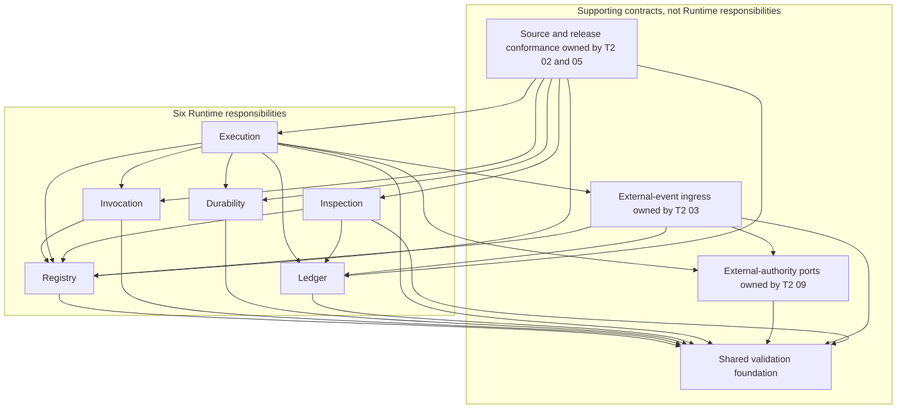

# Agent Runtime Domain Contract

**Purpose**: Define the Agent Runtime as one independently governed product
domain, delegate its six peer responsibilities, and specify the public handoffs,
shared identities, ordering invariants, and completion conditions that every
Runtime specialization must preserve.

**Required reader gain**: A reader can identify the Runtime product outcome,
its public host and plugin boundaries, the single owner of each responsibility,
the direction in which responsibilities may depend on one another, and the
cross-responsibility evidence required before implementation or release may be
called complete.

## 0. Contract Capsule

```yaml
layer: T1
status: candidate
canonical_owner: designDoc/agent_runtime_00_runtime_domain_contract.md
parent: designDoc/the_agent_runtime.md
owned_system_object: independently governed Agent Runtime domain
inherits:
  - designDoc/the_charter.md
  - designDoc/the_agent_runtime.md
  - designDoc/the_product_authorization.md
  - designDoc/the_data_governance.md
  - designDoc/the_timestamp_semantic.md
scope:
  - Runtime domain outcome and public handoffs
  - Registry, Execution, Invocation, Durability, Ledger, and Inspection delegation
  - shared Runtime identity and release law
  - cross-responsibility call, commit, recovery, and acknowledgement ordering
  - external authorization and governed-data integration boundary
  - standalone package and conformance result
non_goals:
  - domain graph meaning, business role, quality rubric, or terminal product decision
  - host task routing, product workflow selection, deployment topology, or user interface
  - provider, model, database, durable backend, SDK, CLI, or renderer selection
  - detailed T2 record schemas, state machines, adapter protocols, or current bindings
  - current source inventory, implementation status, test result, or delivery plan
specialization_contracts:
  - designDoc/agent_runtime_01_registry_contract.md
  - designDoc/agent_runtime_02_source_architecture_contract.md
  - designDoc/agent_runtime_03_external_event_ingress_contract.md
  - designDoc/agent_runtime_04_execution_ledger_contract.md
  - designDoc/agent_runtime_05_standalone_release_conformance_contract.md
  - designDoc/agent_runtime_06_inspection_contract.md
  - designDoc/agent_runtime_07_durability_contract.md
  - designDoc/agent_runtime_08_invocation_contract.md
  - designDoc/agent_runtime_09_external_authority_integration_contract.md
  - designDoc/agent_runtime_10_execution_contract.md
outputs:
  - stable Runtime public host and extension handoffs
  - complete responsibility and Design Contract delegation
  - shared identity, authority, isolation, and recovery invariants
  - machine-contract and release-conformance obligations
truth_surfaces:
  - designDoc/agent_runtime_00_runtime_domain_contract.md
  - code-owned Runtime architecture and public-surface registrations
  - immutable Runtime releases
  - canonical Runtime Ledger and release-conformance evidence
```

## 1. Domain Outcome

The Agent Runtime domain turns one exact, admitted, externally authorized
execution binding into durable Workflow and Module progress, resolved output
references, canonical execution lineage, and authorized inspection.

It supports two product-neutral execution origins:

1. an exact Workflow release selected by a host; and
2. one exact Module release invoked independently when its release and external
   authority permit that origin.

Testing, Evaluation, replay, repair, and migration may use controlled execution
origins defined by the owning T2 contracts. Such origins produce the same
identity, authority, Invocation, Ledger, and recovery lineage as production;
they do not create a second execution system.

Runtime treats Module roles, graph states, branch meanings, evaluation content,
and terminal business outcomes as opaque domain values. A one-Module Workflow
is valid when the host owns an independent product lifecycle for it. A Module
does not become a Workflow merely because it can execute independently.

## 2. Responsibility and Contract Delegation

The Runtime has six peer logical responsibilities. Each responsibility has one
primary T2 owner. T2 numbering supports human navigation and establishes
neither authority rank nor execution order.

| Responsibility | Primary T2 owner | Owned result |
| --- | --- | --- |
| Registry | `agent_runtime_01_registry_contract.md` | Immutable release closure, admission, activation, deactivation, withdrawal, exact retrieval, and Registry-store schema lifecycle |
| Execution | `agent_runtime_10_execution_contract.md` | Public host lifecycle, Workflow and Module coordination, Attempt policy, Evaluation, Selection, Resolution, cancellation, and reconciliation |
| Invocation | `agent_runtime_08_invocation_contract.md` | Model-visible Context, tool session, workspace boundary, provider invocation, bounded observations, and adapter conformance |
| Durability | `agent_runtime_07_durability_contract.md` | Provider-neutral durable commands, bounded snapshots, timers, waits, replay, recovery, and adapter conformance |
| Ledger | `agent_runtime_04_execution_ledger_contract.md` | Canonical execution facts, content refs, atomic batches, durable authority-fence facts, monotonic append order, atomic fence comparison, custody facts, query ports, and Ledger-store schema lifecycle |
| Inspection | `agent_runtime_06_inspection_contract.md` | Authorized query scopes, bounded read models, pagination, live inspection, and offline export |

Four T2 contracts specialize or validate those six responsibilities without
creating additional peers:

| T2 contract | Owned specialization | Consumes but does not own |
| --- | --- | --- |
| `agent_runtime_02_source_architecture_contract.md` | Source ownership, import direction, public namespaces, foundation boundary, cohesion signals, and migration-debt enforcement | Runtime behavior and release admission |
| `agent_runtime_03_external_event_ingress_contract.md` | External-event identity, legal-wait matching, idempotent receipt, and acknowledgement protocol | Authorization observations from document 09; it owns no Execution state, durable submission, or backend implementation |
| `agent_runtime_05_standalone_release_conformance_contract.md` | Runtime distribution closure, public-surface conformance, adapter evidence, integration evidence, and frozen release subject | Software Delivery admission |
| `agent_runtime_09_external_authority_integration_contract.md` | Execution-time external-authorization and governed-data observation ports, operation intents, fence-value semantics, invalidation, late-result quarantine, and newly authorized compensation requests | Resource semantics and lifecycle enforcement owned by each protected-resource responsibility; durable fence facts and comparison owned by document 04; finalization timing, Workflow advancement, event lifecycle, and Runtime state transitions owned by document 10 |

Every persistent responsibility owns the schema identity, ordered migration,
startup compatibility refusal, and recovery evidence for its own store.
Registry and Ledger retain their record meaning, schema meaning, and intended
writer semantics. Data Governance registers each persistent record family as a
managed Data Asset, binds its one System of Record and writer boundary, and
governs forward and rollback transition registration, reconciliation, and the
rollback window. Software Delivery admits migration code and deployment.
Neither handoff transfers Registry or Ledger semantic ownership.

The external-authority fence is one boundary with three owners, not three
competing implementations. Document 09 defines what an observed fence value
means and when external authority invalidates it. When clock domains differ,
document 09 pins the registered protected predicate and immutable
`DistributedClockProfile` and requires fresh `ClockHealthEvidence` in the
authority observation. Document 04 durably records those exact refs and hashes,
preserves monotonic append order, and performs the atomic fail-closed
comparison. Document 10 decides when finalization requests that comparison and
how execution state advances from the result.

Document 09 does not centralize authorization for every Runtime-owned resource.
Each Runtime responsibility that owns a protected resource acts as the Policy
Enforcement Point for its own operations under Product Authorization and
publishes its own `ResourcePermissionManifest`. Registry lifecycle enforcement,
for example, remains a Registry boundary and does not import document 09's
execution-time ports. When an enforcement point judges an external decision's
validity across clock domains, it consumes a registered Timestamp Semantics
protected predicate, pins its immutable `DistributedClockProfile`, requires
fresh `ClockHealthEvidence`, records those refs with the protected fact, and
fails closed on missing or unverifiable evidence.

The canonical T1 root and its ten specialization contracts form one admission
closure. Candidate authoring and review may proceed one T2 at a time, while the
current canonical root and T2 set remain active. Canonical admission replaces
the old root and all ten target T2 contracts atomically; the Design Doc
contract registry never exposes two active document-00 roots or a root whose
specialization closure is unresolved.

## 3. Supporting Foundation and Dependency Direction

A small supporting foundation may own canonical serialization, content hashing,
stable ID construction, ref and timestamp validation, immutable byte values,
and provider-neutral schema traversal required by more than one responsibility.
It owns no release, Workflow, Attempt, authorization, backend, persistence
policy, or inspection model.

Timestamp validation enforces the instant meaning, format, precision, and
ordering semantics owned by `the_timestamp_semantic.md`. The supporting
foundation does not define or widen those semantics. Format or ordering
validation in the foundation does not satisfy a protected cross-clock
predicate; documents 09, 04, and 10 retain the evidence and decision split
defined in section 2.

The target logical dependency direction is:



An arrow means that the source consumes a public contract or port from the
target. The containing boxes identify node class, not deployment containment.
There is no peer reverse edge. Concrete adapters may depend on their own
external SDK and their responsibility's public contracts. Another responsibility
cannot import that concrete adapter as its authority.

Document 02 owns the exact machine-checked allowed-import graph, public-surface
manifest, file ownership, and migration-debt high-water mark.

## 4. Shared Runtime Identities

Every T2 uses the same logical identity chain:

```text
Runtime release closure
Host execution binding and external authorization context
Runtime Execution
Workflow Execution, only when Workflow-originated
Module Run under that Workflow Execution or directly under Runtime Execution
Execution Variant
Attempt
Invocation and protected-operation observations
Execution outputs
Evaluation and Selection, when required
Module Output Resolution
Outcome, checkpoint, and backend acknowledgement
```

Identity ownership is fixed:

- Registry owns immutable Runtime release identities and exact dependency
  closure;
- Execution creates the common Runtime Execution identity, the conditional
  Workflow Execution identity, Module Run, Variant, Attempt policy, Evaluation
  coordination, Selection, Resolution, and Outcome decisions;
- Invocation returns typed provider and tool observations under one Attempt;
- Ledger assigns canonical fact identity, transaction order, and content refs;
- Durability maps Runtime execution identity to acknowledged backend progress;
- Inspection projects already-authorized Registry and Ledger facts.

The external host owns product workflow identity, route selection, tenant and
deployment binding, and the exact host-to-Runtime execution binding. Product
Authorization owns Principal and permission authority. Data Governance owns
governed-data and content-custody policy. Runtime pins their opaque refs and
hashes but creates none of those external identities.

## 5. Public Handoffs

### 5.1 Host execution service

The Runtime distribution provides one Runtime-owned service implementing the
complete public lifecycle:

- start an exact admitted execution idempotently;
- read bounded status and result references;
- request cancellation under external authority;
- accept an externally authorized event at a legal wait;
- accept a pushed authority invalidation through the authorized Execution
  service action;
- reconcile an intent or committed result lacking backend acknowledgement; and
- recover execution after worker or process replacement.

The service receives narrow ports. It does not require exact concrete
in-memory Registries, Ledgers, authorization controllers, provider adapters, or
durable backends.

### 5.2 Plugin and release handoff

A domain or authoring tool submits one structured, content-addressed candidate
bundle. Runtime Registry validates the bundle without discovering a mutable
working tree, provider-specific Skill directory, or host product catalog.

Registration grants neither product routing nor authorization. A host start
command references one exact admitted release closure and an externally owned
execution binding.

### 5.3 Adapter handoff

Provider and durable adapters implement provider-neutral Runtime ports and are
admitted by exact adapter release. Behavior-bearing options, capability bounds,
failure classification, environment policy, output budgets, snapshot bounds,
and compatibility are part of the owning adapter contract and release.

### 5.4 Inspection handoff

The host authenticates the caller and resolves an opaque authorized query
scope. Inspection applies that scope at the Registry or Ledger query boundary,
then retains per-object authorization as defense in depth. The host receives
bounded summaries, stable page cursors, and individually authorized content
access rather than an unbounded execution object.

## 6. Cross-Responsibility Start Ordering

One start follows this invariant order:

1. Execution receives an exact host command and stable idempotency identity.
2. Registry resolves and validates the admitted release closure.
3. Document 09 ports validate the external authorization and governed-input
   context without issuing new authority.
4. Ledger atomically commits the binding, active fence, start intent, and
   common Runtime Execution fact; for Workflow origin it also commits the
   Workflow Execution fact, while for independent Module origin it commits the
   root Module Run binding and no Workflow identity.
5. Durability receives an idempotent frozen start command containing no mutable
   Registry lookup requirement.
6. Execution receives the backend execution identity and bounded snapshot.
7. Ledger commits backend acknowledgement.
8. The host receives the Runtime execution handle.

If the process fails after start intent and before acknowledgement, recovery
replays the same idempotent durable command and commits only the missing
acknowledgement. It creates no second Runtime Execution or origin-specific
lineage root.

## 7. Cross-Responsibility Attempt Ordering

One Module dispatch follows this invariant order:

1. Execution loads the exact dispatch, release, and current Ledger state.
2. A committed Outcome for the same dispatch is returned without new work.
3. Ledger records the next legal Attempt claim and current durable authority
   fence.
4. Required protected-operation intents are committed before external access.
5. Invocation or an enforcing Gateway performs one admitted operation and
   returns bounded observations and bytes.
6. Content bytes are staged under integrity and custody policy.
7. In one Ledger transaction, Execution compares the active claim and current
   fence, then commits terminal Attempt, calls, usage, content refs, Evaluation,
   Selection, Resolution, Outcome, and checkpoint facts that are ready.
8. Execution submits the committed Outcome ref to Durability.
9. Ledger commits the backend acknowledgement.

An unexpected adapter or Runtime exception does not become a provider retry.
Only a typed failure admitted by the exact retry policy may create the next
Attempt. Recovery repeats no committed provider call or protected effect.

Document 10 owns the state machine and dispatch policy. Document 04 owns the
record and transaction families. Documents 07 through 09 own their respective
adapter and external-authority handoffs.

## 8. External Event Application Boundary

Runtime does not claim atomicity across Ledger and an external durable backend
when no shared transaction exists. The contract is recoverable:

1. Execution applies document 03's identity and legal-wait protocol, then asks
   Ledger to commit one idempotent ingress intent with the expected authorized
   snapshot;
2. Execution submits one idempotent event command to Durability;
3. Durability returns the backend-authoritative resulting snapshot;
4. Execution asks Ledger to commit application and backend acknowledgement
   facts; and
5. Execution reconciliation repairs any durable intent lacking acknowledgement
   under document 10 policy.

Domain legality, Product Authorization, ingress acceptance, backend delivery,
application, and acknowledgement are distinct decisions with distinct
evidence. Document 03 owns the ingress identity, legal-wait matching, receipt,
and acknowledgement protocol. Document 09 supplies authorization observations.
Document 10 executes durable submission and alone owns reconciliation policy
and Workflow state advancement; document 07 executes the frozen durable
command.

## 9. Persistence, Content, and Inspection Invariants

### 9.1 Persistent schema

Each persistent adapter declares one exact supported schema release. Registry
T2 owns Registry-store schema lifecycle; Ledger T2 owns Ledger-store schema
lifecycle. An ordered migration mechanism runs outside ordinary service startup
mutation. Runtime startup checks compatibility and refuses unsupported or
incomplete states.

Migration design defines clean creation, forward upgrade, interrupted-migration
recovery, compatibility refusal, and a documented restore or forward-repair
path. Safe reverse DDL is declared when supported and is not assumed. Each
persistent record family has one Data Governance `DataAssetRegistration`,
System-of-Record binding, and writer boundary. Existing-authority changes use
registered forward and rollback transitions with writer fencing, consumer
switch, reconciliation, and an explicit rollback window. Software Delivery
admits the implementation and deployment; it does not own migration legality.

### 9.2 Canonical Ledger and content custody

One canonical Ledger owns execution facts. A compatibility record model, UI
projection, provider result, or backend history cannot become a second write
authority.

Immutable lineage, content hashes, disposition facts, and tombstones remain
verifiable. Content bodies may follow an external Data Governance retention,
offboarding, legal-disposition, or key-custody decision. Runtime represents body
unavailability explicitly and does not mutate historical producing lineage.

### 9.3 Authorized bounded inspection

List queries apply authorized scope in storage. Execution summary and Trace
detail are separate surfaces. Trace records and content metadata use stable
cursors, page limits, and response budgets. Polling requests only summaries or
new cursor ranges. A content body is retrieved separately under current
authorization.

An offline Inspection export is an authorized derived response, not Runtime
persistent state. Runtime does not assign it a Registry- or Ledger-store schema
lifecycle or a Runtime System-of-Record. Any host that retains or redistributes
the returned bytes does so under its own Data Governance registration and
writer boundary.

## 10. Failure and Completion Semantics

| Condition | Runtime domain result |
| --- | --- |
| Invalid release closure, external authority, schema state, or input binding | Fail closed before protected work |
| Typed retryable Attempt failure | Preserve committed facts and allow the next policy-admitted Attempt |
| Unexpected Runtime or adapter defect | Record a Runtime defect surface; do not silently convert it into provider retry |
| Worker loss before invocation commitment | Recover the claim or create a policy-admitted new Attempt |
| Worker loss after invocation commitment | Reconstruct the committed result and repeat no invocation or protected effect |
| Outcome committed before backend acknowledgement | Return the same Outcome and append only acknowledgement |
| Authorization invalidation | Fence new work, quarantine uncommitted results, preserve the committed effect plus authority observation and invalidation as canonical lineage, hand that record to the owning external contract, and issue no compensating external operation without a new explicit authorization through document 09 |
| Durable wait | Preserve execution identity and accept only a legal, authorized, snapshot-bound event |
| Cancellation | Preserve the last committed domain and Runtime facts and enter the terminal cancellation semantics owned by document 10 |
| Missing pinned implementation | Suspend or fail closed under release policy; never adopt a latest release silently |
| Unsupported persistent schema | Refuse startup or affected operation before reading or mutating as if compatible |
| Content body disposed | Preserve lineage and disposition evidence; return explicit body-unavailable semantics |

Domain completion, Runtime completion, external effect success, Artifact
admission, and Software Delivery admission are separate results.

Document 09 owns the external-authority observation, invalidation semantics,
late-result quarantine decision, external handoff port, and any new explicit
authorization for compensation. Document 10 owns the resulting Runtime state
transition and handoff timing. Neither contract may infer or issue a
compensating external operation from invalidation alone.

## 11. Public Surface and Migration Boundary

The stable public surface is organized by responsibility and narrow host ports,
not by one cross-responsibility contracts facade or exported concrete in-memory
implementations.

Runtime produces a symbol-level downstream consumer manifest before a public-
surface cutover. Each affected host product owns its migration decision and
compatibility tests; Runtime does not infer that decision and does not add a
permanent compatibility facade merely to preserve the old surface. Software
Delivery status may tighten compatibility and release guarantees, but does not
change this ownership split.

Document 02 owns public namespace manifests and import enforcement. Document 05
owns Runtime distribution and downstream closure evidence. Software Delivery
owns release and deployment admission.

## 12. Required Machine Contracts

This T1 inherits every machine-contract obligation in
`the_agent_runtime.md` section 11. The following list specializes those
obligations into Runtime-domain handoffs and does not create a parallel source:

- immutable release records, canonical serialization, dependency closure,
  admission, activation, and exact retrieval;
- one host execution service and stable idempotent lifecycle commands;
- one canonical Ledger record store, content store, atomic batch protocol,
  fence comparison, exact protected-predicate, distributed-clock-profile and
  clock-health-evidence refs, checkpoint, acknowledgement, and query surface;
- provider-neutral Invocation and Durability ports with admitted adapter
  releases;
- execution-time external-authorization and governed-data observation ports,
  operation-intent, invalidation, and reconciliation ports, plus each
  protected-resource responsibility's own `ResourcePermissionManifest` and
  enforcement point with registered protected-predicate, distributed-clock
  profile, and clock-health-evidence obligations when validity spans clock
  domains;
- authorized query scopes, bounded summaries, stable page cursors, content
  disposition, and body-unavailable results;
- persistent-schema identity, migration state, startup compatibility, and
  recovery evidence;
- source ownership, import graph, public namespaces, code cohesion, and
  migration-debt enforcement;
- Runtime distribution closure, downstream consumer closure, adapter conformance, real
  integration evidence, generated Design Contract bundle parity against its
  approved canonical source, and frozen review-subject manifests.

Exact fields and physical placement belong to the owning T2 code projection
after the Design Contract is approved.

## 13. Domain Evidence for Product Completion

The Charter owns the product completion conditions for independent
publishability. This T1 supplies the Runtime-domain evidence consumed by that
gate; release and deployment admission remain with Software Delivery:

| Evidence family | T2 evidence owner |
| --- | --- |
| Non-overlapping responsibility ownership and allowed import graph | Documents 01 through 10, validated by document 02 |
| Public start-to-terminal lifecycle, retry, Evaluation, Resolution, cancellation, external events, and recovery | Document 10 with document 03 ingress evidence |
| Canonical Registry and Ledger authority, durable fences, protected cross-clock evidence, and persistent-schema compatibility | Documents 01 and 04 with document 09 authority observations and document 10 finalization timing |
| Per-responsibility protected-resource enforcement | Each T2 owning a protected resource, through its published `ResourcePermissionManifest`, Policy Enforcement Point conformance, Product Authorization decision evidence, and registered protected-predicate, distributed-clock-profile, and clock-health evidence when validity spans clock domains |
| Managed Runtime record-family Data Asset, System-of-Record, writer-boundary, and migration-transition registrations | Documents 01 and 04 with Data Governance registrations |
| Provider, tool, Gateway, and durable-backend conformance | Documents 07 through 09 |
| Authorized bounded inspection and content-body disposition | Document 06 with Ledger custody evidence |
| Standalone Runtime distribution closure, real integration evidence, and downstream compatibility evidence | Document 05 |
| Generated Runtime Design Contract bundle parity with the approved canonical source | Document 05 using the Design Doc Management projection contract |

These evidence families do not create a second release verdict. Missing
evidence leaves the corresponding Charter condition unsatisfied.

## 14. Change Boundary

A change to this T1 changes stable Runtime-domain intent. It does not by itself
change Runtime code, tests, public imports, database schemas, generated Design
Contract packages, or downstream consumers. Each implementation change starts
from its owning T2 contract, freezes a Code Design Basis, and closes focused and
repository-level validation before release review.

Canonical Design Contract changes follow Design Doc Management authoring,
freezing, independent-review, and projection rules. Generated package copies
are rebuilt mechanically from the reviewed canonical source.

## References

- [Agent Runtime Charter](the_charter.md)
- [Agent Runtime T0](the_agent_runtime.md)
- [Design Doc Management](../../designDoc/the_design_doc_management.md)
- [Product Authorization](../../designDoc/the_product_authorization.md)
- [Data Governance](../../designDoc/the_data_governance.md)
- [Timestamp Semantics](../../designDoc/the_timestamp_semantic.md)
- [Artifact Graph](../../designDoc/the_artifact_graph.md)
- [Agency Platform](../../designDoc/the_agency_platform.md)
- [Software Delivery](../../designDoc/the_software_delivery.md)
- [Contract Audit](../../designDoc/the_contract_audit.md)
