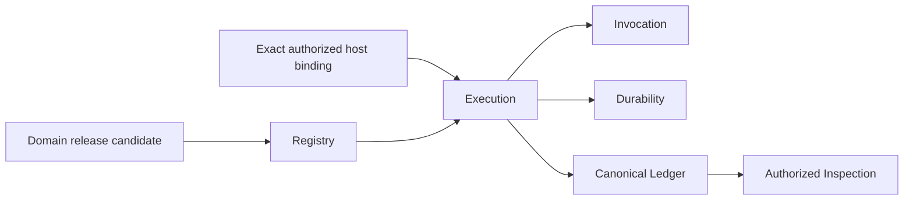

# Agent Runtime

**Purpose**: Define the portable law for registering immutable Agent
capabilities and executing them through provider-neutral, durable, authorized,
recoverable, and inspectable Runtime services.

**Required reader gain**: A reader can distinguish Runtime authority from host,
domain, authorization, governed-data, provider, persistence, durability, and
delivery authority; identify the stable Runtime identities and invariants; and
know which details must be delegated to one Runtime T1 domain.

## 0. Contract Capsule

```yaml
layer: T0
t0_layer_id: the_agent_runtime
status: candidate
canonical_owner: designDoc/the_agent_runtime.md
owned_system_object: provider-neutral Agent Runtime law
scope:
  - immutable Runtime release and dependency-closure law
  - provider-neutral Workflow and Module execution identity
  - invocation, durability, Ledger, and Inspection authority boundaries
  - external authorization and governed-data handoffs
  - isolation, retry, replay, recovery, cancellation, and output Resolution invariants
  - independently distributable Runtime public contracts and extension seams
non_goals:
  - domain roles, graph meaning, quality rubrics, revision policy, or terminal business decisions
  - host workflow selection, product lifecycle, deployment topology, or user experience
  - Principal, Entitlement, policy, authorization decision, or operation-grant issuance
  - governed-data ownership, retention-policy authorship, canonical domain mutation, or Artifact admission
  - provider, model, database, durable backend, SDK, CLI, renderer, hosting, or deployment selection
inputs:
  - immutable admitted Runtime release closure
  - exact host-selected execution binding
  - external authorization context and governed input authority
outputs:
  - stable Runtime public handoffs
  - immutable Runtime release and execution identities
  - authoritative execution lineage and resolved output references
  - provider-neutral recovery and inspection law
t1_delegation:
  - designDoc/agent_runtime_00_runtime_domain_contract.md
truth_surfaces:
  - designDoc/the_agent_runtime.md
  - the approved Runtime T1 release projection
  - code-owned Runtime release and execution contracts
  - authoritative Runtime Registry and Ledger records
```

## 1. Owned System Object and Authority

This T0 owns provider-neutral Agent Runtime law. It defines the meaning and
required separation of immutable releases, Runtime Execution, Workflow
Execution, Module Run,
Execution Variant, Attempt, resolved execution output, durable progress,
canonical execution lineage, and authorized inspection.

It alone may define these cross-project Runtime invariants:

1. what identity must remain stable across provider and backend replacement;
2. which behavior changes require a new immutable release or execution object;
3. which execution facts are authoritative and which surfaces are projections;
4. what committed work recovery may reuse and must never repeat;
5. how Runtime consumes external authority without issuing or widening it;
6. what output may advance to a downstream Runtime Module or return to a host;
7. which isolation boundaries provider and durable adapters must preserve; and
8. what evidence a Runtime implementation must expose for independent review.

This T0 does not select a current implementation, enumerate current source
files, define one host product, or maintain a delivery status inventory.

## 2. Runtime Outcome

Agent Runtime is an independently distributable infrastructure product. A host
registers or selects exact admitted Runtime releases, supplies an externally
authorized execution request, and receives durable execution state plus
resolved output references. Runtime does not interpret the business meaning of
the graph, input, evaluation rubric, or terminal outcome.



The arrows describe logical consumption or committed-fact flow. They do not
describe source placement, deployment containment, authority rank, or a
selected technology.

The Runtime has exactly six peer logical responsibilities:

| Responsibility | Stable ownership |
| --- | --- |
| Registry | Immutable Runtime release compilation, validation, dependency closure, admission, activation, deactivation, withdrawal, and exact retrieval |
| Execution | Host lifecycle, Workflow advancement, Module coordination, Attempt policy, Evaluation, Selection, Resolution, cancellation, and reconciliation |
| Invocation | Model-visible Context projection and one admitted model, tool, or Gateway invocation under an Attempt |
| Durability | Provider-neutral acknowledged commands, timers, waits, replay, recovery, and replaceable durable-backend coordination |
| Ledger | Canonical execution facts, atomic commit order, content references, fences, checkpoints, outcomes, and acknowledgements |
| Inspection | Authorized, bounded, read-only projections of Registry and Ledger authority |

Shared validation primitives, source architecture, external-authority ports,
and release conformance support these responsibilities. They do not become
additional Runtime responsibilities.

## 3. Stable Identity and Immutable Release Law

### 3.1 Release law

Every behavior-bearing Runtime object enters execution through one immutable,
content-bound release. A release version has one canonical payload, one
serialization domain, and one content identity. Compatibility decoding, when
required, is a migration concern and cannot cause one current release class to
emit multiple canonical shapes.

Every executable closure binds the exact content of its behavior-bearing
dependencies. A ref-string hash does not prove the content behind the ref.
Mutable authoring paths, provider sessions, current pointers, discovered
plugins, or prose names are not release authority.

Admission, activation, and host selection are separate decisions:

- Registry admission establishes that a release is valid for Runtime use;
- activation selects a current release for a declared Registry scope;
- deactivation removes a current selection without changing the admitted
  release;
- withdrawal makes one admitted release ineligible for new execution selection
  and appends the reason and evidence to Registry authority;
- host selection binds an exact release closure to a product execution; and
- external authorization decides whether the requested product action is
  permitted.

Deactivation or withdrawal does not rewrite immutable release bytes and does
not silently change an already pinned execution closure. A host may cancel or
replace an in-flight execution only through the execution and authorization
contracts that already govern it. No one decision substitutes for another.

### 3.2 Execution identity law

The stable execution object chain is:

```text
Runtime Execution
  -> origin
    -> Workflow Execution -> Module Run, when a Workflow is the origin
    -> Module Run, when a Module is the origin
  -> each Module Run
    -> Execution Variant
      -> Attempt
        -> immutable execution outputs and invocation observations
    -> Evaluation and Selection, when required
    -> Module Output Resolution
```

A host backend ID, provider session, task queue ID, workspace path, database
row address, or UI route is an implementation mapping and never replaces a
Runtime identity.

A **Runtime Execution** is the common top-level Runtime identity for one exact
host start command and has exactly one declared origin kind: Workflow or
independent Module. A **Workflow Execution** exists only for Workflow origin
and pins one exact admitted Workflow and execution closure for its lifecycle.
A **Module Run** pins one exact Module release, execution purpose, input
closure, and authority closure. An **Execution Variant** pins one
behavior-affecting execution configuration. An **Attempt** is one immutable
invocation try under one Variant. Retry appends an Attempt and never rewrites a
prior Attempt.

Any change to provider-visible behavior, adapter behavior, model profile,
prompt or instruction, tool policy, network policy, input-delivery policy,
Context policy, retry policy, Evaluation policy, or Resolution policy must be
represented by the release or execution identity that owns that behavior.

## 4. System-Wide Runtime Invariants

Every conforming Runtime T1 and T2 specialization obeys these invariants:

1. Runtime core imports neither a host product, domain package, authoring or
   Skill tree, nor a business-database implementation.
2. One canonical Registry owns admitted Runtime release identity and closure.
3. One canonical Ledger owns execution facts and their append order.
4. Invocation returns bounded observations; it does not decide retry, Workflow
   advancement, Evaluation, or Ledger authority.
5. Durability owns acknowledged commands and recoverable cursor progress; it
   does not own the complete execution history or look up mutable Registry
   state while replaying a frozen command.
6. Execution coordinates peers through narrow public contracts and never
   requires a concrete in-memory implementation as authority.
7. Inspection is read-only, receives authorization before retrieval, and
   exposes bounded projections rather than loading an unbounded history.
8. External authorization and governed-data authorities remain external even
   when Runtime records their observations and fences.
9. Immutable execution lineage remains verifiable when governed content bodies
   expire or become unavailable under external Data Governance policy.
10. Current implementation bindings, lifecycle state, evidence, and release
    pointers come from code and persistent records, not maintained Design prose.

## 5. External Authority and Data Boundaries

### 5.1 Product Authorization

Runtime consumes an exact execution authorization context and typed decision or
grant references. It does not read Entitlement bodies, evaluate product policy,
issue grants, expand scope, or treat a Runtime Execution as a new Product
Principal.

An execution-local fence records Runtime's current observation of external
authority. Finalization of authority-sensitive work must compare the current
durable fence in the same atomic Ledger transaction that commits that work. A
process-local lock or caller-supplied snapshot cannot prove this boundary.

When finalization evaluates an expiry or validity window whose instants were
committed by different clock domains, Runtime consumes one registered protected
predicate, pins its immutable `DistributedClockProfile`, references the
required fresh `ClockHealthEvidence`, applies the conservative half-open window
owned by Timestamp Semantics section 8, and fails closed on missing, expired,
unhealthy, regressed, mismatched, or unverifiable clock evidence. A monotonic
authority version proves causal order but does not replace clock-health
evidence; storage-format validation does not authorize the protected decision.

Loss, expiry, revocation, or invalidation prevents new protected work and
quarantines returned but uncommitted results. For an already committed external
effect, Runtime records the committed effect, the authority observation, and
the invalidation as canonical lineage, then hands that record to the owning
external contract. Runtime does not issue a compensating external operation
unless a new explicit authorization arrives through the governed external-
authority port. Continued execution under changed or broader authority requires
a newly authorized execution when the owning T1 contract cannot prove same-
authority continuation.

### 5.2 Governed data and content custody

Runtime receives pre-materialized authorized inputs or calls an enforcing
Gateway with the exact execution context and declared operation. It receives no
ambient business-database credential and cannot perform a canonical domain
write merely because an execution output exists.

Ledger facts, content hashes, tombstones, and custody records may be immutable
while a content body follows externally owned retention, offboarding, legal
disposition, residency, and key-custody policy. Body unavailability is an
explicit state with governing evidence. It is not represented by silently
rewriting lineage or pretending that removed bytes remain readable.

### 5.3 Artifact and domain handoff

Runtime returns one resolved execution output reference and its producing
lineage. Resolution does not create Artifact readiness, product acceptance,
canonical publication, or permission to perform an external effect. Those
decisions remain with their owning domain, Artifact, authorization, and Data
Governance contracts.

## 6. Execution, Commit, and Recovery Law

Runtime exposes a host lifecycle that can start, read bounded status and result
references, cancel, accept legal external events, accept an authorized pushed
authority invalidation, reconcile, and recover one exact execution. Module
dispatch and backend acknowledgement are internal
Runtime ordering steps, not additional Host product operations.
Production conformance requires one Runtime-owned implementation of that public
lifecycle, not only a set of isolated component protocols.

The T1 domain and Execution T2 own the exact ordered state machine. Every legal
ordering must preserve three T0 invariants:

1. exact release and external-authority closure is validated before protected
   work;
2. the durable intent and active fence are committed before the corresponding
   external effect; and
3. a returned result becomes authoritative only through the active-claim and
   current-fence commit, before backend acknowledgement can advance progress.

Recovery follows committed authority:

- before invocation or protected-effect commitment, policy may create a new
  Attempt after terminalizing or orphaning the prior claim;
- after invocation or effect commitment, recovery reconstructs the result and
  repeats no provider call or protected effect;
- after Outcome commitment but before backend acknowledgement, recovery returns
  the committed Outcome and appends only the missing acknowledgement.

Cross-system atomicity is not claimed where no single transaction manager
exists. Stable identities, idempotent commands, durable intents,
acknowledgements, and reconciliation form the contract.

## 7. Evaluation and Resolution Law

Domain owners define evaluator meaning, rubrics, veto rules, and required
coverage. Runtime owns mechanical Evaluation scheduling, candidate coverage,
Selection, and Resolution lineage.

Only one immutable Module Output Resolution may authorize downstream Runtime
consumption for one Module Run. A raw provider response, Attempt, output,
Evaluation result, score, or Selection cannot bypass Resolution. Resolution
grants no external authorization, domain acceptance, Artifact readiness, or
canonical-write authority.

A model-backed evaluator is an ordinary admitted Module execution with its own
release, Module Run, Variant, Attempt, authorization, usage, and output lineage.
Self-authored evaluation logs or unregistered provider calls cannot satisfy a
formal gate.

## 8. Inspection, Evidence, and Portability

Inspection consumes authorized Registry and Ledger query contracts. The caller
first resolves an opaque authorized query scope. Retrieval applies that scope at
the storage boundary and retains per-execution and per-content checks as
defense in depth.

Execution summaries are bounded. Trace records and content metadata are paged
with stable cursors and response budgets. Content bodies require individual
authorization and are not included in ambient polling. Generated HTML, offline
bundles, dashboards, and reports are projections and never mutation authority.

Runtime exposes exact file manifests, content hashes, Code Projections, schema
releases, commands, raw outputs, environment identity, and execution identity
so the independently owned review authority can bind its verdict to the exact
subject it judges.

Runtime distribution remains independent of host and domain code. Technology
adapters may ship separately. Current providers, durable backends, persistent
stores, versions, and deployment choices belong to code-owned registration,
deployment composition, and release evidence.

## 9. External Governance Boundaries

| External authority | Runtime handoff |
| --- | --- |
| Product Charter | Defines the standalone product boundary and accountable product outcome |
| Design Doc Management | Governs hierarchy, material change, candidate identity, approval, and generated projection rules |
| Product Authorization | Issues Principal, Entitlement, decision, execution-context, revocation, and operation-grant authority |
| Data Governance | Owns managed Data Asset, System-of-Record and writer binding, migration, data placement, access enforcement, retention, residency, custody, export, and disposition law; Runtime retains Registry and Ledger record semantics |
| Artifact Graph | Owns Artifact identity, dependency, readiness, and graph eligibility; the owning domain issues the required acceptance decision |
| Task Routing | Selects the owning business action or Workflow before Runtime intake |
| Timestamp Semantics | Owns instant meaning, format, precision, ordering, registered protected predicates, distributed-clock profiles, clock-health evidence, and conservative validity-window law; Runtime consumes and records those exact authorities |
| Skill Governance | Owns Skill classification, authoring, migration, managed projection, and direct-entry retirement; Runtime only admits a structured immutable candidate bundle through Registry |
| Agency Platform | Composes host, product, tenant, and operator control-plane surfaces around Runtime; it does not own the Runtime build |
| Software Delivery | Owns Runtime build admission, release evidence, package deployment, rollback, and product-build retirement |
| Contract Audit | Owns Independent Review profiles and verdicts over frozen subjects |

Cross-authority references are dependencies, not additional Design Contract
parents.

## 10. T1 Delegation

The unique Agent Runtime T1 root owns the independently governed Runtime domain
that realizes this T0. `agent_runtime_00_runtime_domain_contract.md` is the
portable filename convention for that root, not a project-local implementation
binding. It must define:

- the Runtime domain outcome and public host handoffs;
- the six responsibility delegation map;
- shared identity and cross-responsibility ordering rules;
- external authority ports and failure handoffs;
- required machine contracts and conformance evidence; and
- completion, failure, and release boundaries for the Runtime as one product.

The T1 root delegates cohesive behavior to T2 contracts. It does not copy the
detailed Registry, Ledger, Invocation, Durability, Inspection, authorization,
event-ingress, conformance, or Execution state machine into the root.

## 11. Required Machine Contract

A conforming Runtime implementation provides code-owned contracts for:

- canonical release serialization, hashing, dependency closure, admission, and
  exact retrieval;
- one public host execution lifecycle and exact execution identities;
- one canonical append-only Ledger with atomic batches, durable fences,
  idempotency, content custody, and query ports;
- provider-neutral Invocation, Durability, external-authority, and Inspection
  ports;
- persistent-schema release identity, ordered migration, compatibility refusal,
  and failure recovery;
- authorized query scopes, stable page cursors, response budgets, and
  individually authorized content retrieval;
- source ownership, allowed import direction, public namespace manifests, and
  migration-debt high-water marks;
- downstream public-API consumer closure and compatibility evidence; and
- immutable release and review evidence packages.

Exact fields, schemas, source paths, current implementations, and current
bindings belong to code after the design is approved.

## 12. Review and Admission

A material portable Runtime-law change follows Design Doc Management authoring
and freezing rules, receives independent semantic review, is accepted by the
governance distribution owner, changes the portable governance source first,
and is then projected mechanically into each consuming project. A consuming
project does not edit the installed target as a private fork. Project-specific
variation belongs in that project's Charter or an owned T1/T2. Design
correctness, governance-source acceptance, project-contract acceptance,
implementation completion, Independent Review, Runtime release conformance,
and Software Delivery admission remain separate results. This T0 creates no
additional portfolio or peer-decision object.

Runtime produces deterministic synthetic conformance plus declared real
integration evidence for every selected provider, persistent store, durable
backend, and host composition, and exposes that evidence to Software Delivery.
Software Delivery decides production admission. A skipped integration test
records validation debt; it is neither passing evidence nor automatic proof of
a design defect.

## References

- [Agent Runtime Charter](the_charter.md)
- [Design Doc Management](../../designDoc/the_design_doc_management.md)
- [Product Authorization](../../designDoc/the_product_authorization.md)
- [Data Governance](../../designDoc/the_data_governance.md)
- [Timestamp Semantics](../../designDoc/the_timestamp_semantic.md)
- [Artifact Graph](../../designDoc/the_artifact_graph.md)
- [Software Delivery](../../designDoc/the_software_delivery.md)
- [Contract Audit](../../designDoc/the_contract_audit.md)
