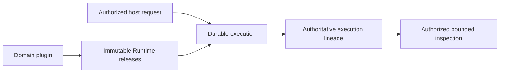

# Agent Runtime Charter

**目的**：定义可独立发布、与业务无关的 Agent Runtime 产品宪章。宿主产品可以注册
自己的 Module 与 Workflow，但不能把业务语义、产品授权策略、业务数据权威或宿主部署
控制面放进 Runtime core。

**读者应获得的结果**：能够直接判断一项能力是否属于 Runtime、应当由 Runtime 还是
外部产品负责，以及什么证据足以证明 Runtime 可以独立发布。六项 Runtime 责任的稳定
语义由 `the_agent_runtime.md` 定义，本 Charter 只确认本产品采用该责任模型。

## 0. Intent Capsule

```yaml
layer: T0
t0_layer_id: the_charter
status: candidate
canonical_owner: designDoc/the_charter.md
owned_system_object: standalone Agent Runtime product constitution
scope:
  - immutable Runtime release registration and exact retrieval
  - provider-neutral Workflow and Module execution
  - invocation, durable progress, retry, wait, replay, and recovery
  - authoritative execution lineage and authorized inspection
  - independently installable Runtime core and extension interfaces
non_goals:
  - business workflow meaning, role semantics, prompt content, or quality rubric
  - Principal, Entitlement, Product Authorization, or operation-grant issuance
  - product task routing, workflow selection, or host deployment control
  - governed domain-data ownership, retention policy, or canonical domain writes
  - provider, database, or durable-backend product selection
inputs:
  - admitted immutable Runtime release closure
  - exact host-selected execution binding and external authorization context
  - authorized frozen Module inputs and external-operation decisions
outputs:
  - immutable Runtime releases
  - durable Workflow and Module execution
  - authoritative execution, usage, failure, recovery, and output lineage
  - authorized bounded inspection
truth_surfaces:
  - designDoc/the_charter.md
  - designDoc/the_agent_runtime.md
  - designDoc/agent_runtime_00_runtime_domain_contract.md
  - code-owned Runtime release and architecture contracts
  - authoritative Runtime release and execution records
```

## 1. Product Result

Agent Runtime 的产品结果不是“调用一次模型”，而是让一个已注册的 Agent capability
能够被精确版本化、可靠执行、失败后恢复、独立验证，并被授权还原。



Runtime 只解释执行合同，不解释业务内容。Writer、Verifier、Router、Reviewer 和 Expert
等角色由宿主领域注册，它们不是 Runtime 内建子系统。

## 2. Adopted Runtime Responsibility Boundary

本产品采用 `the_agent_runtime.md` 定义的六项同层级 Runtime 责任。下面是面向本项目
读者的索引，不建立第二套责任定义：Registry、Execution、Invocation、Durability、
Ledger 和 Inspection。每项责任的稳定含义、边界和变化以
`the_agent_runtime.md` 为准。

公共 identity、canonical serialization、hash、timestamp、token 和 ref 校验可以由无业务策略
的 supporting foundation 提供。该 foundation 不是第七个产品职责，不能拥有 release、
Workflow、Attempt、authorization、backend 或 inspection policy。

目录、数据库、durable backend、provider SDK、CLI 和 renderer 都是物理组织或
implementation binding，不能被画成新的同级职责。

## 3. External Authorities

Runtime 消费外部决定，但不复制或扩大外部权威。

| External concern | Runtime behavior |
| --- | --- |
| Product Authorization | 消费精确 execution context、decision 和 grant refs；不签发 Entitlement 或自行扩大权限 |
| Governed Data Access | 通过 enforcing Gateway 或预先冻结的授权输入读取；不持有域数据库长期凭据或业务写权限 |
| Data Governance | 消费 content custody、retention 和 disposition 决定；不可变 lineage 不等于无限期保存 content body |
| Timestamp Semantics | 消费 registered protected predicate、`DistributedClockProfile`、fresh `ClockHealthEvidence` 和 conservative validity-window law；不自行生成跨时钟安全结论 |
| Task Routing | 接收已经选定的 Module 或 Workflow binding；不从自然语言重新选择业务 owner |
| Artifact Graph | 发出可关联的 release、execution 和 output refs；不决定 Artifact readiness 或 canonical admission |
| Agency Platform | 提供稳定 Runtime API；不实现用户、产品、路由、部署拓扑或控制面职责 |
| Software Delivery | 提供可测试、可打包的 release unit 和 evidence；不自批生产部署 |

外部权威的可用性不改变所有权。Runtime 可以 fail closed、记录 observation、设置 fence
或进入 recovery，但不能在外部权威不可用时自行生成等价决定。

## 4. Project Application of Design Doc Governance

Design Doc 的层级、生命周期和 material-change 规则由
`the_design_doc_management.md` 统一拥有。本仓库应用该规则后的项目映射是：

- `the_*` 是 project-facing T0；
- `agent_runtime_00_runtime_domain_contract.md` 是 Agent Runtime 唯一 T1 root；
- `agent_runtime_<NN>_*.md` 且 `NN != 00` 是该 T1 下的 T2；
- frontmatter、Registry 和 prose 校验这个映射，不能重新定义它；
- 实际属于其他产品的合同迁回其语义 owner，不继续使用 `agent_runtime_*` 文件名。

本仓库完整的 T0 集合由一个项目专用 Charter 和已安装的可迁移治理及领域合同组成。
本 Charter 只拥有 Agent Runtime 产品身份、产品范围和产品完成条件；
`the_agent_runtime.md` 拥有 provider-neutral Runtime law；其他 `the_*` 文件各自拥有其
声明的元治理对象。一条规则只由它的语义 owner 声明。两个 T0 对同一对象给出不同规则
时，该候选不合规，必须回到语义 owner 修正，不能用文档优先级掩盖冲突。

本 Charter 的中文正文是产品宪章的 canonical text。Runtime 技术合同以各自声明的英文
正文为 canonical text；额外翻译只用于阅读，不建立第二套合同语义。

## 5. Intent, Code Truth, and Repository Planes

Design Docs 维护稳定 intent、职责边界、失败语义和应达到的结果。代码、schema、Registry、
持久记录和验证 evidence 维护精确字段、版本、绑定、当前状态和执行事实。

仓库内的物理平面保持可区分：

| Plane | Authority rule |
| --- | --- |
| Runtime distribution unit | 实现六项 Runtime 职责和 supporting foundation；当前 packaging binding 由代码登记 |
| Build and conformance tooling | 生成或验证 release subject；不成为生产 Runtime service |
| Portable governance source | 提供可部署治理基线；不进入 Runtime 业务执行 import graph |
| Agent interface projections | 投影同一 session 和 governance contract；当前工具绑定由代码登记，不成为新的语义 owner |
| Canonical Design Docs and generated package projection | Canonical intent 可编辑，package projection 只能机械生成 |

生成的 architecture、release inventory 和 Inspector 是可重建 inspection，不能成为第二套
可编辑权威。Provider session、CLI workspace、durable history 和 UI cache 也不能替代
Runtime Ledger 或 domain system of record。

## 6. Correctness and Change Priority

结果正确性高于仪式性的流程完成。测试、review 和 admission 的作用是提高结果正确性，
不是为错误设计盖章。发现职责错误、合同断裂或实现根因时，应修正 owning Design Doc
与 code truth；不得为了保留旧流程而增加 shadow registry、平行 Ledger、兼容别名或
临时旁路。

Public API hard cutover 可以是正确选择。Runtime 必须提供 symbol-level downstream
consumer closure 和 compatibility evidence；每个外部 consumer 的迁移处置由其所在产品
负责。此要求不创造永久 compatibility facade。

## 7. Product Completion Conditions

Agent Runtime 达到可独立发布的最低条件是：

1. 外部 domain plugin 只通过公开接口即可注册 dependency-closed immutable releases；
2. 一个 release version 只有一个 canonical payload 和一个 identity domain；
3. Host 通过公开 API 提交 exact binding，Runtime 可以完成 start、bounded status/result、
   cancel、authorized external event、authorized pushed authority invalidation、reconcile 和 recovery lifecycle；dispatch 和 backend
   acknowledgement 由 Runtime 内部完成，不伪装为 Host 产品接口；
4. 一个 canonical Ledger 是 execution fact authority，provider result、backend history 和
   compatibility model 都不能成为平行权威；
5. 按 `the_agent_runtime.md` 的 authority law，authority-sensitive finalization 在同一 durable transaction 中比较当前 fence；跨时钟
   expiry 或 validity 判断同时绑定 registered protected predicate、`DistributedClockProfile`
   和 fresh `ClockHealthEvidence`；
6. 按 `the_agent_runtime.md` 的 recovery law，crash、retry、wait、worker replacement 和 replay 不会重复已经 commit 的 invocation 或
   protected effect；
7. 按 `the_agent_runtime.md` 的 Inspection law，retrieval 前接收 authorized query scope，并对 summary、Trace、content
   metadata 和 body 实施 bounded、paged、individually authorized access；
8. 按 `the_agent_runtime.md` 的 data-boundary law，immutable lineage 与 governed content custody 分离，retention、offboarding 和 disposition
   后的 body-unavailable 语义有明确合同；
9. Runtime startup 能识别 persistent-schema release，并拒绝 unsupported 或 incomplete
   migration state；每个 persistent record family 均有 Data Governance
   `DataAssetRegistration`、System-of-Record 和 writer-boundary evidence；
10. `the_agent_runtime.md` 定义的 portable core-import invariant 通过机器校验；
11. public-surface 变更具有 downstream symbol closure 和 consumer compatibility evidence；
12. Runtime distribution unit 内 Runtime-owned Design Contract bundle 与 approved canonical source 一致，并且
    Provider、persistent store 和 durable backend 的生产准入证据来自声明过的真实 instance。

未满足条件时，应报告真实缺口，不得用 README 声明、演示页面、in-memory semantic model
或跳过的 integration test 替代完成状态。

## 8. Review and Admission

本 Charter 的变更遵循 Design Doc Management 的 authoring、冻结和 review 规则。候选在
替换 canonical text 前接受独立语义 review，并由 Project Owner 或明确委派的 design
owner 接受；实现变更另外提供 machine contract、migration、tests 和 frozen evidence。
Software Delivery 再根据这些证据决定是否发布。

设计正确性、Project Owner 接受决定、实现完成度、独立 review 结论和发布状态分别记录，
互不替代。本合同不新增 `PeerStructureDecision`、portfolio approval 或 announcement
等运行对象。

## References

- [Agent Runtime](the_agent_runtime.md)
- [Design Doc Management](../../designDoc/the_design_doc_management.md)
- [Product Authorization](../../designDoc/the_product_authorization.md)
- [Data Governance](../../designDoc/the_data_governance.md)
- [Software Delivery](../../designDoc/the_software_delivery.md)
