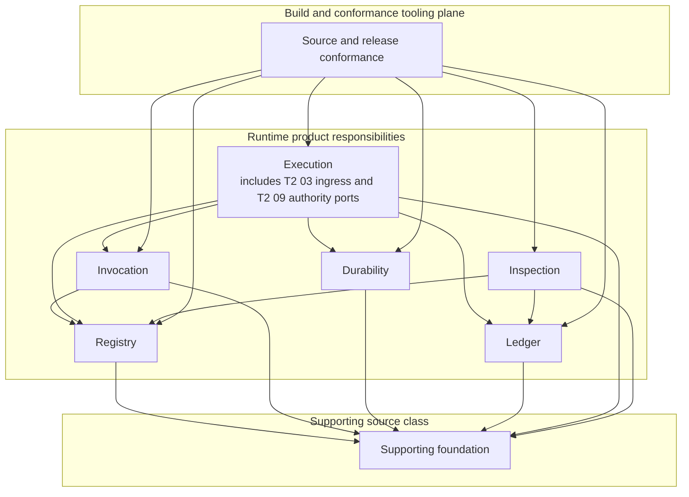

# Agent Runtime Source Architecture Contract

**Purpose**: Define the machine-enforced source ownership, dependency direction,
public namespaces, supporting foundation boundary, and migration-debt rules for
the standalone Agent Runtime distribution.

**Required reader gain**: A maintainer can place or split a source unit, decide
which imports and exports are legal, distinguish Runtime product code from
repository support planes, and determine whether an architecture change is
eligible to enter implementation without reading a manually maintained file
inventory.

## 0. Contract Capsule

```yaml
layer: T2
status: candidate
canonical_owner: designDoc/agent_runtime_02_source_architecture_contract.md
parent: designDoc/agent_runtime_00_runtime_domain_contract.md
owned_system_object: Agent Runtime source ownership and dependency architecture
inherits:
  - designDoc/the_charter.md
  - designDoc/the_agent_runtime.md
  - designDoc/the_design_doc_management.md
  - designDoc/the_software_delivery.md
  - designDoc/the_timestamp_semantic.md
scope:
  - Runtime source-unit ownership and responsibility placement
  - allowed import direction and cycle refusal
  - supporting foundation primitive boundary
  - responsibility-level public namespace manifests
  - optional adapter and dependency isolation
  - repository-plane separation
  - migration-debt declaration and monotonic retirement
  - source architecture conformance evidence
non_goals:
  - Runtime release, execution, invocation, persistence, durability, or inspection behavior
  - provider, database, durable backend, SDK, CLI, renderer, or deployment selection
  - current source-file inventory, line counts, versions, implementation status, or delivery plan
  - host, domain, authorization, governed-data, Skill, or software-release ownership
outputs:
  - RuntimeSourceOwnershipManifest
  - RuntimeDependencyPolicy
  - RuntimePublicSurfaceManifest
  - RuntimeMigrationDebtManifest
  - RuntimeCohesionSignalReport
truth_surfaces:
  - designDoc/agent_runtime_02_source_architecture_contract.md
  - code-owned Runtime source-architecture registrations
  - generated architecture and public-surface inspection
```

## 1. Owned Result

This contract makes the Runtime source graph mechanically decidable. Every
Runtime product source unit resolves to exactly one of the six Runtime
responsibilities or to the supporting foundation. Every public symbol resolves
to one responsibility-owned namespace. Every internal import is accepted or
rejected by a versioned dependency policy.

The contract does not turn physical directories into peer responsibilities.
Logical ownership, source placement, dependency direction, public exposure,
and current technology binding are separate dimensions. A generated report may
show them together only when each dimension remains labeled.

## 2. Required Machine Contracts

| Machine contract | Required result |
| --- | --- |
| `RuntimeSourceOwnershipManifest` | Registers every repository source path and its plane; for the Runtime product distribution plane, assigns the source unit to exactly one responsibility or the supporting foundation; for another plane, records that plane's declared owner without treating it as a Runtime responsibility |
| `RuntimeDependencyPolicy` | Declares the exact allowed responsibility and foundation edges, forbidden cycles, adapter direction, and import-boundary exceptions |
| `RuntimePublicSurfaceManifest` | Declares each responsibility-owned public namespace and its exact exported symbols, while excluding concrete adapters, test doubles, predecessor types, and private implementation |
| `RuntimeMigrationDebtManifest` | Names every temporary architecture exception, its current owner, affected rule, replacement or retirement disposition, entry basis, and exit evidence |
| `RuntimeCohesionSignalReport` | Derives file-size, fan-in, fan-out, and responsibility-count signals from registered source bytes, the ownership manifest, and the import graph; names the owning module and carries no independent split verdict |

Exact paths, symbols, exception IDs, hashes, current violations, and generated
views belong to code-owned registrations. A prose list, directory scan without
registration, or magic file count cannot replace those records.

## 3. Logical Dependency Direction

The allowed logical direction is:



An arrow means the source consumes the target's public contract or port. It
does not mean source containment, deployment containment, semantic authority,
or call order.

Rules:

1. A responsibility imports only the foundation, its declared inward public
   dependencies, and its own private implementation.
2. A peer reverse edge or responsibility cycle is invalid. Composition occurs
   in Execution or in explicitly external host assembly, not through mutual
   imports.
3. Concrete adapters depend on their responsibility's public port and their own
   optional SDK. A responsibility or peer adapter never imports that concrete
   adapter as authority.
4. External host, domain, authoring, Skill, business-database, and deployment
   implementations do not enter the Runtime product import graph.
5. Build and conformance tooling may inspect Runtime product surfaces but is not
   imported by Runtime execution code.
6. Source implementing the T2 03 Event Ingress protocol or T2 09 External
   Authority Integration ports belongs to the Execution responsibility. These
   contracts specialize Execution behavior and do not create peer source-owner
   classes or peer public namespaces. Calls between those source units are
   intra-Execution dependencies. Invocation does not import the T2 09 port;
   as the Policy Enforcement Point for its own resources it consumes only a
   host-provided Product Authorization decision validator through its public
   Invocation boundary, following the same dependency pattern as Registry.

## 4. Source Ownership and Cohesion

Every Runtime product source unit has one primary semantic owner. Ownership is
assigned by the behavior and state transition it implements, not by its current
directory, filename, imported technology, or storage location.

A source unit must be split when it independently implements behavior owned by
more than one responsibility and the parts can change or fail separately. A
small private helper may remain with its caller. A helper used by multiple
responsibilities moves to the supporting foundation only when it is pure and
contains no release, Workflow, Attempt, authorization, provider, backend,
persistence-policy, inspection, retry, or business rule.

File size, fan-in, fan-out, and responsibility count are cohesion signals, not
standalone verdicts. A code-owned architecture check produces the registered
`RuntimeCohesionSignalReport` from exact registered source bytes,
`RuntimeSourceOwnershipManifest`, and the import graph. It reports each signal
and its owning module and does not split a file by numeric threshold alone.

Shared generated projections name every affected source owner and their one
canonical generator. They do not become a second editable source.

## 5. Supporting Foundation Boundary

The supporting foundation may own only provider-neutral primitives required by
more than one Runtime responsibility:

- canonical serialization and content hashing;
- stable ID, token, ref, instant, and exact-record validation;
- immutable byte and content-reference values;
- provider-neutral schema traversal; and
- base error values containing no responsibility policy.

The foundation owns no release, Workflow, Module Run, Attempt, authorization,
provider session, durable command, persistent store policy, inspection model,
retry decision, or Resolution. Adding such behavior is an architecture defect,
not a convenient shared abstraction.

Instant validation implements only the format, precision, and ordering
semantics owned by Timestamp Semantics. The foundation cannot define or widen
those semantics, satisfy a protected predicate, or prove a cross-clock
decision. The authority observation, durable comparison, and Execution decision
remain with T2 09, T2 04, and T2 10.

Schema traversal distinguishes schema-bearing positions from container maps.
For example, `properties` and `$defs` are maps whose values may be schemas; the
maps themselves are not schema nodes. One shared traversal primitive serves
Registry validation and Invocation projection so provider-specific projections
cannot silently create a second traversal semantics.

## 6. Public Namespace Law

The standalone Runtime exposes deliberate responsibility namespaces for
Registry, Execution, Invocation, Durability, Ledger, and Inspection. T2 03 and
T2 09 public contracts are exported through the Execution namespace. The
package root exports package metadata only and no responsibility record,
protocol, service, error, Adapter, or implementation type. Product consumers
import the owning responsibility namespace directly, so the package root cannot
regrow into a cross-responsibility contracts facade.

Each `RuntimePublicSurfaceManifest` binds:

- namespace identity and semantic owner;
- exact exported records, protocols, services, and errors;
- stability and compatibility classification;
- permitted optional dependency, if any;
- downstream consumer closure; and
- replacement or retirement disposition for removed symbols.

Public surfaces do not export concrete in-memory implementations, optional
provider or backend adapters, test fixtures, migration readers, predecessor
models, or private storage codecs. Base-package import succeeds without
installing an optional provider, durable backend, database driver, renderer, or
host integration.

A public hard cutover is permitted under the parent contracts after Runtime
produces symbol-level downstream consumer closure and each consuming product
records its own migration disposition and tests. No permanent compatibility
facade is required.

## 7. Repository Plane Separation

Repository code is classified before architecture enforcement:

| Plane | Boundary |
| --- | --- |
| Runtime product distribution | Implements the six responsibilities and supporting foundation; subject to this contract's product import and public-surface rules |
| Build and conformance tooling | Generates or validates release and architecture evidence; never becomes an execution responsibility |
| Portable governance source | Supplies reusable T0 and governance Skill authority; projects into consuming projects and is not imported by Runtime execution |
| Agent interface projections | Expose the same governance and session contracts through tool-specific entry surfaces; do not become semantic owners |
| Canonical Design Docs and generated distribution projection | Canonical intent is author-owned; the distribution copy is mechanically generated and read-only |

`RuntimeSourceOwnershipManifest` records each current path, repository plane,
semantic owner, packaging disposition, and generator when present. Moving a
file between planes is a material architecture or delivery change when it
changes import eligibility, packaging, or authority.

## 8. Migration Debt

The first conforming `RuntimeMigrationDebtManifest` freezes the exact known
exceptions to this target architecture. Each debt item has one rule violation,
one owner, one approved disposition (`split`, `move`, `replace`, or `retire`),
one compatibility boundary, and measurable exit evidence.

An implementation change may retire debt or replace one item with a reviewed
more precise decomposition. It may not silently add an exception, widen an
allowed import edge, restore a forbidden facade, or reset the baseline to the
current tree. The validator compares exact debt identities and dispositions,
not only an aggregate count. Any proposed increase requires an approved Code
Design Basis that explains why the target architecture itself remains correct
and how the new debt exits.

Migration readers and compatibility tools remain outside the Runtime product
public import graph. Once downstream closure and data obligations are complete,
the retired source, alias, and exception disappear together.

## 9. Deterministic Conformance

Architecture conformance validates at least:

1. every Runtime product source unit has exactly one registered owner;
2. every import edge is permitted and the responsibility graph is acyclic;
3. the foundation contains only admitted primitive families, and instant
   validation remains within the Timestamp Semantics boundary;
4. every responsibility public namespace exactly matches its manifest, T2 03
   and T2 09 exports belong to Execution, and the package root exposes no
   product type;
5. base-package import does not load undeclared optional dependencies;
6. concrete adapters depend inward and are absent from peer public imports;
7. generated architecture and public-surface projections owned by this
   contract reproduce from their code-owned registrations; Design Contract
   bundle parity belongs to T2 05;
8. every public removal has symbol-level consumer disposition and tests;
9. every architecture exception exists in the frozen debt manifest and the
   proposed change does not widen debt without an approved basis;
10. every source unit has a registered repository plane and the Runtime
    distribution contains no host, domain, authoring, Skill, or
    business-database implementation;
11. the cohesion signal report is reproducible from registered source bytes,
    ownership, and import evidence, names each affected owner, and creates no
    independent architecture verdict; and
12. Invocation resource enforcement consumes only the host-provided Product
    Authorization decision-validator protocol and has no import edge to T2 09
    or Execution private source.

A missing registration, unresolved owner, forbidden edge, cycle, public-symbol
drift, optional-dependency leak, or undeclared debt item fails conformance. An
AI reviewer cannot waive a deterministic failure.

## 10. Failure and Change Boundary

Architecture validation reports exact source units, edges, symbols, owners,
and debt IDs. It does not repair imports, create compatibility aliases, infer an
owner from a directory, or select a replacement technology.

This Design Intent does not move files or change imports. After the complete
T0/T1/T2 contract set is accepted, one Code Design Basis freezes the current
source manifest, target ownership, allowed edges, public-surface disposition,
consumer closure, migration debt, test gates, and rollback boundary before any
source restructuring begins.

Source Architecture supplies conformance evidence. Software Delivery decides
whether a source change or Runtime distribution may be released.

## References

- [Agent Runtime Charter](../agent_runtime_t0_t1_candidate/the_charter.md)
- [Agent Runtime T0](../agent_runtime_t0_t1_candidate/the_agent_runtime.md)
- [Agent Runtime Domain Contract](../agent_runtime_t0_t1_candidate/agent_runtime_00_runtime_domain_contract.md)
- [Design Doc Management](../../designDoc/the_design_doc_management.md)
- [Timestamp Semantics](../../designDoc/the_timestamp_semantic.md)
- [Software Delivery](../../designDoc/the_software_delivery.md)
