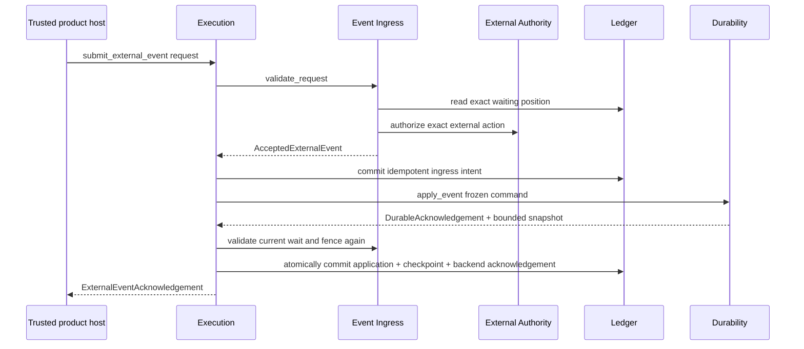

# Agent Runtime External Event Ingress Contract

**Purpose**: Define the single provider-neutral protocol that accepts one
externally authorized event request for an exact waiting execution, proves it
matches the pinned wait, and preserves idempotent intent, application, and
acknowledgement lineage without owning a UI, authorization policy, Workflow
state machine, Ledger, or durable backend.

**Required reader gain**: A maintainer can distinguish request authorization,
legal-wait matching, ingress acceptance, Execution application, durable
delivery, and acknowledgement, and can recover every crash window without
double-applying an event.

## 0. Contract Capsule

```yaml
layer: T2
status: candidate
canonical_owner: designDoc/agent_runtime_03_external_event_ingress_contract.md
parent: designDoc/agent_runtime_00_runtime_domain_contract.md
owned_system_object: authorized external-event identity and legal-wait protocol
inherits:
  - designDoc/the_charter.md
  - designDoc/the_agent_runtime.md
  - designDoc/the_product_authorization.md
  - designDoc/the_data_governance.md
  - designDoc/the_timestamp_semantic.md
scope:
  - typed external-event request and accepted event identity
  - exact waiting-position and event-schema matching
  - authority observation binding
  - idempotent ingress, application, and acknowledgement lineage
  - stale-event, replay, race, and reconciliation semantics
non_goals:
  - authentication, UI, form, notification, approval persona, or human-task design
  - Product Authorization policy, Entitlement, grant, or Principal management
  - Workflow state advancement, Module dispatch, retry, cancellation, or Evaluation
  - Ledger transaction implementation or durable-backend delivery
outputs:
  - ExternalEventIngressPort
  - ExternalEventRequest
  - AcceptedExternalEvent
  - ExternalEventAcknowledgement
truth_surfaces:
  - designDoc/agent_runtime_03_external_event_ingress_contract.md
  - code-owned ingress schemas and legal-wait validator
  - canonical Ledger ingress, application, and acknowledgement facts
```

## 1. Owned Result

External Event Ingress turns one trusted external request into one immutable
`AcceptedExternalEvent` only when two independent predicates pass:

1. the external authority observation allows the exact action; and
2. the event type and payload schema match the execution's exact current wait.

It does not decide the next Workflow state. Execution applies the accepted
event under document 10. It does not call a concrete durable backend or write a
private event store; Ledger 04 remains the fact authority.

An event may represent human feedback, approval, rejection, data arrival,
external-system completion, or another registered event class. Those meanings
belong to the pinned Workflow Release. No PM, reviewer, approver, browser, or
provider persona is hard-coded into this contract.

## 2. Public Ingress Port

`ExternalEventIngressPort` is an intra-Execution contract exported through the
Execution namespace. It is not a second host entry surface. The trusted host
calls only `RuntimeExecutionService.submit_external_event`; Execution invokes
this port.

The port supports:

| Operation | Result |
| --- | --- |
| `validate_request` | Accepted event value or typed rejection for one exact waiting execution |
| `resolve_existing` | Existing accepted event, application, and acknowledgement lineage for an idempotency identity |
| `validate_application` | Confirmation that an accepted event still matches the current wait and authority fence immediately before application |

The port consumes Registry and Ledger query contracts plus document 09's
external-authority port. It returns values to Execution. It imports no concrete
store, Product Authorization client, Workflow UI, or durable Adapter.

## 3. Request and Event Closure

`ExternalEventRequest` binds:

- stable request and idempotency identities;
- exact Runtime execution and caller-seen wait identity and generation;
- requested registered event type;
- payload content ref and exact event schema ref when a payload exists;
- trusted host request-context ref; and
- requested action and resource identity.

Principal, tenant, Cell, authority decision, target state, graph edge, and
current Workflow state are never accepted from caller-selected fields.

`AcceptedExternalEvent` additionally binds:

- exact request ref and hash;
- exact Workflow Release, current wait, event class, and validated payload
  schema refs and hashes;
- exact `ExecutionAuthorityObservation` or protected-operation observation;
- current monotonic fence value and required cross-clock evidence refs;
- derived event identity; and
- acceptance disposition.

Request time, transport retry count, worker identity, and backend delivery count
do not enter event identity.

Data Governance registers the event payload content class and rejected-intent
evidence class. Ledger's registered content custody holds bodies and immutable
content refs. Ingress receives and returns only bounded refs, hashes, schema
identity, and disposition evidence.

## 4. Legal-Wait Validation

Ingress reads the exact current Ledger state and pinned Workflow Release. It
requires:

- execution status is `waiting`;
- execution origin is an exact Workflow Release rather than an independent
  Module origin;
- caller-seen wait identity and generation equal the current wait;
- event type is in the wait's registered accepted set;
- payload validates against the exact event schema;
- execution release, tenant, Cell, and authority context match; and
- the external authority observation is current and permits the action.

The caller cannot select the next state. Execution 10 applies the accepted
event through the pinned provider-neutral Workflow transition table. A named
state reached again later has a new wait generation, preventing same-state ABA
replay.

## 5. Commit, Application, and Acknowledgement Protocol



The second validation is mandatory because wait ownership or authority may
change after request acceptance. Cross-system atomicity is not claimed.
Execution owns durable submission and state advancement; Ingress owns event
identity and legal-wait validation; Ledger owns commits; Durability owns
acknowledged backend progress.

`ExternalEventAcknowledgement` is the bounded value returned by Execution after
Ledger commits the exact application and Durability acknowledgement refs and
hashes. It is not an Ingress-owned commit receipt and cannot substitute for the
canonical Ledger facts.

## 6. Idempotency and Concurrency

One logical external action keeps the same request, event, ingress intent,
application, and acknowledgement identities across transport retries.

| Observed state | Required behavior |
| --- | --- |
| Same identity and same bytes before ingress commit | Return the same accepted event |
| Ingress exists, application absent | Revalidate wait and authority; resubmit the same durable command |
| Application exists, acknowledgement absent | Return the existing application and reconcile acknowledgement |
| Application and acknowledgement exist | Return the original result |
| Same identity with different bytes | Reject as immutable conflict |
| Wait generation, fence, release, tenant, or Cell differs | Reject as stale or cross-scope reuse |
| Two concurrent applications | Ledger serializes on wait identity; at most one commits |

An accepted event is not proof of application. A durable signal receipt is not
proof of Runtime application. Only the committed application fact and exact
backend acknowledgement close the lineage.

## 7. Time and Authority

Document 09 supplies the registered protected predicate, pinned
`DistributedClockProfile`, and fresh per-domain `ClockHealthEvidence`
requirements for the execution authority binding. Timestamp Semantics alone
defines the conservative half-open validity window. Bare wall-clock comparison
is forbidden.

An authority expansion cannot widen the waiting execution. Expiry, revocation,
scope reduction, mismatch, or unprovable clock evidence rejects application.
Ingress preserves the rejected intent as bounded audit evidence but causes no
Workflow transition.

## 8. Failure and Recovery Semantics

| Failure | Required result |
| --- | --- |
| Missing trusted host context | Reject before authority resolution |
| Execution not waiting or wait generation stale | Reject; no event application |
| Event type or payload schema illegal | Reject; no target-state inference |
| Authority deny, expiry, invalidation, or service failure | Fail closed with bounded evidence ref |
| Ingress commit succeeds, durable call fails | Reconcile the same committed intent |
| Durable event accepted, Runtime response lost | Recover bounded snapshot and existing application identity |
| Application loses race to cancellation or invalidation | Preserve ingress; commit no transition |
| Backend acknowledgement lost | Reconcile exact application ref; never apply again |

Runtime does not fabricate a domain `blocked` state for infrastructure failure.
The last committed domain state remains authoritative.

## 9. Conformance and Completion Evidence

Conformance proves:

1. authorization and legal-wait matching are independent and both required;
2. caller-selected Principal, tenant, Cell, target state, graph edge, release,
   and authority decision fail;
3. stale wait, same-state ABA, stale release, and stale fence fail;
4. exact retry before and after application returns one event and one transition;
5. conflicting idempotency reuse is rejected;
6. concurrent event, cancellation, invalidation, and timeout races admit at most
   one legal transition;
7. every crash window converges through Ledger and Durability reconciliation;
8. no concrete Product Authorization, Ledger store, UI, or durable backend is
   imported by the public ingress contract; and
9. content, credentials, Entitlement bodies, and provider secrets do not enter
   shared ingress or durable state.

## 10. Change Boundary

This contract does not freeze exact DTO fields. After the complete Runtime
Design Contract set is accepted, the Code Design Basis must define the public
port, request and event schemas, wait validator, Ledger batch builders,
Execution integration, predecessor in-memory ingress disposition, concurrency
tests, migration, and rollback.

## References

- [Agent Runtime Charter](../agent_runtime_t0_t1_candidate/the_charter.md)
- [Agent Runtime T0](../agent_runtime_t0_t1_candidate/the_agent_runtime.md)
- [Agent Runtime Domain Contract](../agent_runtime_t0_t1_candidate/agent_runtime_00_runtime_domain_contract.md)
- [Execution Ledger](../agent_runtime_t2_candidate_next/agent_runtime_04_execution_ledger_contract.md)
- [Durability](../agent_runtime_t2_candidate_next/agent_runtime_07_durability_contract.md)
- [External Authority](agent_runtime_09_external_authority_integration_contract.md)
- [Execution](agent_runtime_10_execution_contract.md)
- [Timestamp Semantics](../../designDoc/the_timestamp_semantic.md)
- [Data Governance](../../designDoc/the_data_governance.md)
