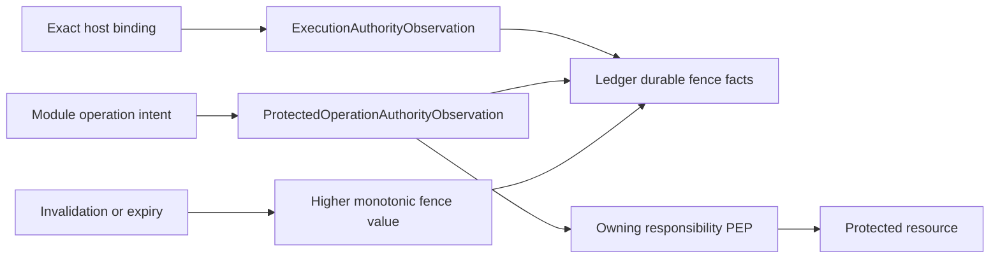

# Agent Runtime External Authority Integration Contract

**Purpose**: Define how Runtime consumes, freezes, refreshes, and records
execution-time observations from external authorization and governed-data
authorities without becoming an identity, Entitlement, policy, credential, or
resource-permission service.

**Required reader gain**: A maintainer can identify which authority facts enter
one execution, when the execution fence must close, which component enforces a
protected resource, and how late results and compensation requests behave when
external authority changes.

## 0. Contract Capsule

```yaml
layer: T2
status: candidate
canonical_owner: designDoc/agent_runtime_09_external_authority_integration_contract.md
parent: designDoc/agent_runtime_00_runtime_domain_contract.md
owned_system_object: execution-time external-authority observations and fence semantics
inherits:
  - designDoc/the_charter.md
  - designDoc/the_agent_runtime.md
  - designDoc/the_product_authorization.md
  - designDoc/the_data_governance.md
  - designDoc/the_timestamp_semantic.md
scope:
  - provider-neutral external-authority observation ports
  - immutable execution authority and governed-data scope bindings
  - current-status, invalidation, and fence-value semantics
  - protected-operation authority observations
  - late-result quarantine and newly authorized compensation requests
non_goals:
  - authentication, Product Principal, Group, Entitlement, policy, or grant management
  - Registry lifecycle authorization or another Runtime responsibility's resource policy
  - direct database access, row filtering, resource mutation, or credential custody
  - Workflow state, retry, finalization timing, event application, or durable scheduling
outputs:
  - ExternalAuthorityPort
  - ExternalAuthorityInvalidationSink
  - ExecutionAuthorityObservation
  - GovernedDataScopeObservation
  - ProtectedOperationAuthorityObservation
  - ExternalAuthorityInvalidation
  - CompensationAuthorityObservation
  - AuthorityFenceValue
truth_surfaces:
  - designDoc/agent_runtime_09_external_authority_integration_contract.md
  - code-owned provider-neutral authority protocols and observation schemas
  - canonical Ledger refs to committed observations and fence facts
```

## 1. Owned Result

External Authority Integration turns external decisions into bounded,
provider-neutral observations that Runtime can bind to one execution and use in
fail-closed fence comparisons. It does not create or widen authority.

The initiating Product Principal remains external. Runtime is a distinct
workload actor. A Workflow Execution is neither a Principal nor an Entitlement.
Module permissions come from each admitted Module release; user permission
comes from Product Authorization; governed-data filtering is performed by the
resource-owning Data Access Gateway. Runtime carries exact refs and scopes to
those enforcement points.

## 2. External Authority Port

The provider-neutral `ExternalAuthorityPort` supports bounded operations:

| Operation | Result |
| --- | --- |
| `validate_execution_authority` | Current immutable authority observation for an exact host binding and execution origin |
| `resolve_governed_data_scope` | Opaque governed-data scope observation for one declared input or query class |
| `authorize_protected_operation` | Current allow or deny observation and required grant disposition for one exact operation intent |
| `resolve_execution_status` | Current status and monotonic fence value for one bound execution authority context |
| `request_compensation_authority` | A new, separately authorized observation for one exact compensation intent |

The port accepts trusted Runtime values and returns typed observations plus
immutable evidence refs. It exposes no policy body, Entitlement evaluator,
database connection, credential, mutable user profile, or provider-specific
client to a Module or Adapter.

Concrete hosts may implement the port with Product Authorization, Data Access
Gateways, or other admitted services. Runtime code depends only on this port.

`ExternalAuthorityInvalidationSink` is an intra-Execution protocol implemented
behind the public `RuntimeExecutionService.submit_authority_invalidation`
action. A trusted host integration cannot call the sink directly. Execution is
the Policy Enforcement Point for that action: its
`ResourcePermissionManifest` declares the authority-invalidation resource,
`submit_authority_invalidation` action, exact execution-binding scope, trusted
external-authority workload actor, and bounded `OperationGrant` requirement.
Only after that public action validates the current grant does Execution pass
the typed observation to the sink for identity, monotonic-order, Ledger-commit,
and state coordination.

Every submission carries trusted external-authority request context, the exact
execution authority binding ref and hash, the monotonic external status or
fence value, and immutable evidence refs. The sink value carries no Runtime
state or retry decision. When an integration has no admitted push channel,
Execution must refresh `resolve_execution_status` before every protected
dispatch, operation, finalization, event application, cancellation, and
process re-entry.

## 3. Execution Authority Binding

Before execution starts, Execution obtains one
`ExecutionAuthorityObservation` binding:

- exact host execution binding and Runtime execution origin;
- initiating Product Principal and Runtime workload actor as distinct refs;
- tenant, Cell, authorization context, policy release, and decision refs;
- admitted maximum execution scope and expiry;
- registered protected predicate version;
- pinned `DistributedClockProfile` and fresh `ClockHealthEvidence`; and
- monotonic external authority status and fence value.

The clock-health closure contains fresh evidence for every clock domain named
by the profile, including each external authority domain and the Runtime Ledger
store domain that assigns the authoritative commit instant.

Caller payload cannot select or widen Principal, tenant, Cell, scope, policy,
clock profile, or decision. The observation contains no Entitlement body.
Ledger commits the exact refs and hashes with the execution start and durable
fence facts.

An authority expansion never widens a running execution. A Principal, tenant,
Cell, policy, scope, or execution-binding change starts a new execution.
Reduction, expiry, revocation, mismatch, or unverifiable status closes the old
execution fence.

## 4. Governed Data and Module Permission Conjunction

Runtime does not compute row or object visibility. For a governed read or
mutation it supplies:

- the exact execution authority binding;
- exact Module release and its registered operation ID;
- requested resource and action through a typed interface;
- current governed-data scope observation when required; and
- operation idempotency and lineage.

The resource owner or Gateway is the Policy Enforcement Point. It resolves the
effective intersection of user authority and Module permission, applies Data
Governance and resource-local preconditions, performs the operation through its
own credential, and returns bounded decision and effect evidence. Runtime never
receives the database credential or substitutes a direct connection.

Each Runtime responsibility that owns a protected resource publishes and
enforces its own `ResourcePermissionManifest`. This document does not become a
central Runtime PEP and does not replace Registry or Invocation enforcement.

## 5. Protected Operation Intent and Observation

Execution commits a protected-operation intent before the operation begins.
The intent binds the execution, Module Run, Variant, Attempt, Module permission,
action, resource, input hash, deadline, idempotency identity, enforcing service,
and required grant class.

External Authority Integration returns one
`ProtectedOperationAuthorityObservation` containing the exact decision,
context, status, grant disposition when required, predicate, clock profile,
health evidence, validity window, and enforcing audience refs and hashes.
For a dynamic Invocation-owned operation, Execution's request-bound
`InvocationHost` obtains this one observation through
`authorize_protected_operation`; Invocation applies it to Invocation's own
`ResourcePermissionManifest` and therefore remains the enforcing
responsibility. Execution does not issue a second authorization decision. It
verifies observation-to-request and observation-to-execution binding and
submits the exact refs and hashes for the Ledger intent transaction. A provider
trace or later observation cannot manufacture prior authority.

## 6. Fence Semantics and Time

An `AuthorityFenceValue` is monotonic within one execution authority binding.
It represents whether new protected work and terminal result admission remain
allowed under the latest committed external observation.

When clock domains differ, the observation includes the registered protected
predicate, immutable `DistributedClockProfile`, and fresh
`ClockHealthEvidence` for every participating domain, including the Runtime
Ledger store domain. Validity uses Timestamp Semantics' conservative half-open
window. Missing evidence for any domain, or expired, unhealthy, regressed,
mismatched, unknown, or unverifiable evidence closes the fence.

Document 04 stores the durable fence facts and evaluates the supported
predicate inside atomic finalization. This document defines their meaning;
document 10 decides when to request comparison and how execution advances.



## 7. Invalidation and Late Results

An invalidation is accepted only for the exact execution authority binding and
a fence value greater than the last committed value. Duplicate identical
events are idempotent. Conflicting reuse or regression fails closed.

After the fence closes:

- no new Module dispatch or protected operation begins;
- a provider or tool result already in flight may be retained as bounded
  diagnostic and usage evidence but is quarantined from authoritative
  Resolution;
- already committed external effects remain historical truth and are not
  repeated; and
- continued or compensating work requires a new, exact external authorization
  observation and a new execution or Workflow-authorized compensation branch.

Historical facts are not rewritten when later authority changes.

## 8. Failure and Recovery Semantics

| Failure | Required result |
| --- | --- |
| Missing or invalid execution observation | Reject start before durable submission |
| Authority service unavailable | Fail closed at the protected transition; retry only the same observation request |
| Invalidation lacks trusted request context or exact execution binding | Reject without changing the Runtime fence |
| Invalidation reuses an identity with different bytes or regresses the monotonic value | Reject as immutable conflict and fail closed for new protected work |
| No push channel and current status cannot be refreshed | Fail closed at the next protected transition or re-entry |
| Entitlement or scope expands | Preserve the original maximum; require a new execution to use expansion |
| Scope reduces, expires, or is revoked | Advance the monotonic fence and stop new work |
| Cross-clock evidence is unprovable | Close fence; do not compare bare wall clocks |
| Gateway or resource owner denies | Record denial; no direct credential or alternate path |
| Late result after fence closure | Quarantine; preserve bounded observation and usage evidence |
| Compensation requested under old authority | Reject; require newly authorized compensation identity |

Runtime never changes provider, Gateway, policy copy, tenant, Cell, or
credential to bypass an external-authority failure.

## 9. Conformance and Completion Evidence

Conformance proves:

1. base Runtime operates with a replaceable in-memory external-authority port;
2. caller-selected Principal, tenant, Cell, scope, policy, and decision fail;
3. initiating Principal and Runtime workload actor remain distinct;
4. expansion does not widen a running execution;
5. reduction, expiry, revocation, and mismatch monotonically close the fence;
6. user authority and Module permission are both required at the owning PEP;
7. every high-risk operation carries the grant class required by the owning
   `ResourcePermissionManifest`;
8. Modules and Adapters receive no policy body, Entitlement body, database
   credential, or unfiltered resource client;
9. cross-clock validity records and verifies the exact predicate, profile, and
   complete fresh health-evidence set for every participating clock domain,
   including the Runtime Ledger store, and fails closed for every invalid case;
10. pushed invalidation rejects untrusted, cross-binding, conflicting, and
    regressed submissions through the authorized
    `RuntimeExecutionService.submit_authority_invalidation` action, while an
    integration without push refreshes current status at every declared
    protected boundary;
11. late results cannot create authoritative Resolution after fence closure;
12. compensation uses a new authority observation and idempotency identity; and
13. audit reconstruction joins external authority, Runtime Ledger, and
    resource-owner evidence without making a projection authoritative.

## 10. Change Boundary

This contract does not select an authorization product or freeze physical DTO
fields. After the complete Runtime Design Contract set is accepted, the Code
Design Basis must define public protocols, observation schemas, fence-value
representation, protected-predicate implementations, predecessor
authorization disposition, test doubles, integration evidence, and rollback.

## References

- [Agent Runtime Charter](../agent_runtime_t0_t1_candidate/the_charter.md)
- [Agent Runtime T0](../agent_runtime_t0_t1_candidate/the_agent_runtime.md)
- [Agent Runtime Domain Contract](../agent_runtime_t0_t1_candidate/agent_runtime_00_runtime_domain_contract.md)
- [Execution Ledger](../agent_runtime_t2_candidate_next/agent_runtime_04_execution_ledger_contract.md)
- [Product Authorization](../../designDoc/the_product_authorization.md)
- [Data Governance](../../designDoc/the_data_governance.md)
- [Timestamp Semantics](../../designDoc/the_timestamp_semantic.md)
