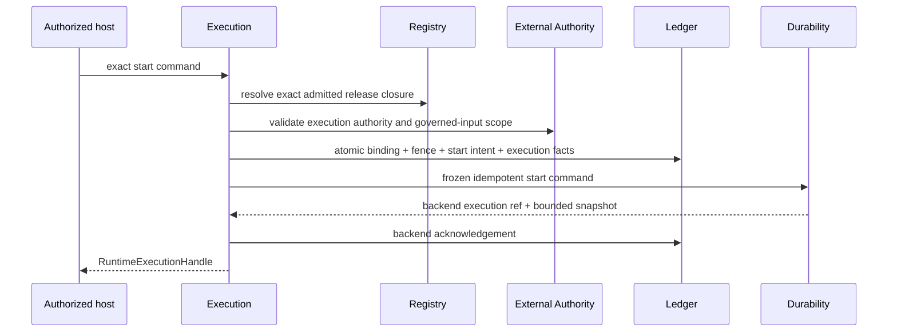

# Agent Runtime Execution Contract

**Purpose**: Define the single Runtime composition root that turns an exact
authorized host command into Workflow and Module progress, Attempt policy,
Evaluation, Selection, Resolution, cancellation, and reconciliation by using
Registry, Ledger, Invocation, Durability, External Authority, and Event Ingress
through their public contracts.

**Required reader gain**: A maintainer can implement the public Runtime service
and one state machine without creating a second Ledger, retry loop, provider
path, durable coordinator, authorization system, or product workflow owner.

## 0. Contract Capsule

```yaml
layer: T2
status: candidate
canonical_owner: designDoc/agent_runtime_10_execution_contract.md
parent: designDoc/agent_runtime_00_runtime_domain_contract.md
owned_system_object: Runtime host lifecycle and execution state machine
inherits:
  - designDoc/the_charter.md
  - designDoc/the_agent_runtime.md
  - designDoc/the_product_authorization.md
  - designDoc/the_data_governance.md
  - designDoc/the_timestamp_semantic.md
scope:
  - public Runtime execution lifecycle
  - Workflow and independent Module execution origins
  - Module Run, Variant, Attempt, Evaluation, Selection, Resolution, and Outcome coordination
  - retry, wait, cancellation, external-event, and reconciliation state machines
  - composition of Registry, Ledger, Invocation, Durability, and external-authority ports
non_goals:
  - product routing, workflow selection, tenant placement, or host execution binding issuance
  - release admission, canonical record storage, provider invocation, or durable backend implementation
  - Product Authorization policy, governed-data access, business content meaning, or UI
outputs:
  - RuntimeExecutionService
  - RuntimeExecutionCommand family
  - RuntimeExecutionHandle and RuntimeExecutionStatus
  - Execution ResourcePermissionManifest
  - execution state-machine and reconciliation evidence
truth_surfaces:
  - designDoc/agent_runtime_10_execution_contract.md
  - code-owned public Execution protocols and state-machine registrations
  - canonical Ledger facts and durable acknowledgement refs
```

## 1. Owned Result and Host Boundary

Execution is the Runtime composition root. It owns ordering and decisions, not
the implementation authority of its dependencies.

The host supplies one exact, already selected execution binding. Runtime never
chooses a product workflow, deployment, tenant, Cell, provider, model, or
durable backend from a request. Start resolves exact admitted Runtime releases
and external authority and fails closed on missing or ambiguous closure.

Two origins are supported:

1. an exact admitted Workflow Release; and
2. an exact admitted Module Release when its registration allows independent
   execution.

Both origins create one common top-level `RuntimeExecution` identity and the
same Module Run, Variant, Attempt, Invocation, Ledger, authority, and durability
lineage. Workflow origin additionally creates one Workflow Execution;
independent Module origin does not. Test and Evaluation entry points use the
same service with an explicitly registered execution purpose.

## 2. Public Runtime Execution Service

`RuntimeExecutionService` exposes:

| Operation | Result |
| --- | --- |
| `start` | Idempotently start one exact authorized execution and return its handle |
| `get_status` | Return one bounded status and resolved output refs |
| `request_cancellation` | Commit and deliver one authorized cancellation intent |
| `submit_external_event` | Apply document 03 to one exact legal wait |
| `submit_authority_invalidation` | Accept one authorized pushed invalidation for the exact execution binding |
| `reconcile` | Repair one committed intent or result lacking its backend acknowledgement |
| `recover` | Resume from canonical Ledger facts and one bounded durable snapshot |

The service accepts provider-neutral DTOs and narrow ports. It does not expose
PostgreSQL sessions, Temporal handles, provider SDK objects, in-memory Registry
types, or Product Authorization clients to callers.

### 2.1 Execution resource enforcement

Execution is the Policy Enforcement Point for its own execution resources. Its
code-owned `ResourcePermissionManifest` declares:

- resource types for Runtime execution origins, active executions, external
  event targets, authority-invalidation targets, cancellation targets, and
  reconciliation cases;
- atomic actions `start`, `get_status`, `request_cancellation`,
  `submit_external_event`, `submit_authority_invalidation`, `reconcile`, and
  `recover`;
- Principal, tenant, Cell, origin-release, execution, and lineage scope forms;
- exact binding, lifecycle state, fence, idempotency, and compatibility
  conditions; and
- the grant requirement class for every action.

`start`, `get_status`, `reconcile`, and `recover` require a current exact
authorization decision under their registered scope. External
`request_cancellation`, `submit_external_event`, and
`submit_authority_invalidation` mutate canonical execution state across a
service boundary and require the bounded `OperationGrant` class unless a
successor manifest deliberately admits a narrower class. Execution
enforces this manifest itself through a host-provided Product Authorization
decision-validator protocol supplied at service composition. For every public
action, Execution resolves the exact action, resource, Principal, scope, and
required grant class server-side and asks that validator for the current
decision or bounded grant evidence before mutation or disclosure. This
lifecycle validator is an Execution public dependency and is distinct from
document 09's execution-time authority-observation and protected-operation
ports; Execution does not route lifecycle authorization through those ports.

## 3. Start Protocol

One start command binds exact host execution binding, origin release, input
package, admitted Runtime Execution Variant Policy release, external authority
context, governed-input scope, durable Adapter binding, and stable idempotency
identity. The Variant Policy is an admitted Registry Execution Variant Policy
Release carried as an opaque exact ref by the host binding. It declares the ordered sibling
Variant IDs and exact admitted Execution Profile refs for every Workflow node
or independent Module origin. The host forwards this Runtime release and cannot
add or replace a Profile. Before committing the common `RuntimeExecution`,
Execution verifies that Workflow-origin coverage exactly matches every
executable node in the pinned Workflow graph, or that Module-origin coverage
exactly matches the one pinned Module. Missing, extra, duplicate, unresolved,
or unadmitted Variant or Profile coverage rejects the start; Execution never
fills it from an ambient default. Time, worker, process, and random workspace
values do not enter logical start identity.



If the Ledger start exists but acknowledgement does not, `start` or
`reconcile` resubmits the same durable command and commits the returned existing
backend result. It creates no second Runtime Execution, Workflow Execution, or
root Module Run.

## 4. Workflow and Module Coordination

Execution interprets only the registered provider-neutral Workflow control
schema plus the admitted Runtime Execution Variant Policy release in the host
binding: nodes, legal
edges, Module release refs, exact per-node sibling Variant IDs and Execution
Profile refs, branch and join policy, wait policy, retry policy, Evaluation
policy, Selection policy, and terminal Outcome mapping. Domain names and
content remain opaque.

For an independent Module origin, Execution commits one top-level
`RuntimeExecution` with `origin_kind=module`, exact Module Release, external
binding, authority, governed input, and Variant Policy refs. It commits no
Workflow Execution fact and creates one root Module Run. The Module Release's
registered entry, retry, Evaluation, output-resolution, and terminal mapping
policies replace the Workflow control schema. An independent Module origin
cannot enter an external wait or accept an external event; a product requiring
that lifecycle registers a Workflow Release, including a one-Module Workflow
when appropriate.

Execution also supplies the request-bound implementation of Invocation's
`InvocationHost` protocol. The implementation may stage content only through
the Ledger content port and may enter a dynamic admitted resource only after it
has revalidated the active Attempt claim and current durable fence and received
the Ledger commit receipt for the exact protected-operation intent. This
composition gives Invocation no Ledger import and creates no second Ledger
writer.

For one ready dispatch Execution:

1. resolves the exact pinned release and current Ledger state;
2. checks no terminal Outcome or resolved dispatch already exists;
3. obtains the current authority observation and commits one active Attempt
   claim with the next legal ordinal;
4. commits every protected-operation intent known before Invocation;
5. calls Invocation once for that Attempt with the request-bound
   `InvocationHost`;
6. for each dynamic operation requested during Invocation, obtains exactly one
   `ProtectedOperationAuthorityObservation` through document 09's
   `authorize_protected_operation` port; Invocation applies that observation
   to its own `ResourcePermissionManifest`, while Execution independently
   verifies only that its refs and hashes match the active execution binding,
   Attempt, operation, resource, action, scope, and required grant class;
   Ledger then atomically revalidates the active claim and durable fence and
   commits the exact intent before the host bridge permits resource entry;
7. stages output or diagnostic bytes only through the Ledger content port;
8. receives bounded observations without treating them as facts or decisions;
9. requests Ledger finalization, including active-claim and fence comparison;
10. applies registered Evaluation and Selection policy to committed candidates;
11. commits one Module Output Resolution, Outcome, and checkpoint when ready;
12. submits the committed Outcome ref to Durability; and
13. commits the backend acknowledgement.

No direct provider, tool, Gateway, database, or durable SDK call exists outside
the admitted public port for its responsibility.

## 5. Module Run, Variant, and Attempt Law

A Module Run represents one logical Module task in the Workflow. Sibling
Execution Variants represent declared provider, model, Profile, Adapter, or
experimental execution differences under the same Module semantics. An Attempt
is one try of one Variant.

- Provider/model A/B creates sibling Variants, not duplicate Workflows.
- A retry creates the next monotonic Attempt under the same Variant.
- A reviewer or debater invocation is its own Module Run when the Workflow
  graph declares that Module.
- Reviewer feedback sent to a writer creates a new writer Module Run or a new
  Workflow-declared revision dispatch; it never rewrites a committed Attempt.
- A provider session may resume only under Invocation's compatibility law and
  never substitutes for Module Run or Attempt history.

## 6. Retry, Evaluation, Selection, and Resolution

Only Execution applies the release-pinned retry policy. A retry is allowed only
for a typed failure whose policy class, Attempt ceiling, time budget, authority
fence, and Workflow state permit another Attempt. Backend delivery retries do
not count as Runtime Attempts. A programming defect is not silently converted
into a provider retry.

Attempt time budgets are measured by the monotonic process clock under the
exact Execution Profile and are never persisted as cross-process business
timestamps. Persistent retry and wait timers use a registered integer duration
from the pinned policy and one Timestamp-governed `scheduled_for_at_utc`
derived from an authoritative Ledger commit instant or another explicitly
admitted scheduling instant under the execution-pinned clock profile.
Execution never assigns the Ledger's `recorded_at_utc`.

Evaluation consumes committed candidate outputs and exact evaluator Module or
deterministic evaluator releases. It produces observations that Ledger commits
under the evaluated candidates. Selection consumes only committed Evaluation
facts and policy. Resolution commits exactly one authoritative Module output or
one explicit no-selection outcome. Later Attempts cannot replace an existing
Resolution without a new Workflow-declared revision lineage.

Parallel branches and fan-out create independently identified Module Runs.
Join readiness depends only on committed branch outcomes and the registered
join policy; completion order or backend delivery order cannot alter meaning.

## 7. Waits and External Events

A wait commits exact control position, wait generation, accepted event classes,
event schema refs, and timeout policy. Durability holds only the bounded wait
identity. Document 03 validates one external request against this exact wait.
Only Workflow-origin executions can enter this state.

After an event intent commits, Execution calls the declared Durability
`apply_event` operation with one frozen command. Durability returns one
`DurableAcknowledgement` and bounded resulting snapshot. Execution verifies the
current wait, authority fence, and event lineage and commits the application,
next checkpoint, and backend acknowledgement through Ledger. Separately, a
`DurableReadyEvent` delivered through `DurableDispatchSink` may wake Execution
for a timer, wait, cancellation, or recovery condition; it carries no state
decision and is not the response to `apply_event`.

## 8. Cancellation and Authority Invalidation

Cancellation and external-authority invalidation serialize against the same
active claim and durable fence used by finalization.

- A cancellation request requires its exact external authority observation.
- Execution commits cancellation intent before durable delivery.
- An in-flight Invocation receives best-effort cancellation, but its late
  result is still subjected to Ledger finalization and quarantine.
- Authority invalidation prevents new dispatch and protected operations and
  leads to `authorization_invalidated` when no newly authorized compensation
  branch exists.
- Already committed external effects remain facts and are reconciled, never
  repeated or erased.

Backend-native force termination is break-glass evidence, not a successful
Runtime cancellation.

## 9. Reconciliation and Recovery

Execution is the only owner of cross-responsibility reconciliation. It compares
canonical Ledger intents and acknowledgements with one bounded durable snapshot.
It never copies complete backend history into Ledger or lets backend state
overwrite committed Runtime facts.

Reconciliation covers:

- start intent without backend acknowledgement;
- protected operation or external effect with uncertain acknowledgement;
- committed Outcome or event intent not yet acknowledged by Durability;
- backend snapshot ahead of the last Ledger acknowledgement;
- worker replacement and provider-session loss; and
- break-glass backend termination.

Each case either replays the same idempotent command, commits a missing
acknowledgement for an existing backend result, quarantines an incompatible
result, or stops for typed operator repair. It never mints replacement
authority, a new Attempt, or a new execution merely to hide uncertainty.

## 10. Failure and Terminal Semantics

| Failure | Execution result |
| --- | --- |
| Execution action or resource absent from the admitted Execution ResourcePermissionManifest | Reject before Runtime mutation or disclosure |
| Missing or incompatible release, binding, schema, or authority | Reject start or dispatch before side effect |
| Invocation typed retryable failure | Apply exact retry policy and schedule through Durability |
| Invocation terminal or non-retryable failure | Commit failed Attempt and registered branch or terminal Outcome |
| Runtime or Adapter programming defect | Internal failure; preserve reconciliation intent; no provider fallback |
| Active claim or authority fence lost at finalization | Quarantine result; no Resolution |
| Evaluation or Selection closure incomplete | Remain unresolved; do not guess a winner |
| Durable acknowledgement missing | Preserve committed intent and reconcile |
| Illegal or stale external event | Reject with no Workflow transition |
| Cancellation or invalidation race | Serialize on the claim and fence; at most one authoritative terminal result |

Execution terminal status is derived from the latest committed Outcome and
acknowledgement state, not from the first failed Attempt or provider session.

## 11. Conformance and Completion Evidence

Execution conformance proves:

1. the public service starts Workflow and independent Module origins under one
   common Runtime Execution identity, with Workflow Execution present only for
   Workflow origin, through the same authority, Ledger, Invocation, and
   durability law;
2. exact start replay creates one Runtime Execution and one backend binding;
3. no mutable `latest` release lookup occurs after start;
4. one dispatch produces monotonic Attempts and at most one active claim;
5. retry policy, ceilings, timers, and terminal failure are actually executed;
6. sibling A/B Variants remain isolated and Selection consumes committed
   Evaluation facts only;
7. review loops create explicit new Module Run or revision lineage;
8. fence closure and cancellation quarantine late results under concurrency;
9. external event, Outcome, cancellation, and start crash windows reconcile
   without duplicate work or effects;
10. replay and recovery do not call providers, Gateways, or business resources;
11. a second Ledger, direct provider path, shadow retry loop, and concrete
    durable-backend import are absent;
12. every public execution action enforces the admitted Execution
    `ResourcePermissionManifest`, exact decision, and required grant before
    Runtime mutation or disclosure;
13. `get_status` remains within declared response budgets, returns bounded
    status and resolved output refs only, and delegates paged trace and content
    retrieval to Inspection 06;
14. retry budgets use the admitted monotonic duration boundary, persistent
    timers use governed instant and integer-duration forms, and Execution never
    assigns a Ledger commit instant;
15. real persistent-store, provider, and durable-backend tests prove the
    end-to-end lifecycle and every declared crash window;
16. every start rejects an Execution Variant Policy with missing, extra,
    duplicate, unresolved, or unadmitted coverage before any execution fact or
    protected work is committed;
17. every public lifecycle action resolves its exact action, resource, scope,
    and grant class server-side and validates the current Product Authorization
    decision through the host-provided decision-validator protocol before
    mutation or disclosure; and
18. the Execution-supplied `InvocationHost` proves that each dynamic operation
    binds exactly one document-09 `ProtectedOperationAuthorityObservation`,
    whose refs and hashes machine-match the active execution, Attempt,
    operation, action, resource, scope, and required grant class; Invocation is
    the sole resource PEP, Execution performs no second authorization decision,
    Ledger atomically verifies the active claim and current durable fence before
    committing the intent, resource entry follows the receipt, and content
    staging uses only Ledger's content port; and
19. `submit_authority_invalidation` is the only pushed-invalidation service
    entry, enforces the Execution ResourcePermissionManifest and bounded grant
    before the intra-Execution sink, and rejects untrusted or cross-binding
    submissions before Ledger mutation.

## 12. Change Boundary

This contract does not freeze exact Python classes or migrate current services.
After the complete Runtime Design Contract set is accepted, the Code Design
Basis must define public service DTOs, the state and transition table, atomic
Ledger batch builders, retry and Evaluation engines, dependency injection,
predecessor execution disposition, migration sequence, tests, and rollback.

## References

- [Agent Runtime Charter](../agent_runtime_t0_t1_candidate/the_charter.md)
- [Agent Runtime T0](../agent_runtime_t0_t1_candidate/the_agent_runtime.md)
- [Agent Runtime Domain Contract](../agent_runtime_t0_t1_candidate/agent_runtime_00_runtime_domain_contract.md)
- [Registry](../agent_runtime_t2_candidate/agent_runtime_01_registry_contract.md)
- [Execution Ledger](../agent_runtime_t2_candidate_next/agent_runtime_04_execution_ledger_contract.md)
- [Invocation](../agent_runtime_t2_candidate_next/agent_runtime_08_invocation_contract.md)
- [Durability](../agent_runtime_t2_candidate_next/agent_runtime_07_durability_contract.md)
- [External Authority](agent_runtime_09_external_authority_integration_contract.md)
- [External Event Ingress](agent_runtime_03_external_event_ingress_contract.md)
