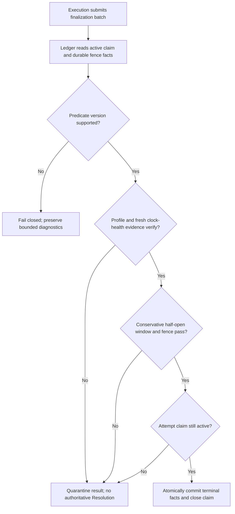

# Agent Runtime Execution Ledger Contract

**Purpose**: Define the single authoritative record model, append and atomic
transaction semantics, content references, authority-fence facts, persistence
ports, and query boundary for Agent Runtime execution.

**Required reader gain**: A maintainer can decide which execution fact belongs
in the Ledger, which responsibility decides that fact, which records must
commit together, how idempotent replay is recognized, and how a persistent
Ledger implementation can change without creating a second execution truth.

## 0. Contract Capsule

```yaml
layer: T2
status: candidate
canonical_owner: designDoc/agent_runtime_04_execution_ledger_contract.md
parent: designDoc/agent_runtime_00_runtime_domain_contract.md
owned_system_object: authoritative Agent Runtime execution facts and transaction semantics
inherits:
  - designDoc/the_charter.md
  - designDoc/the_agent_runtime.md
  - designDoc/the_product_authorization.md
  - designDoc/the_data_governance.md
  - designDoc/the_timestamp_semantic.md
scope:
  - canonical execution record families and lineage constraints
  - deterministic fact identity and monotonic append order
  - idempotent atomic record batches and commit receipts
  - Attempt claim, terminal finalization, fence comparison, and acknowledgement transactions
  - immutable content references and body-custody facts
  - Registry-independent bounded Ledger query ports
  - Ledger-store schema release and migration compatibility
non_goals:
  - Workflow routing, retry decisions, Evaluation policy, Selection, or state advancement
  - provider invocation, tool execution, workspace management, or provider-session state
  - durable-backend scheduling, timer, replay, or cursor ownership
  - Product Authorization, Entitlement, governed-data policy, or external-effect compensation
  - inspection presentation, caller authentication, billing prices, or domain artifact admission
outputs:
  - RuntimeExecutionRecordStore
  - RuntimeExecutionQueryStore
  - RuntimeContentStore
  - RuntimeRecordBatch and CommitReceipt
  - canonical execution-record schema family
truth_surfaces:
  - designDoc/agent_runtime_04_execution_ledger_contract.md
  - code-owned Ledger record and persistent-schema registrations
  - canonical Ledger records and migration evidence
```

## 1. Owned Result

The Ledger is the sole Runtime system of record for committed execution facts.
It answers what Runtime accepted, attempted, observed, committed, rejected,
resolved, acknowledged, and recovered. It does not decide what should run next.

Execution owns state-machine decisions and submits valid record batches.
Invocation returns bounded observations. Durability returns backend receipts and
snapshots. External Authority Integration returns authority observations.
Ledger validates lineage, compares the active durable fence where required,
assigns append order, and commits the resulting facts atomically.

Provider transcripts, CLI workspaces, Temporal history, Inspector projections,
in-memory result objects, and usage aggregates are derived or operational
surfaces. None is a second Ledger.

## 2. Record Families and Decision Owners

| Record family | Decision supplied by | Ledger responsibility |
| --- | --- | --- |
| Runtime Execution, conditional Workflow Execution, and external binding | Execution and host command | Preserve exact origin, release, authorization, data-scope, and start lineage |
| Module Run, Variant, and Attempt claim | Execution | Validate parent closure, ordinal, active claim, and idempotent identity |
| Model call, tool call, usage, failure, and raw output observation | Invocation or enforcing Gateway | Canonicalize bounded observations under the exact Attempt |
| Authority binding, protected-operation intent, invalidation, and fence value | External Authority Integration and Execution | Preserve exact refs and perform the registered atomic comparison |
| Evaluation, Selection, Resolution, Outcome, and checkpoint | Execution | Validate referenced candidates and commit the chosen facts |
| Durable start, event, cancellation, outcome, and checkpoint acknowledgement | Durability through Execution | Bind one backend receipt and snapshot to the originating intent |
| Content reference, custody state, tombstone, and unavailability | Content Store and Data Governance decision | Preserve immutable lineage while representing current body availability |

The Ledger owns record schemas and validation. It does not infer missing
decisions from timestamps, latest rows, provider status, filenames, or backend
history.

## 3. Canonical Identity and Append Law

Every canonical fact has one record version, one canonical payload, and one
content-hash domain. A stable fact ID is derived only from the immutable logical
identity of the fact. `recorded_at_utc`, lease time, worker identity, random
workspace path, retry delay, and other observation-local values never enter an
idempotency key or logical fact identity.

The Ledger enforces:

1. one common Runtime Execution identity for one exact start command hash,
   with a Workflow Execution fact only for Workflow origin; for independent
   Module origin, that same start identity also fixes exactly one root Module
   Run identity and replay cannot create a second root Module Run;
2. one Module Run, Variant, and Attempt lineage under their declared parents;
3. monotonic Attempt ordinals per Variant and no simultaneous active claim for
   the same dispatch;
4. exact call, usage, output, Evaluation, Selection, Resolution, Outcome,
   checkpoint, and acknowledgement parent closure;
5. byte-identical replay returns the existing commit receipt;
6. the same logical identity with different canonical bytes is a conflict; and
7. append order is a Ledger sequence, not an inference from wall-clock time.

Timestamp fields retain the instant semantics and format required by Timestamp
Governance. They describe when an observation occurred. They do not establish
transaction order or replay identity. The Ledger store alone assigns
`recorded_at_utc` at atomic commit; an observation supplier cannot provide or
override it. Every concrete persisted Ledger record class has one exact
Timestamp class registration.

## 4. Public Ledger Ports

The Runtime exposes three responsibility-owned ports:

| Port | Boundary |
| --- | --- |
| `RuntimeExecutionRecordStore` | Commits typed, validated atomic record batches and returns exact receipts |
| `RuntimeExecutionQueryStore` | Returns bounded execution facts through explicit execution, lineage, record-family, and cursor constraints |
| `RuntimeContentStore` | Stages immutable bytes, verifies content hashes, binds content refs, retrieves bodies under a scope resolved outside Ledger, and applies registered body-custody dispositions |

These ports expose Ledger records and values. They do not expose a concrete
PostgreSQL connection, ORM session, transaction object, in-memory store,
Inspection view model, or Execution service.

The query port receives a storage-applicable authorized scope resolved outside
Ledger. It filters at the storage boundary and returns no row outside that
scope. Inspection performs current per-object authorization as defense in depth
before exposing content bodies. Content retrieval returns either the exact
authorized body or a typed body-unavailable result that preserves its lineage,
hash, and current disposition facts; it never substitutes empty bytes or hides
that the body once existed.

## 5. Atomic Transaction Families

### 5.1 Execution start

One start batch commits the exact host binding, admitted Runtime release
closure, external authorization context, governed-input scope, active authority
fence, durable-start intent, and top-level Runtime Execution fact. A
Workflow-origin start additionally commits its exact Workflow Execution fact.
An independent Module origin additionally commits `origin_kind=module`, the
exact Module Release and Variant Policy refs, and the one root Module Run fact
directly under the Runtime Execution; it commits no invented Workflow identity.
Byte-identical replay returns the same Runtime Execution and root Module Run
identities. A conflicting replay fails before a durable command is sent.

### 5.2 Attempt claim

One claim transaction checks the current dispatch state, existing Outcome,
active Variant, next legal Attempt ordinal, retry eligibility supplied by
Execution, and current authority fence. It either returns the existing terminal
Outcome, returns the existing byte-identical claim, or commits one new claim.

### 5.3 Protected operation intent

Before a model call, Gateway call, external effect, or other protected
operation begins, Ledger commits the exact operation identity, parent Attempt,
authority-observation refs, resource/action scope, and idempotency identity.
Observation after the operation cannot manufacture this prior authority.

For a dynamic operation discovered after Invocation begins, the
Execution-supplied `InvocationHost` submits this exact intent through the
Execution-owned Ledger writer and waits for the commit receipt before entering
the admitted resource callable. The intent transaction itself verifies the
active Attempt claim, reads and compares the current durable fence, verifies
that the exact `ProtectedOperationAuthorityObservation` refs belong to the
same execution authority binding and operation request, and commits the intent
only if all checks pass. A prior process read or `InvocationHost` check cannot
substitute for these in-transaction checks. Invocation never writes Ledger
directly, and neither the resource receipt nor a provider trace can replace the
prior intent commit.

### 5.4 Attempt finalization

One finalization transaction:

1. verifies the active claim and parent lineage;
2. reads the current durable authority-fence facts and the finalization batch's
   exact predicate, `DistributedClockProfile`, and `ClockHealthEvidence` refs;
3. applies the supported registered predicate version fail closed;
4. verifies staged content hashes and all call, usage, and output refs;
5. commits the terminal Attempt plus every ready observation, output,
   Evaluation, Selection, Resolution, Outcome, and checkpoint fact; and
6. closes the claim.

If the claim is stale or the fence is closed, the transaction preserves
permitted usage and diagnostic facts, records the rejected or quarantined
result, and creates no authoritative output Resolution. A later Attempt cannot
be overwritten by an earlier completion.

### 5.5 Backend acknowledgement

A durable acknowledgement batch binds the original committed intent, exact
backend execution or command identity, returned bounded snapshot, and
acknowledgement disposition. Receipt loss replays the same batch. A different
snapshot under the same acknowledgement identity is a conflict.

## 6. Authority Fence and Clock Evidence

External Authority Integration owns fence meaning, invalidation rules, the
registered protected predicate, and any required `DistributedClockProfile` and
fresh `ClockHealthEvidence`. Ledger owns the durable fence facts and executes
the exact registered comparison inside the same transaction that would make an
Attempt result authoritative.

The finalization batch supplies typed refs and hashes for the predicate version,
the pinned `DistributedClockProfile`, and the fresh `ClockHealthEvidence`, or
references an already committed durable fence fact carrying that complete
tuple. The Ledger implementation evaluates the predicate itself using
Timestamp Semantics' conservative half-open validity window. Its supported
predicate versions are code-owned by the Ledger release; it performs no
Registry lookup and imports no document-09 implementation while the
transaction is open. An unknown or unsupported predicate version fails closed.



Ledger does not call an authorization service while holding a database
transaction and does not claim atomicity across independent systems. A missing,
expired, incompatible, or unprovable authority observation closes the fence.
Execution decides the subsequent Runtime state and whether newly authorized
compensation work may be requested.

## 7. Content and Custody

Runtime records refer to immutable content by exact ref, media type, byte
length, canonical schema ref when applicable, and content hash. A staged body
becomes authoritative only when its reference commits in a valid Ledger batch.
Unreferenced staged bytes are recoverable garbage, not output.

Data Governance owns retention, residency, export, legal disposition,
offboarding, encryption-key custody, and physical body destruction. Ledger
preserves producing lineage, hash, disposition, and tombstone facts when a body
becomes unavailable. Historical facts are never rewritten to pretend the body
never existed.

Prompt, response, tool argument, tool result, stdout, stderr, and private Source
bodies remain in their governed content class. Shared Ledger rows contain only
the bounded fields and content refs declared by their record schema.

## 8. Persistent Schema and Migration

Ledger owns Ledger record meaning, persistent-schema meaning, intended writer
semantics, and ordered schema compatibility. Data Governance registers the
record families as Data Assets, binds the System of Record and writer boundary,
and governs custody and transition registration. Software Delivery admits the
migration implementation and deployment.

Ordinary service startup never mutates schema. It reads one exact installed
schema release and refuses unsupported, incomplete, or ambiguous migration
state. Migration evidence covers clean creation, ordered forward upgrade,
interruption recovery, concurrent-writer fencing, reconciliation, explicit
rollback window, and a restore or forward-repair path. Reverse DDL is supported
only when explicitly proven.

## 9. Failure and Recovery Semantics

| Failure | Required result |
| --- | --- |
| Duplicate byte-identical batch | Return the original commit receipt |
| Same identity, different payload | Reject as immutable conflict |
| Missing or mismatched parent | Reject the complete batch |
| Stale Attempt claim | Preserve bounded observation evidence and quarantine the result |
| Protected-operation intent submitted under a stale claim, closed fence, or mismatched authority observation | Reject the entire intent batch before resource entry; commit no operation intent |
| Closed or unprovable authority fence | Commit the permitted failed or rejected facts; no output Resolution |
| Missing, expired, unhealthy, regressed, mismatched, or unverifiable cross-clock predicate, profile, or health evidence | Fail the conservative half-open fence comparison closed; preserve exact evidence refs and create no output Resolution |
| Content staging succeeds but fact commit fails | Leave unreferenced bytes eligible for governed cleanup |
| Authorized content body is unavailable | Return typed unavailability with lineage, hash, and disposition; do not fabricate or erase content history |
| Fact commit succeeds but caller loses receipt | Replay returns the original receipt without new facts |
| Backend effect committed but acknowledgement is absent | Preserve the intent for Execution reconciliation; do not infer failure |
| Unsupported store schema | Refuse startup or the affected operation |

Already committed external effects remain historical truth. Ledger records the
effect and its incomplete acknowledgement or compensation lineage. It cannot
erase the effect or authorize compensating work.

## 10. Conformance and Completion Evidence

Ledger conformance proves:

1. one canonical record family and no dual-write predecessor Ledger;
2. deterministic identity excludes timestamps and attempt-local randomness;
3. every lineage and cross-record reference closes exactly;
4. start, claim, operation-intent, finalization, and acknowledgement batches
   are atomic and idempotent;
5. concurrent operation-intent and finalization transactions admit only the
   active claim and current fence, and stale, closed, or mismatched authority
   observations cannot commit an intent;
6. retry success is not masked by an earlier failed Attempt;
7. staged-body loss, receipt loss, process crash, and acknowledgement gaps are
   recoverable without duplicate provider calls or effects;
8. authorized query scope is applied before rows leave storage;
9. content custody preserves immutable lineage and explicit unavailability;
10. every persisted record class has an exact Timestamp class registration and
    only the Ledger store assigns `recorded_at_utc` at atomic commit;
11. authority-sensitive finalization records the exact registered predicate,
    pinned `DistributedClockProfile`, and fresh `ClockHealthEvidence`, applies
    the conservative half-open window, and fails closed for every missing,
    expired, unhealthy, regressed, mismatched, unknown, or unverifiable case;
12. authorized body retrieval returns exact content or typed unavailability
    without losing lineage, hash, or disposition; and
13. real persistent-store tests prove transaction, concurrency, cross-clock
    fence, schema-release, migration, content-retrieval, and recovery behavior.

Missing real integration evidence remains validation debt and cannot be
reported as production conformance.

## 11. Change Boundary

This contract does not freeze exact record fields or migrate current Ledger
tables. After the complete Runtime Design Contract set is accepted, a Code
Design Basis must define the canonical record families, transaction APIs,
predecessor-ledger retirement, content-store seam, persistent-schema migration,
consumer closure, tests, and rollback before implementation changes.

## References

- [Agent Runtime Charter](../agent_runtime_t0_t1_candidate/the_charter.md)
- [Agent Runtime T0](../agent_runtime_t0_t1_candidate/the_agent_runtime.md)
- [Agent Runtime Domain Contract](../agent_runtime_t0_t1_candidate/agent_runtime_00_runtime_domain_contract.md)
- [Registry Contract](../agent_runtime_t2_candidate/agent_runtime_01_registry_contract.md)
- [Source Architecture](../agent_runtime_t2_candidate/agent_runtime_02_source_architecture_contract.md)
- [Product Authorization](../../designDoc/the_product_authorization.md)
- [Data Governance](../../designDoc/the_data_governance.md)
- [Timestamp Semantics](../../designDoc/the_timestamp_semantic.md)
