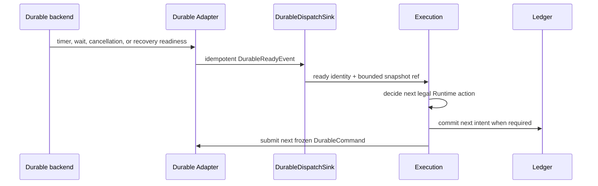
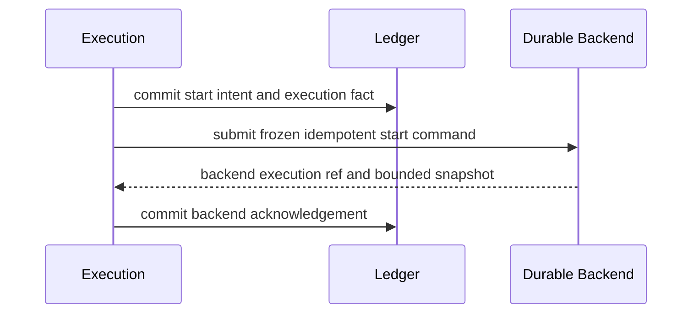

# Agent Runtime Durability Contract

**Purpose**: Define the provider-neutral commands, acknowledgements, bounded
snapshots, timers, waits, replay, and recovery behavior through which Execution
uses a replaceable durable backend.

**Required reader gain**: A maintainer can implement or replace a durable
backend without importing Registry, business Workflow meaning, provider
invocation, host topology, authorization policy, or the complete Execution
Ledger into durable history.

## 0. Contract Capsule

```yaml
layer: T2
status: candidate
canonical_owner: designDoc/agent_runtime_07_durability_contract.md
parent: designDoc/agent_runtime_00_runtime_domain_contract.md
owned_system_object: provider-neutral durable progress and recovery
inherits:
  - designDoc/the_charter.md
  - designDoc/the_agent_runtime.md
  - designDoc/the_timestamp_semantic.md
scope:
  - durable backend port and exact adapter release binding
  - idempotent frozen start, event, cancellation, outcome, timer, and checkpoint commands
  - backend acknowledgements and bounded execution snapshots
  - wait, retry-timer, replay, recovery, and worker replacement
  - bounded history rollover and snapshot compatibility
  - durable adapter conformance
non_goals:
  - Workflow graph meaning, legal transition policy, Module dispatch, retry eligibility, or Evaluation
  - Registry lookup, release admission, host route selection, tenant placement, or backend product selection
  - provider execution, model Context, Product Authorization, Entitlement, or governed-data access
  - canonical Runtime execution facts, content bodies, inspection presentation, or domain mutation
outputs:
  - DurableBackend
  - DurableDispatchSink and DurableReadyEvent
  - DurableCommand family
  - DurableAcknowledgement
  - DurableExecutionSnapshot
  - durable adapter conformance evidence
truth_surfaces:
  - designDoc/agent_runtime_07_durability_contract.md
  - admitted durable Adapter release and provider-neutral port
  - backend execution identity and bounded snapshots
  - canonical Ledger acknowledgement refs
```

## 1. Owned Result

Durability keeps Runtime progress recoverable across process, worker, and host
replacement. It accepts frozen idempotent commands from Execution and returns
exact backend identities, acknowledgements, and bounded snapshots. It owns the
backend protocol and replay invariants. Execution owns the decisions encoded in
the commands.

The durable backend receives no mutable Registry reader. A frozen start command
contains the exact execution identity, graph-control projection, adapter
release, safety ceilings, and opaque refs required for durable coordination.
The backend never discovers `latest`, chooses a provider, reads business data,
or interprets a domain role.

## 2. Public Durable Port

The provider-neutral `DurableBackend` supports:

| Operation | Required result |
| --- | --- |
| `start` | One backend execution ref and bounded initial snapshot for an exact frozen start command |
| `query` | Latest bounded snapshot for one backend execution ref |
| `apply_event` | Idempotent acknowledgement and resulting snapshot for one committed event intent |
| `request_cancellation` | Idempotent acknowledgement and resulting snapshot for one committed cancellation intent |
| `acknowledge_outcome` | Idempotent acknowledgement and resulting snapshot for one committed Runtime Outcome ref |
| `schedule_timer` | Stable timer identity for one retry or wait deadline |
| `cancel_timer` | Idempotent timer cancellation acknowledgement |
| `recover` | Same authoritative bounded snapshot after client or worker loss |

Adapter-specific clients, Workflow handles, SDK objects, database sessions, and
host deployment records remain private implementation. The Runtime public port
returns canonical provider-neutral values.

The inbound boundary is one provider-neutral `DurableDispatchSink`. When a
timer fires, a legal wait is satisfied, cancellation is observed, or recovery
work becomes ready, the Adapter delivers one `DurableReadyEvent` containing
only the exact backend execution ref, Adapter release ref, opaque backend
binding identity, stable command, timer, or wait identity, resulting bounded
snapshot position and hash, readiness kind, and delivery idempotency identity.
It carries no retry, transition, authorization, or provider-invocation decision.
Durability owns this stable delivery identity; Execution consumes the event and
decides the next legal Runtime action.



## 3. Frozen Command Law

Every durable command binds:

- Runtime execution identity and command kind;
- exact durable Adapter release and opaque backend binding identity selected by
  the host;
- command payload version and canonical payload hash;
- stable idempotency identity;
- expected bounded snapshot position or wait identity when applicable;
- committed Ledger intent or Outcome ref and hash; and
- Timestamp-governed deadline only when the operation requires time.

The idempotency identity excludes command submission time, random worker ID,
SDK request ID, task-queue delivery count, and retry delay observation. The same
identity with the same canonical payload returns the existing result. The same
identity with different bytes is a conflict.

Start commands additionally carry a frozen, ref-only control projection. They
do not carry prompt bodies, Source content, provider outputs, credentials,
Entitlement bodies, Product Authorization policy, host tenant models, or a
Registry connection.

## 4. Bounded Snapshot

A `DurableExecutionSnapshot` contains only bounded coordination state:

- Runtime and backend execution identities;
- monotonic backend position and snapshot version;
- current control node or wait identity as an opaque Runtime ref;
- outstanding command and timer identities;
- latest acknowledged Runtime Outcome or checkpoint refs;
- cancellation and terminal disposition; and
- bounded reconciliation metadata.

It does not contain the complete event history, prompt, output, tool payload,
provider transcript, domain artifact, or canonical Ledger record set. Ledger
is the historical execution authority. Snapshot size and collection counts are
bounded by the Adapter release and validated before a result enters Runtime.

Long-running executions use a registered rollover, continue-as-new, compaction,
or equivalent backend mechanism. Rollover preserves Runtime execution identity,
monotonic position, outstanding intent identities, and exact snapshot hash. It
does not create a new Workflow Execution or discard unresolved commands.

## 5. Start and Acknowledgement Ordering

Execution commits a start intent before calling Durability. Durability accepts
the same frozen command idempotently and returns one backend execution ref and
snapshot. Execution then commits the acknowledgement in Ledger.



If the process fails between any two steps, recovery reads the committed intent
and acknowledgement state, resubmits only an unacknowledged command, and binds
the returned existing backend result. Durability never writes the Ledger
directly and Ledger never infers backend acceptance from elapsed time.

The same protocol applies to external events, cancellation, Outcome delivery,
and checkpoints. Cross-system atomicity is not claimed.

## 6. Waits, Timers, and Retry Coordination

Execution decides whether a Module failure is retryable, calculates the next
legal Attempt policy, and asks Durability to schedule the registered timer.
Durability records and fires the stable timer. A backend retry count or Activity
delivery attempt is infrastructure metadata; it cannot become a Runtime
Attempt ordinal or authorize another provider call.

A wait is identified by exact Runtime execution, control position, accepted
event classes, and wait generation. External Event Ingress establishes whether
an event matches that legal wait. Execution submits the resulting committed
event intent to Durability. Durability applies only the frozen command and
returns the resulting snapshot.

Cancellation is a typed Runtime command. Backend-native force termination is a
separate operator break-glass action whose detection and reconciliation must be
recorded; it cannot silently masquerade as a normal Runtime cancellation.

## 7. Replay and Recovery

Durable replay executes no provider call, Gateway call, database query,
authorization decision, business mutation, or nondeterministic clock read.
Every branching value required by backend replay is present in bounded durable
history or the current snapshot.

Worker replacement and client loss preserve:

- exact command idempotency;
- backend execution identity;
- current snapshot position;
- outstanding command and timer identities;
- acknowledged Outcome and checkpoint refs; and
- unresolved reconciliation obligations.

Recovery compares the backend snapshot with committed Ledger intent and
acknowledgement refs through Execution. A difference becomes a typed
reconciliation case. Neither surface overwrites the other.

## 8. Adapter Boundary

Registry admits one immutable durable Adapter release that declares:

- supported command and snapshot schema versions;
- backend protocol and optional dependency;
- idempotency, timer, signal or update, cancellation, query, and recovery capabilities;
- history, payload, snapshot, command, and concurrency bounds;
- rollover and compatibility behavior;
- failure normalization; and
- exact conformance evidence.

Host composition selects the backend binding and provides deployment-specific
namespace, endpoint, queue, credentials, region, and placement through a secure
Adapter configuration. Those deployment-specific values never enter a durable
command payload, canonical command hash, or idempotency identity. Only the
opaque backend binding identity and exact Adapter release ref cross the
provider-neutral command boundary. Tenant routing, Cell placement, LLM supply,
Entitlement, and product topology remain host concerns.

The base Runtime package imports no optional backend SDK. A concrete Adapter
imports only the Durability public port, supporting foundation, and its external
SDK. Execution never imports the concrete Adapter.

## 9. Backend Adapter Mapping

A named backend's signal, inbound-message, timer, query, retry, and rollover
primitives may implement the provider-neutral Durability port only when their
semantics satisfy this contract's command-identity, acknowledgement,
`DurableReadyEvent`, and bounded-snapshot laws. Exact primitive mappings belong
to the code-owned Adapter Release and its conformance evidence, not stable
Design Intent.

A backend-native receipt is not by itself a Runtime acknowledgement. The
Adapter returns an acknowledgement only after the corresponding backend state
is accepted and the resulting bounded snapshot is available. Backend history
remains an operational replay surface, while Ledger remains canonical execution
history.

## 10. Failure Semantics

| Failure window | Required result |
| --- | --- |
| Before backend accepts command | Resubmit the exact command identity |
| Backend accepts, caller loses response | Query or resubmit and return the existing result |
| Backend result exists, Ledger acknowledgement is absent | Execution reconciliation commits the missing acknowledgement |
| Ledger acknowledgement exists, caller loses response | Return the existing Runtime receipt |
| Same identity, different command bytes | Reject as immutable conflict |
| Snapshot exceeds registered bounds | Reject the Adapter result and enter reconciliation |
| Worker or host replacement | Recover the same backend execution and bounded snapshot |
| Backend-native termination | Report a break-glass discrepancy requiring Runtime reconciliation |
| Unsupported Adapter or snapshot version | Refuse start, recovery, or affected command |

Durability does not classify provider output failure or decide Runtime retry.
Unexpected Adapter defects remain infrastructure failures and preserve the
committed reconciliation intent.

## 11. Conformance and Completion Evidence

Every durable Adapter must prove:

1. byte-identical start and command replay return one backend result;
2. conflicting identity reuse is rejected;
3. crash-before-ack and response-loss windows converge without duplicate Runtime work;
4. timer and backend retries never mint Runtime Attempt identity;
5. event, cancellation, Outcome, and checkpoint commands preserve intent-to-ack lineage;
6. snapshots and backend history stay within registered bounds and rollover
   preserves unresolved state;
7. replay performs no external side effect or nondeterministic read;
8. base Runtime imports without the backend SDK;
9. the Adapter receives no mutable Registry, host topology, business data, or
   provider-invocation authority;
10. timer, wait, cancellation, and recovery readiness enter Execution only as
    idempotent `DurableReadyEvent` values that contain no Runtime decision;
11. deployment namespace, endpoint, queue, credentials, region, and placement
    remain Adapter configuration and never enter command bytes or identity; and
12. real backend tests cover worker replacement, replay, cancellation, wait,
    timer, inbound delivery, rollover, and reconciliation.

Missing real integration evidence remains validation debt and cannot be
reported as production conformance.

## 12. Change Boundary

This contract does not select Temporal as a product dependency or freeze exact
backend DTO fields. After the complete Runtime Design Contract set is accepted,
a Code Design Basis must define the public Durability port, frozen command and
snapshot schemas, predecessor topology-type disposition, Temporal migration,
history bounds, integration tests, consumer closure, and rollback before
implementation changes.

## References

- [Agent Runtime Charter](../agent_runtime_t0_t1_candidate/the_charter.md)
- [Agent Runtime T0](../agent_runtime_t0_t1_candidate/the_agent_runtime.md)
- [Agent Runtime Domain Contract](../agent_runtime_t0_t1_candidate/agent_runtime_00_runtime_domain_contract.md)
- [Registry Contract](../agent_runtime_t2_candidate/agent_runtime_01_registry_contract.md)
- [Source Architecture](../agent_runtime_t2_candidate/agent_runtime_02_source_architecture_contract.md)
- [Execution Ledger](agent_runtime_04_execution_ledger_contract.md)
- [Timestamp Semantics](../../designDoc/the_timestamp_semantic.md)
