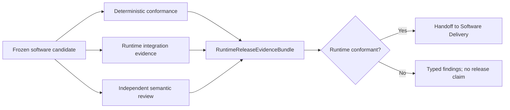

# Agent Runtime Standalone Release Conformance Contract

**Purpose**: Define the frozen subject and evidence required to claim that one
Agent Runtime software candidate is independently installable, internally
coherent, portable across hosts, and conformant to the complete Runtime Design
Contract set.

**Required reader gain**: A maintainer can distinguish Runtime conformance from
software release admission, assemble one exact evidence bundle, and reject a
candidate with hidden domain dependencies, duplicate authorities, unproven
adapters, unsafe migrations, or incomplete execution and recovery evidence.

## 0. Contract Capsule

```yaml
layer: T2
status: candidate
canonical_owner: designDoc/agent_runtime_05_standalone_release_conformance_contract.md
parent: designDoc/agent_runtime_00_runtime_domain_contract.md
owned_system_object: independently publishable Runtime distribution conformance
inherits:
  - designDoc/the_charter.md
  - designDoc/the_agent_runtime.md
  - designDoc/the_design_doc_management.md
  - designDoc/the_contract_audit.md
  - designDoc/the_software_delivery.md
  - designDoc/the_data_governance.md
  - designDoc/the_timestamp_semantic.md
scope:
  - frozen Runtime software conformance subject
  - design, source, public-surface, schema, persistence, adapter, execution, recovery, security, and portability evidence
  - deterministic and independent semantic conformance results
  - clean-install and host-conformance fixtures
non_goals:
  - software release, deployment, or rollback admission
  - product workflow, domain plugin, provider, model, or durable-backend selection
  - persistent database, provider, or durable-backend product selection
  - roadmap, staffing, scheduling, incident response, or operational monitoring
  - business quality, user authorization policy, or host UI
outputs:
  - RuntimeReleaseConformanceSubject
  - RuntimeReleaseEvidenceBundle
  - RuntimeReleaseConformanceReport
truth_surfaces:
  - designDoc/agent_runtime_05_standalone_release_conformance_contract.md
  - code-owned conformance profiles and evidence schemas
  - immutable test, inspection, migration, and independent-review evidence
```

## 1. Owned Result and Authority Boundary

Release Conformance answers one question: does this exact Runtime software
candidate satisfy the admitted Runtime contracts and evidence requirements?

It does not publish or deploy software. Software Delivery owns change, release,
deployment, rollback, and provenance admission. Contract Audit owns independent
semantic conformance. Data Governance owns persistent Data Asset and migration
law. This contract assembles their exact results and Runtime-specific evidence
without replacing those authorities.

## 2. Frozen Conformance Subject

`RuntimeReleaseConformanceSubject` binds:

- exact source commit and clean-tree or declared-diff identity;
- package metadata, version, build configuration, lock and dependency closure;
- complete Runtime T0, T1, and ten-T2 Design Contract release refs and hashes;
- exact generated Design Contract bundle release and hash governed by Design
  Doc Management's projection and parity law;
- exact source ownership, import-policy, public-surface, migration-debt, and
  cohesion-report releases from Source Architecture;
- exact Registry, Ledger, Invocation, Durability, Execution, Inspection, and
  external-integration contract and schema releases;
- exact admitted provider, durable-backend, and persistence Adapter release
  refs and hashes, plus every Execution Profile release exercised by the
  evidence profile;
- supported Python and platform matrix;
- declared core, adapter, persistence, inspection, test, and development extras;
- predecessor disposition and migration state; and
- evidence profile and denominator.

The subject cannot be changed after any conformance result is attached. A code,
contract, generated Design Contract bundle, schema, dependency, Adapter,
Execution Profile, version, build, or evidence-profile change creates a new
subject.

### 2.1 Evidence denominator

An evidence denominator is the exact declared set of claims and fixtures that
one conformance profile must satisfy for one release scope. The core denominator
covers provider-neutral Runtime behavior and required store, host, plugin,
Inspection, and durable integration. An Adapter denominator covers only one
exact Adapter release, its optional dependency, supported provider or backend,
Execution Profiles, capability claims, and real tests. A partial Adapter
denominator cannot satisfy or weaken the core denominator.

## 3. Distribution Boundary

The standalone distribution contains:

- provider-neutral Runtime contracts and supporting foundation;
- Registry, Ledger, Invocation, Durability, Execution, and Inspection public
  interfaces and implementations admitted for the release;
- optional provider, durable-backend, and persistence Adapters behind declared
  extras;
- plugin authoring and registration SDK surfaces;
- migrations, conformance fixtures, generated inspection, and release metadata.

The base install imports without provider SDKs, durable-backend SDKs, host
product code, domain plugins, business data, customer content, local checkout
paths, or credentials. Host composition depends on Runtime; Runtime never
imports the host. Exact excluded package identities belong to the code-owned
conformance profile and evidence record, not this stable contract.

## 4. Evidence Families

| Evidence family | Required proof |
| --- | --- |
| Contract closure | Exact T0/T1/T2 hashes, owner uniqueness, references, and independent review results |
| Generated Design Contract parity | Exact generated bundle release and hash reproduce the approved canonical source under Design Doc Management projection law |
| Source architecture | Every path and plane registered; allowed import graph, public exports, foundation boundary, and migration debt pass |
| Build and clean install | Wheel and source distribution build reproducibly; base and declared extras install in clean environments |
| Public compatibility | Exact export set, schema compatibility, typed failure surface, and consumer contract tests |
| Registry and Ledger | Real persistent-store atomicity, concurrency, idempotency, timestamp, migration, authorization, and recovery evidence |
| Invocation adapters | Capability enforcement, Context fidelity, structured output, usage, failure normalization, limits, and real opt-in provider tests |
| Durability adapters | Replay, worker replacement, timers, waits, cancellation, rollover, idempotency, and real backend tests |
| Execution | End-to-end start, retry, A/B, Evaluation, Selection, Resolution, event, cancellation, fence, recovery, and reconciliation tests |
| Inspection | Storage-level authorization, bounded pagination, complete lineage, content integrity, live view, and export rebuild tests |
| Security and content | Secret scan, permission manifests, denial paths, content-class isolation, and leak checks |
| Portability | At least one synthetic host and plugin proving no host-product, domain-plugin, business-database, or customer-content import and no host semantic assumption |

Evidence identifies the tested release, environment, Adapter, backend, provider,
model, schema, and denominator. Missing real integration evidence is validation
debt and cannot be reported as conformance.

## 5. Deterministic and Independent Review



No reviewer, prose, or model judgment may waive a deterministic failure under
Contract Audit law. Independent review does not rerun deterministic validators
or approve deployment. Every finding has an exact subject, severity, correction
owner, evidence, and disposition.

## 6. Required Integration Fixtures

The minimum release profile includes:

1. one synthetic independently executable Module;
2. one synthetic Workflow with branch, join, wait, retry, Evaluation, Selection,
   Resolution, cancellation, and external event;
3. two isolated tenants or Cells proving no cross-scope Registry, Ledger,
   content, workspace, provider context, or durable binding reuse;
4. one declared real persistent-store instance carrying the exact Registry and
   Ledger migration path, with its concrete identity recorded only in evidence;
5. one real supported durable Adapter with replay and worker replacement;
6. each release-supported provider Adapter under its declared opt-in profile;
7. one live Inspection service over formal records; and
8. one external host and plugin proving Runtime portability.

Optional provider or backend evidence gates only the Adapter release that
claims it. The core release denominator must remain explicit and cannot hide a
missing required core fixture behind a skipped optional test.

## 7. Failure and Release Semantics

| Condition | Conformance result |
| --- | --- |
| Subject hash, version, or dependency changes | Invalidate results; create new subject |
| T0/T1/T2 closure incomplete or contradictory | Block |
| Generated Design Contract bundle differs from the approved canonical source or projection release | Block |
| Undeclared public export or reverse dependency | Block |
| Base import requires optional SDK or host package | Block |
| Duplicate Registry, Ledger, retry, authorization, or durable authority | Block |
| Persistent migration, crash recovery, or authorization isolation unproven | Block |
| Declared Adapter lacks real conformance evidence | Adapter release blocked; core disposition follows declared denominator |
| Missing body due to governed disposition | Preserve evidence ref; decide only whether the profile requires body availability |
| Software Delivery rejects a conformant candidate | Runtime remains conformant but unreleased |

Conformance is immutable for one frozen subject. A later failure creates new
evidence and a successor report; it does not rewrite the prior result.

## 8. Report and Inspection

`RuntimeReleaseConformanceReport` contains subject identity, profile,
denominator, deterministic results, integration evidence refs, independent
review verdict, open findings, validation debt, exact provider,
durable-backend, and persistence Adapter release dispositions, exercised
Execution Profile release refs, and exact handoff disposition. It contains no
customer content or credential.

Generated inspection renders the report and its evidence graph. It is a
projection, not a release authority. Software Delivery consumes the exact
report and independently applies its release and deployment law.

## 9. Conformance of the Conformance System

The conformance implementation itself proves:

1. a changed subject cannot reuse old results;
2. the generated Design Contract bundle exactly matches the approved canonical
   source under the declared projection release;
3. declared and actual files, imports, exports, schemas, migrations, tests, and
   optional dependencies reconcile exactly;
4. skip, unavailable, fail, validation debt, and pass remain distinct;
5. evidence denominators prevent partial suites from claiming full release;
6. deterministic failure cannot be waived by any reviewer or semantic review;
7. host, provider, backend, database, and plugin substitutions are explicit;
8. reports are reproducible from immutable evidence refs;
9. no report publishes or deploys software; and
10. the clean-install fixture contains no host-product, domain-plugin,
    business-database, or customer-content code and no ambient local
    credentials.

## 10. Change Boundary

This contract does not define a delivery roadmap. After the complete Runtime
Design Contract set is accepted, the Code Design Basis must define subject and
evidence schemas, conformance profiles, validator registry, clean-build matrix,
integration harness, report renderer, Software Delivery handoff, tests,
migration, and rollback.

The predecessor delivery-roadmap document's retirement or re-home is a Design
Doc Management lifecycle decision accepted by the Software Delivery owner
before this contract may take the canonical `agent_runtime_05` identity. It is
not an implementation choice delegated to the Code Design Basis.

## References

- [Agent Runtime Charter](../agent_runtime_t0_t1_candidate/the_charter.md)
- [Agent Runtime T0](../agent_runtime_t0_t1_candidate/the_agent_runtime.md)
- [Agent Runtime Domain Contract](../agent_runtime_t0_t1_candidate/agent_runtime_00_runtime_domain_contract.md)
- [Source Architecture](../agent_runtime_t2_candidate/agent_runtime_02_source_architecture_contract.md)
- [Registry](../agent_runtime_t2_candidate/agent_runtime_01_registry_contract.md)
- [Execution Ledger](../agent_runtime_t2_candidate_next/agent_runtime_04_execution_ledger_contract.md)
- [Invocation](../agent_runtime_t2_candidate_next/agent_runtime_08_invocation_contract.md)
- [Durability](../agent_runtime_t2_candidate_next/agent_runtime_07_durability_contract.md)
- [Execution](../agent_runtime_t2_candidate_execution/agent_runtime_10_execution_contract.md)
- [Inspection](agent_runtime_06_inspection_contract.md)
- [Software Delivery](../../designDoc/the_software_delivery.md)
- [Contract Audit](../../designDoc/the_contract_audit.md)
