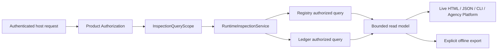

# Agent Runtime Inspection Contract

**Purpose**: Define the read-only Runtime boundary that turns already-authorized
Registry and Ledger queries into bounded execution, release, content, usage,
failure, and lineage views for live and offline consumers without creating a
second system of record.

**Required reader gain**: A maintainer can build an Inspector that shows every
Runtime Execution, its conditional Workflow Execution or direct root Module
Run, each Variant and Attempt, complete model Context, output, usage, failure,
retry, and release ref while applying authorization before storage retrieval
and preserving Registry and Ledger authority.

## 0. Contract Capsule

```yaml
layer: T2
status: candidate
canonical_owner: designDoc/agent_runtime_06_inspection_contract.md
parent: designDoc/agent_runtime_00_runtime_domain_contract.md
owned_system_object: authorized bounded read models of Runtime authority
inherits:
  - designDoc/the_charter.md
  - designDoc/the_agent_runtime.md
  - designDoc/the_product_authorization.md
  - designDoc/the_data_governance.md
  - designDoc/the_timestamp_semantic.md
scope:
  - authorized Registry and Ledger query scopes
  - bounded execution summaries and paged lineage records
  - separately authorized content-body dereference
  - live read models and explicit offline exports
  - integrity, redaction, pagination, and projection rebuild semantics
non_goals:
  - Runtime mutation, retry, cancellation, approval, or release admission
  - Product Authorization policy, Entitlement, identity, or credential management
  - Registry or Ledger record ownership
  - UI styling, product navigation, alerts, telemetry backend, or billing prices
  - persistent-store, renderer framework, or transport selection
outputs:
  - RuntimeInspectionService
  - InspectionQueryScope
  - ExecutionSummary and ExecutionDetailPage
  - RuntimeContentView
  - RuntimeInspectionExport
  - Inspection ResourcePermissionManifest
truth_surfaces:
  - designDoc/agent_runtime_06_inspection_contract.md
  - code-owned inspection query and projection schemas
  - canonical Registry and Ledger facts returned by authorized queries
```

## 1. Owned Result

Inspection owns bounded read models, not execution facts. Registry remains
authoritative for admitted releases and lifecycle. Ledger remains authoritative
for execution records and content refs. An Inspection view can be discarded and
rebuilt without changing either authority.

Inspection never updates Runtime state, resolves an Outcome, retries an
Attempt, selects a model, or reclassifies a failure. The live HTML Inspector,
JSON API, CLI output, Agency Platform projection, and offline bundle are
consumers of the same service contract, not separate truths.

Execution 10 separately owns the bounded lifecycle-status resource returned by
`RuntimeExecutionService.get_status`. Inspection never widens that surface.
For the same execution, both enforcement points resolve the same Principal,
tenant, Cell, and execution scope; Inspection alone supplies the deeper paged
read models and separately authorized content access.

## 2. Policy Enforcement and Query Scope

Inspection is the Policy Enforcement Point for Runtime inspection resources.
It publishes one code-owned `ResourcePermissionManifest` covering release
metadata, execution summaries, lineage records, usage, diagnostics, model
Context, input bodies, output bodies, tool bodies, and export actions.
The manifest declares resource types, atomic actions, scope forms, condition
schema, and grant requirement class for every resource. `export_execution`
requires the bounded `OperationGrant` class defined by Product Authorization
unless a successor manifest deliberately admits a narrower class.

The trusted host resolves one opaque `InspectionQueryScope` from Product
Authorization before query execution. The scope binds exact Principal,
workload actor, tenant, Cell, allowed resource classes, permitted execution or
release identities, content classes, action, validity, predicate, clock, and
decision evidence.

Inspection passes a storage-applicable scope to Registry or Ledger. Filtering
occurs inside the query boundary before row counts, facets, cursors, summaries,
or records leave storage. Per-object and per-content checks remain as defense in
depth. A broad database read followed by application filtering is
non-conformant.

When scope validity spans clock domains, Inspection consumes the registered
protected predicate, pins the immutable `DistributedClockProfile`, requires
fresh `ClockHealthEvidence` for every participating domain, applies Timestamp
Semantics' conservative half-open window, and records those refs with the
disclosure decision. Missing or unverifiable evidence fails closed.

## 3. Public Inspection Service

`RuntimeInspectionService` supports:

| Operation | Bounded result |
| --- | --- |
| `list_executions` | Authorized execution summaries plus stable next cursor |
| `get_execution` | One execution identity, release closure, latest committed Outcome refs, derived bounded lifecycle status, and lineage counts |
| `list_module_runs` | Paged Module Run, Variant, Attempt, and retry relationships |
| `list_records` | Paged canonical record headers by explicit family and lineage constraints |
| `get_release` | One authorized release closure and lifecycle view |
| `get_content` | Exact authorized body or typed unavailable/redacted disposition |
| `export_execution` | One explicit immutable export subject over authorized records and bodies |

All list APIs require explicit bounds and stable cursors. Unbounded "all
records" and hidden N+1 body retrieval are forbidden.

## 4. Execution and Invocation Views

One execution detail view makes the lineage visible:

```text
Runtime Execution
  Origin
    Workflow Execution -> Module Run, when Workflow-originated
    Module Run, when independently Module-originated
  Each Module Run
    Execution Variant
      Attempt
        model/tool calls
        complete Runtime-authored ModelContextEnvelope
        provider-native projection
        input/output content refs
        usage and normalized failure
    Evaluation records over exact committed candidates
    Selection and Module Output Resolution
    Module Run Outcome and checkpoint
  durable acknowledgement
  execution terminal status derived from latest committed Outcome
```

The complete model Context is shown as one Ledger-committed invocation
surface. Inspection reads and projects that surface; it never records or
reconstructs the Context itself.
Prompt-component projections may be inspectable as assembly provenance but are
not rendered as separate invocations. Provider-private reasoning is not
invented or inferred when unavailable.

Every retry Attempt and technical failure remains visible. The execution status
derives from the latest committed Outcome and acknowledgement state, not the
first failure. Sibling A/B Variants remain separate.

## 5. Content and Usage

Content metadata and body access are separate permissions. A caller allowed to
see an execution summary does not thereby gain Prompt, Source, input, output,
tool, stdout, stderr, or diagnostic bodies.

`get_content` uses the exact content ref and hash plus an authorized content
scope. It returns:

- exact bytes and verified metadata;
- a typed governed redaction;
- a typed body-unavailable disposition preserving lineage and hash; or
- an integrity failure when bytes do not match the committed hash.

Usage views project raw provider quantities as recorded. Unknown input, output,
cache, or reasoning quantities remain unknown, not zero. Prices and billing
policy are external projections unless explicitly supplied as separate
authorized data.

## 6. Live and Offline Delivery



The live interface queries formal Runtime stores through the service. It does
not reconstruct truth from log files, provider workspaces, or browser state.
An offline export is an explicit content-addressed snapshot with subject,
scope, record refs, content dispositions, renderer release, and integrity
evidence. It is never the primary operational source and cannot be imported as
new Ledger truth.

The export is a governed derivative response. It binds recipient scope, redaction
policy, expiry, retention, and deletion behavior and inherits the strictest
tenant, Cell, classification, licence, residency, retention, and export
restriction in its exported closure. Runtime does not persist the export as a
Runtime record family, assign it a Runtime System-of-Record, or treat it as a
third persistent store. A retaining or redistributing host owns any external
Data Governance registration, writer, retention, and deletion boundary for the
returned bytes.

## 7. Time, Integrity, and Projection Law

Inspection preserves every source record's Timestamp class and instant. A
projection generation time is a separate observation and cannot reorder facts
or replace Ledger append order.

Generated views declare source Registry and Ledger schema releases, query scope
identity, projection schema release, renderer release, and content integrity
results. Unknown fields fail according to registered compatibility law rather
than being silently dropped.

## 8. Failure Semantics

| Failure | Required result |
| --- | --- |
| Missing, denied, expired, or mismatched query scope | Return no rows, counts, facets, or timing-derived disclosure |
| Inspection action or resource absent from the published ResourcePermissionManifest, or required export grant absent | Reject before query, dereference, assembly, or disclosure |
| Cross-clock scope validity lacks a registered predicate, pinned profile, or complete fresh healthy evidence set | Fail closed and disclose no rows, counts, facets, cursors, bodies, or timing signal |
| Unsupported cursor or projection schema | Typed incompatibility; no restart from an ambient default |
| Content permission absent | Return bounded denial without dereferencing body |
| Content body unavailable | Return typed disposition with lineage and hash |
| Content hash mismatch | Integrity failure; never display mismatched bytes |
| Registry or Ledger unavailable | Typed service failure; do not fall back to logs or cached browser state |
| Renderer failure | Preserve source query result identity; no mutation of Runtime facts |
| Export request lacks recipient scope, redaction, expiry, retention, deletion, or inherited restriction closure | Reject before bundle creation |

## 9. Conformance and Completion Evidence

Conformance proves:

1. storage-level scope filtering occurs before rows, counts, facets, cursors, or
   timing signals leave Registry or Ledger;
2. cross-Principal, tenant, Cell, execution, release, and content reuse fails;
3. every inspection action resolves through the published manifest, rejects an
   unknown action or resource before access, and requires the declared bounded
   grant for export;
4. cross-clock scope validity records the exact predicate, profile, and fresh
   evidence for every domain and fails closed for every invalid case;
5. summary permission never implies body permission;
6. every list and record family is bounded and paged with stable cursors;
7. complete Context, provider projection, input, output, usage, failure, retry,
   Evaluation, Selection, Resolution, Outcome, and acknowledgement lineage are
   reconstructable from committed facts;
8. content hash mismatch and unavailable-body dispositions remain distinct;
9. live and offline renderers consume the same service result and create no
   second authority;
10. every export is an authorized derived response with exact recipient,
    redaction, expiry, retention, deletion, and inherited restriction evidence,
    creates no Runtime persistent record family or System-of-Record, and cannot
    be imported as Ledger truth;
11. Runtime execution works with Inspection absent;
12. Inspection imports no concrete Registry or Ledger store implementation; and
13. real persistent-store tests against the declared evidence instance prove
    authorization filtering, pagination, concurrency visibility, content
    dereference, and projection rebuild while recording the exact store binding
    only in the code-owned evidence record.

## 10. Change Boundary

This contract does not select a web framework or freeze page layout. After the
complete Runtime Design Contract set is accepted, the Code Design Basis must
define public query DTOs, permission manifest, Registry and Ledger query
adapters, pagination, content dereference, export schema, renderer split,
predecessor projection disposition, tests, migration, and rollback.

## References

- [Agent Runtime Charter](../agent_runtime_t0_t1_candidate/the_charter.md)
- [Agent Runtime T0](../agent_runtime_t0_t1_candidate/the_agent_runtime.md)
- [Agent Runtime Domain Contract](../agent_runtime_t0_t1_candidate/agent_runtime_00_runtime_domain_contract.md)
- [Registry](../agent_runtime_t2_candidate/agent_runtime_01_registry_contract.md)
- [Execution Ledger](../agent_runtime_t2_candidate_next/agent_runtime_04_execution_ledger_contract.md)
- [Execution](../agent_runtime_t2_candidate_execution/agent_runtime_10_execution_contract.md)
- [Product Authorization](../../designDoc/the_product_authorization.md)
- [Data Governance](../../designDoc/the_data_governance.md)
