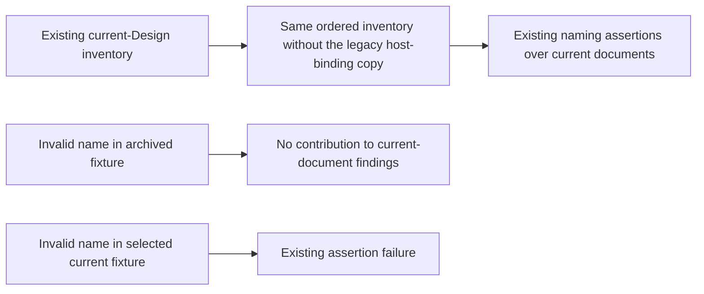

# Runtime current-Design naming inventory: proposed CodeDesignBasis

本候选执行既有计划的第 7a 步。维护者可以据此只修改当前命名测试的输入清单，验证归档文档不再被
当作当前 Runtime authority，同时确认现有命名断言仍能拒绝当前文档中的非法名称。

## Primary flow



这是测试输入与观察结果的关系，不是新的 Runtime 调用链。本变更不新增 product public interface、
Registry、validator service、error vocabulary 或 conformance-result schema。既有测试的断言和异常语义
保持不变；pytest 的局部通过不表示整个 Runtime source architecture 通过。

```yaml
CodeDesignBasis:
  status: proposed
  approved_decision_ref: null
  requested_result: >-
    Remove the user-directed legacy host-binding copy from the existing current Runtime Design naming inventory,
    retain every other selected document in the same order, and prove archived content is not scanned while current
    invalid names remain rejected. Preserve the naming law and defer the actual archive move to its package owner.
  owning_design_refs:
    - design_ref: designDoc/agent_runtime_00_execution_charter.md
      design_sha256: 243a821d7403bdaf9ff51b2e9aa5ea8f336c6d981cde50f0e1389349c638e5e9
      code_projection_ref: null
      code_projection_sha256: null
    - design_ref: designDoc/agent_runtime_02_product_target_topology.md
      design_sha256: c3115f20101dc8370740d80c93a51fe073bbb2f4edaced46eb9114f336ec27a1
      code_projection_ref: null
      code_projection_sha256: null
  system_change_plan_step_ref: review_artifacts/runtime_self_test_and_reviewer_system_change_plan.md#step-7a-source-architecture-inventory-code-design
  system_change_plan_step_sha256: 4bce0cda1fe9f4f51f85f6f63bb53808f1259c183826131da924c9f0e5608f95
  architecture_disposition: retain
  primary_flow:
    diagram_type: flowchart
    diagram: |
      flowchart LR
        original_inventory --> selected_current_inventory
        selected_current_inventory --> current_naming_findings
        archived_invalid_fixture --> no_current_finding
        current_invalid_fixture --> existing_assertion_failure
    edges: []
  interface_contracts: []
  error_contracts: []
  logical_modules:
    - module_id: source_architecture_naming
      responsibility: >-
        Existing Source Architecture naming test owner selects the current Design documents against which its existing
        inline-name assertions run. Selection is code truth, not a declaration of Design admission or external retirement.
      owned_resources: [current_design_naming_inventory, naming_inventory_test_cases]
      public_interfaces: []
      allowed_dependencies: [existing_naming_assertions, frozen_current_design_fixtures, pytest]
      prohibited_dependencies: [provider, database, runtime_execution, external_authorization, business_repository, package_projector_execution]
      failure_and_recovery:
        - Existing assertion failure remains the output of an invalid current inline name.
        - A missing selected current document remains an error; never silently skip it or search an archive fallback.
        - Failed checks do not mutate source, Design lifecycle, package inventory or archive contents.
      required_tests: [exact_inventory_change, archived_content_exclusion, current_content_negative_control, unchanged_naming_suite]
      future_capabilities: [Consume the eventual exact archive move without changing current naming semantics.]
      implementation_bindings:
        - tests/test_agent_runtime_naming_contract.py:RUNTIME_DESIGN_DOCS
        - tests/test_agent_runtime_naming_contract.py:test_runtime_design_docs_use_snake_case_canonical_inline_names
        - tests/test_agent_runtime_naming_contract.py:additional same-owner inventory regression tests
      disposition: retain
  implementation_slices:
    - slice_id: current_design_naming_inventory
      intended_result: Existing current naming inventory excludes the legacy copy and all archived fixtures without weakening current-document assertions.
      included_surfaces: [source_architecture_naming, current_design_naming_inventory, naming_inventory_test_cases]
      excluded_surfaces: []
      deferred_integrations: []
      required_tests: [exact_inventory_change, archived_content_exclusion, current_content_negative_control, unchanged_naming_suite]
      completion_gate: >-
        All tests in tests/test_agent_runtime_naming_contract.py pass outside sandbox, including exact inventory equality,
        an archived-invalid-name non-effect case and an active-invalid-name rejection control. No actual archive move or
        package regeneration is required by this Slice's fixtures. Final exact-commit Engineering Review remains step 12.
  cross_module_seams: []
  migration_and_compatibility:
    - Remove exactly designDoc/agent_runtime_10_workflow_execution_binding_and_admission_contract.md from RUNTIME_DESIGN_DOCS.
    - Keep the remaining seven current entries in their original order; introduce no glob, archive fallback or newly admitted document.
    - Keep name regexes, allowed inline-name exceptions, source/function/parameter checks and public dataclass checks unchanged.
    - Actual archive, byte-equality, package removal and generated projection belong to plan step 10 and its step 7 basis.
    - No production API, stored record, generated artifact, release unit or dependency direction changes in this Slice.
  rollback_boundary: Revert the exact test-only implementation commit; no durable or external state requires recovery. Restore the old inventory only together with the corresponding owner-directed archive rollback, never by silently scanning an archive as current authority.
  acceptance_criteria:
    - The expected inventory is exactly the predecessor tuple minus the one user-directed legacy entry, preserving order and uniqueness.
    - An invalid inline name in a fixture under designDoc/archive has no effect on current-name findings.
    - The same invalid inline name placed in a selected current fixture causes the existing assertion to fail.
    - A missing selected current fixture remains an error, proving exclusion does not become catch-and-skip behavior.
    - All existing naming semantics and tests remain in scope and unchanged except the exact inventory and same-owner regression tests.
    - The actual changed constant and tests each map to this single Slice in the later ChangeSetManifest; no test is treated as a generated projection.
    - No new public or generated projection exists in this test-only Slice; existing package/source projectors retain their owners and gates.
    - No later archive or package result is claimed from local fixture success, and no pre-existing implementation is accepted by proximity.
    - The independent reviewer receives the exact approved basis and exact test-only commit at the later Engineering Review gate.
  unresolved_decisions: []
```

## Exact test boundary

The retained ordered inventory is:

```text
designDoc/the_agent_runtime.md
designDoc/agent_runtime_00_execution_charter.md
designDoc/agent_runtime_01_module_contract_and_assembly.md
designDoc/agent_runtime_02_product_target_topology.md
designDoc/agent_runtime_03_authorized_external_event_ingress.md
designDoc/agent_runtime_07_temporal_durable_adapter_contract.md
designDoc/agent_runtime_09_authorization_integration_contract.md
```

`exact_inventory_change` checks the complete tuple above, not only absence of the familiar legacy filename.
`archived_content_exclusion` creates a temporary root containing harmless current fixtures and an archived fixture
with an invalid inline token. It points the existing test's root at that fixture and invokes the same naming assertions.
`current_content_negative_control` then puts that same token in one selected current fixture and expects the existing
assertion to fail. A missing-current-file control expects the existing file-read failure. These controls change no regex
or exception list and do not require the real archive move. Fixture writes occur only in the test-owned temporary root.

`unchanged_naming_suite` runs the whole owning test file. Source/import/public-export conformance is a separate
repository gate; its currently observed failures remain visible and are not solved by excluding this document.
No Script, production helper or second naming inventory is introduced for this small test maintenance change.

## Authority, hashes and handoff

The full plan hash is `cf0305be721bc8e0e2bded71c1e87bf510d925b109972d505effa3a908a2b576`.
The pre-implementation test-source SHA-256 is
`abf127c9f16a78362aed3f6aee472cdaf05c2e62ee23e46bd8c3804fc69e68a2`.
The step hash above is SHA-256 of the unique step-7a table row's UTF-8 bytes including its terminal LF. Each Design hash
is SHA-256 of its full source bytes. The later commit freezes actual test source; a changed owning input invalidates this
proposed basis. Runtime source ownership/naming remains T2 02; the user-directed local archive disposition comes from
the existing plan and does not retire an Agency Platform contract.

This proposal is independent of the pending Execution basis. It remains a local `proposed` authoring result with no
approval reference, no claimed registered validation and no implementation. It uses the same user-authorized local
Design continuation as the existing plan. Software Delivery's exact basis decision and the later review gates remain
separate. No external payload has been assembled or sent for this candidate.

## Author self-check

Layer 0 classification: skill_contract; independent Code Design review and Software Delivery owner decision remain
required. The four self-review references were consumed directly in this work: Communication, First Principles,
Reader State and Judgment Gain, and Skill Writing. No reference or stage was skipped.

Stage 1 retained a single result: exclude historical input while preserving current-name rejection. The five
reader-state questions resolve to scope, current-versus-archive distinction, non-skipping failure behavior, the exact
test change and the later package-owner handoff. Stage 2 requires exact tuple equality and live negative controls,
rather than a filename denylist. Stage 3 found no paragraph rewrite necessary. The unchanged naming policy and
separate archive operation are deliberate preservation decisions, not omitted fixes. These are author observations,
not an independent verdict.
