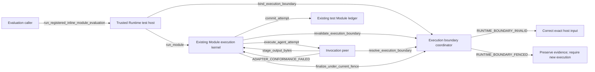

# Runtime self-test: Execution CodeDesignBasis

本候选落实现有计划的第 5 步。它把普通自测接入现有执行内核，由可信测试宿主提供精确资源绑定，
同时保留外部执行的授权路径。它只提出代码设计，不记录自己的批准，不修改 production code。

## Primary flow



### Interfaces

| interface_id | Identity | Semantic owner | Exact input | Successful output | Effects and failures |
| --- | --- | --- | --- | --- | --- |
| run_registered_inline_module_evaluation | declared | Execution inline evaluation helper | exact registry, Module/Profile refs/hashes, projected input bytes/binding, evaluation key and host Adapter factory; optional trusted test_resource_factory for self-test resources; optional explicitly supplied external authority_factory, mutually exclusive with test_resource_factory | existing RegisteredModuleEvaluation | Default creates Runtime test resources and composes the same kernel; an explicit factory may add owner-bound temporary resources to the same exact object set; no automatic external sink; boundary/input failures preserve their owner |
| bind_execution_boundary | referenced | T2 09 External Authority Integration | trusted test-host resource object; exact isolated ModuleExecutionRequest; resolved Module and every selected Profile; host resource description and live resource bindings | committed RuntimeTestExecutionBinding and open test fence | Only test-boundary records; RUNTIME_BOUNDARY_INVALID |
| revalidate_execution_boundary | referenced | T2 09 External Authority Integration | exact committed test binding ref/hash, original live resource bindings, current host availability observation | same binding and still-open fence | May monotonically close fence; RUNTIME_BOUNDARY_INVALID or RUNTIME_BOUNDARY_FENCED |
| resolve_execution_boundary | referenced | T2 09 External Authority Integration | exact test binding ref/hash plus kernel-owned Attempt/request identity | exact committed test binding, matched to the requesting Attempt and original resources | Read only; RUNTIME_BOUNDARY_INVALID |
| run_module | declared | Execution module invocation | existing ModuleExecutionRequest and registry/adapters/artifact_host/ledger, with exactly the applicable explicit test boundary or existing external authority | existing ModuleRunResult | Existing test Run/Variant/Attempt/output effects; test-boundary failures preserve T2 09 codes; Invocation and storage failures preserve their owner |
| execute_agent_attempt | referenced | T2 08 Invocation | existing canonical request augmented by a paired test-boundary ref/hash, plus the request-bound execution host | existing AgentExecutionResult | Invocation owns actual provider/resource enforcement and its typed failures; ADAPTER_CONFORMANCE_FAILED means no acceptable adapter result |
| stage_output_bytes | referenced | T2 08 Invocation; implemented by Execution's request-bound host | existing exact OutputSubmission and bytes for this Attempt | staged non-authoritative output | No authoritative output yet; retain ADAPTER_REQUEST_INVALID and storage-owner failures |
| finalize_under_current_fence | referenced | T2 09 External Authority Integration | exact original binding, Attempt identity, staged/validated result and finalization callback | consumable completed Attempt or non-consumable failed/quarantined Attempt | Same lock orders resource invalidation and authoritative test-ledger commit; RUNTIME_BOUNDARY_INVALID and RUNTIME_BOUNDARY_OBSERVATION_INVALID |
| commit_attempt | referenced | ModuleExecutionLedger | exact existing ModuleAttemptRecord whose outputs belong to this Attempt | committed Attempt | Existing Ledger contract and errors; no new ledger schema or automatic external destination |

### Errors

| error_code | Identity and owner | Condition | Meaning and caller action |
| --- | --- | --- | --- |
| RUNTIME_BOUNDARY_INVALID | referenced, T2 09 | test entry/purpose mismatch; mixed external/test evidence; wrong request, release, input, Profile, resource or binding hash; unresolvable test resource; external context absent on an external request | Reject before the dependent effect. Correct the same owner's exact input; a changed closure requires a new execution. Never fall back between entry kinds. |
| RUNTIME_BOUNDARY_FENCED | referenced, T2 09 | trusted test host invalidated a bound resource, or its fence was already closed | No new dispatch. Preserve facts and require a new execution to continue. Before provider entry this is a typed boundary refusal; after provider entry, retain actual usage and quarantine output. |
| RUNTIME_BOUNDARY_OBSERVATION_INVALID | referenced, T2 09 | finalization or invalidation refers to another binding/Attempt, conflicts with committed facts, or is not a valid trusted observation | Do not accept the observation as progress. Preserve bounded evidence and return to its owner without replaying an effect. |
| ADAPTER_REQUEST_INVALID | referenced, T2 08 | canonical request, input/output handle or staging shape does not satisfy the Invocation contract | Return exact input defect to Invocation/request owner; never fabricate a begin receipt or boundary. |
| ADAPTER_CONFORMANCE_FAILED | referenced, T2 08 | adapter returns the wrong type, throws an unnormalized exception, or violates lifecycle/trace/output obligations | Execution records a failed Attempt with the adapter owner's code and no authoritative output. |

Other existing provider failures remain typed AgentExecutionResult failures. Storage exceptions remain storage failures;
they are never relabelled as authorization denial. This candidate introduces machine-readable codes for its new boundary
refusals through an ExecutionBoundaryError.error_code field; it does not redesign the unrelated legacy error API.

The boundary coordinator invokes the supplied kernel-owned finalization callback while holding the original fence lock.
That callback remains Module Execution code and is the sole caller of `commit_attempt` on the Module ledger. The
coordinator does not gain a direct Module-ledger dependency or acquire the kernel's result-finalization responsibility.
The kernel-to-ledger edge in the flow therefore runs inside that callback, never outside the fence critical section.

## Proposed record

The following is the proposed CodeDesignBasis. Referenced interface/error tables above are normative parts of this
same candidate, not new copies of the peer contracts. No registered CodeDesignBasis schema or caller-action vocabulary
was found in this repository; this is a complete local proposal, not a claim of registered Software Delivery validation.

```yaml
CodeDesignBasis:
  status: proposed
  approved_decision_ref: null
  requested_result: >-
    Run ordinary isolated Runtime Test/Evaluation through the existing Module kernel and inline helper without constructing
    or calling a production authorization client, context/status, grant or allow-all double. Bind and enforce the exact
    test resources, registered release, inputs, Profiles and Attempt; prevent resource invalidation from admitting late output.
  owning_design_refs:
    - design_ref: designDoc/agent_runtime_00_execution_charter.md
      design_sha256: 243a821d7403bdaf9ff51b2e9aa5ea8f336c6d981cde50f0e1389349c638e5e9
      code_projection_ref: null
      code_projection_sha256: null
    - design_ref: designDoc/agent_runtime_09_authorization_integration_contract.md
      design_sha256: f0cab2805ae900d6b7656d1a626284f9da5ed54830056266ebac09c1961a91c0
      code_projection_ref: null
      code_projection_sha256: null
    - design_ref: designDoc/agent_runtime_08_agent_execution_adapter_contract.md
      design_sha256: 66a7d20f6791176c1ba1aa7b5ea60b0765ebfc9efe7e1773329a71b4f72d2003
      code_projection_ref: null
      code_projection_sha256: null
    - design_ref: designDoc/agent_runtime_11_agent_capability_verification.md
      design_sha256: 096ee22c40d3864e1029f6a3fc3cbd350ea354a7b0d25ce229411a76596bf01e
      code_projection_ref: null
      code_projection_sha256: null
  system_change_plan_step_ref: review_artifacts/runtime_self_test_and_reviewer_system_change_plan.md#step-5-execution-code-design
  system_change_plan_step_sha256: 5b8f9330ec3eb3b06682c4b1fe3ca02f47d2b445fece29ce5c78be59c5498fb2
  architecture_disposition: refactor
  primary_flow:
    diagram_type: flowchart
    diagram: |
      flowchart LR
        evaluation_caller -->|run_registered_inline_module_evaluation| test_host
        test_host -->|bind_execution_boundary| execution_boundary
        test_host -->|run_module| module_execution
        module_execution -->|revalidate_execution_boundary| execution_boundary
        module_execution -->|execute_agent_attempt| invocation
        invocation -->|resolve_execution_boundary| execution_boundary
        invocation -->|stage_output_bytes| module_execution
        module_execution -->|finalize_under_current_fence| execution_boundary
        module_execution -->|commit_attempt| module_ledger
        execution_boundary -->|RUNTIME_BOUNDARY_INVALID| request_owner
        execution_boundary -->|RUNTIME_BOUNDARY_FENCED| quarantine
        invocation -->|ADAPTER_CONFORMANCE_FAILED| module_execution
    edges:
      - {from: evaluation_caller, to: test_host, interface_id: run_registered_inline_module_evaluation, error_code: null}
      - {from: test_host, to: execution_boundary, interface_id: bind_execution_boundary, error_code: null}
      - {from: test_host, to: module_execution, interface_id: run_module, error_code: null}
      - {from: module_execution, to: execution_boundary, interface_id: revalidate_execution_boundary, error_code: null}
      - {from: module_execution, to: invocation, interface_id: execute_agent_attempt, error_code: null}
      - {from: invocation, to: execution_boundary, interface_id: resolve_execution_boundary, error_code: null}
      - {from: invocation, to: module_execution, interface_id: stage_output_bytes, error_code: null}
      - {from: module_execution, to: execution_boundary, interface_id: finalize_under_current_fence, error_code: null}
      - {from: module_execution, to: module_ledger, interface_id: commit_attempt, error_code: null}
      - {from: execution_boundary, to: request_owner, interface_id: null, error_code: RUNTIME_BOUNDARY_INVALID}
      - {from: execution_boundary, to: quarantine, interface_id: null, error_code: RUNTIME_BOUNDARY_FENCED}
      - {from: invocation, to: module_execution, interface_id: null, error_code: ADAPTER_CONFORMANCE_FAILED}
  interface_contracts:
    - interface_id: run_registered_inline_module_evaluation
      identity_mode: declared
      semantic_owner_ref: execution_inline_evaluation
      owner_module_id: inline_evaluation
      input: Exact registered Module/Profile refs/hashes, projected input bytes/ModuleInputBinding, evaluation key and Adapter factory; optional trusted test_resource_factory for self-test resources; optional explicitly supplied external authority_factory, mutually exclusive with test_resource_factory.
      output: RegisteredModuleEvaluation with original request, ModuleRunResult, prompt, parsed output or bounded failure detail.
      effects: Allocate test resources by default or validate the exact object set returned by test_resource_factory; stage exact validated input and invoke the existing kernel; no ambient external destination.
      error_codes: [RUNTIME_BOUNDARY_INVALID, RUNTIME_BOUNDARY_FENCED, ADAPTER_REQUEST_INVALID]
    - interface_id: bind_execution_boundary
      identity_mode: referenced
      semantic_owner_ref: designDoc/agent_runtime_09_authorization_integration_contract.md#9-public-interface-and-effects
      owner_module_id: execution_boundary
      input: Trusted test resource object, exact isolated ModuleExecutionRequest, resolved Module and every selected Profile, original resource descriptions/live objects.
      output: Committed RuntimeTestExecutionBinding and open test fence.
      effects: Test-boundary record only.
      error_codes: [RUNTIME_BOUNDARY_INVALID]
    - interface_id: revalidate_execution_boundary
      identity_mode: referenced
      semantic_owner_ref: designDoc/agent_runtime_09_authorization_integration_contract.md#9-public-interface-and-effects
      owner_module_id: execution_boundary
      input: Exact committed binding ref/hash, original resource identities/objects and current trusted resource observation.
      output: Same immutable binding and its still-open fence.
      effects: Resource invalidation monotonically closes the original fence.
      error_codes: [RUNTIME_BOUNDARY_INVALID, RUNTIME_BOUNDARY_FENCED]
    - interface_id: resolve_execution_boundary
      identity_mode: referenced
      semantic_owner_ref: designDoc/agent_runtime_09_authorization_integration_contract.md#9-public-interface-and-effects
      owner_module_id: execution_boundary
      input: Exact binding ref/hash and original kernel-owned request/Attempt identity through the scoped host callback.
      output: Exact committed binding matched to the requesting Attempt and original resources.
      effects: Read only.
      error_codes: [RUNTIME_BOUNDARY_INVALID]
    - interface_id: run_module
      identity_mode: declared
      semantic_owner_ref: execution_module_invocation
      owner_module_id: module_execution
      input: Existing exact ModuleExecutionRequest and registry/adapters/artifact_host/ledger with explicit applicable self_test binding or existing external authority, mutually exclusive.
      output: Existing ModuleRunResult with its Run, Variants, Attempts, outputs and resolution.
      effects: Existing test execution facts and artifacts only; Workflow production entry remains separate.
      error_codes: [RUNTIME_BOUNDARY_INVALID, RUNTIME_BOUNDARY_FENCED, RUNTIME_BOUNDARY_OBSERVATION_INVALID, ADAPTER_REQUEST_INVALID, ADAPTER_CONFORMANCE_FAILED]
    - interface_id: execute_agent_attempt
      identity_mode: referenced
      semantic_owner_ref: designDoc/agent_runtime_08_agent_execution_adapter_contract.md#12-public-interface-and-effects
      owner_module_id: invocation
      input: Canonical request with the paired test-boundary ref/hash and exact request-bound host, or the unchanged external variant.
      output: Existing AgentExecutionResult with normalized output or typed provider failure, actual usage and trace.
      effects: T2 08 owns actual invocation and resource enforcement; test boundary is resolved through the scoped host callback.
      error_codes: [ADAPTER_REQUEST_INVALID, ADAPTER_CONFORMANCE_FAILED, RUNTIME_BOUNDARY_INVALID, RUNTIME_BOUNDARY_FENCED]
    - interface_id: stage_output_bytes
      identity_mode: referenced
      semantic_owner_ref: designDoc/agent_runtime_08_agent_execution_adapter_contract.md#12-public-interface-and-effects
      owner_module_id: module_execution
      input: Exact OutputSubmission and bytes for this Attempt.
      output: Staged output handle; no authoritative output.
      effects: In-Attempt staging only; storage errors retain their owner.
      error_codes: [ADAPTER_REQUEST_INVALID]
    - interface_id: finalize_under_current_fence
      identity_mode: referenced
      semantic_owner_ref: designDoc/agent_runtime_09_authorization_integration_contract.md#9-public-interface-and-effects
      owner_module_id: execution_boundary
      input: Original exact binding/Attempt, validated result and authoritative finalization callback.
      output: Consumable completed Attempt or non-consumable failed/quarantined Attempt under the current fence.
      effects: Same lock orders invalidation and test-ledger result qualification; no repeated provider or tool effect.
      error_codes: [RUNTIME_BOUNDARY_INVALID, RUNTIME_BOUNDARY_OBSERVATION_INVALID]
    - interface_id: commit_attempt
      identity_mode: referenced
      semantic_owner_ref: src/agent_runtime/contracts/execution_module_definition.py#ModuleExecutionLedger
      owner_module_id: module_ledger
      input: Exact existing ModuleAttemptRecord, with any output references belonging to this Attempt.
      output: Committed Attempt under the existing Module ledger contract.
      effects: Existing Ledger storage only; unchanged storage exceptions propagate with Ledger ownership.
      error_codes: []
  error_contracts:
    - error_code: RUNTIME_BOUNDARY_INVALID
      identity_mode: referenced
      semantic_owner_ref: designDoc/agent_runtime_09_authorization_integration_contract.md#10-completion-failure-and-recovery
      owner_module_id: execution_boundary
      condition: Entry/purpose mismatch, mixed evidence, wrong closure/hash, unresolvable resource or absent required external context.
      meaning: The original boundary cannot support admission, dispatch or protected commit.
      caller_action: Correct exact owner input; changed closure requires a new execution; never fall back between entry kinds.
    - error_code: RUNTIME_BOUNDARY_FENCED
      identity_mode: referenced
      semantic_owner_ref: designDoc/agent_runtime_09_authorization_integration_contract.md#10-completion-failure-and-recovery
      owner_module_id: execution_boundary
      condition: Trusted resource invalidation or already-closed original fence.
      meaning: No new dispatch or consumable late result for this execution.
      caller_action: Preserve actual facts and create a new execution with valid resources to continue.
    - error_code: RUNTIME_BOUNDARY_OBSERVATION_INVALID
      identity_mode: referenced
      semantic_owner_ref: designDoc/agent_runtime_09_authorization_integration_contract.md#10-completion-failure-and-recovery
      owner_module_id: execution_boundary
      condition: Finalization/invalidation targets another binding or Attempt, conflicts with committed facts, or lacks trusted observation closure.
      meaning: No observation is accepted as progress.
      caller_action: Preserve bounded evidence and return to observation owner without repeating an effect.
    - error_code: ADAPTER_REQUEST_INVALID
      identity_mode: referenced
      semantic_owner_ref: designDoc/agent_runtime_08_agent_execution_adapter_contract.md#13-completion-failure-and-recovery
      owner_module_id: invocation
      condition: Canonical request, input/output handle or staging shape violates the Invocation contract.
      meaning: No valid invocation or staging request exists.
      caller_action: Correct exact input; never fabricate begin or boundary evidence.
    - error_code: ADAPTER_CONFORMANCE_FAILED
      identity_mode: referenced
      semantic_owner_ref: designDoc/agent_runtime_08_agent_execution_adapter_contract.md#13-completion-failure-and-recovery
      owner_module_id: invocation
      condition: Adapter returns wrong type, throws unnormalized exception or violates lifecycle/trace/output obligations.
      meaning: No acceptable Adapter result or authoritative output.
      caller_action: Execution records a bounded failed Attempt and returns the defect to Invocation owner.
  logical_modules:
    - module_id: execution_boundary
      responsibility: >-
        Existing Execution authorization/boundary coordination owner. Add an explicitly different self-test binding variant
        inside this responsibility; keep external authority records and external protected-operation behavior intact.
      owned_resources: [test_execution_binding, test_execution_fence]
      public_interfaces: [bind_execution_boundary, revalidate_execution_boundary, resolve_execution_boundary, finalize_under_current_fence]
      allowed_dependencies: [foundation_validation, registered_releases, host_test_resources, existing_boundary_ledger]
      prohibited_dependencies: [business_repository, credential_resolution, provider_sdk, entitlement_issuance, ambient_external_sink]
      failure_and_recovery:
        - One immutable boundary per execution; a replay of the same content resolves the same record.
        - Resource invalidation closes the original fence monotonically; a later healthy observation cannot reopen it.
        - The original lock orders dispatch admission, invalidation and final result qualification.
        - An external client is optional only for explicit self-test operations; every existing external operation still requires it.
      required_tests: [boundary_identity_and_hash, explicit_entry_selection, resource_substitution, resource_fence_ordering, boundary_external_authority_regression]
      future_capabilities: [test-host resource bindings supplied by the later verification composition, without another control-plane store]
      implementation_bindings:
        - src/agent_runtime/contracts/execution_authorization_definition.py
        - src/agent_runtime/execution/execution_authorization_coordination.py
        - tests/test_agent_runtime_self_test_boundary.py
      disposition: refactor
    - module_id: module_execution
      responsibility: >-
        Existing Module execution kernel owns Run/Variant/Attempt construction, Adapter handoff, output schema recheck and
        authoritative result finalization. Consume the applicable boundary rather than inferring self-test from missing authority.
      owned_resources: [attempt_execution_state, staged_attempt_outputs]
      public_interfaces: [run_module, stage_output_bytes]
      allowed_dependencies: [registered_releases, execution_boundary, invocation_contract, module_ledger, host_test_resources]
      prohibited_dependencies: [business_repository, provider_cli_direct_call, production_sink_discovery, reviewer_verdict_interpretation]
      failure_and_recovery:
        - Reject production purposes through the isolated public entry before Adapter resolution, as today.
        - Replayed results retain their historical validity; a closed boundary never starts another dispatch.
        - Failed or quarantined attempts retain actual provider usage/trace and never yield consumable outputs.
        - Existing external authority finalization retains its original current-fence path.
      required_tests: [kernel_self_test_positive, kernel_refusal_matrix, kernel_quarantine_race, adapter_result_closure, kernel_external_authority_regression, execution_invocation_joint_boundary, real_registered_reviewer_evaluation]
      future_capabilities: [Invocation-owned registered repository-tool profiles through the same request-bound host]
      implementation_bindings:
        - src/agent_runtime/execution/execution_module_invocation.py
        - tests/test_agent_runtime_self_test_execution.py
      disposition: refactor
    - module_id: inline_evaluation
      responsibility: >-
        Existing Runtime testing helper composes one inline registered Module evaluation. It owns ephemeral staging and
        its helper-level result projection, and becomes the explicit ordinary self-test entry by default.
      owned_resources: [inline_evaluation_resources]
      public_interfaces: [run_registered_inline_module_evaluation]
      allowed_dependencies: [module_execution, execution_boundary, registered_releases, existing_artifact_store, existing_module_ledger, invocation_prompt_assembly]
      prohibited_dependencies: [required_production_authority_factory, ambient_business_configuration, implicit_external_evidence_delivery]
      failure_and_recovery:
        - Resolve and validate exact Module/Profile/input-schema/content before calling the Adapter factory.
        - Preserve explicit authority_factory use as an external-boundary compatibility path; never manufacture its result.
        - A helper failure cannot turn a failed or non-passing Reviewer body into a successful subject review.
      required_tests: [helper_no_authority_default, helper_input_schema_and_hash, helper_explicit_authority_compatibility, helper_explicit_test_resource_factory, helper_resource_factory_substitution, helper_no_external_sink]
      future_capabilities: [verification-owner cleanup and optional evidence delivery after evaluation]
      implementation_bindings:
        - src/agent_runtime/testing/execution_module_evaluation.py
        - tests/test_agent_runtime_module_evaluation.py
      disposition: refactor
    - module_id: invocation
      responsibility: Unchanged ownership of canonical Adapter request, provider context preparation, tools and actual resource enforcement; implementation assigned by plan step 5a.
      owned_resources: []
      public_interfaces: [execute_agent_attempt]
      allowed_dependencies: [invocation_contract, request_bound_execution_host]
      prohibited_dependencies: [production_authority_minting]
      failure_and_recovery: [Preserve T2 08 typed failures and transport capability semantics.]
      required_tests: []
      future_capabilities: []
      implementation_bindings: [plan step 5a owns its exact symbols; this basis changes no Invocation source]
      disposition: retain
    - module_id: module_ledger
      responsibility: Existing ModuleExecutionLedger remains the sole owner of committed Run/Attempt/result facts; no new ledger or persistent schema is introduced here.
      owned_resources: [test_run_attempt_records]
      public_interfaces: [commit_attempt]
      allowed_dependencies: []
      prohibited_dependencies: []
      failure_and_recovery: [Preserve the existing ledger's idempotency and storage errors.]
      required_tests: []
      future_capabilities: []
      implementation_bindings: [src/agent_runtime/contracts/execution_module_definition.py, src/agent_runtime/ledger/ledger_lineage_recording.py]
      disposition: retain
  implementation_slices:
    - slice_id: execution_test_boundary
      intended_result: Typed, resource-bound self-test admission and monotonic invalidation in the existing boundary owner.
      included_surfaces: [execution_boundary, test_execution_binding, test_execution_fence]
      excluded_surfaces: [module_execution, inline_evaluation, execution_invocation_seam]
      deferred_integrations:
        - {surface_id: module_execution, owning_slice_id: execution_test_kernel, completion_gate: kernel self-test positive/refusal/fence tests pass}
        - {surface_id: inline_evaluation, owning_slice_id: execution_test_kernel, completion_gate: helper succeeds without production authority and validates exact input}
        - {surface_id: execution_invocation_seam, owning_slice_id: execution_test_joint_verification, completion_gate: joint tests use the step 8a Invocation candidate}
      required_tests: [boundary_identity_and_hash, explicit_entry_selection, resource_substitution, resource_fence_ordering, boundary_external_authority_regression]
      completion_gate: All new boundary contract tests and unchanged external authorization regression tests pass outside sandbox; no provider or PG is needed.
    - slice_id: execution_test_kernel
      intended_result: Existing kernel/helper consume explicit self-test binding and never require production approval on that path.
      included_surfaces: [module_execution, inline_evaluation, attempt_execution_state, staged_attempt_outputs, inline_evaluation_resources, run_module, stage_output_bytes, run_registered_inline_module_evaluation]
      excluded_surfaces: [execution_invocation_seam]
      deferred_integrations:
        - {surface_id: execution_invocation_seam, owning_slice_id: execution_test_joint_verification, completion_gate: joint tests use the step 8a Invocation candidate}
      required_tests: [kernel_self_test_positive, kernel_refusal_matrix, kernel_quarantine_race, adapter_result_closure, helper_no_authority_default, helper_input_schema_and_hash, helper_explicit_authority_compatibility, helper_explicit_test_resource_factory, helper_resource_factory_substitution, helper_no_external_sink, kernel_external_authority_regression]
      completion_gate: New Execution tests and existing Module/kernel/helper tests pass with fixed-content Adapter doubles; those doubles do not claim real provider support.
    - slice_id: execution_test_joint_verification
      intended_result: Prove Execution's handoff and finalization against the independently designed Invocation implementation from steps 5a and 8a.
      included_surfaces: [execution_invocation_seam]
      excluded_surfaces: []
      deferred_integrations: []
      required_tests: [execution_invocation_joint_boundary, real_registered_reviewer_evaluation]
      completion_gate: Exact compatible registered Reviewer reaches a real provider without any production authority object; exact output/Attempt/usage/trace are preserved and owner validation is applied without equating transport success with subject approval.
  cross_module_seams: [execution_invocation_seam]
  migration_and_compatibility:
    - Existing external binding, fence, grant and Gateway records retain their class fields, serialization, hash domains and required checks.
    - Existing run_module and run_workflow_module share one kernel; no second evaluator, workflow scheduler or shadow finalizer is introduced.
    - run_module adds an explicit keyword-only self_test binding object, mutually exclusive with authority; no missing-authority fallback is allowed.
    - Workflow-bound execution does not acquire an implicit self-test mode. The run_workflow_module entry is unchanged and cannot consume the new isolated self_test parameter.
    - The inline helper's authority_factory becomes optional; an explicitly supplied factory retains its old external-boundary path and validation. The default uses real test resources, not a compatibility allow-all factory.
    - The inline helper also accepts an optional keyword-only test_resource_factory only when authority_factory is null. Its exact callable input is the helper-created RuntimeReleaseRegistry, artifact host, Module ledger and AgentExecutionAdapterRegistry; its output is one RuntimeTestExecutionResources containing those same object identities and any additional immutable resource descriptions/live objects supplied by the trusted test host. The helper recomputes the binding over the returned descriptions and rejects substituted core or additional objects before run_module. When omitted, the existing default factory binds only the helper-created resources. This is the explicit plan-step-6 handoff; it adds no second execution path.
    - Invocation request fields and host callback protocol are the exact seam requirement passed to step 5a, not an unreviewed change made by this basis.
    - The step 5a Adapter-request codec omits only the two new test-boundary keys when both are null; all existing fields, including their null values, keep the exact legacy encoding. A complete non-null pair participates in self-test request identity. Golden legacy payload/hash and new-pair mutation tests are required.
    - Existing immutable releases, persistent Registry records, production stores and active pointers are untouched.
    - Public exports change only for the concrete host-facing binding/types required to compose this path; their single conformance owner is the package projection basis in plan step 7, with exact exported symbol tests and deterministic package gates.
  rollback_boundary: >-
    Revert the exact implementation commit(s) and their public projections together before release. No data migration or
    active pointer change is part of this basis. Stop running self-test attempts and retain their artifacts according to
    their host retention policy; rollback does not reclassify or delete existing persistent Registry records.
  acceptance_criteria:
    - The complete required_tests set below is satisfied; the future exact-commit review covers the same approved basis and actual changed symbols.
    - No self-test execution constructs or invokes a production context/status/client/decision/grant; exact field-set tests and constructor/call tripwires prove the absence with live positive controls.
    - Test binding cannot be selected solely by purpose, missing authority, user payload, or a model-visible resource label.
    - Resource identities, release/input/Profile closure and original live resource objects remain exact from admission through finalization.
    - Resource invalidation and result qualification share one ordering boundary; a closed fence prevents new dispatch and late output acceptance without erasing actual usage.
    - Existing external-path checks and deterministic in-process behavior remain covered by regression tests.
    - Every changed production symbol, public export, contract field and test belongs to exactly one Slice in the future ChangeSetManifest; tests assert their owner contract, not every fixture dependency.
    - No later-Slice code or pre-existing dirty work is counted as accepted evidence for the selected Slice.
    - All required public/generated projections have one conformance/projector owner and a deterministic gate; no generated Design file is hand-edited.
  unresolved_decisions: []
```

## Exact implementation closure

The structural disposition is an in-place refactor of the existing Execution boundary, Module invocation and evaluation
helper seams explicitly named by plan step 5. No logical responsibility, release unit, physical source directory or durable
database is added, split, merged or retired. New DTOs distinguish a new accepted input kind; they do not create a second
authority. Invocation remains a referenced peer and is changed only by its later basis.

### Test-host records and trust

`RuntimeTestExecutionBinding` is a frozen, exact-field DTO in the existing execution authorization contract source.
Its fields are `binding_ref`, `binding_sha256`, `entry_kind`, `execution_scope_id`, `request_sha256`,
`module_release_ref`, `module_release_sha256`, `input_package_ref`, `input_package_sha256`, `input_closure_sha256`,
`profile_bindings`, and `resource_bindings`. `entry_kind` is exactly `runtime_self_test`. The exact request binds a
Test/Evaluation purpose; Workflow-bound requests and every production purpose are rejected.

`profile_bindings` is an immutable ordered tuple of exact Profile ref/hash pairs for the request's variants.
`resource_bindings` is an immutable ordered tuple of `(resource_id, resource_kind, resource_ref, resource_sha256)`;
its canonical description is supplied by the trusted test composition. Resource kinds identify test artifact storage,
test execution records, and any declared workspace/tool resources. The DTO has no identity, tenant, entitlement,
production decision, grant or credential fields. A timestamp is not part of its identity.

`RuntimeTestExecutionResources` holds the actual trusted host objects and their immutable descriptions. It pins the
original artifact host, Module ledger, Adapter registry, and declared resource capabilities; comparing an opaque label
alone never authorizes a substitute object. Its lifetime/invalidation methods are called by the trusted composition,
never by a model input. Default evaluation allocates existing in-memory stores. Later temporary PostgreSQL tests pass
only the resources allocated and verified by their test-host owner. Core does not open a connection or inspect a credential.

The existing boundary coordinator and in-memory boundary ledger store the test binding and its fence as a discriminated
variant, alongside but separate from external authorization records. No external status is manufactured. Existing methods
that require an external binding reject a test binding. The constructor may omit the external client for this test variant;
external entry always checks that its required client is present before work begins.

Test fence facts bind the original binding ref/hash, monotonic open/closed state, trusted resource observation and typed
reason. They do not reuse ProductAuthorizationContextStatus. The same boundary lock orders invalidation and commit.
Availability refresh can close a fence; it cannot replace resource descriptions or reopen the same execution. Resolving
an unknown/ref-hash-mismatched binding or a request-bound callback for another Attempt fails closed.

### Kernel and Invocation handoff

The new `self_test` keyword is an already-bound host object, not a boolean flag in ModuleExecutionRequest. Kernel entry
validates it against the exact request, original registry/adapters/store/ledger and every selected Profile before recording
a new Attempt or entering a provider. It continues to resolve exact release policies, declared operation sets, Adapter
descriptor and purpose admission through their existing owners. Missing or mismatched canonical input bytes/schema
are rejected before provider entry.

The canonical Adapter request gains paired `test_execution_binding_ref` and `test_execution_binding_sha256` fields,
mutually exclusive with all external authority/operation/grant groups. Both new fields default to null. For identity
encoding, `_identity_payload` starts with the existing `asdict` mapping, removes `request_sha256`, preserves the existing
authorized-input normalization, and removes only the two new keys when both are null. Every pre-existing key, including
its null value, stays in the legacy domain. Otherwise both new keys participate in the hash, and validation rejects an
incomplete pair. Serialize with the existing Adapter-request codec: JSON `ensure_ascii=true`, `sort_keys=true`,
`separators=(",", ":")`, UTF-8, without a trailing LF, then SHA-256. This explicit omit-when-both-null rule preserves
legacy request identity; it is not a general removal of null fields. Their exact code change is owned by step 5a.
The request-bound execution host exposes an exact read-only boundary resolution/validation callback to Invocation.
Invocation must resolve and compare the committed binding through this callback; syntactically valid fields alone do not
admit a provider. A callback bound to another request/Attempt cannot be reused.

Dynamic tool calls retain the existing Module declaration, Profile tool set, resource and Attempt checks. Local test
operation admission proves only an operation within the original test resources; it does not create a Product decision
or single-use grant. Step 5a must keep the test and external evidence variants distinct in ProviderOperationIntent and its
receipt rather than storing a test hash in `entitlement_snapshot_hash`. The Execution host handles the resulting explicit
test variant through this same boundary coordinator. No undeclared arbitrary command or production data operation becomes
available. A scoped admission receipt is bound to the exact operation/resource/Attempt/idempotency and is checked by the
resource callable before effect. Completion compares authorized calls with actual observations, including refused calls.

Before dispatch, revalidate the original test resources. At result acceptance, normalize/validate Adapter facts, re-check
the registered output schema, and finalize under the original fence. A late result after resource invalidation is recorded
as non-consumable with its real provider usage/trace; it never changes to completed, and no provider is called again to
"repair" that result. Self-test resource failure uses `dependency_unavailable` with the T2 09 reason code, not a fabricated
external authorization denial. Actual policy violation remains `policy_violation`. A malformed Adapter result is a
conformance failure; preserving valid observed usage must not trust an invalid entire result object.

### Hash domains and test evidence

| Evidence edge | Required exact domain | Positive and negative proof |
| --- | --- | --- |
| plan step | UTF-8 bytes of the unique step-5 table row, including its terminal LF; full plan hash is cf0305be721bc8e0e2bded71c1e87bf510d925b109972d505effa3a908a2b576 | Re-extract the unique row and compare both hashes; mutation of either fails |
| owning Design | Full file bytes for each owning_design_refs entry | Recompute before authoring, review and implementation |
| Module/Profile | Each existing release's canonical release_sha256, resolved through exact registry ref/hash | Wrong reference and wrong content hash both reject before provider |
| input bytes/schema | SHA-256 of exact content bytes and the registered input schema release's existing canonical hash | Invalid JSON/schema, swapped bytes, changed schema and duplicate input names reject |
| input package | Exact content-addressed input-package bytes allocated by the test helper; package binds the complete ordered ModuleInputBinding list | Resolve actual package bytes, not only a hash-shaped string; replace one binding as a negative control |
| input/request closure | Existing ModuleExecutionRequest canonical codec, including all inputs/variants and purpose | Independently rebuild and compare; same idempotency with different content conflicts |
| canonical Adapter request | Existing AuthorizedAgentExecutionRequest identity mapping minus request_sha256; retain all old keys/nulls; omit only test_execution_binding_ref and test_execution_binding_sha256 when both are null, otherwise include both; JSON ensure_ascii=true, sort_keys=true, compact separators, UTF-8 without LF, SHA-256 | Freeze legacy serialized payload/hash vectors before the field addition and rehydrate them with defaults; both omitted and explicit-null new fields preserve those hashes. A complete self-test pair changes identity; changing either value with the old hash or supplying only one field is rejected. Prove existing null-valued fields remain hashed. |
| test resources | SHA-256 of canonical UTF-8 JSON resource description; sort_keys=true, separators=(comma, colon), ensure_ascii=false; no secret/live object repr | Compare descriptors and original live object identities; a relabelled/substituted store fails |
| test binding | Same canonical JSON codec over the exact DTO field set except binding_ref and binding_sha256; includes ordered resource/Profile pairs | Resolve from the canonical boundary ledger, recompute, reject unknown/mutated binding and cross-Attempt callback |
| Adapter output | Existing canonical result contract plus SHA-256 of resolved trace and output bytes | Valid output succeeds; schema violation, wrong output hash, missing trace and post-dispatch fence closure never succeed |

`boundary_identity_and_hash` covers every ref/hash edge and exact field sets. `explicit_entry_selection` has valid self-test
and external controls alongside missing-context, purpose spoofing and mixed-evidence refusals. `resource_substitution`
proves a bound store works and an identically labelled different store fails. `resource_fence_ordering` covers invalidation
before dispatch, between variants, during provider execution and concurrently with finalization, plus duplicate/unrelated
observations and attempted reopening. `boundary_external_authority_regression` and
`kernel_external_authority_regression` use separate owner-scoped assertions over the existing authority path as real
negative/positive controls; self-test tests instead make every production authority constructor/call fail if touched.

`kernel_self_test_positive` proves one real kernel run with a deterministic Adapter fixture and exact registered schema.
`kernel_refusal_matrix` proves every new entry/closure refusal before provider call count increases. `kernel_quarantine_race`
proves ordering at the actual commit boundary. `adapter_result_closure` checks valid/invalid result type, schema, trace,
provider identity, usage and staged output. Helper tests cover ordinary default use, explicit external compatibility,
exact input-schema validation and absence of ambient sink lookup. `helper_explicit_test_resource_factory` proves the
factory receives and returns the identical helper-created Registry, artifact host, Module ledger and Adapter registry plus
one extra test resource. `helper_resource_factory_substitution` replaces each core/additional live object while retaining its
description and requires refusal before run_module. `execution_invocation_joint_boundary` requires both
independently frozen implementation candidates. `real_registered_reviewer_evaluation` belongs to the final live gate and
checks transport facts separately from the Reviewer's passed/non_pass/blocked subject result.

Full capability inventory/runner, optional evidence export and resource cleanup orchestration belong to plan step 6/9.
Package projection and the byte-preserving archive belong to step 7/10. Current naming inventory belongs to step 7a/9a.
Test binding registration belongs to step 11; final exact-commit Engineering Review and live gates belong to step 12.
The later canonical Example remains excluded. None of those results is claimed by this Execution basis.

## Local authorization and qualification

The user asked to finish the Runtime-local work and authorized all related external review requests after receiving
the four completed local Design reviews. This permits continuing the existing plan and preparing this proposal.
The four exact hashes above are the local design inputs; their external reviews are evidence, not fabricated registered
Design admission. Formal plan preparation and registered plan/Design-review evidence remain unestablished and are not
relabelled here. This proposal must receive the separate Software Delivery basis decision before implementation.
Its authoring invocation ends at the frozen proposed candidate.
