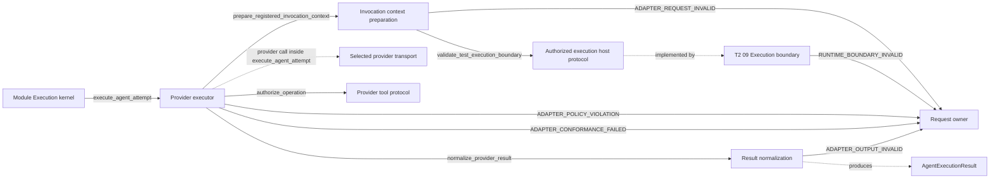

# Runtime self-test: Invocation CodeDesignBasis

本候选执行同一计划的第 5a 步。它让 Invocation 接受 T2 09 已验证的 self-test boundary，同时保留现有
external boundary。Runtime 继续通过一个 Adapter request、一个 request-bound host 和现有 provider
Adapter 执行；本步骤不实现具体 repository、command 或 SQL resource，也不注册 Profile。

## Primary flow



```yaml
CodeDesignBasis:
  status: proposed
  approved_decision_ref: null
  requested_result: >-
    Let the existing provider-neutral Invocation path consume an exact Runtime self-test boundary without any
    production authorization context, decision, entitlement or grant. Preserve external authorization, exact
    Module/Profile/input/output closure, provider/tool resource controls, normalized usage/trace and fail-closed results.
  owning_design_refs:
    - design_ref: designDoc/agent_runtime_08_agent_execution_adapter_contract.md
      design_sha256: 66a7d20f6791176c1ba1aa7b5ea60b0765ebfc9efe7e1773329a71b4f72d2003
      code_projection_ref: null
      code_projection_sha256: null
    - design_ref: designDoc/agent_runtime_09_authorization_integration_contract.md
      design_sha256: f0cab2805ae900d6b7656d1a626284f9da5ed54830056266ebac09c1961a91c0
      code_projection_ref: null
      code_projection_sha256: null
    - design_ref: designDoc/agent_runtime_11_agent_capability_verification.md
      design_sha256: 096ee22c40d3864e1029f6a3fc3cbd350ea354a7b0d25ce229411a76596bf01e
      code_projection_ref: null
      code_projection_sha256: null
  system_change_plan_step_ref: review_artifacts/runtime_self_test_and_reviewer_system_change_plan.md#step-5a-invocation-code-design
  system_change_plan_step_sha256: fa540e8958c6d103bdfeceb957d7ce547b045b15a7c68f859f2cd4a5d6f67a35
  architecture_disposition: refactor
  primary_flow:
    diagram_type: flowchart
    diagram: |
      flowchart LR
        module_execution -->|execute_agent_attempt| provider_executor
        provider_executor -->|prepare_registered_invocation_context| invocation_context
        invocation_context -->|validate_test_execution_boundary| invocation_request
        invocation_request -. implemented by .-> execution_boundary
        provider_executor -->|authorize_operation| provider_tool_protocol
        provider_executor -->|normalize_provider_result| result_normalization
        invocation_context -->|ADAPTER_REQUEST_INVALID| request_owner
        execution_boundary -->|RUNTIME_BOUNDARY_INVALID| request_owner
        provider_executor -->|ADAPTER_POLICY_VIOLATION| request_owner
        provider_executor -->|ADAPTER_CONFORMANCE_FAILED| request_owner
        result_normalization -->|ADAPTER_OUTPUT_INVALID| request_owner
    edges:
      - {from: module_execution, to: provider_executor, interface_id: execute_agent_attempt, error_code: null}
      - {from: provider_executor, to: invocation_context, interface_id: prepare_registered_invocation_context, error_code: null}
      - {from: invocation_context, to: invocation_request, interface_id: validate_test_execution_boundary, error_code: null}
      - {from: provider_executor, to: provider_tool_protocol, interface_id: authorize_operation, error_code: null}
      - {from: provider_executor, to: result_normalization, interface_id: normalize_provider_result, error_code: null}
      - {from: invocation_context, to: request_owner, interface_id: null, error_code: ADAPTER_REQUEST_INVALID}
      - {from: execution_boundary, to: request_owner, interface_id: null, error_code: RUNTIME_BOUNDARY_INVALID}
      - {from: provider_executor, to: request_owner, interface_id: null, error_code: ADAPTER_POLICY_VIOLATION}
      - {from: provider_executor, to: request_owner, interface_id: null, error_code: ADAPTER_CONFORMANCE_FAILED}
      - {from: result_normalization, to: request_owner, interface_id: null, error_code: ADAPTER_OUTPUT_INVALID}
  interface_contracts:
    - interface_id: execute_agent_attempt
      identity_mode: referenced
      semantic_owner_ref: designDoc/agent_runtime_08_agent_execution_adapter_contract.md#12-public-interface-and-effects
      owner_module_id: provider_executor
      input: Exact AuthorizedAgentExecutionRequest, matching request-bound host, resolved Adapter and selected Profile.
      output: AgentExecutionResult with completed output or typed failure, actual usage, Context and trace.
      effects: Enter only the selected provider transport and declared tool/resource callbacks; stage only schema-conforming bytes and commit the bounded trace through the request-bound host. Authoritative output waits for Execution finalization.
      error_codes: [ADAPTER_REQUEST_INVALID, ADAPTER_POLICY_VIOLATION, ADAPTER_CONFORMANCE_FAILED, RUNTIME_BOUNDARY_INVALID, RUNTIME_BOUNDARY_FENCED]
    - interface_id: prepare_registered_invocation_context
      identity_mode: referenced
      semantic_owner_ref: designDoc/agent_runtime_08_agent_execution_adapter_contract.md#12-public-interface-and-effects
      owner_module_id: invocation_context
      input: Exact request, Registry, artifact host, Adapter expectation and the same request-bound Execution host passed to execute_agent_attempt.
      output: Existing PreparedInvocationContext after boundary, release, Profile, schema, prompt and input closure validation.
      effects: Read-only preparation; no provider or resource call.
      error_codes: [ADAPTER_REQUEST_INVALID, RUNTIME_BOUNDARY_INVALID, RUNTIME_BOUNDARY_FENCED]
    - interface_id: validate_test_execution_boundary
      identity_mode: declared
      semantic_owner_ref: runtime_test_execution_host_protocol
      owner_module_id: invocation_request
      input: Exact canonical Adapter request carrying a self-test boundary pair, through the same request-bound host; request/Attempt and original resources must match.
      output: None after the host resolves T2 09's committed test binding and verifies the request pair; failure raises the original T2 09 error.
      effects: Read-only scoped callback; it returns no peer record and creates no Invocation-to-Execution import. External requests retain their existing committed-operation evidence path.
      error_codes: [RUNTIME_BOUNDARY_INVALID, RUNTIME_BOUNDARY_FENCED]
    - interface_id: authorize_operation
      identity_mode: referenced
      semantic_owner_ref: designDoc/agent_runtime_08_agent_execution_adapter_contract.md#12-public-interface-and-effects
      owner_module_id: provider_tool_protocol
      input: Exact external ProviderOperationIntent through AuthorizedAgentExecutionHost.authorize_operation, or RuntimeTestOperationIntent through RuntimeTestExecutionHost.authorize_test_operation, produced by this Attempt's tool session.
      output: Matching external AuthorizedOperationReceipt or RuntimeTestOperationReceipt from the applicable host method.
      effects: Admission of exactly one declared operation/resource/payload/idempotency tuple; the resource callable still validates the receipt before its effect.
      error_codes: [ADAPTER_POLICY_VIOLATION, RUNTIME_BOUNDARY_INVALID, RUNTIME_BOUNDARY_FENCED]
    - interface_id: normalize_provider_result
      identity_mode: referenced
      semantic_owner_ref: designDoc/agent_runtime_08_agent_execution_adapter_contract.md#12-public-interface-and-effects
      owner_module_id: result_normalization
      input: Exact provider response, registered output schema, pinned normalizer and request-bound tool observations.
      output: Existing AgentExecutionResult with canonical output or a typed failed/cancelled result.
      effects: Normalize output, usage, Context and failure into the typed result; staging and trace commit remain provider_executor effects, and no subject approval or authoritative Execution output is created here.
      error_codes: [ADAPTER_OUTPUT_INVALID, ADAPTER_CONFORMANCE_FAILED]
  error_contracts:
    - error_code: ADAPTER_REQUEST_INVALID
      identity_mode: referenced
      semantic_owner_ref: designDoc/agent_runtime_08_agent_execution_adapter_contract.md#13-completion-failure-and-recovery
      owner_module_id: invocation_context
      condition: Request, boundary group, begin receipt, release/Profile/schema/input/prompt, host or handle closure is absent, partial, mixed or mismatched.
      meaning: No valid provider invocation context exists.
      caller_action: Correct the exact input; never infer self-test, fabricate begin/boundary evidence or change provider.
    - error_code: ADAPTER_POLICY_VIOLATION
      identity_mode: referenced
      semantic_owner_ref: designDoc/agent_runtime_08_agent_execution_adapter_contract.md#13-completion-failure-and-recovery
      owner_module_id: provider_executor
      condition: Tool, workspace, network, command, payload, resource or frozen subject exceeds the exact Profile/boundary.
      meaning: The operation is refused and the Attempt cannot succeed.
      caller_action: Preserve actual observations, return typed failed result and correct resource/Profile/subject.
    - error_code: ADAPTER_OUTPUT_INVALID
      identity_mode: referenced
      semantic_owner_ref: designDoc/agent_runtime_08_agent_execution_adapter_contract.md#13-completion-failure-and-recovery
      owner_module_id: result_normalization
      condition: Provider body, slot, schema, required input coverage or normalization is invalid.
      meaning: No consumable output exists; actual provider facts remain.
      caller_action: Return typed failed result and use only the registered bounded repair policy for another Attempt.
    - error_code: ADAPTER_CONFORMANCE_FAILED
      identity_mode: referenced
      semantic_owner_ref: designDoc/agent_runtime_08_agent_execution_adapter_contract.md#13-completion-failure-and-recovery
      owner_module_id: provider_executor
      condition: Adapter throws an unnormalized exception, returns the wrong type, or omits required usage/trace/lifecycle facts.
      meaning: Adapter did not satisfy its contract and no authoritative output exists.
      caller_action: Execution records a bounded failed Attempt and returns the defect to Invocation owner.
    - error_code: RUNTIME_BOUNDARY_INVALID
      identity_mode: referenced
      semantic_owner_ref: designDoc/agent_runtime_09_authorization_integration_contract.md#10-completion-failure-and-recovery
      owner_module_id: execution_boundary
      condition: Applicable test/external boundary or its exact resource/request closure cannot be resolved by the host.
      meaning: Provider/resource entry is unavailable for this execution.
      caller_action: Correct owner input; changed closure requires a new execution and never falls back between boundary kinds.
    - error_code: RUNTIME_BOUNDARY_FENCED
      identity_mode: referenced
      semantic_owner_ref: designDoc/agent_runtime_09_authorization_integration_contract.md#10-completion-failure-and-recovery
      owner_module_id: execution_boundary
      condition: Original external context or test resource fence is closed.
      meaning: No new provider/resource dispatch or consumable late result.
      caller_action: Preserve facts and start a new execution with valid resources to continue.
  logical_modules:
    - module_id: invocation_request
      responsibility: Existing Invocation DTO owner adds an explicit self-test boundary and self-test operation/receipt variant without reusing production evidence fields.
      owned_resources: [canonical_adapter_request, runtime_test_execution_host_protocol, test_operation_intent, test_operation_receipt, provider_entry_evidence_predicate]
      public_interfaces: [validate_test_execution_boundary]
      allowed_dependencies: [foundation_validation, ledger_observation_contract, registry_release_contract]
      prohibited_dependencies: [production_authority_client, credential_resolution, business_repository, execution_private_state]
      failure_and_recovery: [Partial or mixed evidence rejects before provider; exactly one of external operation evidence or host-validated test boundary admits a provider; exact legacy request hashes remain stable.]
      required_tests: [legacy_request_golden_vectors, request_boundary_group_matrix, provider_entry_evidence_matrix, host_protocol_signature_and_missing_callback, test_intent_receipt_field_sets, request_hash_mutation]
      future_capabilities: [Additional owner-qualified boundary variants through explicit new record variants rather than repurposed fields.]
      implementation_bindings: [src/agent_runtime/contracts/invocation_adapter_definition.py, tests/test_agent_runtime_public_adapter_contracts.py]
      disposition: refactor
    - module_id: invocation_context
      responsibility: Existing preparation owner resolves the applicable boundary through the same host, then validates exact release/Profile/schema/prompt/input closure before provider entry.
      owned_resources: [prepared_invocation_context]
      public_interfaces: [prepare_registered_invocation_context]
      allowed_dependencies: [invocation_request, registry_public_contract, module_artifact_host, runtime_test_execution_host_protocol]
      prohibited_dependencies: [execution_private_state, ambient_filesystem, production_authority_client, provider_transport]
      failure_and_recovery: [Every failure precedes provider entry; boundary failures retain T2 09 identity; exact corrected input may be retried as a new Attempt.]
      required_tests: [self_test_boundary_resolution, external_boundary_regression, mixed_boundary_rejection, zero_provider_on_preparation_failure]
      future_capabilities: [Registered managed-attachment and hybrid delivery under their existing explicit Profile modes.]
      implementation_bindings: [src/agent_runtime/invocation/invocation_context_preparation.py, tests/test_agent_runtime_native_structured_output.py]
      disposition: refactor
    - module_id: provider_tool_protocol
      responsibility: Existing request-bound tool protocol accepts separate external and self-test intent/receipt types while preserving exact Module/Profile/tool-set closure.
      owned_resources: [test_operation_admission_protocol]
      public_interfaces: [authorize_operation]
      allowed_dependencies: [invocation_request, authorized_execution_host_protocol, ledger_observation_contract]
      prohibited_dependencies: [direct_database, direct_repository, shell_execution, credential, policy_copy]
      failure_and_recovery: [Wrong intent/receipt variant, cross-Attempt reuse, payload/resource mismatch and refused operations terminate the Attempt as policy violations.]
      required_tests: [intent_receipt_variant_matrix, payload_hash_binding, cross_attempt_receipt_rejection, refused_operation_observation]
      future_capabilities: [Verification-owned repository/command resource sessions implementing this protocol.]
      implementation_bindings: [src/agent_runtime/invocation/invocation_tool_definition.py, src/agent_runtime/invocation/invocation_claude_module_invocation.py, tests/test_agent_runtime_native_structured_output.py]
      disposition: refactor
    - module_id: provider_executor
      responsibility: Existing Claude and Codex provider executors pass the exact request-bound host into shared preparation and retain their current transport, workspace, network, output and failure behavior.
      owned_resources: [provider_attempt_transport]
      public_interfaces: [execute_agent_attempt]
      allowed_dependencies: [invocation_request, authorized_execution_host_protocol, runtime_test_execution_host_protocol, invocation_context, provider_tool_protocol, result_normalization, registered_profile, provider_binding]
      prohibited_dependencies: [production_authority_minting, business_repository, ambient_skill_discovery, implicit_provider_fallback]
      failure_and_recovery: [No provider entry before context closure; transport failures retain actual usage/trace when known; retry follows registered policy only.]
      required_tests: [claude_boundary_preflight, codex_boundary_preflight, self_test_boundary_admits_provider_transport, provider_not_called_negative, existing_transport_regression]
      future_capabilities: [Additional registered provider bindings with the same host/boundary protocol.]
      implementation_bindings: [src/agent_runtime/invocation/invocation_claude_module_invocation.py, src/agent_runtime/invocation/invocation_codex_module_invocation.py, tests/test_agent_runtime_native_structured_output.py]
      disposition: refactor
    - module_id: result_normalization
      responsibility: Existing result owner preserves canonical output, usage, Context, failure and trace after the new boundary preflight.
      owned_resources: [normalized_agent_execution_result]
      public_interfaces: [normalize_provider_result]
      allowed_dependencies: [invocation_request, registered_output_schema, module_artifact_host]
      prohibited_dependencies: [subject_approval, execution_finalization, external_ledger]
      failure_and_recovery: [Invalid output remains typed failure; valid output is only staged for Execution; no result is relabelled unsupported after provider entry.]
      required_tests: [result_schema_regression, actual_usage_preservation, tool_observation_closure, invalid_output_negative]
      future_capabilities: []
      implementation_bindings: [src/agent_runtime/invocation/invocation_failure_recording.py, src/agent_runtime/invocation/invocation_result_assembly.py, src/agent_runtime/invocation/invocation_claude_module_invocation.py, src/agent_runtime/invocation/invocation_codex_module_invocation.py]
      disposition: retain
    - module_id: execution_boundary
      responsibility: Referenced T2 09 owner validates and admits the exact boundary and operation; implementation remains assigned to the approved Execution basis.
      owned_resources: []
      public_interfaces: []
      allowed_dependencies: []
      prohibited_dependencies: []
      failure_and_recovery: [Preserve T2 09 errors and monotonic fence behavior.]
      required_tests: [execution_invocation_joint_boundary]
      future_capabilities: []
      implementation_bindings: [review_artifacts/runtime_self_test_execution_code_design.md]
      disposition: retain
  implementation_slices:
    - slice_id: invocation_boundary_contract
      intended_result: Canonical request and host/tool protocols represent self-test separately from external authority while preserving legacy identity.
      included_surfaces: [invocation_request, provider_tool_protocol, canonical_adapter_request, runtime_test_execution_host_protocol, provider_entry_evidence_predicate, test_operation_intent, test_operation_receipt, test_operation_admission_protocol, authorize_operation, validate_test_execution_boundary]
      excluded_surfaces: [invocation_context, provider_executor, execution_invocation_seam]
      deferred_integrations:
        - {surface_id: invocation_context, owning_slice_id: invocation_boundary_preflight, completion_gate: shared preparation resolves and validates both boundary variants}
        - {surface_id: provider_executor, owning_slice_id: invocation_boundary_preflight, completion_gate: both provider adapters use the same host preflight with zero invocation on failure}
        - {surface_id: execution_invocation_seam, owning_slice_id: invocation_execution_joint_verification, completion_gate: joint candidate proves exact boundary and operation callbacks end to end}
      required_tests: [legacy_request_golden_vectors, request_boundary_group_matrix, provider_entry_evidence_matrix, host_protocol_signature_and_missing_callback, test_intent_receipt_field_sets, request_hash_mutation, intent_receipt_variant_matrix, payload_hash_binding, cross_attempt_receipt_rejection, refused_operation_observation]
      completion_gate: Contract tests pass outside sandbox and prove all old request vectors, the exact host callback signature/missing-callback refusal, and new complete/mixed/tampered variants without any provider call.
    - slice_id: invocation_boundary_preflight
      intended_result: Shared context preparation validates the exact host boundary before either provider transport and keeps result normalization unchanged.
      included_surfaces: [invocation_context, provider_executor, prepared_invocation_context, provider_attempt_transport, prepare_registered_invocation_context, execute_agent_attempt]
      excluded_surfaces: [execution_invocation_seam]
      deferred_integrations:
        - {surface_id: execution_invocation_seam, owning_slice_id: invocation_execution_joint_verification, completion_gate: joint candidate proves exact boundary and operation callbacks end to end}
      required_tests: [self_test_boundary_resolution, self_test_boundary_admits_provider_transport, external_boundary_regression, mixed_boundary_rejection, zero_provider_on_preparation_failure, claude_boundary_preflight, codex_boundary_preflight, provider_not_called_negative, existing_transport_regression, result_schema_regression, actual_usage_preservation, tool_observation_closure, invalid_output_negative]
      completion_gate: Invocation unit and fixed Adapter tests pass outside sandbox; a resolved self-test boundary enters each fixed transport exactly once and preserves staged output/usage/trace, while old external requests stay compatible and every invalid boundary is zero-provider.
    - slice_id: invocation_execution_joint_verification
      intended_result: Approved Execution and Invocation candidates exchange the exact boundary and dynamic-operation variants without production authorization on self-test.
      included_surfaces: [execution_invocation_seam]
      excluded_surfaces: []
      deferred_integrations: []
      required_tests: [execution_invocation_joint_boundary]
      completion_gate: The fixed joint test proves exact self-test boundary and operation callbacks against the frozen approved Execution implementation; live registered Reviewer evidence remains plan step 12.
  cross_module_seams: [execution_invocation_seam]
  migration_and_compatibility:
    - AuthorizedAgentExecutionRequest appends paired optional test_execution_binding_ref/test_execution_binding_sha256 fields with null defaults.
    - Its identity codec omits only those two keys when both null; all legacy keys and nulls retain the exact current JSON/hash domain. A non-null complete pair is hashed; a partial pair fails.
    - Existing external authorization, operation, grant and receipt fields/classes retain exact shape, validation and hash behavior.
    - RuntimeTestOperationIntent is a new exact frozen type with execution_scope_id, Module Run/Variant/Attempt, capability/resource/action IDs, operation_payload_sha256, test binding ref/hash, idempotency_key and intent_sha256. It has no production identity, entitlement, decision, grant or credential field.
    - RuntimeTestOperationIntent.intent_sha256 is SHA-256 of canonical UTF-8 JSON containing every intent field except intent_sha256, with ensure_ascii=true, sort_keys=true, compact separators and no trailing LF. All fields are required, so there is no null-omission rule. Identical reserialization preserves the hash; mutating any field changes it. The receipt compares its stored intent_sha256 with this recomputed value before resource effect.
    - operation_payload_sha256 is SHA-256 over the operation payload's canonical UTF-8 JSON with ensure_ascii=true, sort_keys=true, compact separators and no trailing LF. The attempt-local tool session computes it from the actual provider payload when building the intent; the resource session independently recomputes it from the payload passed to invoke before any effect and compares it with both intent and receipt. payload_hash_binding proves byte-identical recomputation and a one-field mutation failure, never equality of stored hashes alone.
    - RuntimeTestOperationReceipt is a new exact frozen type bound to receipt ID, intent hash, test binding ref/hash, resource/action, operation_payload_sha256, idempotency key and recorded_at_utc. It has no Product decision/grant fields.
    - AuthorizedAgentExecutionHost retains its existing member set and exact authorize_operation(ProviderOperationIntent) -> AuthorizedOperationReceipt signature for external hosts.
    - A separate runtime-checkable RuntimeTestExecutionHost protocol extends AuthorizedAgentExecutionHost with exactly validate_test_execution_boundary(request) -> None and authorize_test_operation(RuntimeTestOperationIntent) -> RuntimeTestOperationReceipt. It is required only when the request has a self-test pair. Execution's request-bound host satisfies the extended protocol, resolves T2 09 state internally, returns no peer DTO, and introduces no Invocation import of Execution records. Existing external hosts without either test member remain conforming AuthorizedAgentExecutionHost instances.
    - authorize_operation and authorize_test_operation are two physical protocol bindings of the one T2 08 logical authorize_operation interface; no second logical interface or permission authority is introduced.
    - The provider-entry predicate changes from unconditional has_operation_evidence to exactly external operation evidence or a successfully host-validated self-test boundary. A request with neither remains ADAPTER_REQUEST_INVALID before provider; operation-free in-process execution never enters this provider path.
    - ModuleProviderToolSession may return either exact intent variant. The provider executor dispatches by exact type: external intent uses the unchanged base authorize_operation; test intent first requires RuntimeTestExecutionHost and uses authorize_test_operation. The session invoke method accepts the matching receipt union and rejects cross-variant use. Concrete repository/command/SQL resource sessions remain Verification-owned later work.
    - Claude and Codex executors retain IDs/revisions and current Profile conjunctions; only shared host-boundary preflight changes. Provider/model selection and fallback do not change.
    - actual_usage_preservation, tool_observation_closure and invalid_output_negative remain required regressions of retained result normalization and are assigned to invocation_boundary_preflight. Live registered Reviewer execution remains exclusively in plan step 12.
    - Public exports and architecture manifests are deferred to the single owners in plan steps 7/7a; no generated Design file is edited here.
  rollback_boundary: Revert Invocation implementation and its public projections together before release; restore no records and mutate no active pointer. Existing external requests/releases remain valid because their bytes and hashes never changed.
  acceptance_criteria:
    - Every actual changed Invocation symbol, public export and test maps to exactly one Slice in the future ChangeSetManifest; this basis produces no schema or migration. Execution-side symbols remain owned by its approved basis.
    - Code for a later Slice that is already present in the worktree remains explicitly unaccepted and cannot satisfy an earlier Slice; it is accepted only when its own slice_id and deferred completion gate pass.
    - Self-test and external boundary groups are complete, mutually exclusive, independently resolvable and structurally fenced; an operation-free in-process request retains its existing no-boundary exception.
    - Host self-test boundary validation uses the exact request object and committed ref/hash, and fires before provider/tool/resource entry; external entry retains its existing committed-operation evidence check.
    - Provider entry requires exactly external operation evidence or a successfully host-validated test pair; neither is rejected before a provider call, with positive and negative controls.
    - Legacy Adapter-request serialized payload/hash golden vectors remain byte-identical; old null values still participate in identity.
    - Test operation intent and receipt bind exact payload/resource/action/Attempt/idempotency and cannot cross boundary kind or Attempt.
    - No test record contains a production principal, tenant, entitlement, decision, grant or credential field; exact field-set tests and constructor/call tripwires are positive controls.
    - Existing external authorization and Gateway tests remain unchanged in meaning and passing.
    - Claude and Codex fixed adapters both refuse an unresolved boundary before provider call count changes; existing success/output/failure/usage tests remain passing.
    - A valid non-pass/blocked Reviewer body remains a successful transport result but never subject approval; malformed output remains failed, and post-provider failure never becomes unsupported.
    - No concrete repository, command, SQL or business resource implementation is added by this basis; later sessions implement only Profile/Module-declared operations through the protocol.
    - No public/generated projection has multiple owners. New public exports are deferred to plan step 7's RUNTIME_PUBLIC_SURFACE_MANIFEST parity and clean-package import gates; step 7a's current-Design naming inventory remains independently owned. This basis creates no generated projection.
    - No production publication, external Ledger destination, Registry-record deletion or active-pointer promotion occurs.
  unresolved_decisions: []
```

## Hash and evidence closure

The full plan hash is `cf0305be721bc8e0e2bded71c1e87bf510d925b109972d505effa3a908a2b576`.
The exact approved Execution-basis prerequisite is
`review_artifacts/runtime_self_test_execution_code_design.md`, SHA-256
`f562700d97c6432dc97840a99a6c238633e15534a88ada5a18e3b027627d1ed7`, with superseding owner decision
`review_artifacts/runtime_self_test_execution_code_design_amendment_owner_decision.md`, SHA-256
`d84a74ece9cb6d574b050c484d76263b061c8c7cc8946c68c43e99d2ee5b1388`.
The step-row hash is SHA-256 over the unique step-5a table row's UTF-8 bytes including its LF. Source hashes frozen
before implementation are:

| Source | SHA-256 |
| --- | --- |
| `src/agent_runtime/contracts/invocation_adapter_definition.py` | `437cc3b7bdabf16e8c9e2eeb7ccc96125d53b3d30c283307943b2007784d4a05` |
| `src/agent_runtime/invocation/invocation_context_preparation.py` | `f8699f0d9fabc4e03a7445db24d200a9e0e879010262311b311c97f6fbfa4a4b` |
| `src/agent_runtime/invocation/invocation_tool_definition.py` | `01e23bbc5d93d83fd3ece46a98ca392257e8700378c3dbdb43431f5b81704097` |
| `src/agent_runtime/invocation/invocation_claude_module_invocation.py` | `2b89823a66a87029f304067adce618454043e2c8b392df7e74062d864f33c975` |
| `src/agent_runtime/invocation/invocation_codex_module_invocation.py` | `436cac7b6351405e449d2b045cdf144e55dbc05391a33b232fc894adce8cc1b4` |
| `tests/test_agent_runtime_public_adapter_contracts.py` | `5e8625050016eb6988948e4390531f4ee1852ef324a0ecf49804f0bcb0d7443c` |
| `tests/test_agent_runtime_native_structured_output.py` | `a9109c9d32b3c1f3e0fd543774c1ecfd75aeb72f95b5609fc943f24b39a425d9` |

`legacy_request_golden_vectors` freezes at least one real legacy request's complete serialized identity payload and
request hash before adding fields. Its controls prove: old omitted input and new explicit-null defaults encode the same
bytes; removing any old null-valued key changes the hash; complete new pair changes the hash; pair mutation and partial
pair fail. Test intent/receipt field-set assertions compare the full dataclass field set, not a denylist.

`self_test_boundary_resolution` uses a live host callback that resolves one exact test binding. Wrong host, wrong ref/hash,
another request or callback bypass is rejected before the provider counter changes. The external regression uses the
same committed authority objects as the current tests and proves their serialized records remain unchanged.

`test_intent_receipt_field_sets` also recomputes `intent_sha256` from every exact field with the declared codec, proves
an identical intent is stable, mutates each field individually, and rejects a receipt whose intent hash or payload hash
does not match. `payload_hash_binding` independently computes the payload digest at tool-session intent creation and again
at resource-session invocation, then mutates one payload field while retaining the old hashes and requires refusal before
effect. `intent_receipt_variant_matrix` proves a base-only external host remains conforming and refuses no valid external
intent, while a test intent is dispatched only to `RuntimeTestExecutionHost.authorize_test_operation`; cross-variant
intent/receipt use is rejected. `provider_entry_evidence_matrix` proves the predicate accepts external evidence and a validated test pair separately,
while neither/mixed/partial groups fail. `host_protocol_signature_and_missing_callback` fixes the exact method signature
and proves a self-test host without it fails before provider entry. `self_test_boundary_admits_provider_transport` is the live positive
control for both fixed Adapters: the transport counter increments once and returns staged output, usage and trace.
`RuntimeTestOperationIntent` has no independent wall-clock expiry; its bounded lifetime is the exact Attempt plus the
monotonic T2 09 test-resource fence. The existing external ProviderOperationIntent expiry field and semantics are unchanged.

Provider success tests retain canonical output schema validation, staged-output checks, Context, trace, actual usage and
tool observation ordering. Failure tests cover boundary, request, policy, output and conformance owners separately.
The real-provider joint case belongs to later implementation evidence; a test double cannot establish transport support.

## Scope and qualification

This is a proposed authoring result. It consumes the approved Execution basis and the user's standing decision for later
bases only after independent no-finding review. It neither invokes that review nor records its own approval. Existing
formal plan/Design review qualifications remain; no source implementation, registration, database or release state was
changed. Optional provider/context capabilities outside the current plan stay future work rather than speculative fields.

## Author self-check

Layer 0 classification: `skill_contract`; independent Code Design content review is required. Structure review first
corrected the T2 09 failure arrows so boundary errors originate from the boundary owner, and moved the approved Execution
basis from `owning_design_refs` to an explicit predecessor-basis prerequisite. Content review checked exact request hash
compatibility, boundary-group exclusivity, host resolution before provider entry, operation payload binding, peer ownership,
Slice deferral and no concrete resource-session implementation. The final prose check found no change to the three owning
Design inputs or the approved Execution handoff. The four self-review references and all eighteen Code Design completion
requirements were used; no stage/reference was skipped. These are author observations, not independent review evidence.
