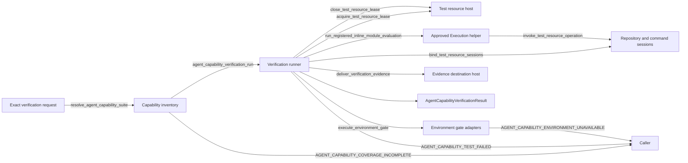

# Runtime self-test: Verification CodeDesignBasis

本候选执行同一计划的第 6 步。它把 T2 11 的完整 capability inventory、focused/complete runner、Runtime
测试宿主资源、Reviewer repository/command session 和 environment gates 固定为一个可实现合同。当前计划不拥有
canonical Example implementation，因此本候选允许 focused evidence，且要求 complete scope 在 Example closure
缺失时返回 coverage incomplete，不能产生 false green。

## Primary flow



```yaml
CodeDesignBasis:
  status: proposed
  approved_decision_ref: null
  requested_result: >-
    Implement the T2 11 code-owned capability inventory and one subject-bound verification runner that can repeat
    focused Runtime self-tests with Runtime-hosted temporary resources, preserve exact passed/failed/not_run facts,
    execute only declared Reviewer repository and command capabilities, and represent persistent, durable and live
    provider gates without production authorization or an ambient external evidence sink. Preserve complete-scope
    failure until the required inventory, canonical Example, environment decisions and peer results are all present.
  owning_design_refs:
    - design_ref: designDoc/agent_runtime_11_agent_capability_verification.md
      design_sha256: 096ee22c40d3864e1029f6a3fc3cbd350ea354a7b0d25ce229411a76596bf01e
      code_projection_ref: null
      code_projection_sha256: null
    - design_ref: designDoc/agent_runtime_00_execution_charter.md
      design_sha256: 243a821d7403bdaf9ff51b2e9aa5ea8f336c6d981cde50f0e1389349c638e5e9
      code_projection_ref: null
      code_projection_sha256: null
    - design_ref: designDoc/agent_runtime_08_agent_execution_adapter_contract.md
      design_sha256: 66a7d20f6791176c1ba1aa7b5ea60b0765ebfc9efe7e1773329a71b4f72d2003
      code_projection_ref: null
      code_projection_sha256: null
    - design_ref: designDoc/agent_runtime_09_authorization_integration_contract.md
      design_sha256: f0cab2805ae900d6b7656d1a626284f9da5ed54830056266ebac09c1961a91c0
      code_projection_ref: null
      code_projection_sha256: null
    - design_ref: designDoc/agent_runtime_05_delivery_roadmap.md
      design_sha256: 5cc5ea90a5b293d06d1351536be46832c28b10c2a0ac18251dda5e5f2cdca323
      code_projection_ref: null
      code_projection_sha256: null
  system_change_plan_step_ref: review_artifacts/runtime_self_test_and_reviewer_system_change_plan.md#step-6-verification-code-design
  system_change_plan_step_sha256: 348594417ee32cef97f15d90cbe3f0ef1c5eae7dcabbf7725dd2ae410fdc9a2a
  architecture_disposition: refactor
  primary_flow:
    diagram_type: flowchart
    diagram: |
      flowchart LR
        verification_request -->|resolve_agent_capability_suite| capability_inventory
        capability_inventory -->|agent_capability_verification_run| verification_runner
        verification_runner -->|acquire_test_resource_lease| test_resource_host
        verification_runner -->|bind_test_resource_sessions| reviewer_resource_sessions
        verification_runner -->|run_registered_inline_module_evaluation| execution_evaluation_peer
        execution_evaluation_peer -->|invoke_test_resource_operation| reviewer_resource_sessions
        verification_runner -->|execute_environment_gate| environment_gate_adapters
        verification_runner -->|close_test_resource_lease| test_resource_host
        verification_runner -->|deliver_verification_evidence| evidence_delivery
        verification_runner -. produces .-> verification_result
        capability_inventory -->|AGENT_CAPABILITY_COVERAGE_INCOMPLETE| caller
        verification_runner -->|AGENT_CAPABILITY_TEST_FAILED| caller
        environment_gate_adapters -->|AGENT_CAPABILITY_ENVIRONMENT_UNAVAILABLE| caller
    edges:
      - {from: verification_request, to: capability_inventory, interface_id: resolve_agent_capability_suite, error_code: null}
      - {from: capability_inventory, to: verification_runner, interface_id: agent_capability_verification_run, error_code: null}
      - {from: verification_runner, to: test_resource_host, interface_id: acquire_test_resource_lease, error_code: null}
      - {from: verification_runner, to: reviewer_resource_sessions, interface_id: bind_test_resource_sessions, error_code: null}
      - {from: verification_runner, to: execution_evaluation_peer, interface_id: run_registered_inline_module_evaluation, error_code: null}
      - {from: execution_evaluation_peer, to: reviewer_resource_sessions, interface_id: invoke_test_resource_operation, error_code: null}
      - {from: verification_runner, to: environment_gate_adapters, interface_id: execute_environment_gate, error_code: null}
      - {from: verification_runner, to: test_resource_host, interface_id: close_test_resource_lease, error_code: null}
      - {from: verification_runner, to: evidence_delivery, interface_id: deliver_verification_evidence, error_code: null}
      - {from: capability_inventory, to: caller, interface_id: null, error_code: AGENT_CAPABILITY_COVERAGE_INCOMPLETE}
      - {from: verification_runner, to: caller, interface_id: null, error_code: AGENT_CAPABILITY_TEST_FAILED}
      - {from: environment_gate_adapters, to: caller, interface_id: null, error_code: AGENT_CAPABILITY_ENVIRONMENT_UNAVAILABLE}
  interface_contracts:
    - interface_id: resolve_agent_capability_suite
      identity_mode: declared
      semantic_owner_ref: capability_suite
      owner_module_id: capability_inventory
      input: >-
        Exact suite release ref/hash, exact Runtime subject ref/hash, verification scope, selected case IDs, required
        environment-gate decision ref/hash when applicable, environment inspection ref/hash, test resource binding
        refs/hashes, optional evidence destination ref/hash and the exact 05 result when required.
      output: >-
        One immutable resolved AgentCapabilityVerificationSuite and exact selected evidence requirements, after the
        resolver proves suite admission and every reference/hash edge required by the requested scope.
      effects: Read-only resolution; it starts no case, provider, resource, database or destination operation.
      error_codes: [AGENT_CAPABILITY_COVERAGE_INCOMPLETE, RELEASE_CONFORMANCE_INCOMPLETE]
    - interface_id: agent_capability_verification_run
      identity_mode: referenced
      semantic_owner_ref: designDoc/agent_runtime_11_agent_capability_verification.md#8-public-interface-and-effects
      owner_module_id: verification_runner
      input: Exact resolved suite, selected evidence requirements, request identity and request-bound test host.
      output: >-
        One subject-bound AgentCapabilityVerificationResult containing each selected case/gate state, exact evidence,
        owner-qualified failure, cleanup and delivery facts, scope completion and separately computed full Runtime completion.
      effects: >-
        Create only declared test resources and verification evidence; invoke only selected cases/gates; contact an
        external evidence destination only through an explicit binding; never mutate production state or an active pointer.
      error_codes: [AGENT_CAPABILITY_TEST_FAILED, AGENT_CAPABILITY_ENVIRONMENT_UNAVAILABLE, AGENT_CAPABILITY_COVERAGE_INCOMPLETE]
    - interface_id: acquire_test_resource_lease
      identity_mode: declared
      semantic_owner_ref: test_resource_lifecycle
      owner_module_id: test_resource_host
      input: Exact verification run identity, selected case resource requirements and explicit host resource bindings.
      output: >-
        RuntimeTestResourceLease bound to owner_run_id, one temporary RuntimeReleaseRegistry, immutable resource descriptions,
        original repository/command live objects, retention, cleanup obligations and monotonically open lifecycle state.
      effects: >-
        Allocate a default in-memory Registry, local evidence store and isolated temporary workspace, or bind only explicitly
        supplied test namespaces. The peer Execution helper owns its internal artifact store and Module ledger; existing
        immutable releases remain outside cleanup ownership.
      error_codes: [AGENT_CAPABILITY_TEST_FAILED, AGENT_CAPABILITY_COVERAGE_INCOMPLETE]
    - interface_id: close_test_resource_lease
      identity_mode: declared
      semantic_owner_ref: test_resource_lifecycle
      owner_module_id: test_resource_host
      input: Exact original lease, completed case evidence and delivery/retention disposition.
      output: Same lease identity with closed state and per-resource retained, delivered, cleaned or cleanup_failed facts.
      effects: >-
        Close and clean only resources whose owner_run_id and live object identity match the lease after required evidence
        retention or delivery; no path glob, production record or pre-existing release is a cleanup target.
      error_codes: [AGENT_CAPABILITY_TEST_FAILED]
    - interface_id: run_registered_inline_module_evaluation
      identity_mode: referenced
      semantic_owner_ref: review_artifacts/runtime_self_test_execution_code_design.md#execution-inline-evaluation-helper
      owner_module_id: execution_evaluation_peer
      input: >-
        The lease's exact temporary RuntimeReleaseRegistry, registered Module/Profile refs/hashes, projected input
        bytes/ModuleInputBinding, evaluation key, Adapter factory and lease-bound test_resource_factory; optional explicitly
        supplied external authority_factory remains the peer-owned external compatibility input and is absent for self-test.
      output: Existing RegisteredModuleEvaluation with exact request, result, prompt, output or bounded failure detail.
      effects: >-
        Let the amended approved Execution helper allocate its core ephemeral resources, invoke test_resource_factory to bind
        the Verification lease's repository/command sessions into the same RuntimeTestExecutionResources, and execute the
        approved Invocation path. No Product Authorization object or external sink is created.
      error_codes: [RUNTIME_BOUNDARY_INVALID, RUNTIME_BOUNDARY_FENCED, ADAPTER_REQUEST_INVALID]
    - interface_id: bind_test_resource_sessions
      identity_mode: declared
      semantic_owner_ref: reviewer_test_resource_sessions
      owner_module_id: reviewer_resource_sessions
      input: >-
        Exact open RuntimeTestResourceLease, selected Module/Profile operation declarations, admitted command catalog and
        the frozen subject repository binding from that lease.
      output: >-
        One lease-bound TestResourceFactory that receives the Execution helper's Registry, artifact host, Module ledger and
        Adapter registry, returns those identical core objects plus the original repository/command session objects and
        immutable descriptions, and can be passed through the helper's explicit test_resource_factory input.
      effects: Construct request-local session objects only; no repository read, command or provider call occurs here.
      error_codes: [AGENT_CAPABILITY_COVERAGE_INCOMPLETE, ADAPTER_POLICY_VIOLATION, RUNTIME_BOUNDARY_INVALID, RUNTIME_BOUNDARY_FENCED]
    - interface_id: invoke_test_resource_operation
      identity_mode: declared
      semantic_owner_ref: reviewer_test_resource_sessions
      owner_module_id: reviewer_resource_sessions
      input: >-
        Exact RuntimeTestOperationIntent and matching RuntimeTestOperationReceipt, provider payload, current Attempt and
        original lease-bound repository or command resource object.
      output: Bounded repository content/search matches or command exit/stdout/stderr evidence with exact content hashes.
      effects: >-
        Read only allowed files from the frozen repository resource or execute one admitted argv with shell disabled,
        bounded output and timeout. SQL source is inspected as repository content; live database queries require a separate
        future Module/Profile-declared operation and are unavailable in this basis.
      error_codes: [ADAPTER_POLICY_VIOLATION, RUNTIME_BOUNDARY_INVALID, RUNTIME_BOUNDARY_FENCED]
    - interface_id: execute_environment_gate
      identity_mode: declared
      semantic_owner_ref: environment_gate_execution
      owner_module_id: environment_gate_adapters
      input: >-
        One selected environment-gate requirement, exact subject/suite/dependency closure, host availability inspection,
        explicit test resource lease and exact gate adapter revision.
      output: >-
        One AgentCapabilityCaseResult with passed, failed or not_run; Reviewer transport results carry supported or
        unsupported only under the exact T2 11 rules.
      effects: >-
        Invoke only the selected persistent-store, durable-backend or provider adapter binding. Missing environment stays
        not_run. An unsupported Reviewer transport proves refusal before provider invocation remains zero.
      error_codes: [AGENT_CAPABILITY_ENVIRONMENT_UNAVAILABLE, AGENT_CAPABILITY_TEST_FAILED, ADAPTER_OUTPUT_INVALID, ADAPTER_CONFORMANCE_FAILED]
    - interface_id: deliver_verification_evidence
      identity_mode: declared
      semantic_owner_ref: verification_evidence_delivery
      owner_module_id: evidence_delivery
      input: Exact completed local result candidate and optional explicit destination binding ref/hash.
      output: Local-only or delivered disposition plus destination-owned evidence ref/hash or exact owner-qualified failure.
      effects: >-
        Without a destination, record local-only and make no external call. With one, deliver only bounded verification
        evidence through the host object; credentials are never fields of Runtime records.
      error_codes: [AGENT_CAPABILITY_TEST_FAILED]
  error_contracts:
    - error_code: AGENT_CAPABILITY_TEST_FAILED
      identity_mode: referenced
      semantic_owner_ref: designDoc/agent_runtime_11_agent_capability_verification.md#91-error-contract
      owner_module_id: verification_runner
      condition: >-
        The verification harness owns a case-execution, orchestration, required cleanup or local evidence-delivery failure;
        peer Runtime capability/storage failures retain their original owner-qualified code in the case result.
      meaning: The affected case or run obligation did not complete; already observed case and peer facts remain exact.
      caller_action: Correct the harness-owned cause and rerun only the same bounded case/resources; never publish a false pass.
    - error_code: AGENT_CAPABILITY_ENVIRONMENT_UNAVAILABLE
      identity_mode: referenced
      semantic_owner_ref: designDoc/agent_runtime_11_agent_capability_verification.md#91-error-contract
      owner_module_id: environment_gate_adapters
      condition: A selected persistent-store, durable-backend or provider-adapter binding is unavailable in the exact host inspection.
      meaning: The affected case is not_run and supplies no positive capability evidence.
      caller_action: Configure the selected binding and rerun; do not relabel unavailable as passed or unsupported.
    - error_code: AGENT_CAPABILITY_COVERAGE_INCOMPLETE
      identity_mode: referenced
      semantic_owner_ref: designDoc/agent_runtime_11_agent_capability_verification.md#91-error-contract
      owner_module_id: capability_inventory
      condition: >-
        A required ref/hash cannot resolve, suite is unadmitted, selection contradicts scope, one capability lacks unique
        evidence, or complete scope lacks the canonical Example, required gate decision or exact 05 result.
      meaning: Verification input or evidence closure is incomplete; execution does not start or full completion stays false.
      caller_action: Supply the exact admitted closure or route the missing mapping to T2 11; never shrink scope after the run.
    - error_code: ADAPTER_POLICY_VIOLATION
      identity_mode: referenced
      semantic_owner_ref: designDoc/agent_runtime_08_agent_execution_adapter_contract.md#13-completion-failure-and-recovery
      owner_module_id: invocation_boundary_peer
      condition: Repository path, command argv, payload, resource, workspace or operation exceeds Module/Profile and lease closure.
      meaning: The resource action is refused and creates no effect.
      caller_action: Preserve the peer failure and correct the declared capability or resource binding.
    - error_code: ADAPTER_REQUEST_INVALID
      identity_mode: referenced
      semantic_owner_ref: designDoc/agent_runtime_08_agent_execution_adapter_contract.md#13-completion-failure-and-recovery
      owner_module_id: invocation_boundary_peer
      condition: The exact release, Profile, input, prompt, Adapter request or applicable boundary group is absent, partial or mismatched.
      meaning: No valid provider invocation context exists.
      caller_action: Correct the exact owner input; never infer a boundary, construct production approval or change provider.
    - error_code: ADAPTER_OUTPUT_INVALID
      identity_mode: referenced
      semantic_owner_ref: designDoc/agent_runtime_08_agent_execution_adapter_contract.md#13-completion-failure-and-recovery
      owner_module_id: invocation_boundary_peer
      condition: Live provider output fails canonical schema or required semantic validation after provider entry.
      meaning: The positive transport case failed and supplies no supported evidence.
      caller_action: Preserve actual provider facts and rerun only under the registered repair/retry policy.
    - error_code: ADAPTER_CONFORMANCE_FAILED
      identity_mode: referenced
      semantic_owner_ref: designDoc/agent_runtime_08_agent_execution_adapter_contract.md#13-completion-failure-and-recovery
      owner_module_id: invocation_boundary_peer
      condition: Adapter returns the wrong type, unnormalized exception or incomplete usage/trace/lifecycle facts.
      meaning: No acceptable transport result exists.
      caller_action: Preserve the peer failure and return the defect to Invocation owner.
    - error_code: RUNTIME_BOUNDARY_INVALID
      identity_mode: referenced
      semantic_owner_ref: designDoc/agent_runtime_09_authorization_integration_contract.md#10-completion-failure-and-recovery
      owner_module_id: execution_boundary_peer
      condition: Operation, request, resource, payload, receipt or test binding cannot resolve to the current Attempt and lease.
      meaning: Provider or resource entry is unavailable for this test execution.
      caller_action: Correct the owner input and create a new execution for changed closure.
    - error_code: RUNTIME_BOUNDARY_FENCED
      identity_mode: referenced
      semantic_owner_ref: designDoc/agent_runtime_09_authorization_integration_contract.md#10-completion-failure-and-recovery
      owner_module_id: execution_boundary_peer
      condition: The original test resource lease or execution fence is closed.
      meaning: No new dispatch or consumable late result is admitted.
      caller_action: Preserve actual facts and start a new execution with an open lease.
    - error_code: RELEASE_CONFORMANCE_INCOMPLETE
      identity_mode: referenced
      semantic_owner_ref: designDoc/agent_runtime_05_delivery_roadmap.md#standalone_conformance_finalize
      owner_module_id: standalone_release_peer
      condition: The supplied StandaloneReleaseConformanceResult is missing required same-artifact gate evidence, failed, stale or bound to another package candidate.
      meaning: No valid standalone package conformance result exists for this verification subject.
      caller_action: Return the exact failed or missing gate to the T2 05 owner and rerun finalize only after same-hash closure.
  logical_modules:
    - module_id: verification_contracts
      responsibility: Own exact verification request/result/case-result records, state vocabularies and canonical hash codecs for T2 11.
      owned_resources: [verification_request, verification_result, capability_case_result, verification_hash_codecs, test_resource_lease_contract, verification_contract_source_registration]
      public_interfaces: []
      allowed_dependencies: [foundation_validation, timestamp_contract]
      prohibited_dependencies: [provider_sdk, database_driver, product_authorization, credential, business_data]
      failure_and_recovery: [Invalid field groups and hash mismatch fail before case selection; observations and timestamps never enter idempotency identity.]
      required_tests: [request_field_set_and_group_matrix, request_hash_mutation, dependency_closure_hash_mutation, case_result_state_matrix, result_completion_separation, no_secret_field_fence, verification_contract_source_registration_closure, contract_import_fence]
      future_capabilities: [Additional evidence kinds through explicit enum and record-version changes.]
      implementation_bindings: [src/agent_runtime/testing/conformance_agent_capability_definition.py, src/agent_runtime/registry/registry_architecture_registration.py, tests/test_agent_runtime_capability_verification.py, tests/test_runtime_architecture_validation.py]
      disposition: refactor
    - module_id: capability_inventory
      responsibility: Own the immutable 42-capability inventory, case/evidence mapping, suite identity and scope selection without executing a case.
      owned_resources: [capability_inventory_records, capability_suite, suite_admission_resolution, scope_selection, agent_capability_runbook_projection, verification_inventory_source_registration, conformance_plane_registration_update]
      public_interfaces: [resolve_agent_capability_suite]
      allowed_dependencies: [verification_contracts, foundation_validation, owning_design_documents, suite_resolver_host, standalone_release_peer]
      prohibited_dependencies: [provider_sdk, subprocess, database_driver, ambient_test_discovery, runtime_active_pointer_mutation]
      failure_and_recovery: [Unknown, duplicate, unowned or uncovered capability fails coverage closure; a corrected exact suite is a new suite hash.]
      required_tests: [exact_42_capability_inventory, unique_evidence_mapping, owner_design_hash_resolution, case_hash_mutation, suite_hash_mutation, runbook_v2_projection_stability, focused_selection, complete_selection_refusal_without_example, standalone_release_peer_failure_regression, verification_inventory_source_registration_closure, conformance_plane_testing_directory_registration, inventory_import_fence]
      future_capabilities: [Canonical Example cases after their separate reviewed successor basis.]
      implementation_bindings: [src/agent_runtime/testing/conformance_agent_capability_inventory.py, src/agent_runtime/registry/registry_architecture_registration.py, tests/test_agent_runtime_capability_verification.py, tests/test_runtime_architecture_validation.py]
      disposition: refactor
    - module_id: verification_runner
      responsibility: Orchestrate one resolved scope, preserve each selected fact, and compute scope/full completion without changing peer outcomes.
      owned_resources: [verification_run_state, case_execution_registry, aggregate_completion, verification_runner_source_registration]
      public_interfaces: [agent_capability_verification_run]
      allowed_dependencies: [verification_contracts, capability_inventory, test_resource_host, reviewer_resource_sessions, execution_evaluation_peer, environment_gate_adapters, evidence_delivery]
      prohibited_dependencies: [ambient_pytest_discovery, shell_string_execution, product_authorization, production_store, result_relabelling]
      failure_and_recovery: [Each case is passed, failed or not_run only; focused completion cannot imply full completion; rerun requires identical subject/suite/dependency closure.]
      required_tests: [focused_local_positive, focused_negative_expected_refusal, harness_failure_owner, peer_failure_passthrough, no_result_propagation, idempotent_rerun, complete_aggregate_matrix, execution_helper_contract_regression, invocation_peer_failure_regression, verification_runner_source_registration_closure, architecture_post_step9_error_set, verification_runner_import_fence]
      future_capabilities: [Complete Example execution after the separately admitted Example suite slice.]
      implementation_bindings: [src/agent_runtime/testing/conformance_agent_capability_verification.py, src/agent_runtime/registry/registry_architecture_registration.py, tests/test_agent_runtime_capability_verification.py, tests/test_runtime_architecture_validation.py]
      disposition: refactor
    - module_id: test_resource_host
      responsibility: Compose and close only this run's Runtime-hosted temporary resources and explicit test namespaces.
      owned_resources: [test_resource_lease_state, temporary_release_registry, temporary_workspace, local_evidence_store]
      public_interfaces: [acquire_test_resource_lease, close_test_resource_lease]
      allowed_dependencies: [verification_contracts, runtime_release_registry, module_ledger, module_artifact_store, host_resource_bindings]
      prohibited_dependencies: [business_database, production_active_pointer, ambient_home_directory, credential_parsing, broad_delete]
      failure_and_recovery: [Lease identity and live object identity fence all use and cleanup; cleanup failure is exact and never widens the target.]
      required_tests: [default_in_memory_resources, explicit_test_namespace_binding, resource_substitution_refusal, cleanup_owner_fence, cleanup_after_evidence, cleanup_failure_preservation, no_external_sink_default]
      future_capabilities: [Additional temporary backend leases through host-supplied opaque bindings.]
      implementation_bindings: [src/agent_runtime/testing/conformance_agent_capability_verification.py, tests/test_agent_runtime_capability_verification.py]
      disposition: refactor
    - module_id: reviewer_resource_sessions
      responsibility: Implement lease-bound repository read/search and admitted command execution for declared Reviewer tools through the Invocation test-operation protocol.
      owned_resources: [test_repository_session, test_command_session, reviewer_resource_source_registration]
      public_interfaces: [bind_test_resource_sessions, invoke_test_resource_operation]
      allowed_dependencies: [verification_contracts, invocation_boundary_peer, execution_boundary_peer, foundation_validation]
      prohibited_dependencies: [ambient_repository, shell_true, unrestricted_environment, credential, network_fallback, direct_database_query]
      failure_and_recovery: [Path traversal, symlink escape, undeclared argv, payload mismatch, timeout and closed lease fail without widening resource scope.]
      required_tests: [repository_exact_commit_read, repository_search_bounds, repository_path_escape_refusal, command_catalog_positive, command_shell_disabled, command_timeout_and_output_bound, payload_recomputation, closed_lease_refusal, sql_source_is_repository_content, execution_boundary_peer_regression, reviewer_resource_source_registration_closure, reviewer_resource_import_fence]
      future_capabilities: [A distinct SQL inspection operation only after a Module declares it and a reviewed Profile/resource boundary admits it.]
      implementation_bindings: [src/agent_runtime/testing/conformance_test_resource_execution.py, src/agent_runtime/registry/registry_architecture_registration.py, tests/test_agent_runtime_test_resource_execution.py, tests/test_runtime_architecture_validation.py]
      disposition: rewrite
    - module_id: environment_gate_adapters
      responsibility: Execute selected persistent-store, durable-backend and live-provider gates through exact host adapters and preserve availability separately from capability.
      owned_resources: [environment_gate_registry, environment_gate_results, reviewer_transport_evidence]
      public_interfaces: [execute_environment_gate]
      allowed_dependencies: [verification_contracts, capability_inventory, test_resource_host, execution_evaluation_peer, invocation_boundary_peer, inspection_peer]
      prohibited_dependencies: [ambient_environment_discovery, production_authorization, undeclared_provider, automatic_fallback, evidence_reclassification]
      failure_and_recovery: [Unavailable is not_run; post-entry provider failure is failed; pre-entry unsupported requires a zero-invocation control.]
      required_tests: [availability_not_run, required_gate_blocks_completion, optional_gate_excluded_from_completion, persistent_namespace_adapter, durable_namespace_adapter, reviewer_static_closure, reviewer_supported_evidence_validation, reviewer_unsupported_preflight_validation, reviewer_non_pass_result_classification, reviewer_malformed_output_classification, reviewer_declared_tool_only, inspection_peer_evidence_regression]
      future_capabilities: [One adapter per newly declared transport or backend binding.]
      implementation_bindings: [src/agent_runtime/testing/conformance_agent_capability_verification.py, tests/test_agent_runtime_capability_verification.py, tests/test_agent_runtime_engineering_reviewer_transport.py]
      disposition: refactor
    - module_id: evidence_delivery
      responsibility: Preserve local verification evidence and optionally deliver the same bounded result through one explicit host-owned destination.
      owned_resources: [verification_evidence_delivery_disposition]
      public_interfaces: [deliver_verification_evidence]
      allowed_dependencies: [verification_contracts, destination_host_binding]
      prohibited_dependencies: [environment_autodiscovery, credential_field, production_ledger_mutation, business_data]
      failure_and_recovery: [Absent destination is local_only; required destination failure retains its owner/code and prevents completion without erasing case facts.]
      required_tests: [local_only_delivery, explicit_destination_delivery, destination_hash_binding, destination_failure_preserves_cases, credential_absence]
      future_capabilities: [Additional external destinations behind the same owner-qualified host contract.]
      implementation_bindings: [src/agent_runtime/testing/conformance_agent_capability_verification.py, tests/test_agent_runtime_capability_verification.py]
      disposition: refactor
    - module_id: execution_evaluation_peer
      responsibility: Referenced approved Execution helper owns self-test Module execution and default in-memory execution resources; step 8 implements it.
      owned_resources: []
      public_interfaces: [run_registered_inline_module_evaluation]
      allowed_dependencies: []
      prohibited_dependencies: []
      failure_and_recovery: [Preserve the approved Execution basis and the compatible Invocation candidate; Verification never constructs Product Authorization.]
      required_tests: []
      future_capabilities: []
      implementation_bindings: [review_artifacts/runtime_self_test_execution_code_design.md, review_artifacts/runtime_self_test_invocation_code_design.md]
      disposition: retain
    - module_id: invocation_boundary_peer
      responsibility: Referenced T2 08 owner admits Adapter/Profile/tool behavior and owns provider/output/conformance failure identities.
      owned_resources: []
      public_interfaces: []
      allowed_dependencies: []
      prohibited_dependencies: []
      failure_and_recovery: [Preserve T2 08 result and error meaning; Verification records it without reclassification.]
      required_tests: []
      future_capabilities: []
      implementation_bindings: [designDoc/agent_runtime_08_agent_execution_adapter_contract.md]
      disposition: retain
    - module_id: execution_boundary_peer
      responsibility: Referenced T2 09 owner validates test binding and operation receipts and owns resource-fence failures.
      owned_resources: []
      public_interfaces: []
      allowed_dependencies: []
      prohibited_dependencies: []
      failure_and_recovery: [Preserve T2 09 boundary and monotonic fence semantics.]
      required_tests: []
      future_capabilities: []
      implementation_bindings: [designDoc/agent_runtime_09_authorization_integration_contract.md]
      disposition: retain
    - module_id: inspection_peer
      responsibility: Referenced Inspection owner projects exact Registry/Ledger facts used by persistent and Reviewer closure; Verification only compares evidence.
      owned_resources: []
      public_interfaces: []
      allowed_dependencies: []
      prohibited_dependencies: []
      failure_and_recovery: [Missing or conflicting source facts retain the Inspection or source owner and cannot become a Verification pass.]
      required_tests: []
      future_capabilities: []
      implementation_bindings: [designDoc/agent_runtime_06_standalone_package_and_lifecycle_contract.md]
      disposition: retain
    - module_id: standalone_release_peer
      responsibility: Referenced T2 05 owner produces the only acceptable StandaloneReleaseConformanceResult through standalone_conformance_finalize; Verification only resolves and consumes it.
      owned_resources: []
      public_interfaces: []
      allowed_dependencies: []
      prohibited_dependencies: []
      failure_and_recovery: [Preserve RELEASE_CONFORMANCE_INCOMPLETE and the exact failed or missing package gate; no local package pass is synthesized.]
      required_tests: []
      future_capabilities: []
      implementation_bindings: [designDoc/agent_runtime_05_delivery_roadmap.md]
      disposition: retain
  implementation_slices:
    - slice_id: verification_contract_inventory
      intended_result: Exact T2 11 records, the complete 42-capability inventory and focused/complete selection fail closed before execution.
      included_surfaces: [verification_contracts, capability_inventory, verification_request, verification_result, capability_case_result, verification_hash_codecs, test_resource_lease_contract, verification_contract_source_registration, capability_inventory_records, capability_suite, suite_admission_resolution, scope_selection, agent_capability_runbook_projection, verification_inventory_source_registration, conformance_plane_registration_update, resolve_agent_capability_suite]
      excluded_surfaces: [verification_runner, test_resource_host, reviewer_resource_sessions, environment_gate_adapters, evidence_delivery, execution_verification_seam, invocation_resource_seam, environment_evidence_seam]
      deferred_integrations:
        - {surface_id: verification_runner, owning_slice_id: verification_runner_resources, completion_gate: resolved focused cases execute and preserve exact three-state evidence}
        - {surface_id: test_resource_host, owning_slice_id: verification_runner_resources, completion_gate: each run uses and closes one exact Runtime-owned test lease}
        - {surface_id: reviewer_resource_sessions, owning_slice_id: verification_runner_resources, completion_gate: repository and command operations require matching intent receipt and lease}
        - {surface_id: evidence_delivery, owning_slice_id: verification_runner_resources, completion_gate: local-only and explicit-destination paths preserve exact case facts}
        - {surface_id: execution_verification_seam, owning_slice_id: verification_runner_resources, completion_gate: runner consumes the frozen approved Execution and Invocation candidates}
        - {surface_id: invocation_resource_seam, owning_slice_id: verification_runner_resources, completion_gate: resource sessions enforce the exact test-operation protocol}
        - {surface_id: environment_gate_adapters, owning_slice_id: verification_environment_gates, completion_gate: environment availability and capability states remain distinct}
        - {surface_id: environment_evidence_seam, owning_slice_id: verification_environment_gates, completion_gate: selected gate results bind the exact subject suite resources and adapter revision}
      required_tests: [request_field_set_and_group_matrix, request_hash_mutation, dependency_closure_hash_mutation, case_result_state_matrix, result_completion_separation, no_secret_field_fence, verification_contract_source_registration_closure, contract_import_fence, exact_42_capability_inventory, unique_evidence_mapping, owner_design_hash_resolution, case_hash_mutation, suite_hash_mutation, runbook_v2_projection_stability, focused_selection, complete_selection_refusal_without_example, standalone_release_peer_failure_regression, verification_inventory_source_registration_closure, conformance_plane_testing_directory_registration, inventory_import_fence]
      completion_gate: Contract tests pass outside sandbox and prove exact field sets/hash mutation, all 42 Design capabilities, unique evidence mapping, admitted suite closure and fail-closed complete selection without the later Example.
    - slice_id: verification_runner_resources
      intended_result: Focused cases repeat through one exact Runtime test lease, declared Reviewer resource sessions and bounded evidence delivery.
      included_surfaces: [verification_runner, test_resource_host, reviewer_resource_sessions, evidence_delivery, verification_run_state, case_execution_registry, aggregate_completion, verification_runner_source_registration, test_resource_lease_state, temporary_release_registry, temporary_workspace, local_evidence_store, test_repository_session, test_command_session, reviewer_resource_source_registration, verification_evidence_delivery_disposition, agent_capability_verification_run, acquire_test_resource_lease, close_test_resource_lease, bind_test_resource_sessions, invoke_test_resource_operation, deliver_verification_evidence, execution_verification_seam, invocation_resource_seam]
      excluded_surfaces: [environment_gate_adapters, environment_evidence_seam]
      deferred_integrations:
        - {surface_id: environment_gate_adapters, owning_slice_id: verification_environment_gates, completion_gate: selected integration gates preserve passed failed not_run and transport capability}
        - {surface_id: environment_evidence_seam, owning_slice_id: verification_environment_gates, completion_gate: environment result closure participates in aggregate completion without reclassification}
      required_tests: [focused_local_positive, focused_negative_expected_refusal, harness_failure_owner, peer_failure_passthrough, no_result_propagation, idempotent_rerun, complete_aggregate_matrix, execution_helper_contract_regression, invocation_peer_failure_regression, verification_runner_source_registration_closure, architecture_post_step9_error_set, verification_runner_import_fence, default_in_memory_resources, explicit_test_namespace_binding, resource_substitution_refusal, cleanup_owner_fence, cleanup_after_evidence, cleanup_failure_preservation, no_external_sink_default, repository_exact_commit_read, repository_search_bounds, repository_path_escape_refusal, command_catalog_positive, command_shell_disabled, command_timeout_and_output_bound, payload_recomputation, closed_lease_refusal, sql_source_is_repository_content, execution_boundary_peer_regression, reviewer_resource_source_registration_closure, reviewer_resource_import_fence, local_only_delivery, explicit_destination_delivery, destination_hash_binding, destination_failure_preserves_cases, credential_absence]
      completion_gate: >-
        Focused runner tests pass outside sandbox against the frozen Execution/Invocation candidates; one valid case and one
        expected refusal are repeatable, repository and command sessions cannot escape the lease, default resources stay
        local, and cleanup or destination failure never erases case facts or becomes full completion.
    - slice_id: verification_environment_gates
      intended_result: Persistent, durable and live-provider adapters produce exact environment evidence, including registered Reviewer support semantics.
      included_surfaces: [environment_gate_adapters, environment_gate_registry, environment_gate_results, reviewer_transport_evidence, execute_environment_gate, environment_evidence_seam]
      excluded_surfaces: []
      deferred_integrations: []
      required_tests: [availability_not_run, required_gate_blocks_completion, optional_gate_excluded_from_completion, persistent_namespace_adapter, durable_namespace_adapter, reviewer_static_closure, reviewer_supported_evidence_validation, reviewer_unsupported_preflight_validation, reviewer_non_pass_result_classification, reviewer_malformed_output_classification, reviewer_declared_tool_only, inspection_peer_evidence_regression]
      completion_gate: >-
        Deterministic adapter tests and every available explicitly selected integration gate run outside sandbox. Unavailable
        gates remain not_run; live registered Reviewer evidence is accepted only in plan step 12 after exact bindings exist,
        while step 9 freezes the static closure and executable gate contract without claiming transport support.
  cross_module_seams: [execution_verification_seam, invocation_resource_seam, environment_evidence_seam]
  migration_and_compatibility:
    - >-
      The current agent_capability_verification.py is an unregistered prototype source whose symbols already leak through
      agent_runtime.testing while the public manifest omits them. Slice verification_contract_inventory first creates
      conformance_agent_capability_definition.py and conformance_agent_capability_inventory.py and registers both exact
      sources. Slice verification_runner_resources creates conformance_agent_capability_verification.py and
      conformance_test_resource_execution.py and registers both. The old prototype and existing agent_runtime.testing facade
      remain byte-unchanged through step 9. Step 7/10 owns the exact predecessor removal, facade rewire, public manifest and
      clean-package import gate. That named later owner and gate own the temporary overlap; new tests import the conforming
      modules directly, and the predecessor cannot satisfy a new Slice.
    - >-
      The conformance supporting-plane purpose changes exactly to "Validate source ownership, dependency direction, public
      surfaces, shrinking migration debt, and T2 11 cross-cutting Agent capability verification outside product execution."
      The testing directory purpose changes exactly to "Shipped Runtime evaluation, Adapter-conformance, and
      Agent-capability-conformance entry points; each source retains its registered logical-responsibility or supporting-plane
      owner." These replacements preserve the existing Adapter-conformance and outside-product-execution meanings while
      projecting the exact parent structure decision at
      `designDoc/agent_runtime_00_execution_charter.md#9-t2-delegation-map`, SHA-256
      `243a821d7403bdaf9ff51b2e9aa5ea8f336c6d981cde50f0e1389349c638e5e9`, whose T2 11 row declares
      `T1-delegated cross-cutting conformance`. The exact plan step 6 ref/hash at lines 58-59 carries this inventory/runner
      projection. These purpose changes add no seventh Runtime logical responsibility.
    - >-
      The four new architecture rows are exact RuntimeSupportingSourceFileRegistration records. Each uses
      supporting_plane_id conformance, source_directory_id testing and owner_contract_ref
      designDoc/agent_runtime_11_agent_capability_verification.md. Their source_path, subject and nominalized_action triples
      are respectively: conformance_agent_capability_definition.py / agent_capability / definition;
      conformance_agent_capability_inventory.py / agent_capability / inventory;
      conformance_agent_capability_verification.py / agent_capability / verification; and
      conformance_test_resource_execution.py / test_resource / execution.
      contract_import_fence and inventory_import_fence parse their source import graphs and fail on provider SDK, database
      driver, subprocess, Product Authorization, credential or business-data imports. verification_runner_import_fence
      applies an exact per-source allowlist to conformance_agent_capability_verification.py and forbids provider SDK, database
      driver, subprocess, Product Authorization and business modules. reviewer_resource_import_fence allows subprocess only
      in conformance_test_resource_execution.py and forbids provider SDK, database driver, Product Authorization, credential
      and business modules. These tests make every shared-source prohibited dependency mechanically observable.
      All four rows have dependency owner id conformance. The existing conformance allowed-target row already admits
      foundation, registry, invocation, durability, ledger, execution and inspection, so the runner may consume the
      execution-owned helper without a new dependency rule. Step 9 creates no public_facade to conformance import because the
      facade remains unchanged; step 7/10 owns and reviews that later projection edge.
    - >-
      AgentCapabilityEvidenceSourceKind retains executable_owner_case, environment_gate and referenced_peer_result.
      AgentCapabilityCommand remains shell-free data and gains no authority to execute arbitrary caller-supplied text.
    - >-
      AgentCapabilityTestCase v2 replaces the unadmitted v1 prototype. It binds exact owner Design refs/hashes, exact evidence
      requirements, one command definition and a case_sha256. Runbook schema becomes agent_capability_runbook_v2. No v1
      compatibility decoder or duplicate case registry is retained because no admitted suite release depends on v1.
      capability_inventory owns the runbook projector and emits it only from the same sorted validated case tuple used by the
      suite. runbook_v2_projection_stability proves byte stability, complete v2 fields and rejection of duplicate case IDs.
    - >-
      The code-owned inventory has exactly 42 stable capability IDs: seven Module/release, nine Invocation, seven Execution,
      eight Workflow, four evidence/inspection and seven persistence/durability/package capabilities from T2 11 section 4.
      All except registered_reviewer_transport and public_package resolve to one evidence requirement of the Design-declared
      class. Registered Reviewer resolves to one static owner case plus one environment gate per declared transport.
      Public package resolves only to the `StandaloneReleaseConformanceResult` produced by
      `standalone_conformance_finalize` under `designDoc/agent_runtime_05_delivery_roadmap.md`, SHA-256
      `5cc5ea90a5b293d06d1351536be46832c28b10c2a0ac18251dda5e5f2cdca323`. The current repository has no code producer for
      this result. Plan step 7/10 owns that package-conformance implementation and projection; until it exists and returns
      same-subject passing evidence, complete verification retains RELEASE_CONFORMANCE_INCOMPLETE or coverage incomplete.
      The Inspection peer remains T2 06 and does not produce this T2 05 result.
    - >-
      AgentCapabilityTestCase.case_sha256 is SHA-256 over canonical UTF-8 JSON of every case-definition field except
      case_sha256, with ensure_ascii=true, sort_keys=true, compact separators and no trailing LF. Tuple order is semantic.
      Changing any owner hash, capability, evidence requirement, command, expected result, cleanup or rerun boundary changes it.
      case_hash_mutation recomputes a stable case, mutates every named field class and tuple order one at a time, and proves
      case_sha256 itself is the only excluded field.
    - >-
      AgentCapabilityVerificationSuite.suite_sha256 uses the same JSON codec over schema_version, suite_ref, code-projection
      ref/hash, runner revision, capability inventory sorted by capability_id and cases sorted by case_id, excluding only
      suite_sha256. A suite resolver must prove the opaque admission ref and this recomputed hash before selection.
    - >-
      AgentCapabilityVerificationRequest.request_sha256 uses the same JSON codec over its complete field set except
      request_sha256. Optional pairs are either both null or both non-null. observation timestamps and live credentials are
      absent. Idempotency binds request_sha256, suite_sha256 and dependency_closure_sha256.
      dependency_closure_sha256 uses the same codec over subject ref/hash, suite ref/hash, sorted owning Design ref/hash pairs,
      approved Execution and Invocation basis/decision ref/hash pairs, environment-inspection ref/hash, optional required-gate
      decision pair, sorted resource-binding ref/hash pairs, optional evidence-destination pair, optional T2 05 result pair and
      sorted Adapter id/revision bindings. It excludes only dependency_closure_sha256 and all observation timestamps/live
      objects. dependency_closure_hash_mutation mutates each member class and proves old evidence cannot be reused.
    - >-
      AgentCapabilityVerificationResult has exact fields for schema version, run/request/subject/suite identities, scope,
      selected and executed case IDs, case results, required-gate decision pair, environment inspection pair, resource lease
      identity, referenced peer results, cleanup/delivery dispositions, invocation state, scope_completed,
      full_runtime_completed and observed_at_utc. Case results bind case/capability/evidence IDs, passed/failed/not_run,
      optional supported/unsupported, exact evidence refs/hashes, dependency closure, owner-qualified failure and timestamps.
      AGENT_CAPABILITY_ENVIRONMENT_UNAVAILABLE is never raised after a run enters running state. The runner appends one
      not_run case result carrying that code and continues to cleanup, delivery and completed result projection. A missing or
      malformed availability-inspection ref/hash is instead AGENT_CAPABILITY_COVERAGE_INCOMPLETE before running. No exception
      after any observation may discard prior case results; an unexpected harness exception becomes a failed case result with
      AGENT_CAPABILITY_TEST_FAILED before cleanup and result return.
    - >-
      AgentCapabilityCommand v2 contains command_id, argv, working_directory_ref, timeout_seconds and max_output_bytes.
      Both bounds are positive integers fixed by the admitted suite and included in case_sha256. The command executor resolves
      command_id and requires exact argv equality with the suite definition. It calls subprocess with shell false, a
      lease-resolved working directory, a bounded environment, the exact timeout and output limit.
      No command string, absolute host path, home path, inline secret or caller-injected environment is accepted.
    - >-
      Repository read/search resolves only paths beneath the lease's frozen subject root, refuses absolute paths, traversal
      and symlink escape, and returns content hashes. Reading SQL source uses this interface. The Reviewer source binding is
      `09_soul/governance/skills/engineering-change-review/runtime_modules/engineering_change_reviewer/module_registration.json`
      at SHA-256 `f0d605f07761bafe54153b8f361cfeb19d1394ef20bad3f81b50420d3c97f888`; it fixes module_id
      engineering_change_reviewer, registration schema_version runtime_module_registration_v2, input schema ref
      schema:engineering_change_reviewer_input@v4, output schema ref schema:engineering_change_reviewer_output@v4 and declared
      operations model_execute, repository_read, repository_search and sandbox_command_execute. Step 9 freezes the exact Profile/Variant requirement manifest and tests
      compatibility in memory. Step 11 uses the canonical compiler/registration operator to derive and resolve the immutable
      Module/Profile/Variant release refs and hashes; this basis does not pre-invent them. It grants no raw database query.
    - >-
      Repository and command actions consume the exact RuntimeTestOperationIntent/Receipt protocol from the approved
      Invocation basis. The resource session independently recomputes operation_payload_sha256 and compares resource, action,
      Attempt, idempotency, binding and lease fence before effect. Test purpose or a model-visible label grants nothing.
      After acquire_test_resource_lease, verification_runner calls bind_test_resource_sessions and passes its returned
      TestResourceFactory through the amended Execution basis's explicit test_resource_factory input. The Execution helper
      calls it only after creating the core objects and rejects any substituted returned object. RuntimeTestResourceLease's
      temporary RuntimeReleaseRegistry is also passed through the helper's existing release_registry input; the same object
      is received by TestResourceFactory and remains lease-owned until cleanup. RuntimeTestResourceLease's immutable record type lives in
      conformance_agent_capability_definition.py; conformance_test_resource_execution.py imports that contract and never
      imports conformance_agent_capability_verification.py. test_resource_host owns the live lease state but never imports or
      constructs Reviewer sessions, so the dependency remains runner to both modules and contains no cycle. The separate
      Execution-owned resource-binding input required to admit those session descriptions is specified below.
    - >-
      Default focused execution composes an in-memory RuntimeReleaseRegistry, local evidence store and fresh temporary
      workspace. The approved Execution helper allocates its existing InMemoryModuleExecutionLedger and
      InMemoryCellArtifactStore internally; Verification neither adds a peer parameter nor claims cleanup ownership over
      those objects. A persistent PostgreSQL gate may consume an explicitly supplied test namespace from the shared
      development host, but Runtime core receives no DSN/credential and cleanup is limited to that test identity. Existing
      persistent release records are read by exact ref/hash and never deleted.
    - >-
      No evidence destination is discovered from environment or business configuration. An absent binding records
      local_only. An explicit destination host returns either a destination evidence ref/hash or an owner-qualified failure;
      required delivery failure prevents completion while preserving every local case fact.
    - >-
      Reviewer static closure is tested in tests/test_agent_runtime_engineering_reviewer_transport.py against exact
      engineering_change_reviewer@v4 Module, Prompt/Schema, frozen input, required subject validator, operation set and the
      frozen Profile/Variant/Adapter requirement manifest, without provider invocation or any Product Authorization object.
      Existing design_contract_reviewer production-authority regressions remain in their separate owner test and are not
      evidence for this self-test. Each live declared transport is a separate environment gate. A valid non-pass Reviewer
      body may prove transport; malformed output or failed required validation is failed after provider entry; unsupported
      is possible only before entry with provider count zero.
      Step 9's four result tests are deterministic validator/classification tests over exact synthetic evidence and cannot
      produce transport support. With unresolved step-11 bindings, an attempted live gate remains not_run. The actual
      positive and negative live transport cases execute only in step 12 and create the subject-bound supported/unsupported
      evidence consumed by delivery.
    - >-
      Canonical Example implementation and its cases are outside this plan by explicit SystemChangePlan exclusion. Until a
      separately reviewed successor supplies and admits that closure, complete scope returns
      AGENT_CAPABILITY_COVERAGE_INCOMPLETE or full_runtime_completed false. Focused selected cases remain runnable.
    - >-
      Live registered Reviewer execution is plan step 12 after step 11 resolves exact Module/Profile/Variant bindings.
      Step 9 implements and freezes the runner, resource sessions, static Reviewer closure and gate adapters; it does not
      manufacture supported evidence from doubles, CLI exit zero or unvalidated natural-language output.
    - >-
      Public exports, final RUNTIME_PUBLIC_SURFACE_MANIFEST parity and clean-package import are owned by plan step 7/10.
      Step 9 retains the old prototype for step 10 and therefore expects the exact architecture errors to be the following
      six strings: `unregistered Runtime source file: src/agent_runtime/testing/agent_capability_verification.py`;
      `new forbidden Runtime dependency: src/agent_runtime/registry/registry_module_authoring.py
      [registry] -> agent_runtime.contracts.execution_module_definition [execution]`; `Runtime dependency debt exceeds its
      high-water mark`; `agent_runtime: public surface differs from manifest`; `agent_runtime.testing: public surface differs
      from manifest`; and `agent_runtime.testing: importable package names differ from public surface`.
      architecture_post_step9_error_set is a new Verification-owner assertion in
      tests/test_agent_runtime_capability_verification.py that compares the exact tuple and proves no new source or dependency
      error was added. It replaces no assertion in tests/test_runtime_architecture_conformance.py. The existing
      test_current_runtime_architecture_passes_full_conformance remains byte-unchanged and failing until all six errors reach
      their plan or pre-existing-lane owners; its pytest outcome therefore remains failed before and after step 9. Step 9 does
      not edit the public manifest, generated Design bundle, archived host-binding Design or package data.
  rollback_boundary: >-
    Before suite admission, revert the new Verification sources, resource session source, architecture source rows and tests
    as one change. `src/agent_runtime/testing/__init__.py` is unchanged by this basis; its later rewire or restoration belongs
    only to plan step 7/10. Delete only temporary resources
    whose exact lease proves this run owns them. No Registry release, active pointer, external Ledger or business data is
    changed by rollback. After suite admission, publish a new reviewed suite release; never mutate prior evidence.
  acceptance_criteria:
    - Every actual changed symbol, source registration and test maps to exactly one Slice in the future ChangeSetManifest; the existing testing facade is byte-unchanged and this basis creates no schema or migration.
    - Generated/public projection has one later owner: step 7/10 owns manifest and package parity. Already-present later-step code remains explicitly unaccepted until its own gate passes.
    - Inventory identity is exactly the 42 T2 11 capabilities, and every capability has one unambiguous evidence closure with exact owning Design ref/hash.
    - Focused selection cannot claim full Runtime completion; complete selection cannot omit the Example, required environment decision, exact 05 result or required Reviewer transports.
    - passed, failed, not_run and supported/unsupported remain distinct; no sibling result propagates and no post-provider failure becomes unsupported.
    - Every counted case/gate/peer result binds the same subject, suite and dependency/configuration closure; subject or suite byte changes require new evidence.
    - Default resources are Runtime-hosted and temporary. Production authorization constructors and clients are absent from exact field sets and fail if called in positive self-test controls.
    - Repository and command operations require the Module/Profile declaration, exact test intent/receipt and original lease; SQL source inspection grants no database query capability.
    - Command execution is argv-only with shell disabled, exact catalog match, bounded environment, timeout and output. Repository access rejects path and symlink escape.
    - No external evidence sink is contacted without an explicit destination binding; credentials remain host-owned and absent from Runtime records and logs.
    - Persistent-store tests use only an explicit test namespace and report unavailable as not_run; they never delete existing immutable releases or change an active pointer.
    - Reviewer support requires static closure plus real transport, canonical output schema, subject validation, Attempt, usage, Ledger and Inspection evidence. A process exit alone is insufficient.
    - Step 9 tests run outside sandbox. Available explicitly selected integrations execute; genuine unavailability is reported as not_run rather than passed.
    - Current architecture/public failures remain visible until their exact owning later steps. No migration-debt entry, allowlist or compatibility shim is added to make the gate green early.
    - No production publication, external destination configuration, persistent Registry deletion, active-pointer promotion or cross-repository change occurs.
  unresolved_decisions: []
```

## Inventory closure

The 42 stable capability IDs are:

```text
explicit_module_loading
path_free_release_identity
schema_closure
prompt_closure
policy_closure
profile_independence
generic_profile_compatibility
inline_semantic_input
structured_output
tool_free_execution
runtime_hosted_self_test
authorized_gateway_read
attempt_workspace
context_isolation
network_enforcement
provider_failure_normalization
module_run
multiple_variants
evaluation_and_selection
retry_budget
idempotent_replay
operation_boundary_enforcement
cancellation
graph_authoring
sequential_and_branch_routing
parallel_fan_out_and_join
revision_loop
wait_and_external_event
crash_recovery
portable_workflow_registration
per_registry_execution_binding
attempt_and_workflow_ledger
usage_truth
release_inspection
execution_inspection
persistent_registry
persistent_ledger
persistent_inspection
durable_backend
live_provider_adapter
registered_reviewer_transport
public_package
```

`exact_42_capability_inventory` compares this entire set and count with the code-owned inventory. The test also proves
that every `capability_id` resolves to one exact owner Design binding and the evidence form declared by T2 11. It rejects
an omitted, added, duplicated or remapped row. For `registered_reviewer_transport`, one inventory row owns a compound
requirement: the static case plus one gate for every transport declared by the admitted suite. This does not duplicate the
capability row or allow one transport to stand in for another.

## Hash and evidence closure

The full plan hash is `cf0305be721bc8e0e2bded71c1e87bf510d925b109972d505effa3a908a2b576`.
The step-row hash is SHA-256 over the unique step-6 table row's UTF-8 bytes including its LF. Approved prerequisites are:

- Execution basis `review_artifacts/runtime_self_test_execution_code_design.md`, SHA-256
  `f562700d97c6432dc97840a99a6c238633e15534a88ada5a18e3b027627d1ed7`;
- Execution owner decision `review_artifacts/runtime_self_test_execution_code_design_amendment_owner_decision.md`, SHA-256
  `d84a74ece9cb6d574b050c484d76263b061c8c7cc8946c68c43e99d2ee5b1388`;
- Invocation basis `review_artifacts/runtime_self_test_invocation_code_design.md`, SHA-256
  `38d8297fb88a5cb7c193eb1d0be4d1d2af9bd362921b98ec89a2dca6946981a9`;
- Invocation owner decision `review_artifacts/runtime_self_test_invocation_code_design_refresh_owner_decision.md`, SHA-256
  `16cd3810aee018fa2ae1588847045e22351d49191ff09fabd8f2fc03f953e046`.

Source hashes frozen before implementation are:

| Source | SHA-256 |
| --- | --- |
| `src/agent_runtime/testing/agent_capability_verification.py` | `e58609e14ab0e500361186dd067e7693a180d623e2da636f92bbf6800e337d4b` |
| `src/agent_runtime/testing/__init__.py` | `4b190645b8adc08986439a584798d6ae0d93cfa55950b5822a9072ba563a9dea` |
| `src/agent_runtime/registry/registry_architecture_registration.py` | `5d161e60bfedb6cc706c35e42da758fa14824b18d9228d02284090479814f878` |
| `src/agent_runtime/conformance/conformance_architecture_manifest.py` | `bdb1b91228433f8bc942c41ffacb3a3a327df9d05f66b7188fd01ecefb83f808` |
| `src/agent_runtime/conformance/conformance_architecture_validation.py` | `555e024f5d9644579785e5b96ed261b4a817c8cbc3300a376d3832f641614388` |
| `tests/test_agent_runtime_capability_verification.py` | `7ef6b372f8da00fe61ab0067487563a0458c96ebccc585ec7c00f7c5f90ca822` |
| `tests/test_runtime_architecture_validation.py` | `36761df8400e761ba236d7a46821095c69bf2d47c6b43195ea0bdc7f17b6129a` |
| `tests/test_runtime_architecture_conformance.py` | `6744c40874a5a84f8b2f2bbfd37f58f771e39909a0a124972cd03dba5660bbf1` |
| `09_soul/governance/skills/engineering-change-review/runtime_modules/engineering_change_reviewer/module_registration.json` | `f0d605f07761bafe54153b8f361cfeb19d1394ef20bad3f81b50420d3c97f888` |
| `09_soul/governance/skills/engineering-change-review/runtime_modules/engineering_change_reviewer/schemas/input.schema.json` | `7d86fe6ca58bb7390e0dd733ea764f03c96084aa4598e9bf87d94acb3682d0a6` |
| `09_soul/governance/skills/engineering-change-review/runtime_modules/engineering_change_reviewer/schemas/output.schema.json` | `08ad1bdd99653593d2ce16e0f00b2cb476e786fe004b19fa6d3e35180296d909` |

The current Execution helper source and its tests are observations only because approved plan step 8 changes them before
Verification implementation begins. Their load-bearing prerequisite is the exact approved Execution basis above, not
their pre-step-8 file hashes. Step 9 consumes the frozen step-8 and step-8a candidates and does not edit their sources.

The current focused characterization gate is `21 passed`. It proves the predecessor case/runbook records and old
evaluation-helper behavior only. It is not inventory, runner, temporary-resource, environment-gate or Reviewer transport
evidence. The existing architecture failure caused by the unregistered source and facade mismatch remains a planned
later-step fact, not a passing gate.

## Scope and qualification

This is a proposed authoring result. It consumes the approved Execution and Invocation bases and becomes eligible for the
user's standing implementation decision only after independent review finds all Code Design requirements satisfied with
no material finding. It neither invokes that review nor records approval. Step 9 owns implementation; step 10 owns final
package/public projection; step 11 owns exact test binding resolution; step 12 owns live registered Reviewer evidence and
exact-commit Engineering Review. No Runtime source, test, database, registration or release state changed here.

## Author self-check

Layer 0 classification: `skill_contract`; independent Code Design content review is required. Structure review separated
the cross-cutting Verification owner from Execution, Invocation, Registry, Ledger and Inspection peers; it also kept public
projection with step 7/10. Content review checked 42-item inventory closure, focused versus complete semantics, temporary
resource ownership, declared repository/command operations, SQL-source-only access, tri-state evidence, Reviewer support,
cleanup/delivery and the later Example exclusion. Prose review preserved T2 11 meaning and introduced no Product
Authorization, production sink or business data dependency. All eighteen Code Design completion requirements were used;
these observations are author evidence only.
