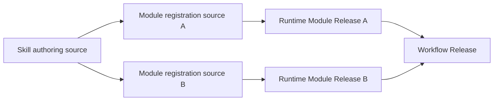

# Skill-authored Runtime Module Registration Code Design

Status: approved correction for implementation.

## Requested result

Keep Skill review and Runtime execution as two separate systems:

- Skill Management reviews a Skill candidate with `skill_id`,
  `candidate_revision`, and `candidate_sha256`;
- Agent Runtime registers and executes immutable Module and Workflow Releases;
- a Skill may author zero or more independent Module registration sources, but
  neither the Skill nor a Skill candidate becomes a Runtime Release.

The change removes `SkillPackageRelease`, `SkillModuleExport`, package
admission, package versioning, and package-to-Module release dependencies from
Agent Runtime. It does not replace them with another aggregate release.

## Correct object model



`source_skill_id` is optional stable provenance on an Agent Module Release. It
does not carry a Skill candidate revision, hash, admission state, or execution
authority. The Module Release itself closes the exact prompt, schemas,
policies, operations, owner contract, and compatible transports required for
execution.

## Logical responsibilities

### `registry_module_loading`

- reads one fixed
  `.claude/skills/<skill_id>/runtime_modules/<module_id>/` authoring directory;
- validates exact `skill_id`, `module_id`, owner contract, prompt, schemas, and
  declared Runtime policies;
- never creates or discovers a Skill-level Runtime release;
- exposes single-Module loading as the registration primitive.

### `registry_release_compilation`

- compiles one Module source into Schema Asset, Prompt Component, Prompt
  Bundle, Execution Profile, and Runtime Module Releases;
- records only stable `source_skill_id` provenance on an Agent Module;
- does not scan sibling Modules or couple their versions.

### Runtime contracts, Registry, persistence, inspection, and execution

- accept no `SkillPackageRelease` or `SkillModuleExport` records;
- admit and resolve Module and Workflow Releases directly;
- persist and inspect Module provenance through `source_skill_id` only;
- validate execution closure through the Module's exact Prompt and Schema
  bindings, not through a Skill-level release.

## Authoring manifest

The fixed Module registration format is `runtime_module_registration_v2`:

```yaml
schema_version: runtime_module_registration_v2
skill_id: the-contract-audit
module_id: system_change_reviewer
owner_contract_path: designDoc/the_contract_audit.md
input_schema_ref: schema:system_change_reviewer_input@v1
input_schema_path: schemas/input.schema.json
output_schema_ref: schema:system_change_reviewer_output@v1
output_schema_path: schemas/output.schema.json
```

The remaining existing operation, transport, Context, Evaluation, retry,
entry, and output-resolution fields remain Module-owned fields in the same
manifest. `skill_package_id`, `export_id`, and Package owner fields are invalid.

## Compatibility decision

This is a correction before the Package model is admitted for production. The
Runtime public contract moves forward without a legacy Package compatibility
shim. Existing database tables created by older development builds may remain
physically present, but current Runtime code neither reads nor writes them.

## Required tests

1. One Skill can author two Modules with distinct Module owners.
2. Compiling one Module does not read or validate sibling Module directories.
3. The compiled Agent Module records its stable `source_skill_id` and exact
   Prompt/Schema closure.
4. Runtime bundles, Registry snapshots, PostgreSQL projection, inspection, and
   execution contain no Skill Package release family.
5. Non-Agent Modules carry no `source_skill_id`.
6. Invalid Skill/Module identity, undeclared files, owner mismatch, prompt
   shape, and schema closure fail before release registration.
7. Public exports and the standalone design bundle contain no Package release
   contract.

## Acceptance criteria

- repository search finds no production symbol named `SkillPackageRelease` or
  `SkillModuleExport`;
- Runtime Module and Workflow registration, execution, persistence, and
  inspection tests pass;
- canonical Design Docs and generated standalone projections describe the
  same object model;
- external engineering review finds no hidden Package-version dependency or
  new substitute aggregate.
