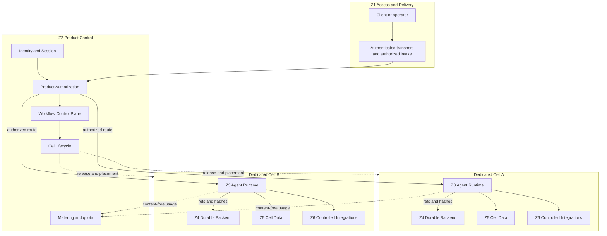

# Agent Runtime Product Target Topology Contract

**Purpose**: Define how the Agency Platform deploys Agent Runtime for dogfood,
institution-dedicated Cells, and a later pooled tier without changing Runtime,
authorization, or domain contracts.

**Required reader gain**: A reader can place each service in one deployment
zone, identify every hard isolation boundary, and determine whether a Cell or
durable-backend deployment is eligible for product admission.

## 0. Intent Capsule

```yaml
layer: T1
status: proposal
canonical_owner: designDoc/agent_runtime_02_product_target_topology.md
parent: designDoc/the_agency_platform.md
scope:
  - product deployment horizons
  - topology-local zones and canonical Agency Platform plane mapping
  - Dedicated Cell and pooled-tier isolation
  - data placement and credential boundary
  - durable-backend placement, binding, and admission
  - two-Cell conformance
non_goals:
  - domain graph meaning, quality gates, or artifact schemas
  - Runtime execution-record schemas or provider invocation
  - Product Authorization policy language
  - commercial rating, invoicing, or payment authority
  - current provider, backend, deployment, or release inventory
inputs:
  - designDoc/the_agency_platform.md
  - designDoc/the_agent_runtime.md
  - designDoc/the_product_authorization.md
  - designDoc/the_data_governance.md
  - designDoc/the_timestamp_semantic.md
outputs:
  - deployment_zone_mapping
  - cell_isolation_contract
  - cell_runtime_binding
  - backend_admission_requirements
  - two_cell_conformance_contract
truth_surfaces:
  - src/agent_runtime/contracts/durability_topology_definition.py
  - src/agent_runtime/durability/durability_backend_registration.py
  - src/agent_runtime/registry/registry_architecture_registration.py
  - src/agent_runtime/inspection/inspection_release_rendering.py
generated_projection_surfaces:
  - agent_runtime.inspection.inspection_release_rendering:build_runtime_inventory
verification_hooks:
  - topology and dedicated-Cell isolation tests
  - backend catalog and generated-inspection parity
  - ref-only payload and two-Cell conformance tests
review_gate: design review, topology conformance, and independent engineering review
open_decisions: []
```

## 1. Topology Views

This contract uses deployment views only. Each view answers one question.

| View | Question |
| --- | --- |
| Product horizon | Which isolation model is admitted at each product stage? |
| Deployment zone | Where does a service run and which canonical platform plane owns it? |
| Data placement | Where may content, metadata, credentials, and durable state reside? |
| Cell identity | Which tenant, Cell, release, and backend binding are frozen? |
| Backend admission | Which evidence permits one durable implementation to serve product traffic? |
| Conformance | How do two synthetic institutions prove isolation and recovery? |

Execution mechanics belong to Agent Runtime. Authorization decisions belong to
Product Authorization. Business state and quality belong to domain contracts.

## 2. Product Horizons

| Horizon | Deployment rule |
| --- | --- |
| `tenant_0` dogfood | A single-machine deployment is allowed, but it uses the same identity, authorization, Cell, usage, audit, and release contracts as customer deployments. |
| Institution Dedicated Cell | Each institution has an isolated data plane, credential domain, provider context, durable persistence, and worker identity. This is the first product target. |
| Pooled tier | Regional engines or workers may be shared only after tenant isolation, quota, residency, crypto-erasure, noisy-neighbor, and billing-attribution conformance passes. |

Scaling the Dedicated Cell phase means one control plane can provision and
operate many isolated Cells. It does not require a shared customer data plane.

## 3. Deployment Zones

`Z1` through `Z6` are placement and failure-boundary labels. They are **not** another platform-plane taxonomy and grant no semantic authority.

| Topology-local zone | Canonical Agency Platform plane | Responsibility | Explicit non-ownership |
| --- | --- | --- | --- |
| Z1 Access Edge and Task Intake | Access and Delivery Plane | Authenticated transport, authorized task intake, request limits, and result delivery | Principal, tenant, Cell, policy, or Runtime release resolution |
| Z2 Product Control Services | Product Control Plane | Identity and Session hosting, Product Authorization, workflow binding, Cell lifecycle, metering, and quota | Customer content, provider credentials, domain quality, or commercial rating |
| Z3 Agent Runtime | Execution Cell Plane | Runtime admission, execution lineage, Context, Evaluation, recovery, and telemetry | Entitlement policy, grant issuance, domain semantics, or canonical writes |
| Z4 Durable Backend | Execution Cell Plane | Scheduling, cursor, retry, timer, acknowledged event, and worker recovery | Customer content, Runtime semantics, domain judgment, or protected effects |
| Z5 Cell Data Services | Cell Data Plane | Cell-local content, Runtime ledgers, Context events, retention, backup, restore, and authorized dereference | External invocation, workflow scheduling, or permission issuance |
| Z6 Controlled Integration Services | Controlled Integration Plane | Model, Tool, Search, external-event, publication, and billing-handoff gateways | Workflow routing, quality verdicts, grant issuance, or unrestricted data access |

The Trust and Operations Plane is cross-cutting. It protects credentials and
keys, supplies workload and clock evidence, and owns operational SLO, HA/DR,
security, and incident response. It is not `Z7` and gains no product,
workflow, data, or domain authority.

### 3.1 Product topology



There is no content path between Cell A and Cell B. Control-plane services may
observe bounded health, release, usage, and audit references. They cannot
dereference customer content.

## 4. Three Hard Boundaries

### 4.1 Cell isolation

A Dedicated Cell does not share any of the following with another tenant:

- customer content or Artifact namespace;
- database, object-store, durable-history, or audit persistence;
- model, Tool, Search, or publication credentials;
- encryption key domain or private key material;
- provider-native Context;
- worker execution identity or unrestricted endpoint credential.

A control plane may store non-secret encryption-key identifiers and health
metadata. Secret material and private key bytes remain in the Cell-scoped
secret and key boundary.

### 4.2 Durable payload

Z4 stores only bounded control data:

- execution, release, state, dispatch, event, and snapshot identities;
- exact refs and SHA-256 hashes;
- graph adjacency and bounded status codes;
- retry, timer, sequence, and acknowledgement metadata.

It stores no prompt, Source body, Draft, revision packet, provider output,
search result, Entitlement body, credential, secret, or raw exception prose.

### 4.3 Controlled integration

Every model, Tool, Search, external event, publication, and billing handoff
enters through its own enforcing service. Runtime and durable workers receive a
bounded interface and exact authorization evidence, never an unrestricted
credential or direct canonical-write handle.

Commercial rate cards, rating, invoice amounts, charges, and payment state
remain outside Product Control authority. Metering may emit a content-free,
tenant-scoped usage export. The external commercial system owns rating and
billing truth.

## 5. Identity and Authorization Handoff

The Identity and Session
Service authenticates the subject and maintains assertion or session status.
Product Authorization resolves tenant, Principal, and Cell server-side and
returns exact authorization evidence. Authentication proves a subject/session; it never selects a tenant, product workflow, Cell, Runtime release, or resource
scope.

The host Workflow Control Plane resolves the exact product workflow binding.
Agent Runtime then validates the exact admitted `workflow_release`, execution
binding, and authorization closure. None of these records substitutes for
another authority.

A Workflow Execution freezes:

- tenant and Cell identity;
- workflow and Runtime releases;
- authorization binding and input closure;
- data and Context scope;
- durable-backend binding;
- timestamp and clock-validation profile.

Later Entitlement expansion cannot widen the execution. Expiry, revocation, or
invalidation fences new work. A broader or restored scope starts a newly
authorized Workflow Execution.

## 6. Data Placement

| Data class | System of Record | Shared control-plane projection |
| --- | --- | --- |
| Customer Source, Evidence, Draft, Prompt Envelope, provider output | Z5 Cell Data Services | None |
| Runtime releases and admission records | Global Runtime control-plane store | IDs, refs, hashes, lifecycle |
| Workflow Execution, Module Run, Variant, Attempt, output and Evaluation lineage | Cell-local Runtime ledger | Bounded status, refs, hashes, usage |
| Principal, Entitlement, decisions, delegation, grants | Product Authorization | Exact evidence refs and hashes |
| Durable cursor and history | Z4 Cell-bound backend | Ref-only control state |
| Credentials and private key material | Cell-scoped secret/key service | Non-secret identifiers and health only |
| Usage meter | Metering service | Tenant-scoped content-free counters |
| Commercial rating and invoice | External commercial authority | Acknowledgement and reconciliation refs |

Physical residency, retention, export, backup, restore, and destruction follow
Data Governance. Runtime topology cannot override those bindings.

## 7. Dedicated and Pooled Deployment

### 7.1 Dedicated Cell

The first product target assigns each institution a distinct Cell data plane,
durable namespace and persistence, key domain, worker credential, provider
Context boundary, and audit surface. Namespace separation alone is
insufficient when credentials or persistence can cross tenants.

Workers may scale to zero. Product Control may retain endpoint and health
metadata but cannot retain a credential that reads customer content.

### 7.2 Pooled tier

A pooled deployment is admissible only after all of these pass:

- tenant-aware scheduling, fair queueing, and quota enforcement;
- namespace, database, Artifact, Context, and log cross-tenant negatives;
- tenant-scoped encryption, retention, export, and crypto-erasure;
- provider and Gateway credential isolation;
- noisy-neighbor and denial-of-service limits;
- per-tenant usage and billing attribution;
- recovery and replay without cross-tenant dereference.

The same domain and Runtime releases must run in Dedicated and pooled
topologies. A backend requiring domain-graph or Artifact-schema changes fails
portability.

## 8. Durable Backend Placement and Admission

Each Cell pins one exact backend descriptor, adapter release, namespace policy,
persistence policy, and deployment reference for the complete Workflow
Execution. Credentials remain outside the binding record. Switching backend
inside an execution is forbidden.

The code-owned backend catalog classifies implementations and owns their current
state. Human Design Docs define only stable admission law.

| Role | Meaning |
| --- | --- |
| `reference` | Comparison oracle only |
| `evaluation_candidate` | May collect evaluation evidence |
| `selected_candidate` | Sole candidate eligible to advance through product gates |
| `rejected_candidate` | Retained as decision evidence and not executable for product traffic |
| `reference_composition` | Illustrative service mapping with no admission authority |

Admission progresses through dependency, integration, conformance, canary, and
active evidence. Current role, implementation ref, selected candidate, and
admission state come from code and generated inspection, never this document.

A production candidate requires:

- engine and persistence HA, backup, restore, and schema-upgrade evidence;
- worker version pin, drain, long-wait, and rollback behavior;
- access control, audit, retention, visibility, and operator controls;
- ref-only history and payload leakage tests;
- two-Cell isolation and recovery;
- one opaque synthetic graph and one domain-owned graph through the same
  canonical durable interface.

## 9. Two-Cell Conformance

The shared fixture uses only synthetic institutions.

| Dimension | `institution_alpha` | `institution_beta` |
| --- | --- | --- |
| Cell | `cell_alpha_us` | `cell_beta_cn` |
| LLM supply | Platform | Bring your own |
| Private sentinel | `ALPHA_PRIVATE_SENTINEL` | `BETA_PRIVATE_SENTINEL` |
| Workload | Loop and acknowledged resume | Concurrency and worker recovery |

Every admitted backend must prove:

1. distinct persistence, credentials, namespaces, key domains, and provider
   Context;
2. neither sentinel appears in the other Cell's payload, history, logs, or
   query results;
3. exact execution and backend binding survives restart and replay;
4. acknowledged external events are idempotent and Cell-scoped;
5. worker crash does not duplicate Module execution or a protected effect;
6. backend payload remains ref-only;
7. cancellation and authorization invalidation preserve the last committed
   domain state and fence successor work;
8. code-owned inventory and generated inspection reproduce the admitted
   topology.

## 10. Code Truth and Adjacent Contracts

Code owns exact topology records, backend descriptors, active composition,
current admission state, commands, and generated inspection. This document
owns only target placement, isolation, and admission invariants.

`inspection_release_rendering.build_runtime_inventory` produces the
deterministic current host-composition projection from an explicit Workflow
Registry and Durable Backend Candidate Set. Generated host inspection owns
those mutable facts.

Adjacent ownership:

- Agent Runtime T0 owns portable execution and isolation invariants.
- `agent_runtime_01` owns Module and Workflow release assembly.
- `agent_runtime_03` owns authorized external-event ingress.
- `agent_runtime_07` owns Temporal adapter mapping and conformance.
- `agent_runtime_09` owns Product Authorization integration and fencing.
- `agent_runtime_10` owns host workflow execution binding and admission.
- Data Governance owns physical placement and retention.
- Timestamp Semantic owns time roles and clock validity.

## References

- [Agency Platform](the_agency_platform.md)
- [Agent Runtime](the_agent_runtime.md)
- [Product Authorization](the_product_authorization.md)
- [Data Governance](the_data_governance.md)
- [Timestamp Semantic](the_timestamp_semantic.md)
- [Temporal Durable Adapter](agent_runtime_07_temporal_durable_adapter_contract.md)
